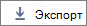

# Microsoft 365-rapporten in het beheercentrum - Actieve gebruikersMicrosoft 365 Reports in the admin center - Active Users

Het dashboard Microsoft 365 **Reports** toont u het activiteitenoverzicht voor de producten in uw organisatie.The Microsoft 365 **Reports** dashboard shows you the activity overview across the products in your organization. U kunt inzoomen op rapporten op het niveau van afzonderlijke producten om een gedetailleerder inzicht te krijgen in de activiteiten binnen elk product.It enables you to drill in to individual product level reports to give you more granular insight about the activities within each product. Bekijk [het overzichtsonderwerp over rapporten](activity-reports.md).Check out [the Reports overview topic](activity-reports.md).
  
U kunt bijvoorbeeld het rapport **Actieve gebruikers** gebruiken om te kijken hoeveel productlicenties er worden gebruikt door individuele personen in uw organisatie. Vervolgens kunt u inzoomen om te zien welke licenties er door welke gebruikers worden gebruikt. Aan de hand van dit rapport kunnen beheerders bepalen welke producten onderbenut zijn of welke gebruikers extra training of informatie nodig hebben.For example, you can use the **Active Users** report to find out how many product licenses are being used by individuals in your organization, and drill down for information about which users are using what products. This report can help administrators identify underutilized products or users that might need additional training or information. 
  
> [!NOTE]
> U moet een globale beheerder, globale lezer of rapportenlezer in Microsoft 365 of een Exchange-, SharePoint- of Skype voor Bedrijven-beheerder zijn om rapporten te kunnen bekijken.You must be a global administrator, global reader or reports reader in Microsoft 365 or an Exchange, SharePoint, or Skype for Business administrator to see reports. 

## Hoe u aan het rapport met actieve gebruikers komtHow to get to the Active Users report

1. Ga in het beheercentrum naar de pagina **Rapporten** \> <a href="https://go.microsoft.com/fwlink/p/?linkid=2074756" target="_blank">Gebruik</a>.In the admin center, go to the **Reports** \> <a href="https://go.microsoft.com/fwlink/p/?linkid=2074756" target="_blank">Usage</a> page.

2. Selecteer **Office 365** \> **Active-gebruikers** in de vervolgkeuzelijst.Select **Office 365** \> **Active users** from the drop-down. 

## Het rapport met actieve gebruikers interpreterenInterpret the Active Users report

  
|||
|:-----|:-----|
|1.1.    |In het rapport **Actieve gebruikers** kunnen trends worden weergegeven voor de laatste 7, 30, 90 of 180 dagen.The **Active Users** report can be viewed for trends over the last 7 days, 30 days, 90 days, or 180 days. Als u echter een bepaalde dag in het rapport bekijkt, worden in de tabel (7) gegevens weergegeven gedurende maximaal 28 dagen na de huidige datum (niet de datum waarop het rapport is gegenereerd).However, if you view a particular day in the report, the table (7) will show data for up to 28 days from the current date (not the date the report was generated).    |
|2.2.    |De gegevens in elk rapport bestrijken meestal tot de laatste 24 tot 48 uur.The data in each report usually covers up to the last 24 to 48 hours.    |
|3.3.    |In de grafiek **Actieve gebruikers** ziet u per product de actieve gebruikers voor de rapportageperiode.The **Active Users** chart shows you daily active users in the reporting period separated by product.    In de grafiek **Services** ziet u het aantal gebruikers per activiteitstype en service.The **Services** chart shows you count of users by activity type and Service.    |
|4.4.    | In de grafiek **Actieve gebruikers** wordt op de x-as de geselecteerde rapportageperiode weergegeven en op de y-as de actieve gebruikers per dag. Deze zijn per licentietype van elkaar zijn gescheiden en van een kleurcodering voorzien.    On the **Active Users** chart, the x axis shows the selected reporting time period and the y axis displays the daily active users separated and color coded by licence type.     Op de activiteitengrafiek **Services** worden op de x-as de afzonderlijke services weergegeven die voor uw gebruikers zijn ingeschakeld in de opgegeven periode. Op de y-as wordt het aantal gebruikers per activiteitsstatus weergegeven, voorzien van een kleurcodering per activiteitsstatus.    On the **Services** activity chart, the X axis displays the individual services your users are enabled for in the given time period and the Y axis is the Count of users by activity status, color coded by activity status.    |
|5.5.    |U de reeksen die u in de grafiek ziet filteren door een item in de legenda te selecteren.You can filter the series you see on the chart by selecting an item in the legend. Door deze selectie te wijzigen, verandert de informatie in de rastertabel niet.Changing this selection doesn't change the info in the grid table.    |
|6.6.    |U de rapportgegevens ook exporteren naar een Csv-bestand in Excel](../../media/816a224b-6ca7-4967-a135-4f6427f64dc8.JPG) door de gegevens **exporteren**  link. Hiermee exporteert u de gegevens van alle gebruikers en kunt u eenvoudige sortering en filtering toepassen voor verdere analyse.This exports data of all users and enables you to do simple sorting and filtering for further analysis. Als u minder dan 2000 gebruikers hebt, kunt u de tabel in het rapport zelf sorteren en filteren.If you have less than 2000 users, you can sort and filter within the table in the report itself. Als u meer dan 2000 gebruikers hebt, moet u de gegevens exporteren om te kunnen filteren en sorteren.If you have more than 2000 users, in order to filter and sort, you will need to export the data.    |
|7.7.    |Gebruik de besturingselementen van een kolom om te wijzigen welke gegevens worden weergegeven in de rastertabel.You can change what information is displayed in the grid table with column controls.    Als uw abonnement wordt uitgevoerd door 21Vianet, ziet u Yammer niet.If your subscription is operated by 21Vianet, then you will not see Yammer.     |
|||

Als het beleid van uw organisatie verhindert dat u rapporten weergeeft waarin gebruikersgegevens kunnen worden geïdentificeerd, kunt u de privacy-instelling voor elk van deze rapporten wijzigen.If your organization's policies prevents you from viewing reports where user information is identifiable, you can change the privacy setting for all these reports. Bekijk de **gegevens over gebruikersniveau?** [Activity Reports in the Microsoft 365 admin center](activity-reports.md)Check out the **How do I hide user level details?** section in [Activity Reports in the Microsoft 365 admin center](activity-reports.md).  
