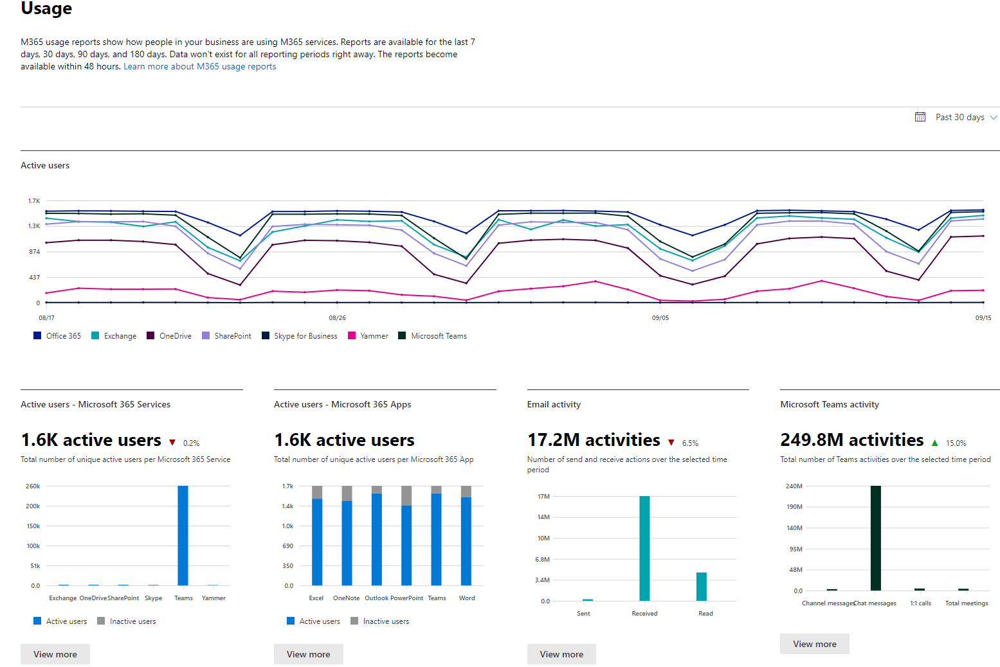

# Microsoft 365-overzichten in het beheercentrumMicrosoft 365 Reports in the admin center

U kunt gemakkelijk zien hoe mensen in uw bedrijf Microsoft 365-services gebruiken. Zo kunt u vaststellen wie een service veel gebruikt en quota's behaalt, of wie misschien helemaal geen Microsoft 365-licentie nodig heeft. Eeuwigdurende licentie wordt niet opgenomen in de rapporten.You can easily see how people in your business are using Microsoft 365 services. For example, you can identify who is using a service a lot and reaching quotas, or who may not need an Microsoft 365 license at all. Perpetual license model will not be included in the reports. 
  
Er zijn overzichten beschikbaar voor de afgelopen 7 dagen, 30 dagen, 90 dagen en 180 dagen. Er zijn niet direct gegevens voor alle rapportageperioden beschikbaar. De rapporten komen beschikbaar na 48 uur.Reports are available for the last 7 days, 30 days, 90 days, and 180 days. Data won't exist for all reporting periods right away. The reports become available within 48 hours.
  
## Bekijk: Een gebruiksrapport in Office 365 opvolgenWatch: Act on a usage report in Office 365
  
> [!VIDEO https://www.microsoft.com/videoplayer/embed/fb726f8e-aead-43b2-ba0f-53ba5b886bf7?autoplay=false]
  
## Hoe ga ik naar het dashboard Rapporten?How to get to the Reports dashboard

::: moniker range="o365-worldwide"

1. Ga in het beheercentrum naar de pagina **Rapporten** \> <a href="https://go.microsoft.com/fwlink/p/?linkid=2074756" target="_blank">Gebruik</a>.In the admin center, go to the **Reports** \> <a href="https://go.microsoft.com/fwlink/p/?linkid=2074756" target="_blank">Usage</a> page.

::: moniker-end

::: moniker range="o365-germany"

1. Ga in het <a href="https://go.microsoft.com/fwlink/p/?linkid=848041" target="_blank">beheercentrum</a> naar de pagina **Rapporten** \> **Gebruik**.In the <a href="https://go.microsoft.com/fwlink/p/?linkid=848041" target="_blank">admin center</a>, go to the **Reports** \> **Usage** page.

::: moniker-end

::: moniker range="o365-21vianet"

1. Ga in het <a href="https://go.microsoft.com/fwlink/p/?linkid=850627" target="_blank">beheercentrum</a> naar de pagina **Rapporten** \> **Gebruik**.In the <a href="https://go.microsoft.com/fwlink/p/?linkid=850627" target="_blank">admin center</a>, go to the **Reports** \> **Usage** page.

::: moniker-end

2. Klik op de knop **Meer weergeven** in de activiteitenkaart voor een service (zoals e-mail of OneDrive) om de detailpagina van het rapport weer te geven.Click on the **View more** button from the at-a-glance activity card for a service (such as email or OneDrive) to see the report detail page. Er zijn verschillende rapporten voor de service beschikbaar op tabbladen.In there different reports for the service are provided in tabs.   

## Wie kan rapporten zien?Who can see reports

Personen met de volgende machtigingen:People who have the following permissions:
  
- Globale beheerders: we raden aan slechts een beperkt aantal personen in uw bedrijf deze rol te geven. Het vermindert het risico voor uw bedrijf.Global admins: We recommend that only a few people in your company have this role. It reduces the risk to your business.
    
- Exchange-beheerdersExchange admins
    
- SharePoint-beheerdersSharePoint admins
    
- Skype voor Bedrijven-beheerdersSkype for Business admins

- Algemene lezerGlobal reader
    
- RapportenlezerReports reader

- Teams-servicebeheerderTeams Service Administrator

- Teams-communicatiebeheerderTeams Communications Administrator
    
Zie [Informatie over beheerdersrollen](../add-users/about-admin-roles.md) en [Beheerdersrollen toewijzen](../add-users/assign-admin-roles.md) voor meer informatie.To learn more, see [About admin roles](../add-users/about-admin-roles.md) and [Assign admin roles](../add-users/assign-admin-roles.md).
  
## Welke activiteitenrapporten zijn er beschikbaar in het beheercentrum?Which activity reports are available in the admin center

Afhankelijk van uw abonnement zijn de volgende rapporten beschikbaar.Depending on your subscription, here are the available reports.

- [Microsoft browsergebruikMicrosoft browser usage](browser-usage-report.md) 
  
- [E-mailactiviteitEmail activity](email-activity-ww.md)
    
- [PostvakgebruikMailbox usage](mailbox-usage.md)
    
- [Office-activeringenOffice activations](microsoft-office-activations-ww.md)

- [Actieve gebruikersActive Users](active-users-ww.md)
  
- [Gebruik van e-mail-appsEmail apps usage](email-apps-usage-ww.md)

- [FormulieractiviteitForms activity](forms-activity-ww.md)

- [Dynamics 365 Customer Voice-activiteitDynamics 365 Customer Voice activity](forms-pro-activity-ww.md)

- [Microsoft 365-groepenMicrosoft 365 groups](office-365-groups-ww.md)
  
- [Gebruikersactiviteit in OneDrive voor BedrijvenOneDrive for Business user activity](onedrive-for-business-activity-ww.md)

- [Gebruik van OneDrive voor BedrijvenOneDrive for Business usage](onedrive-for-business-usage-ww.md)

- [Gebruik van Microsoft 365-appsMicrosoft 365 Apps usage](microsoft365-apps-usage-ww.md)
  
- [SharePoint-sitegebruikSharePoint site usage](sharepoint-site-usage-ww.md)
  
- [SharePoint-activiteitSharePoint activity](sharepoint-activity-ww.md)
  
- [Skype voor Bedrijven Online-activiteitSkype for Business Online activity](/SkypeForBusiness/skype-for-business-online-reporting/activity-report)
  
- [Activiteit van georganiseerde vergaderingen in Skype voor Bedrijven OnlineSkype for Business Online conference organized activity](/SkypeForBusiness/skype-for-business-online-reporting/conference-organizer-activity-report)
  
- [Activiteit van deelnemers aan vergaderingen in Skype voor Bedrijven OnlineSkype for Business Online conference participant activity](/SkypeForBusiness/skype-for-business-online-reporting/conference-participant-activity-report)
  
- [Peer-to-peeractiviteit in Skype voor Bedrijven OnlineSkype for Business Online peer-to-peer activity](/SkypeForBusiness/skype-for-business-online-reporting/peer-to-peer-activity-report)

- [Yammer-activiteitYammer activity](yammer-activity-report-ww.md)

- [Yammer-apparaatgebruikYammer device usage](yammer-device-usage-report-ww.md)

- [Yammer groups activity report](yammer-groups-activity-report-ww.md) (Rapport met Yammer-groepsactiviteit)[Yammer groups activity report](yammer-groups-activity-report-ww.md)

- [Gebruikersactiviteit in Microsoft TeamsMicrosoft Teams user activity](microsoft-teams-user-activity-preview.md)

- [Apparaatgebruik in Microsoft TeamsMicrosoft Teams device usage](microsoft-teams-device-usage-preview.md)

## Het weergeven van licentie-informatieHow to view licensing information

- Als u wilt zien hoeveel licenties u hebt toegewezen en ingetrokken, gaat u in het beheercentrum naar **Facturering** \> <a href="https://go.microsoft.com/fwlink/p/?linkid=842264" target="_blank">Licenties</a>.To see how many licenses you have assigned and unassigned, in the admin center, go to the **Billing** \> <a href="https://go.microsoft.com/fwlink/p/?linkid=842264" target="_blank">Licenses</a> page.
    
- Als u wilt zien wie een licentie heeft, wie niet, en wie gast is, gaat u in het beheercentrum naar de pagina **Gebruikers** \> <a href="https://go.microsoft.com/fwlink/p/?linkid=834822" target="_blank">Actieve gebruikers</a>.To see who is licensed, unlicensed, or guest, in the admin center, go to the **Users** \> <a href="https://go.microsoft.com/fwlink/p/?linkid=834822" target="_blank">Active users</a> page. 
  
## Gebruiksinformatie voor een specifieke gebruiker weergevenHow to view usage information for a specific user

Gebruik de servicerapporten om te onderzoeken hoeveel een specifieke gebruiker gebruikmaakt van de service. Als u bijvoorbeeld wilt weten hoeveel postvakopslagruimte een specifieke gebruiker heeft gebruikt, opent u het rapport Postvakgebruik en sorteert u de gebruikers op naam. Als er duizenden gebruikers zijn, kunt u het rapport exporteren naar Excel zodat u de lijst snel kunt filteren.Use the service reports to research how much a specific user is using the service. For example, to find out how much mailbox storage a specific user has consumed, open the Mailbox usage report, and sort the users by name. If you have thousands of users, export the report to Excel so you filter through the list quickly.
  
U kunt geen rapport genereren waarbij u het account van een gebruiker invoert en een lijst krijgt van welke services die persoon gebruikt en hoeveel.You can't generate a report where you enter a user's account and then get a list of which services they are using and how much.

In bepaalde omstandigheden kan een nieuwe gebruiker worden weergegeven als **onbekend**.There are circumstances where new users show up as **unknown**. Dit wordt meestal veroorzaakt door incidentele vertragingen bij het aanmaken van gebruikersprofielen.This is usually due to occasional delays in creating user profiles.  
  
## Gebruikersgegevens in de rapporten verbergenHide user details in the reports

Als u gebruikersgegevens wilt verbergen bij het genereren van rapporten, kunt u deze wijziging snel aanbrengen in het beheercentrum.If you want to hide user level information when you're generating your reports, you can quickly make that change in the admin center.
  
1. Ga in het beheercentrum naar de pagina **Instellingen** \> <a href="https://go.microsoft.com/fwlink/p/?linkid=2053743" target="_blank">Services &amp; invoegtoepassingen</a>.In the admin center, go to the **Settings** \> <a href="https://go.microsoft.com/fwlink/p/?linkid=2053743" target="_blank">Services &amp; add-ins</a> page.

2. Selecteer **Rapporten**.Select **Reports**. 
  
3. Selecteer de gewenste opties in het deelvenster **Rapporten** en sla de wijzigingen op.In the **Reports** pane, select the options you want, and then save your changes.
  
Uw lijst met gebruikers ziet er zo uit:Your user list will look like this:
  

  
Het duurt enkele minuten voordat deze wijzigingen zijn doorgevoerd in de rapporten in het dashboard Rapporten. Deze instelling geldt ook voor de rapporten-API.It'll take a few minutes for these changes to take effect on the reports in the reports dashboard. This setting also applies to the reports API.
  
## Wat gebeurt er met de gebruiksgegevens wanneer een gebruikersaccount wordt gesloten?What happens to usage data when a user account is closed?

Wanneer u het account van een gebruiker sluit, worden de gebruiksgegevens van die gebruiker binnen 30 dagen verwijderd.Whenever you close a user's account, Microsoft will delete that user's usage data within 30 days. Deze gebruiker wordt nog steeds opgenomen in de totalen van de activiteitengrafiek (zie nummer 1) voor de perioden waarin ze actief is, maar wordt niet weergegeven in de tabel Gebruikersgegevens (zie nummer 2).That user will still be included in the Activity chart totals (see number 1) for the periods she was active in, but will not appear in the User Details table (see number 2).
  
Als u echter een bepaalde dag selecteert (bijvoorbeeld nummer 3), wordt in het rapport vanaf de huidige datum tot 28 dagen daarna het gebruik van de gebruiker voor die dag weergegeven in de tabel Gebruikersgegevens (zie nummer 2).However, when you select a particular day (see number 3), up to 28 days from the current date, the report show the user's usage for that day in the User Details table (see number 2).
  
## Verwante inhoudRelated content

[Rapporten in het Beveiligings- &amp; compliancecentrum](../../compliance/reports-in-security-and-compliance.md) (artikel)[Reports in the Security &amp; Compliance Center](../../compliance/reports-in-security-and-compliance.md) (article)\
[Microsoft 365-gebruiksanalyse](../usage-analytics/usage-analytics.md) (artikel)[Microsoft 365 usage analytics](../usage-analytics/usage-analytics.md) (article)\
[Rapporten in Microsoft 365-gebruiksanalyse naar voorkeur aanpassen](../usage-analytics/customize-reports.md) (artikel)[Customize the reports in Microsoft 365 usage analytics](../usage-analytics/customize-reports.md) (article)
