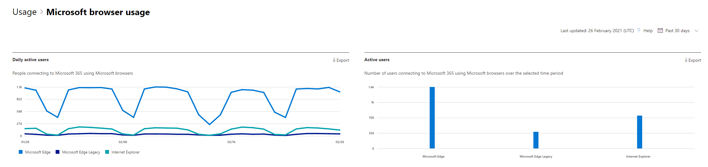

# Microsoft 365 Rapporten in het beheercentrum - Browsergebruik van MicrosoftMicrosoft 365 Reports in the admin center - Microsoft browser usage

In Microsoft 365 **dashboard Rapporten** ziet u een overzicht van activiteiten voor de producten in uw organisatie.The Microsoft 365 **Reports** dashboard shows you an activity overview across the products in your organization. Hiermee kunt u inzoomen op afzonderlijke rapporten op productniveau om u gedetailleerder inzicht te geven in de activiteiten binnen elk product.It enables you to drill into individual product level reports to give you more granular insight about the activities within each product. Bekijk [het overzichtsonderwerp over rapporten](activity-reports.md).Check out [the Reports overview topic](activity-reports.md). In het rapport Browsergebruik van Microsoft kunt u inzichten krijgen in Internet Explorer, Microsoft Edge (oudere versie) en nieuw Microsoft Edge gebruik.In the Microsoft browser usage report, you can gain insights on Internet Explorer, Microsoft Edge Legacy, and new Microsoft Edge usage. Gebruiksrapportage is gebaseerd op Microsoft 365 onlineservices die worden geopend met een Microsoft-browser.Usage reporting is based on Microsoft 365 online services accessed by using a Microsoft browser.

 > [!NOTE]
 > U moet een globale beheerder, globale lezer of rapportlezer zijn in Microsoft 365 of een Exchange, SharePoint of Skype voor Bedrijven beheerder om rapporten te zien.You must be a global administrator, global reader or reports reader in Microsoft 365 or an Exchange, SharePoint, or Skype for Business administrator to see reports.

## Het browsergebruiksrapport van Microsoft openenHow to get to the Microsoft browser usage report

1. Ga in het beheercentrum naar de pagina **Rapporten** \> <a href="https://go.microsoft.com/fwlink/p/?linkid=2074756" target="_blank">Gebruik</a>.In the admin center, go to the **Reports** \> <a href="https://go.microsoft.com/fwlink/p/?linkid=2074756" target="_blank">Usage</a> page. 
2. Klik op de startpagina van het dashboard op **de knop Meer** weergeven op de microsoft-browsergebruikskaart.From the dashboard homepage, click on the **View more** button on the Microsoft browser usage card.

## Gebruikers op de hoogte stellen van een upgrade van hun browserHow to notify users to upgrade their browser

Globale beheerders kunnen zich ervoor kiezen om berichten te verzenden naar gebruikers die gebruikmaken van Microsoft 365-services op Edge Legacy (niet ondersteund) en Internet Explorer (binnenkort niet meer ondersteund).Global admins can opt-in to sending messages to users using Microsoft 365 services on Edge Legacy (unsupported) and Internet Explorer (soon to be unsupported). Dit gerichte bericht meldt gebruikers dat de ondersteuning voor deze browsers binnenkort wordt beëindigen en het wordt naar een ondersteuningsartikel met informatie over Microsoft Edge en eenvoudige stappen die u moet volgen om van browser te wisselen.This targeted message notifies users that support for these browsers will end soon, and it links to a support article with information on Microsoft Edge and simple steps to follow to switch browsers. 

U vindt deze functie op de rapportpagina.You can find this feature on the report page. Wanneer het bericht is gemaakt, worden gebruikers op de hoogte gesteld met de opgegeven frequentie tot 17 augustus 2021.Once the message is created, users are notified at the frequency specified until August 17, 2021. U kunt deze functie op elk moment uitschakelen om te stoppen met het verzenden van meldingen naar gebruikers.You can turn off this feature at any time to stop sending notifications to users. Als u wilt beginnen met het opnieuw verzenden van meldingen, zet u de functie weer in.To begin sending notifications again, turn the feature back on.

Zie voor meer informatie [Microsoft Edge help & leren.](https://support.microsoft.com/microsoft-edge)For more information, see [Microsoft Edge help & learning](https://support.microsoft.com/microsoft-edge).

## Het browsergebruiksrapport van Microsoft interpreterenInterpret the Microsoft browser usage report

|ItemItem|BeschrijvingDescription|
 |:-----|:-----|
 |1.1.   |Het **browsergebruiksrapport van Microsoft** kan worden bekeken voor trends in de afgelopen 7, 30, 90 of 180 dagen.The **Microsoft browser usage** report can be viewed for trends over the last 7 days, 30 days, 90 days, or 180 days.    |
 |2.2.   |De gegevens in elk rapport hebben meestal betrekking op de laatste zeven dagen.The data in each report usually covers up to the last seven days.   |
 |3.3.   |In **de grafiek** Dagelijkse actieve gebruikers ziet u het dagelijkse aantal gebruikers voor Microsoft Edge, Microsoft Edge (oudere versie) en Internet Explorer wanneer deze worden gebruikt voor toegang tot Microsoft 365 services.The **Daily active users** chart shows you the daily user count for Microsoft Edge, Microsoft Edge Legacy and Internet Explorer when used to access to Microsoft 365 services.   |
 |4.4. |In **de** grafiek Actieve gebruikers ziet u het totale aantal gebruikers dat Microsoft Edge, Microsoft Edge (oudere versie) en Internet Explorer gebruikt voor toegang tot Microsoft 365 services in de geselecteerde periode.The **Active Users** chart shows you the total number of users using Microsoft Edge, Microsoft Edge Legacy and Internet Explorer when used to access to Microsoft 365 services over the selected time period. |
 |5.5. |De tabel toont een uitsplitsing van de gegevens per gebruiker. U kunt kolommen toevoegen aan of verwijderen uit de tabel.  The table shows you a breakdown of data at the per-user level. You can add or remove columns from the table.   **Gebruikersnaam** is het e-mailadres van de gebruiker die verbinding heeft gemaakt met Microsoft 365 services met Behulp van Microsoft-browsers.**Username** is the email address of the user who connected to Microsoft 365 services using Microsoft browsers.  **Gebruikte Microsoft Edge** toont een vinkje als de gebruiker Microsoft Edge gebruikt om verbinding te maken met Microsoft 365 services.**Used Microsoft Edge** shows a tick mark if the user used Microsoft Edge to connect to Microsoft 365 services.  **Gebruikte Microsoft Edge (oudere versie)** toont een vinkje als de gebruiker Microsoft Edge (oudere versie) gebruikt om verbinding te maken met Microsoft 365 services.**Used Microsoft Edge Legacy** shows a tick mark if the user used Microsoft Edge Legacy to connect to Microsoft 365 services.  **In Gebruikte Internet Explorer** wordt een vinkje weergegeven als de gebruiker Internet Explorer heeft gebruikt om verbinding te maken met Microsoft 365 services.**Used Internet Explorer** shows a tick mark if the user used Internet Explorer to connect to Microsoft 365 services. |
 |6.6. |Selecteer het **pictogram Kolommen kiezen** om kolommen toe te voegen of te verwijderen uit het rapport.Select the **Choose columns** icon to add or remove columns from the report.|
 |7.7. |U kunt de rapportgegevens ook exporteren naar een Excel .csv bestand door de **koppeling Exporteren te** selecteren.You can also export the report data into an Excel .csv file by selecting the **Export** link. Hiermee exporteert u gegevens voor alle gebruikers en kunt u eenvoudige aggregatie, sorteren en filteren voor verdere analyse.This exports data for all users and enables you to do simple aggregation, sorting, and filtering for further analysis. Als u minder dan 100 gebruikers hebt, kunt u sorteren en filteren in de tabel in het rapport zelf.If you have less than 100 users, you can sort and filter within the table in the report itself. Als u meer dan 100 gebruikers hebt, moet u de gegevens exporteren om te kunnen filteren en sorteren.If you have more than 100 users, in order to filter and sort, you will need to export the data.|
