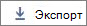

# Microsoft 365-rapporten in het beheercentrum - E-mailactiviteitMicrosoft 365 Reports in the admin center - Email activity

Het dashboard Microsoft 365 **Rapporten** toont u het activiteitenoverzicht voor de producten in uw organisatie.The Microsoft 365 **Reports** dashboard shows you the activity overview across the products in your organization. U kunt inzoomen op rapporten op het niveau van afzonderlijke producten om een gedetailleerder inzicht te krijgen in de activiteiten binnen elk product.It enables you to drill in to individual product level reports to give you more granular insight about the activities within each product. Bekijk [het overzichtsonderwerp over rapporten](activity-reports.md).Check out [the Reports overview topic](activity-reports.md).
  
Via de pagina Rapporten kunt u bijvoorbeeld een globale weergave krijgen van het e-mailverkeer in uw organisatie, waarna u kunt inzoomen op de widget E-mailactiviteit om inzicht te krijgen in de trends en de details op gebruikersniveau van de e-mailactiviteiten in uw organisatie.For example, you can get a high level view of email traffic within your organization from the Reports page, and then you can drill into the Email activity widget to understand the trends and per user level details of the email activity within your organization.
  
> [!NOTE]
> U moet een globale beheerder, wereldwijde lezer of rapportenlezer zijn in Microsoft 365 of een Exchange-, SharePoint-, Teams-service-, Teams-communicatie- of Skype voor Bedrijven-beheerder om rapporten te bekijken.You must be a global administrator, global reader or reports reader in Microsoft 365 or an Exchange, SharePoint, Teams Service, Teams Communications, or Skype for Business administrator to see reports. 

## Hoe u toegang tot het rapport E-mailactiviteit krijgtHow to get to the email activity report

1. Ga in het beheercentrum naar de pagina **Rapporten** \> <a href="https://go.microsoft.com/fwlink/p/?linkid=2074756" target="_blank">Gebruik</a>.In the admin center, go to the **Reports** \> <a href="https://go.microsoft.com/fwlink/p/?linkid=2074756" target="_blank">Usage</a> page.

    
2. Selecteer in de vervolgkeuzelijst **Een rapport** selecteren de optie **Exchange** \> **Exchange-e-mailactiviteit**.From the **Select a report** drop-down, select **Exchange** \> **Email activity**.
  
## Het rapport E-mailactiviteit interpreterenInterpret the email activity report

Met de grafieken **Activiteit** en **Gebruikers** kunt u inzicht krijgen in de e-mailactiviteiten van uw gebruikers.You can get a view into your user's email activity by looking at the **Activity** and **Users** charts. 
  

  
|||
|:-----|:-----|
|1.1.    |In het **e-mailactiviteitenrapport** kunnen trends worden weergegeven voor de laatste 7, 30, 90 of 180 dagen.The **Email activity** report can be viewed for trends over the last 7 days, 30 days, 90 days, or 180 days. Als u echter een bepaalde dag in het rapport selecteert, worden in de tabel (7) gegevens weergegeven voor maximaal 28 dagen vanaf de huidige datum (niet de datum waarop het rapport is gegenereerd).However, if you select a particular day in the report, the table (7) will show data for up to 28 days from the current date (not the date the report was generated).    |
|2.2.    |De gegevens in elk rapport bestrijken meestal tot de laatste 24 tot 48 uur.The data in each report usually covers up to the last 24 to 48 hours.    |
|3.3.    |De grafiek **Activiteit** geeft inzicht in de trend van de hoeveelheid e-mailactiviteit die zich afspeelt binnen uw organisatie.The **Activity** chart enables you to understand the trend of the amount of email activity going on in your organization. U inzicht krijgen in de splitsing van e-mailverzenden, e-maillezen, ontvangen e-mail, door een vergadering gemaakte vergadering of activiteiten met interactie met vergaderingen.You can understand the split of email send, email read, email received, meeting created, or meeting interacted activities.    |
|4.4.    |De grafiek **Gebruiker** geeft een beeld van de trend van het aantal unieke gebruikers die de e-mailactiviteiten genereren.The **User** chart enables you to understand the trend of the amount of unique users who are generating the email activities. U kijken naar de trend van gebruikers die e-mail verzenden, e-mail lezen, e-mail ontvangen, vergadering maken, of vergadering interactie activiteiten.You can look at the trend of users performing email sending, email reading, email receiving, meeting creating, or meeting interacting activities.    |
|5.5.    | In het **grafiek Activiteit** is de Y-as het aantal activiteiten van het type verzonden e-mail, ontvangen e-mail, e-maillezen, gemaakte vergadering en interactie met de vergadering.On the **Activity** chart, the Y axis is the count of activity of the type email sent, email received, email read, meeting created, and meeting interacted.     In het activiteitendiagram **Gebruikers** is de Y-as de activiteit van de gebruiker die optreedt voor het type verzonden e-mail, ontvangen e-mail, e-mail lezen, vergadering gemaakt of interactie op de vergadering.On the **Users** activity chart, the Y axis is the user's performing activity of the type email sent, email received, email read, meeting created, or meeting interacted.     De X-as van beide grafieken is het geselecteerde datumbereik voor dit specifieke rapport.The X axis on both charts is the selected date range for this specific report.    |
|6.6.    |U de reeks die u in de grafiek ziet filteren door een item in de legenda te selecteren.You can filter the series you see on the chart by selecting an item in the legend. Selecteer bijvoorbeeld in de **grafiek Activiteit** de optie **Verzonden,** **Ontvangen,** **Lezen,** **Vergadering gemaakt**of Met vergadering **geinteracteerde**  om alleen de informatie te zien die betrekking heeft op elk nummer.  For example, on the **Activity** chart, select **Sent**, **Received**, **Read**, **Meeting created**, or **Meeting interacted**   to see only the info related to each one. Door deze selectie te wijzigen, verandert de informatie in de rastertabel niet.Changing this selection doesn't change the info in the grid table.    |
|7.7.    | De tabel toont een onderverdeling van de e-mailactiviteiten op gebruikersniveau.The table shows you a breakdown of the email activities at the per-user level. Hier ziet u alle gebruikers aan wie een Exchange-product is toegewezen, en de bijbehorende e-mailactiviteiten.This shows all users that have an Exchange product assigned to them and their email activities.     **Gebruikersnaam** is het e-mailadres van de gebruiker.**Username** is the email address of the user.    **Weergavenaam** is de volledige naam als de gebruiker.**Display name** is the full name if the user.    **Verwijderd** verwijst naar de gebruiker van wie de huidige status Verwijderd is, maar die een deel van de rapportageperiode van het rapport actief was.**Deleted** refers to the user whose current state is deleted, but was active during some part of the reporting period of the report.    **Verwijderd op** is de datum waarop de gebruiker is verwijderd.**Deleted date** is the date the user was deleted.    **Datum van laatste activiteit** verwijst naar de laatste keer dat de gebruiker een e-mail heeft gelezen of verzonden.**Last activity date** refers to the last time the user performed a read or send email activity.    **Verzendacties** is het aantal keren dat een actie E-mailbericht verzenden voor de gebruiker is vastgelegd.**Send actions** is the number of times an email send action was recorded for the user.    **Ontvangstacties** is het aantal keren dat een actie E-mail ontvangen voor de gebruiker is vastgelegd.**Receive actions** is the number of times an email received action was recorded for the user.    **Leesactie** is het aantal keren dat een actie E-mailbericht lezen voor de gebruiker is vastgelegd.**Read actions** is the number of times an email read action was recorded for the user.    **Door vergaderingen gemaakte acties** is het aantal keren dat een actie voor het verzenden van een vergaderingsverzoek voor de gebruiker is geregistreerd.**Meeting created actions** is the number of times a meeting request send action was recorded for the user.    **Acties op basis** van interactie met vergaderingen is het aantal keren dat een vergaderverzoek actie accepteert, voorlopig, weigert of annuleert voor de gebruiker.**Meeting interacted actions** is the number of times a meeting request accept, tentative, decline, or cancel action was recorded for the user.    **Toegewezen product** zijn de producten die aan deze gebruiker zijn toegewezen.**Product assigned** is the products that are assigned to this user.     Als het beleid van uw organisatie verhindert dat u rapporten weergeeft waarin gebruikersgegevens kunnen worden geïdentificeerd, kunt u de privacy-instelling voor elk van deze rapporten wijzigen.If your organization's policies prevents you from viewing reports where user information is identifiable, you can change the privacy setting for all these reports. Bekijk de **sectie Hoe verberg ik de gegevens op gebruikersniveau?** [Activity Reports in the Microsoft 365 admin center](activity-reports.md)Check out the **How do I hide user level details?** section in the [Activity Reports in the Microsoft 365 admin center](activity-reports.md).    |
|8.8.    |U de rapportgegevens ook exporteren naar een CSV-bestand in Excel door **de**  selecteren.You can also export the report data into an Excel .csv file, by selecting the **Export**  link. Hiermee exporteert u de gegevens van alle gebruikers en kunt u eenvoudige sortering en filtering toepassen voor verdere analyse.This exports data of all users and enables you to do simple sorting and filtering for further analysis. Als u minder dan 2000 gebruikers hebt, kunt u de tabel in het rapport zelf sorteren en filteren.If you have less than 2000 users, you can sort and filter within the table in the report itself. Als u meer dan 2000 gebruikers hebt, moet u de gegevens exporteren om te kunnen filteren en sorteren.If you have more than 2000 users, in order to filter and sort, you will need to export the data.    |
|||
   
Opmerking: Het rapport E-mailactiviteit is alleen beschikbaar voor postvakken die zijn gekoppeld aan gebruikers die licenties hebben.Note: The Email activity report is only available for mailboxes that are associated with users who have licenses.
