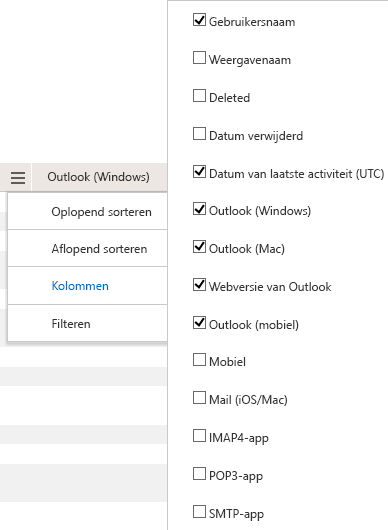

# Microsoft 365-rapporten in het Beheercentrum-gebruik van e-mail-appsMicrosoft 365 Reports in the admin center - Email apps usage

Het dashboard Microsoft 365 **rapporten** toont u het overzicht van de activiteiten in de producten van uw organisatie.The Microsoft 365 **Reports** dashboard shows you the activity overview across the products in your organization. U kunt inzoomen op rapporten op het niveau van afzonderlijke producten om een gedetailleerder inzicht te krijgen in de activiteiten binnen elk product.It enables you to drill in to individual product level reports to give you more granular insight about the activities within each product. Bekijk [het overzichtsonderwerp over rapporten](activity-reports.md).Check out [the Reports overview topic](activity-reports.md). In het rapport gebruik van de e-mail-apps kunt u zien hoeveel e-mail-apps verbinding maken met Exchange Online.In the email apps usage report, you can see how many email apps are connecting to Exchange Online. Daarnaast kunt u de versiegegevens bekijken van Outlook-apps die gebruikers gebruiken, zodat u weet welke personen niet-ondersteunde versies gebruiken en contact met ze kunt opnemen om ondersteunde versies van Outlook te installeren.You can also see the version information of Outlook apps that users are using, which will allow you to follow up with those who are using unsupported versions to install supported versions of Outlook.
  
> [!NOTE]
> U moet een globale beheerder, algemene lezer of rapporten lezer zijn in Microsoft 365 of een Exchange-, SharePoint-, teams-service, teams-communicatie of Skype voor bedrijven-beheerder om rapporten te zien.You must be a global administrator, global reader or reports reader in Microsoft 365 or an Exchange, SharePoint, Teams Service, Teams Communications, or Skype for Business administrator to see reports.  
 
## Naar het rapport met e-mail-apps gaanHow to get to the email apps report

1. Ga in het beheercentrum naar de pagina **Rapporten** \> <a href="https://go.microsoft.com/fwlink/p/?linkid=2074756" target="_blank">Gebruik</a>.In the admin center, go to the **Reports** \> <a href="https://go.microsoft.com/fwlink/p/?linkid=2074756" target="_blank">Usage</a> page.

    
2. Selecteer in de vervolgkeuzelijst **een rapport selecteren** de optie **Exchange** \> **-app gebruiken**.From the **Select a report** drop-down, select **Exchange** \> **Email app usage**.
  
## Het rapport met e-mail-apps interpreterenInterpret the email apps report

U kunt inzicht krijgen in de activiteiten van de e-mailapps door de grafieken **gebruikers** en **cliënten** te bekijken.You can get a view into email apps activity by looking at the **Users** and **Clients** charts. 
  

  
|ItemItem|BeschrijvingDescription|
|:-----|:-----|
|1.1.    |In het rapport **gebruik van e-mail-apps** kunnen trends worden weergegeven voor de laatste 7 dagen, 30 dagen, 90 dagen of 180 dagen.The **Email apps usage** report can be viewed for trends over the last 7 days, 30 days, 90 days, or 180 days. Als u echter een bepaalde dag selecteert in het rapport, worden in de tabel (7) gegevens weergegeven voor tot 28 dagen vanaf de huidige datum (niet de datum waarop het rapport is gegenereerd).However, if you select a particular day in the report, the table (7) will show data for up to 28 days from the current date (not the date the report was generated).    |
|2.2.    |De gegevens in de rapporten liggen meestal binnen de laatste 24 tot 48 uur.The data in each report usually covers up to the last 24 to 48 hours.    |
|3.3.    |In de weergave **Gebruikers** ziet u het aantal unieke gebruikers dat met een willekeurige e-mail-app is verbonden met Exchange Online.The **Users** view shows you the number of unique users that connected to Exchange Online using any email app.    |
|4.4.    |In de weergave **Apps** ziet u het aantal unieke gebruikers per app in de geselecteerde periode.The **Apps** view shows you the number of unique users by app over the selected time period.    |
|5.5.    |In de weergave **versies** ziet u het aantal unieke gebruikers voor elke versie van Outlook in Windows.The **Versions** view shows you the number of unique users for each version of Outlook in Windows.    |
|zes.6.    | In de grafiek **Gebruikers** is de Y-as het totale aantal unieke gebruikers dat op een willekeurige dag van de rapportageperiode is verbonden met een app.On the **Users** chart, the Y axis is the total count of unique users that connected to an app on any day of the reporting period.     In de grafiek **Gebruikers** is de X-as het aantal unieke gebruikers dat die app voor die rapportageperiode heeft gebruikt.On the **Users** chart, the X axis is number of unique users that used the app for that reporting period.     In de grafiek **Apps** is de Y-as het totale aantal unieke gebruikers dat gedurende de rapportageperiode een specifieke app heeft gebruikt.On the **Apps** chart, the Y axis is the total count of unique users who used a specific app during the reporting period.     In de grafiek **Apps** is de X-as de lijst met apps in uw organisatie.On the **Apps** chart, the X axis is the list of apps in your organization.     In de grafiek **Versies** is de Y-as het totale aantal unieke gebruikers dat een specifieke versie van de bureaubladversie van Outlook gebruikt.On the **Versions** chart, the Y axis is the total count of unique users using a specific version of Outlook desktop. Als het versienummer van Outlook niet kan worden omgezet in het rapport, wordt de hoeveelheid weergegeven als **onbepaald**.If the report can't resolve the version number of Outlook, the quantity will show as **Undetermined**.     In de grafiek **Versies** is de X-as de lijst met apps in uw organisatie.On the **Versions** chart, the X axis is the list of apps in your organization.    |
|7,5.7.    |U kunt de reeks die u in de grafiek ziet, filteren door een item te selecteren in de legenda.You can filter the series you see on the chart by selecting an item in the legend. Selecteer bijvoorbeeld in de grafiek **gebruikers** de optie **Mac mail** of **Outlook** Select the email client to get more reporting data on that client.](../../media/19b9da1b-7b69-4a04-8527-38349f859e84.png) om alleen de informatie te zien die betrekking heeft op elk van die gebruikers.to see only the info related to each one. Door deze selectie te wijzigen, verandert de informatie in de rastertabel niet.Changing this selection doesn't change the info in the grid table. Mac Mail, Outlook voor Mac, Outlook Mobile, de bureaubladversie van Outlook en de webversie van Outlook zijn voorbeelden van e-mail-apps die in uw organisatie kunnen worden gebruikt.Mac mail, Outlook for Mac, Outlook mobile, Outlook desktop, and Outlook on the web are examples of email apps you may have in your organization.    |
|8:00.8.    | Mogelijk worden de items in de onderstaande lijst pas weergegeven als u ze toevoegt.You might not see all the items in the list below in the columns until you add them.  **Gebruikers** naam is de naam van de eigenaar van de e-mail app.**Username** is the name of the email app's owner.    **Datum van laatste activiteit** is de laatste datum waarop de gebruiker een e-mailbericht heeft gelezen of verzonden.**Last activity date** is the latest date the user read or sent an email message.    **Mac Mail**, **Outlook voor Mac**, **Outlook**, **Outlook Mobile** en de **webversie van Outlook** zijn voorbeelden van e-mail-apps die in uw organisatie kunnen worden gebruikt.**Mac mail**, **Mac Outlook** and **Outlook**, **Outlook mobile** and **Outlook on the web** are examples of email apps you may have in your organization.     Als het beleid van uw organisatie verhindert dat u rapporten weergeeft waarin gebruikersgegevens kunnen worden geïdentificeerd, kunt u de privacy-instelling voor elk van deze rapporten wijzigen.If your organization's policies prevents you from viewing reports where user information is identifiable, you can change the privacy setting for all these reports. Kijk eens naar de sectie **Hoe kan ik Details van gebruikersniveau verbergen?** in de [activiteitsrapporten in het Microsoft 365-Beheercentrum](activity-reports.md).Check out the **How do I hide user level details?** section in the [Activity Reports in the Microsoft 365 admin center](activity-reports.md).    |
|aanhaling.9.    |Selecteer **kolommen beheren** als u kolommen wilt toevoegen aan of verwijderen uit het rapport.Select **Manage columns** to add or remove columns from the report.    |
|10.10.    |U kunt de rapportgegevens ook exporteren naar een CSV-bestand van Excel door de koppeling **exporteren** te selecteren.You can also export the report data into an Excel .csv file, by selecting the **Export** link. Hiermee exporteert u de gegevens van alle gebruikers en kunt u eenvoudige sortering en filtering toepassen voor verdere analyse.This exports data of all users and enables you to do simple sorting and filtering for further analysis. Als u minder dan 2000 gebruikers hebt, kunt u de tabel in het rapport zelf sorteren en filteren.If you have less than 2000 users, you can sort and filter within the table in the report itself. Als u meer dan 2000 gebruikers hebt, moet u de gegevens exporteren om te kunnen filteren en sorteren.If you have more than 2000 users, in order to filter and sort, you will need to export the data.    |
|||
   
