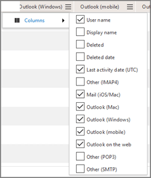

# Microsoft 365-rapporten in het beheercentrum - Gebruik van e-mailapps

Het dashboard Microsoft 365 **Reports** toont u het activiteitenoverzicht voor de producten in uw organisatie. U kunt inzoomen op rapporten op het niveau van afzonderlijke producten om een gedetailleerder inzicht te krijgen in de activiteiten binnen elk product. Bekijk [het overzichtsonderwerp over rapporten](activity-reports.md). In het gebruiksrapport van e-mailapps u zien hoeveel e-mailapps verbinding maken met Exchange Online. Daarnaast kunt u de versiegegevens bekijken van Outlook-apps die gebruikers gebruiken, zodat u weet welke personen niet-ondersteunde versies gebruiken en contact met ze kunt opnemen om ondersteunde versies van Outlook te installeren.
  
> [!NOTE]
> U moet een globale beheerder, globale lezer of rapportenlezer in Microsoft 365 of een Exchange-, SharePoint- of Skype voor Bedrijven-beheerder zijn om rapporten te kunnen bekijken. 
 
## Het rapport e-mailapps ontvangen?

1. Ga in het beheercentrum naar de pagina **Rapporten** \> <a href="https://go.microsoft.com/fwlink/p/?linkid=2074756" target="_blank">Gebruik</a>.

    
2. Selecteer in de vervolgkeuzelijst **Een rapport selecteren** de optie Gebruik van **Exchange-e-mail-apps**. **Exchange** \>
  
## Het rapport e-mailapps interpreteren

U een overzicht krijgen van de activiteit van e-mailapps door de grafieken **gebruikers** en **clients** te bekijken. 
  

  
|||
|:-----|:-----|
|1.    |Het **gebruiksrapport e-mailapps** kan worden bekeken voor trends in de afgelopen 7 dagen, 30 dagen, 90 dagen of 180 dagen. Als u echter een bepaalde dag in het rapport selecteert, worden in de tabel (7) gegevens weergegeven gedurende maximaal 28 dagen na de huidige datum (niet de datum waarop het rapport is gegenereerd).    |
|2.    |De gegevens in elk rapport bestrijken meestal tot de laatste 24 tot 48 uur.    |
|3.    |In de weergave **Gebruikers** ziet u het aantal unieke gebruikers dat met een willekeurige e-mail-app is verbonden met Exchange Online.    |
|4.    |In de weergave **Apps** ziet u het aantal unieke gebruikers per app in de geselecteerde periode.    |
|5.    |In de weergave **Versies** ziet u het aantal unieke gebruikers voor elke versie van Outlook in Windows.    |
|6.    | In de grafiek **Gebruikers** is de Y-as het totale aantal unieke gebruikers dat op een willekeurige dag van de rapportageperiode is verbonden met een app.     In de grafiek **Gebruikers** is de X-as het aantal unieke gebruikers dat die app voor die rapportageperiode heeft gebruikt.     In de grafiek **Apps** is de Y-as het totale aantal unieke gebruikers dat gedurende de rapportageperiode een specifieke app heeft gebruikt.     In de grafiek **Apps** is de X-as de lijst met apps in uw organisatie.     In de grafiek **Versies** is de Y-as het totale aantal unieke gebruikers dat een specifieke versie van de bureaubladversie van Outlook gebruikt. Als het versienummer van Outlook niet kan worden bepaald in het rapport, wordt Onbepaald voor de hoeveelheid weergegeven.     In de grafiek **Versies** is de X-as de lijst met apps in uw organisatie.    |
|7.    |U de reeksen die u in de grafiek ziet filteren door een item in de legenda te selecteren. Selecteer bijvoorbeeld in het diagram **Gebruikers** de optie **Mac-e-mail** of **Outlook-lijst**  om alleen de informatie te zien die betrekking heeft op elk van die gebruikers. Door deze selectie te wijzigen, verandert de informatie in de rastertabel niet. Mac Mail, Outlook voor Mac, Outlook Mobile, de bureaubladversie van Outlook en de webversie van Outlook zijn voorbeelden van e-mail-apps die in uw organisatie kunnen worden gebruikt.    |
|8.    | Mogelijk worden de items in de onderstaande lijst pas weergegeven als u ze toevoegt.  **Gebruikersnaam** is de naam van de eigenaar van de e-mailapp.    **De laatste activiteitsdatum** is de laatste datum waarop de gebruiker een e-mailbericht heeft gelezen of verzonden.    **Mac Mail**, **Outlook voor Mac**, **Outlook**, **Outlook Mobile** en de **webversie van Outlook** zijn voorbeelden van e-mail-apps die in uw organisatie kunnen worden gebruikt.     Als het beleid van uw organisatie verhindert dat u rapporten weergeeft waarin gebruikersgegevens kunnen worden geïdentificeerd, kunt u de privacy-instelling voor elk van deze rapporten wijzigen. Bekijk de details van het **gebruikersniveau?** [Activity Reports in the Microsoft 365 admin center](activity-reports.md)    |
|9.    |Selecteer **Kolommen** beheren om kolommen uit het rapport toe te voegen of te verwijderen.    |
|10.    |U de rapportgegevens ook exporteren naar een Csv-bestand van Excel door de koppeling **Exporteren** te selecteren. Hiermee exporteert u de gegevens van alle gebruikers en kunt u eenvoudige sortering en filtering toepassen voor verdere analyse. Als u minder dan 2000 gebruikers hebt, kunt u de tabel in het rapport zelf sorteren en filteren. Als u meer dan 2000 gebruikers hebt, moet u de gegevens exporteren om te kunnen filteren en sorteren.    |
|||
   

