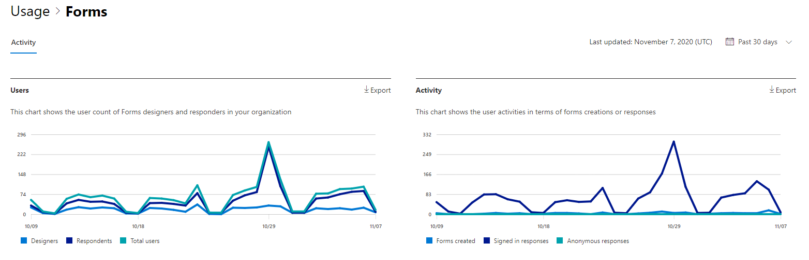

# Microsoft 365 Rapporten in het beheercentrum - Activiteit Formulieren

In Microsoft 365 **dashboard Rapporten** ziet u het activiteitenoverzicht voor de producten in uw organisatie. U kunt inzoomen op rapporten op het niveau van afzonderlijke producten om een gedetailleerder inzicht te krijgen in de activiteiten binnen elk product. Bekijk [het overzichtsonderwerp over rapporten](activity-reports.md).
  
U kunt bijvoorbeeld de activiteit begrijpen van elke gebruiker die een licentie heeft om Microsoft Forms te gebruiken door te kijken naar de interactie met formulieren. Het helpt u ook om het niveau van samenwerking te begrijpen door te kijken naar het aantal formulieren dat is gemaakt en formulieren waarmee de gebruiker heeft gereageerd.
  
> [!NOTE]
> U moet een globale beheerder, globale lezer of rapportlezer zijn in Microsoft 365 of een Exchange, SharePoint, Teams Service, Teams Communications of Skype voor Bedrijven-beheerder om rapporten te kunnen zien.  
 
## Het rapport Forms-activiteiten

1. Ga in het beheercentrum naar de pagina **Rapporten** \> <a href="https://go.microsoft.com/fwlink/p/?linkid=2074756" target="_blank">Gebruik</a>. 
2. Klik op de startpagina van het dashboard op **de knop Meer** weergeven op de formulierenkaart.
  
## Het rapport Forms-activiteit interpreteren

U kunt de activiteiten in het rapport Formulieren bekijken door het tabblad **Activiteit te** kiezen. 

Selecteer **Kolommen kiezen** om kolommen toe te voegen of te verwijderen uit het rapport.    

U kunt de rapportgegevens ook exporteren naar een Excel .csv bestand door de **koppeling Exporteren te** selecteren. Hiermee exporteert u de gegevens van alle gebruikers en kunt u eenvoudige sortering en filtering toepassen voor verdere analyse. Als u minder dan 2000 gebruikers hebt, kunt u de tabel in het rapport zelf sorteren en filteren. Als u meer dan 2000 gebruikers hebt, moet u de gegevens exporteren om te kunnen filteren en sorteren. 
  
|Item|Beschrijving|
|:-----|:-----|
|**Metrische**|**Definitie**|
|Gebruikersnaam    |Het e-mailadres van de gebruiker die de activiteit heeft uitgevoerd in Microsoft Forms.    |
|Laatste activiteitsdatum (UTC)    |De laatste datum waarop een formulieractiviteit is uitgevoerd door de gebruiker voor het geselecteerde datumbereik. Als u de activiteit van een bepaalde datum wilt zien, selecteert u de datum rechtstreeks in de grafiek.  Hiermee filtert u de tabel om alleen bestandsactiviteitsgegevens weer te geven voor gebruikers die de activiteit op die specifieke dag hebben uitgevoerd.    |
|Aantal formulieren dat is gemaakt    |Het aantal formulieren dat de gebruiker heeft gemaakt.     |
|Aantal ingevulde formulieren    |Het aantal formulieren waar de gebruiker antwoorden op heeft verzonden.|
|||
