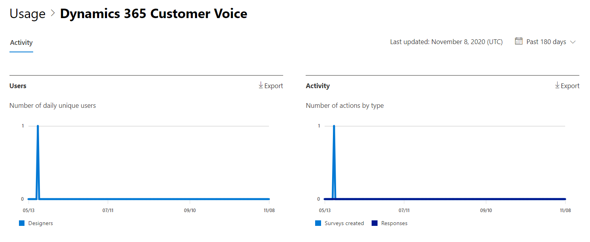

# Microsoft 365 Rapporten in het beheercentrum - Activiteit Dynamics 365 Customer Voice

In Microsoft 365 **dashboard Rapporten** ziet u het activiteitenoverzicht voor de producten in uw organisatie. U kunt inzoomen op rapporten op het niveau van afzonderlijke producten om een gedetailleerder inzicht te krijgen in de activiteiten binnen elk product. Bekijk [het overzichtsonderwerp over rapporten](activity-reports.md).
  
U kunt bijvoorbeeld de activiteit begrijpen van elke gebruiker die een licentie heeft voor het gebruik van Microsoft Dynamics 365 Customer Voice door te kijken naar de interacties met Dynamics 365 Customer Voice. Het helpt u ook om het niveau van samenwerking te begrijpen door te kijken naar het aantal Pro Enquêtes dat is gemaakt en Pro Enquêtes waarop de gebruikers hebben gereageerd. 
  
> [!NOTE]
> U moet een globale beheerder, globale lezer of rapportlezer zijn in Microsoft 365 of een Exchange, SharePoint, Teams Service, Teams Communications of Skype voor Bedrijven-beheerder om rapporten te kunnen zien.  
 
## Het dynamics 365 Customer Voice-activiteitenrapport

1. Ga in het beheercentrum naar de pagina **Rapporten** \> <a href="https://go.microsoft.com/fwlink/p/?linkid=2074756" target="_blank">Gebruik</a>. 
2. Klik op de startpagina van het dashboard op de knop **Meer** weergeven op de Dynamics 365 Customer Voice-kaart.
  
## Het dynamics 365 Customer Voice-activiteitenrapport interpreteren

U kunt de activiteiten in het rapport Dynamics 365 Customer Voice bekijken door het tabblad **Activiteit te** kiezen. 

Selecteer **Kolommen kiezen** om kolommen toe te voegen of te verwijderen uit het rapport.    

U kunt de rapportgegevens ook exporteren naar een Excel .csv bestand door de **koppeling Exporteren te** selecteren. Hiermee exporteert u de gegevens van alle gebruikers en kunt u eenvoudige sortering en filtering toepassen voor verdere analyse. Als u minder dan 2000 gebruikers hebt, kunt u de tabel in het rapport zelf sorteren en filteren. Als u meer dan 2000 gebruikers hebt, moet u de gegevens exporteren om te kunnen filteren en sorteren. 
  
|Item|Beschrijving|
|:-----|:-----|
|**Metrische**|**Definitie**|
|Gebruikersnaam    |Het e-mailadres van de gebruiker die de activiteit heeft uitgevoerd in Microsoft Forms.    |
|Laatste activiteitsdatum (UTC)    |De laatste datum waarop een formulieractiviteit is uitgevoerd door de gebruiker voor het geselecteerde datumbereik. Als u de activiteit van een bepaalde datum wilt zien, selecteert u de datum rechtstreeks in de grafiek. Hiermee filtert u de tabel om alleen bestandsactiviteitsgegevens weer te geven voor gebruikers die de activiteit op die specifieke dag hebben uitgevoerd.    |
|Aantal enquêtes dat is gemaakt    |Het aantal enquêtes dat de gebruiker heeft gemaakt.     |
|Aantal enquêtereacties    |Het aantal reacties van responders aan wie de enquête is gedistribueerd.|
|||