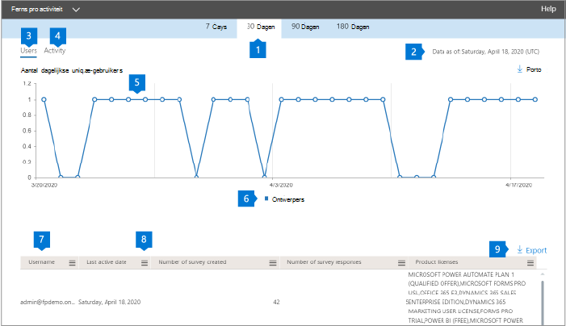

# Microsoft 365-rapporten in het beheercentrum - Activiteit Dynamics 365 Customer VoiceMicrosoft 365 Reports in the admin center - Dynamics 365 Customer Voice activity

In het dashboard  Microsoft 365-rapporten ziet u het activiteitenoverzicht voor alle producten in uw organisatie.The Microsoft 365 **Reports** dashboard shows you the activity overview across the products in your organization. U kunt inzoomen op rapporten op het niveau van afzonderlijke producten om een gedetailleerder inzicht te krijgen in de activiteiten binnen elk product.It enables you to drill in to individual product level reports to give you more granular insight about the activities within each product. Bekijk [het overzichtsonderwerp over rapporten](activity-reports.md).Check out [the Reports overview topic](activity-reports.md).
  
U kunt bijvoorbeeld de activiteit begrijpen van elke gebruiker die een licentie heeft voor het gebruik van Microsoft Dynamics 365 Customer Voice door te kijken naar de interacties met Dynamics 365 Customer Voice.For example, you can understand the activity of every user licensed to use Microsoft Dynamics 365 Customer Voice by looking at their interactions with Dynamics 365 Customer Voice. Het helpt u ook om het niveau van samenwerking te begrijpen door te kijken naar het aantal pro-enquêtes dat is gemaakt en Pro-enquêtes waarop de gebruikers hebben gereageerd.It also helps you to understand the level of collaboration going on by looking at the number of Pro Surveys created and Pro Surveys to which the users responded to. 
  
> [!NOTE]
> U moet een globale beheerder, globale lezer of rapportlezer zijn in Microsoft 365 of een Exchange-, SharePoint-, Teams-, Teams-, Teams-, of Skype voor Bedrijven-beheerder om rapporten te kunnen zien.You must be a global administrator, global reader or reports reader in Microsoft 365 or an Exchange, SharePoint, Teams Service, Teams Communications, or Skype for Business administrator to see reports. 

## Het activiteitsrapport Forms Pro gebruikenHow to get to the Forms Pro activity report

1. Ga in het beheercentrum naar de pagina **Rapporten** \> <a href="https://go.microsoft.com/fwlink/p/?linkid=2074756" target="_blank">Gebruik</a>.In the admin center, go to the **Reports** \> <a href="https://go.microsoft.com/fwlink/p/?linkid=2074756" target="_blank">Usage</a> page.

    
2. Selecteer  **dynamics 365 Customer Voice-activiteit** in de vervolgkeuze selecteer \> **een rapport selecteren.**From the **Select a report** drop-down, select **Dynamics 365 Customer Voice** \> **activity**.

## Het dynamics 365 Customer Voice-activiteitenrapport interpreterenInterpret the Dynamics 365 Customer Voice activity report

U kunt de activiteit Dynamics 365 Customer Voice van uw gebruiker bekijken door de grafieken **Activiteit** en **Gebruikers te** bekijken.You can get a view into your user's Dynamics 365 Customer Voice activity by looking at the **Activity** and **Users** charts. 

|ItemItem|BeschrijvingDescription|
|:-----|:-----|
|1.1.    |Het **dynamics 365 Customer** Voice-activiteitenrapport kan worden bekeken voor trends in de afgelopen 7, 30 dagen, 90 of 180 dagen.The **Dynamics 365 Customer Voice** activity report can be viewed for trends over the last 7 days, 30 days, 90 days, or 180 days. Als u echter een bepaalde dag in het rapport selecteert, worden in de tabel (7) gegevens voor maximaal 28 dagen vanaf de huidige datum (niet de datum waarop het rapport is gegenereerd) weer te geven.However, if you select a particular day in the report, the table (7) will show data for up to 28 days from the current date (not the date the report was generated).     |
|2.2.    |De gegevens in elk rapport zijn meestal net zo recent als de afgelopen 48 uur.The data in each report is usually as recent as the last 48 hours.    |
|3.3.    |De **weergave** Gebruikers helpt u de trend te begrijpen in het aantal actieve gebruikers van Dynamics 365 Customer Voice.The **Users** view helps you to understand the trend in the number of active Dynamics 365 Customer Voice users. Een gebruiker wordt als actief beschouwd als hij of zij een activiteit rond een Pro-enquête (maken, bewerken, weergeven, enzovoort) heeft uitgevoerd binnen de specifieke periode.A user is considered active if they have executed an activity around a Pro Survey (create, edit, view, etc.) within the specific time period.    |
|4.4.    |Met **de weergave** Activiteit kunt u de trend in het aantal actieve gebruikers begrijpen.The **Activity** view helps you to understand the trend in the number of active users. Een gebruiker wordt als actief beschouwd als hij of zij een bestandsactiviteit (opslaan, synchroniseren, wijzigen of delen) heeft uitgevoerd of een pagina bezocht in de opgegeven periode.A user is considered active if he or she has executed a file activity (save, sync, modify, or share) or visited a page within the specific time period.  OPMERKING: Een activiteit kan meerdere keren voor één enquête plaatsvinden, maar wordt slechts als één actieve enquête geteld.NOTE: An activity can occur multiple times for a single survey, but will count only as one active Survey. U kunt bijvoorbeeld een Pro-enquête maken en dezelfde enquête meerdere keren gedurende een opgegeven periode blijven bewerken. Deze enquête wordt slechts als één enquête geteld.For example, you can create a Pro Survey and continue to edit the same Survey multiple times over a specified time period, it will count only as one single Survey.  |
|5.5. |In de **grafiek Gebruikers** is de Y-as het aantal unieke gebruikers.On the **Users** chart, the Y axis is the number of unique users. X-as is de datum waarop de unieke gebruikers actief zijn.X axis is the date that the unique users are active on. De legenda's zijn:The legends are:  **Ontwerpers** betekent dat de gebruiker een Dynamics 365 Customer Voice Survey heeft gemaakt of bewerkt.**Designers** means the user has created or edited a Dynamics 365 Customer Voice Survey.  In de **grafiek Activiteit** is de Y-as het aantal Dynamics 365 Customer Voice-antwoorden per enquête.On the **Activity** chart, the Y axis is the count of Dynamics 365 Customer Voice responses per survey. X-as is de datum waarop de activiteit Enquête of Antwoord heeft plaatsgevonden.X axis is the date that the Survey or Response activity occurred. De legenda's zijn:The legends are:  **Enquêtes** die zijn gemaakt, is het aantal unieke Dynamics 365 Customer Voice-enquêtes die de gebruikers hebben gemaakt**Surveys created** is the count of unique Dynamics 365 Customer Voice surveys that the users have created **Antwoorden is** het aantal anonieme of niet-anonieme antwoorden dat de gebruikers die de enquête hebben ontvangen, hebben ingediend.**Responses** is the count of anonymous or non-anonymous responses that the users who received the survey have submitted. |
|6.6. |U kunt de reeks filteren die u in de grafiek ziet door een item in de legenda te selecteren.You can filter the series you see on the chart by selecting an item in the legend. Selecteer bijvoorbeeld in de grafiek Gebruikers ontwerpers, responders of totale gebruikers om alleen de informatie te zien die betrekking heeft op elke grafiek.For example, on the Users chart, select designers, responders, or total users to see only the info related to each one. Als u deze selectie wijzigt, worden de gegevens in de rastertabel eronder niet gewijzigd.Changing this selection doesn't change the info in the grid table below it.|
|7.7. |In de tabel ziet u een uitsplitsing van de activiteiten op het niveau per gebruiker.The table shows you a breakdown of the activities at the per-user level. De legenda's zijn:The legends are:  **Gebruikersnaam** is het e-mailadres van de gebruiker die de activiteit heeft uitgevoerd op Microsoft Forms.**Username** is the email address of the user who performed the activity on Microsoft Forms. **De laatste activiteitsdatum (UTC)** is de laatste datum waarop een formulieractiviteit is uitgevoerd door de gebruiker voor het geselecteerde datumbereik.**Last activity date (UTC)** is the latest date a form activity was performed by the user for the selected date range. Als u de activiteit van een bepaalde datum wilt zien, selecteert u de datum rechtstreeks in de grafiek.To see activity that occurred on a specific date, select the date directly in the chart. Hiermee filtert u de tabel om alleen bestandsactiviteitsgegevens weer te geven voor gebruikers die de activiteit op die specifieke dag hebben uitgevoerd.This will filter the table to display file activity data only for users who performed the activity on that specific day.  **Het aantal enquêtes dat** is gemaakt, is het aantal enquêtes dat de gebruiker heeft gemaakt.**Number of surveys created** is the number of surveys that the user created.  **Het aantal enquêtereacties** is het aantal antwoorden van antwoorders aan wie de enquête is gedistribueerd.**Number of survey responses** is the number of responses from responders to whom the survey was distributed to.|
|8.8. |Selecteer het **pictogram Kolommen beheren** om kolommen toe te voegen of te verwijderen uit het rapport.Select the **Manage columns** icon to add or remove columns from the report.|
|9.9. |U kunt de rapportgegevens ook exporteren naar een CSV-bestand van Excel door de **koppeling Exporteren te** selecteren.You can also export the report data into an Excel .csv file by selecting the **Export** link. Hiermee exporteert u gegevens voor alle gebruikers en kunt u eenvoudige aggregatie, sorteren en filteren voor verdere analyse.This exports data for all users and enables you to do simple aggregation, sorting and filtering for further analysis. Als u minder dan 100 gebruikers hebt, kunt u sorteren en filteren in de tabel in het rapport zelf.If you have less than 100 users, you can sort and filter within the table in the report itself. Als u meer dan 100 gebruikers hebt, moet u de gegevens exporteren om te kunnen filteren en sorteren.If you have more than 100 users, in order to filter and sort, you will need to export the data.|