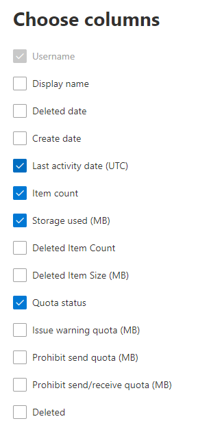

# Microsoft 365-rapporten in het beheercentrum - PostvakgebruikMicrosoft 365 Reports in the admin center - Mailbox usage

Het rapport **Postvakgebruik** bevat informatie over gebruikers met een gebruikerspostvak en de mate van activiteit op basis van de e-mail die wordt verzonden, gelezen, afspraken maken, vergadering verzenden, accepteren, weigeren en annuleren van vergaderactiviteiten.The **Mailbox usage report** provides information about users with a user mailbox and the level of activity by each based on the email send, read, create appointment, send meeting, accept meeting, decline meeting and cancel meeting activity. Het rapport bevat ook informatie over hoeveel opslagruimte in beslag wordt genomen door elk gebruikerspostvak en hoeveel van die postvakken de opslagquota naderen.It also provides information about how much storage has been consumed by each user mailbox, and how many of them are approaching storage quotas. 
  
> [!NOTE]
> U moet een globale beheerder, globale lezer of rapportenlezer in Microsoft 365 of een beheerder van Exchange, SharePoint, Teams Service, Teams Communications of Skype voor Bedrijven zijn om rapporten te kunnen zien.You must be a global administrator, global reader or reports reader in Microsoft 365 or an Exchange, SharePoint, Teams Service, Teams Communications, or Skype for Business administrator to see reports. 
 
## Het gebruiksrapport verkrijgenHow to get to the mailbox usage report

1. Ga in het beheercentrum naar de pagina **Rapporten** \> <a href="https://go.microsoft.com/fwlink/p/?linkid=2074756" target="_blank">Gebruik</a>.In the admin center, go to the **Reports** \> <a href="https://go.microsoft.com/fwlink/p/?linkid=2074756" target="_blank">Usage</a> page.
2. Selecteer **Meer weergeven onder** **E-mailactiviteit.**Select **View More** under **Email activity**. 
3. Selecteer **Exchange-postvakgebruik** in de vervolgkeuzelijst **E-mailactiviteit.** \> From the **Email activity** drop-down list, select **Exchange** \> **Mailbox usage**.

## Het rapport Postvakgebruik interpreterenInterpret the mailbox usage report

U krijgt een overzicht van het **Postvakgebruik** in uw organisatie aan de hand van de grafieken **Postvak**, **Opslag** en **Quotum**.You can get a view into your organization's **Mailbox usage** by looking at the **Mailbox**, **Storage** and **Quota** charts. 
  

|ItemItem|BeschrijvingDescription|
|:-----|:-----|
|1.1.    |In het rapport **Postvakgebruik** kunnen trends worden weergegeven voor de laatste 7, 30, 90 of 180 dagen.The **Mailbox usage** report can be viewed for trends over the last 7 days, 30 days, 90 days, or 180 days. Als u echter een bepaalde dag in het rapport selecteert, worden in de tabel gegevens voor een datum tot 28 dagen vanaf de huidige datum (niet de datum waarop het rapport is gegenereerd) als gegevens worden gegenereerd.However, if you select a particular day in the report, the table will show data for up to 28 days from the current date (not the date the report was generated).    |
|2.2.    |De gegevens in elk rapport zijn meestal tot de laatste 24 tot 48 uur bestrijkt.The data in each report usually covers up to the last 24 to 48 hours.    |
|3.3.    |De grafiek Postvak toont het totale aantal gebruikerspostvakken in uw organisatie en het totale aantal gebruikerspostvakken dat actief is op een bepaalde dag van de rapportageperiode. Een gebruikerspostvak wordt als actief beschouwd als er een e-mailbericht via het postvak is verzonden of gelezen, een afspraak is gemaakt of een vergadering is verzonden, geaccepteerd, afgewezen of geannuleerd.The Mailbox chart shows you the total number of user mailbox in your organization, and the total number that are active on any given day of the reporting period. A user mailbox is considered active if it had an email send, read, create appointment, send meeting, accept meeting, decline meeting and cancel meeting activity.    |
|4.4.    |De grafiek **Opslag** toont de hoeveelheid gebruikte opslagruimte in uw organisatie.The **Storage** chart shows you amount of storage used in your organization. Opslagdiagram bevat geen archiefpostvakken.Storage Chart doesn't include archive mailboxes. Zie Overzicht van onbeperkt archiveren [in Microsoft 365](https://docs.microsoft.com/microsoft-365/compliance/unlimited-archiving)voor meer informatie over automatisch uit te breiden archivering.For more information about auto-expanding archiving, see [Overview of unlimited archiving in Microsoft 365](https://docs.microsoft.com/microsoft-365/compliance/unlimited-archiving).  |
|5.5.    | De grafiek **Quotum** toont het aantal gebruikerspostvakken in elke quotumcategorie. Er zijn vier quotumcategorieën:  The **Quota** chart shows you the number of user mailboxes in each quota category. There are four quota categories:     Goed: het aantal gebruikers waarvoor de gebruikte opslagruimte onder het quotum voor Waarschuwing geven ligt.Good - number of users whose storage used is below the issue warning quota.     Waarschuwing: het aantal gebruikers waarvoor de gebruikte opslagruimte op of boven het quotum voor Waarschuwing geven ligt, maar onder het quotum voor Verzenden blokkeren.Warning - number of users whose storage used is at or above issue warning, but below prohibit send quota     Kan niet verzenden: het aantal gebruikers waarvoor de gebruikte opslagruimte op of boven het quotum voor Verzenden blokkeren ligt, maar onder het quotum voor Verzenden/ontvangen blokkeren.Can't send - number of users whose storage used is at or above the prohibit send quota, but below prohibit send/receive quota     Kan niet verzenden/ontvangen: het aantal gebruikers waarvoor de gebruikte opslagruimte op of boven het quotum voor Verzenden/ontvangen blokkeren ligt.Can't send/receive - number of users whose storage used is at or above prohibit send/receive quota    |
|6.6.    | In de grafiek **Postvak** bevat de Y-as het aantal gebruikerspostvakken.On the **Mailbox** chart, the Y axis is the count of user mailboxes.     In de grafiek **Opslag** bevat de Y-as de hoeveelheid opslagruimte die wordt gebruikt door gebruikerspostvakken in uw organisatie.On the **Storage** chart, the Y axis is the amount of storage being used by user mailboxes in your organization.     In de grafiek **Quotum** bevat de Y-as het aantal gebruikerspostvakken in elk opslagquotum.On the **Quota** chart, the Y axis is the number of user mailboxes in each storage quota.     De X-as in de grafieken Postvak en Opslag toont het geselecteerde datumbereik voor dit specifieke rapport.The X axis on the Mailbox and Storage charts is the selected date range for this specific report.     De X-as van de grafiek Quotum is de quotumcategorie.The X axis on the Quota charts is the quota category.    |
|7.7.    |U kunt grafieken die u ziet filteren door een item in de legenda te selecteren.You can filter charts you see by selecting an item in the legend.    |
|8.8.    | De tabel toont een onderverdeling van het postvakgebruik op gebruikersniveau. U kunt extra kolommen aan de tabel toevoegen.  The table shows you a breakdown of mailbox usage at the per-user level. You can add additional columns to the table.    **Gebruikersnaam** is het e-mailadres van de gebruiker.**User name** is the email address of the user.    **Weergavenaam** is de volledige naam van de gebruiker.**Display Name** is the full name if the user.    **Verwijderd** verwijst naar een postvak waarvoor de huidige status Verwijderd is, maar dat een deel van de rapportageperiode van het rapport actief was.**Deleted** refers to the mailbox whose current state is deleted, but was active during some part of the reporting period of the report.    **Verwijderd op** is de datum waarop het postvak is verwijderd.**Deleted date** is the date the mailbox was deleted.    **Datum maken** is de datum waarop het postvak is gemaakt.**Create date** is the date the mailbox was created.    **Laatste activiteitsdatum** is de laatste datum waarop via het postvak een e-mailbericht is verzenden of gelezen.**Last activity date** refers to the date the mailbox had an email send or read activity.    **Aantal items** verwijst naar het totale aantal items in het postvak.**Item count** refers to the total number of items in the mailbox.    **Opslagruimte gebruikt (MB)** verwijst naar de totale gebruikte opslagruimte.**Storage used (MB)** refers to the total storage used.    **Verwijderde items tellen** verwijst naar het totale aantal verwijderde items in het postvak.**Deleted Item Count** refers to the total number of deleted items in the mailbox.   **Verwijderde itemgrootte (MB)** verwijst naar de totale grootte van alle verwijderde items in het postvak.**Deleted Item Size (MB)** refers to the total size of all deleted items in the mailbox.   **Quotum Waarschuwing geven (MB)** verwijst naar de opslaglimiet wanneer de eigenaar van het postvak een waarschuwing ontvangt dat het opslagquotum bijna is bereikt.**Issue warning quota (MB)** refers to the storage limit when the mailbox owner will receive a warning that it's about to hit the storage quota.    **Quotum Verzenden blokkeren (MB)** verwijst naar de opslaglimiet wanneer het postvak geen e-mailberichten meer kan verzenden.**Prohibit send quota (MB)** refers to the storage limit when the mailbox can no longer send emails.    **Quotum Verzenden/ontvangen blokkeren (MB)** verwijst naar de opslaglimiet wanneer het postvak geen e-mailberichten meer kan verzenden of ontvangen.**Prohibit send receive quota (MB)** refers to the storage limit when the mailbox can no longer send or receive emails.     Als het beleid van uw organisatie verhindert dat u rapporten weergeeft waarin gebruikersgegevens kunnen worden geïdentificeerd, kunt u de privacy-instelling voor elk van deze rapporten wijzigen.If your organization's policies prevents you from viewing reports where user information is identifiable, you can change the privacy setting for all these reports. Bekijk de **gebruikersdetails verbergen in de sectie Rapporten** in de [activiteitenrapporten in het Microsoft 365-beheercentrum.](activity-reports.md)Check out the **Hide user details in the reports** section in the [Activity Reports in the Microsoft 365 admin center](activity-reports.md).    |
|9.9.    |Selecteer **Kolommen kiezen om** kolommen toe te voegen aan of te verwijderen uit het rapport.Select **Choose columns** to add or remove columns from the report.    |
|10.10.    |U kunt de rapportgegevens ook exporteren naar een CSV-bestand van Excel door de **koppeling Exporteren te** selecteren.You can also export the report data into an Excel .csv file, by selecting the **Export** link.    |
|||
   
