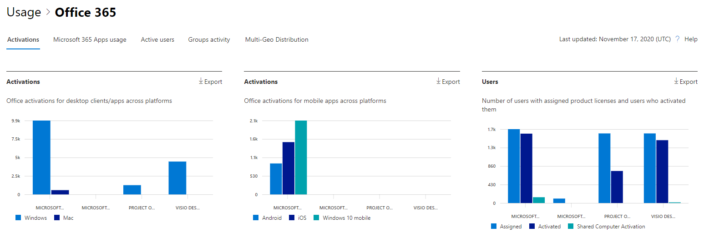
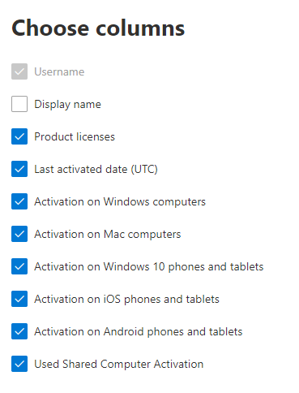

# Microsoft 365 Rapporten in het beheercentrum - Microsoft Office activeringenMicrosoft 365 Reports in the admin center - Microsoft Office activations

In Microsoft 365 **dashboard Rapporten** ziet u het activiteitenoverzicht voor de producten in uw organisatie.The Microsoft 365 **Reports** dashboard shows you the activity overview across the products in your organization. U kunt inzoomen op rapporten op het niveau van afzonderlijke producten om een gedetailleerder inzicht te krijgen in de activiteiten binnen elk product.It enables you to drill in to individual product level reports to give you more granular insight about the activities within each product. Bekijk [het overzichtsonderwerp over rapporten](activity-reports.md).Check out [the Reports overview topic](activity-reports.md).
  
Het activeringsrapport van Office geeft een overzicht van welke gebruikers hun Office-abonnement op minstens één apparaat hebben geactiveerd.The Office Activation report gives you a view of which users have activated their Office subscription on at least one device. Het biedt een uitsplitsing van de Microsoft 365-apps voor ondernemingen, Project en Visio Pro voor Office 365- en abonnementsactiveringen, evenals de uitsplitsing van activeringen op desktopcomputers en apparaten.It provides a breakdown of the Microsoft 365 Apps for enterprise, Project, and Visio Pro for Office 365 subscription activations, as well as the breakdown of activations across desktop and devices. Dit rapport kan u helpen gebruikers te identificeren die mogelijk meer hulp en ondersteuning nodig hebben om hun Office-abonnement te activeren.This report could be useful in helping you identify users that might need additional help and support to activate their Office subscription.
  
> [!NOTE]
> U moet een globale beheerder, globale lezer of rapportlezer zijn in Microsoft 365 of een Exchange, SharePoint, Teams Service, Teams Communications of Skype voor Bedrijven-beheerder om rapporten te kunnen zien.You must be a global administrator, global reader or reports reader in Microsoft 365 or an Exchange, SharePoint, Teams Service, Teams Communications, or Skype for Business administrator to see reports.  
  
## Naar het Office-activeringsrapport gaanHow to get to the Office activations report

1. Ga in het beheercentrum naar de pagina **Rapporten** \> <a href="https://go.microsoft.com/fwlink/p/?linkid=2074756" target="_blank">Gebruik</a>.In the admin center, go to the **Reports** \> <a href="https://go.microsoft.com/fwlink/p/?linkid=2074756" target="_blank">Usage</a> page. 
2. Klik op de startpagina van het dashboard op de knop **Meer** weergeven op Office activeringskaart.From the dashboard homepage, click on the **View more** button on the Office activations card.
  
## Het Office-activeringsrapport interpreterenInterpret the Office activations report
  
U kunt de activeringen in het rapport Office 365 door het tabblad **Activeringen te** kiezen.You can view the activations in the Office 365 report by choosing the **Activations** tab. 

Selecteer **Kolommen kiezen** om kolommen toe te voegen of te verwijderen uit het rapport.Select **Choose columns** to add or remove columns from the report.    

U kunt de rapportgegevens ook exporteren naar een Excel .csv bestand door de **koppeling Exporteren te** selecteren.You can also export the report data into an Excel .csv file by selecting the **Export** link. Hiermee exporteert u de gegevens van alle gebruikers en kunt u eenvoudige sortering en filtering toepassen voor verdere analyse.This exports data of all users and enables you to do simple sorting and filtering for further analysis. Als u minder dan 2000 gebruikers hebt, kunt u de tabel in het rapport zelf sorteren en filteren.If you have less than 2000 users, you can sort and filter within the table in the report itself. Als u meer dan 2000 gebruikers hebt, moet u de gegevens exporteren om te kunnen filteren en sorteren.If you have more than 2000 users, in order to filter and sort, you will need to export the data. 

|ItemItem|BeschrijvingDescription|
|:-----|:-----|
|**Metrische****Metric**|**Definitie****Definition**|
|GebruikersnaamUsername    |Het e-mailadres van de gebruiker.The email address of the user.    |
|WeergavenaamDisplay name    |De volledige naam van de gebruiker.The full name of the user.    |
|ProductlicentiesProduct licenses    |De producten die aan deze gebruiker zijn toegewezen.The products that are assigned to this user.    |
|Laatst geactiveerde datum(UTC)Last activated date(UTC)    |De datum waarop de gebruiker de Office op een bureaublad of apparaat heeft geactiveerd.The date the user activated Office on a desktop or a device.    |
|Activering op Windows computersActivation on Windows computers    |Het aantal Windows bureaubladen dat een gebruiker heeft geactiveerd Office ingeschakeld.The number of Windows desktops a user activated Office on.    |
|Activering op Mac-computersActivation on Mac computers   |Het aantal Mac-bureaubladen dat een gebruiker heeft Office ingeschakeld.The number of Mac desktops a user activated Office on.|
|Activering op Windows 10 telefoons en tabletsActivation on Windows 10 phones and tablets    |Het aantal Windows 10 mobiele apparaten dat een gebruiker heeft geactiveerd Office ingeschakeld.The number of Windows 10 mobile devices a user activated Office on.    |
|Activering op iOS-telefoons en -tabletsActivation on iOS phones and tablets    |Het aantal iOS-apparaten dat een gebruiker heeft geactiveerd Office ingeschakeld.The number of iOS devices a user activated Office on.|
|Activering op Android-telefoons en -tabletsActivation on Android phones and tablets    |Het aantal Android-apparaten dat een gebruiker heeft Office ingeschakeld.The number of Android devices a user activated Office on.    |
|Gedeelde computeractivering gebruiktUsed Shared Computer Activation |Dit is het geval als de gebruiker de Office via de activering van de gedeelde computer heeft gebruikt.This is true if the user used Office through shared computer activation.|
|||
   