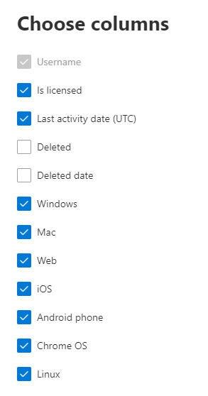

# Microsoft 365-rapporten in het Beheercentrum-Apparaatgebruik in Microsoft teamsMicrosoft 365 Reports in the admin center - Microsoft Teams device usage

Het dashboard Microsoft 365 **rapporten** toont u het overzicht van de activiteiten in de producten van uw organisatie.The Microsoft 365 **Reports** dashboard shows you the activity overview across the products in your organization. U kunt inzoomen op rapporten op het niveau van afzonderlijke producten om een gedetailleerder inzicht te krijgen in de activiteiten binnen elk product.It enables you to drill in to individual product level reports to give you more granular insight about the activities within each product. Bekijk [het overzichtsonderwerp over rapporten](activity-reports.md).Check out [the Reports overview topic](activity-reports.md). Met het rapport App-gebruik in Microsoft Teams kunt u meer inzicht krijgen in de Microsoft Teams-apps die in uw organisatie worden gebruikt.In the Microsoft Teams app usage report, you can gain insights into the Microsoft Teams apps that are used in your organization.
  
> [!NOTE]
> U moet een globale beheerder, algemene lezer of rapporten lezer zijn in Microsoft 365 of een Exchange-, SharePoint-, teams-service, teams-communicatie of Skype voor bedrijven-beheerder om rapporten te zien.You must be a global administrator, global reader or reports reader in Microsoft 365 or an Exchange, SharePoint, Teams Service, Teams Communications, or Skype for Business administrator to see reports.  
 
## Zo gaat u naar het rapport App-gebruik in Microsoft TeamsHow to get to the Microsoft Teams app usage report

1. Ga in het beheercentrum naar de pagina **Rapporten** \> <a href="https://go.microsoft.com/fwlink/p/?linkid=2074756" target="_blank">Gebruik</a>.In the admin center, go to the **Reports** \> <a href="https://go.microsoft.com/fwlink/p/?linkid=2074756" target="_blank">Usage</a> page. 
2. Klik op de startpagina van het dashboard op de knop **meer weergeven** op de activiteiten kaart van Microsoft teams.From the dashboard homepage, click on the **View more** button on the Microsoft Teams activity card.
  
## Het rapport App-gebruikt in Microsoft Teams interpreterenInterpret the Microsoft Teams app usage report

U kunt het apparaat gebruiken in het rapport teams door het tabblad **Apparaatgebruik** te kiezen.You can view the device use in the Teams report by choosing the **Device usage** tab. 

Selecteer **kolommen kiezen** als u kolommen wilt toevoegen aan of verwijderen uit het rapport.Select **Choose columns** to add or remove columns from the report.    

U kunt de rapportgegevens ook exporteren naar een CSV-bestand van Excel door de koppeling **exporteren** te selecteren.You can also export the report data into an Excel .csv file by selecting the **Export** link. Hiermee exporteert u de gegevens van alle gebruikers en kunt u eenvoudige sortering en filtering toepassen voor verdere analyse.This exports data of all users and enables you to do simple sorting and filtering for further analysis. Als u minder dan 2000 gebruikers hebt, kunt u de tabel in het rapport zelf sorteren en filteren.If you have less than 2000 users, you can sort and filter within the table in the report itself. Als u meer dan 2000 gebruikers hebt, moet u de gegevens exporteren om te kunnen filteren en sorteren.If you have more than 2000 users, in order to filter and sort, you will need to export the data. 
  
|ItemItem|BeschrijvingDescription|
|:-----|:-----|
|**Gegevens****Metric**|**Definitie****Definition**|
|GebruikersnaamUser name    |De weergavenaam van de gebruiker.The display name of the user.    |
|WindowsWindows    |Deze optie is geselecteerd als de gebruiker actief is geweest in de desktopclient van teams op een Windows-computer.Selected if the user was active in the Teams desktop client on a Windows-based computer.    |
|MacMac    |Geselecteerd als de gebruiker is geactiveerd in de desktopclient van de teams-bureaubladclient op een macOS-computer.Selected if the user was active in the Teams desktop client on a macOS computer.    |
|ApparateniOS    |Deze optie is geselecteerd als de gebruiker actief is geweest in de mobiele client voor teams voor iOS.Selected if the user was active on the Teams mobile client for iOS.    |
|Android-telefoonAndroid phone    | Deze optie is geselecteerd als de gebruiker actief is geweest in de mobiele app teams voor Android.Selected if the user was active on the Teams mobile client for Android.    |
|Chroom OSChrome OS    |Geselecteerd als de gebruiker in de desktopclient van de team versie van een ChromeOS-computer is geactiveerd.Selected if the user was active in the Teams desktop client on a ChromeOS computer.|
|SpreekLinux    | Geselecteerd als de gebruiker is geactiveerd in de desktopclient van de teams-bureaubladclient op een Linux-computer.Selected if the user was active in the Teams desktop client on a Linux computer.    |
|WebWeb    |Geselecteerd als de gebruiker is geactiveerd in de webclient van teams op apparaten.Selected if the user was active in the Teams web client on devices.|
|Datum van laatste activiteit (UTC)Last activity date (UTC)    |De laatste datum (UTC) waaraan de gebruiker heeft deelgenomen aan een teams-activiteit.The last date (UTC) that the user participated in a Teams activity .    |
|Is een licentieIs licensed|Geselecteerd als de gebruiker een licentie heeft om teams te gebruiken.Selected if the user is licensed to use Teams.|
|||