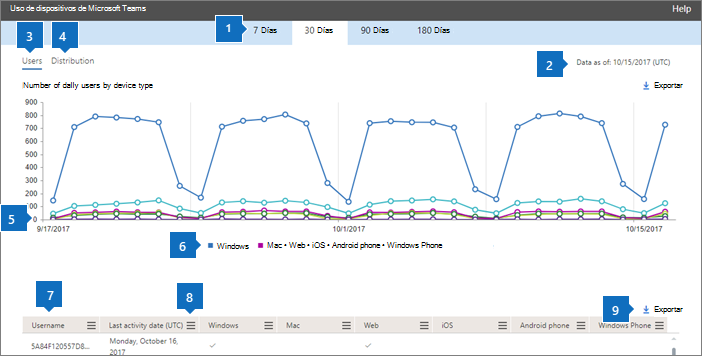
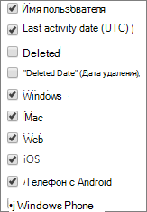

# Microsoft 365-rapporten in het Beheercentrum-Apparaatgebruik in Microsoft teams

Het dashboard Microsoft 365 **rapporten** toont u het overzicht van de activiteiten in de producten van uw organisatie. U kunt inzoomen op rapporten op het niveau van afzonderlijke producten om een gedetailleerder inzicht te krijgen in de activiteiten binnen elk product. Bekijk [het overzichtsonderwerp over rapporten](activity-reports.md). Met het rapport App-gebruik in Microsoft Teams kunt u meer inzicht krijgen in de Microsoft Teams-apps die in uw organisatie worden gebruikt.
  
> [!NOTE]
> U moet een globale beheerder, algemene lezer of rapporten lezer zijn in Microsoft 365 of een Exchange-, SharePoint-, teams-service, teams-communicatie of Skype voor bedrijven-beheerder om rapporten te zien.  
 
## Zo gaat u naar het rapport App-gebruik in Microsoft Teams

1. Ga in het beheercentrum naar de pagina **Rapporten** \> <a href="https://go.microsoft.com/fwlink/p/?linkid=2074756" target="_blank">Gebruik</a>.

    
2. Selecteer in de vervolgkeuzelijst **een rapport selecteren** de optie Apparaatgebruik in **Microsoft teams** \> **Device usage**.
  
## Het rapport App-gebruikt in Microsoft Teams interpreteren

U kunt inzicht krijgen in het app-gebruik in Microsoft Teams door de grafieken **Gebruikers** en **Distributie** te bekijken. 
  

  
|Item|Beschrijving|
|:-----|:-----|
|1.    |In het rapport **Apparaatgebruik in Microsoft Teams** kunnen trends worden weergegeven voor de laatste 7, 30, 90 of 180 dagen. Als u echter een bepaalde dag selecteert in het rapport, worden in de tabel (7) gegevens weergegeven voor tot 28 dagen vanaf de huidige datum (niet de datum waarop het rapport is gegenereerd).    |
|2.    |De gegevens in de rapporten liggen meestal binnen de laatste 24 tot 48 uur.    |
|3.    |In de weergave **Gebruikers** ziet u het aantal unieke gebruikers per app per dag.    |
|4.    |In de weergave **Distributie** ziet u het aantal unieke gebruikers per app in de geselecteerde periode.    |
|5.    | In de grafiek **Gebruikers** geeft de Y-as het aantal gebruikers per app aan.     In de grafiek **Distributie** geeft de Y-as het aantal gebruikers aan dat de opgegeven app heeft gebruikt.     De X-as in de grafieken toont het geselecteerde datumbereik voor het specifieke rapport.    |
|zes.    |U kunt de reeks die u in de grafiek ziet, filteren door een item te selecteren in de legenda. Selecteer bijvoorbeeld in de grafiek **gebruikers** de optie **Windows**, **Mac**, **bellen**, **Web**, **Android-telefoon**of **Windows Phone** om alleen de informatie te zien die voor elk item wordt weergegeven. Door deze selectie te wijzigen, verandert de informatie in de rastertabel niet.    |
|7,5.    | Welke lijst met groepen wordt weergegeven, wordt bepaald door de groepen die bestaan (niet zijn verwijderd) in de ruimste rapportageperiode (180 dagen). Het aantal activiteiten is afhankelijk van de datumselectie.    Opmerking: u kunt alle items in de onderstaande lijst in de kolommen niet zien totdat u ze toevoegt.  **Gebruikersnaam** is het e-mailadres van de gebruiker. U kunt het feitelijke e-mailadres weergeven of dit veld anoniem maken.    **Datum van laatste activiteit (UTC)** verwijst naar de laatste datum waarop de gebruiker heeft deelgenomen aan een Microsoft Teams-activiteit in een app.    **Verwijderd** geeft aan of het team is verwijderd. Als het team is verwijderd maar activiteiten had in de rapportageperiode, wordt het weergegeven in het raster met Verwijderd ingesteld op Waar.    **Verwijderd op** is de datum waarop het team is verwijderd.    **Windows** is ingeschakeld als de gebruiker in de opgegeven periode actief is geweest in de Windows-app.    **Mac** is ingeschakeld als de gebruiker in de opgegeven periode actief is geweest in een Mac-app.    **Web** is ingeschakeld als de gebruiker in de opgegeven periode actief is geweest in een web-app.    **iOS** is ingeschakeld als de gebruiker in de opgegeven periode actief is geweest in een iOS-app.    **Android-telefoon** is ingeschakeld als de gebruiker in de opgegeven periode actief is geweest in een Android-telefoon-app.    **Windows-telefoon** is ingeschakeld als de gebruiker in de opgegeven periode actief is geweest in een Windows Phone-app.     Als het beleid van uw organisatie verhindert dat u rapporten weergeeft waarin gebruikersgegevens kunnen worden geïdentificeerd, kunt u de privacy-instelling voor elk van deze rapporten wijzigen. Kijk eens naar de sectie **Hoe kan ik Details van gebruikersniveau verbergen?** in de [activiteitsrapporten in het Microsoft 365-Beheercentrum](activity-reports.md).    |
|8:00.    |Selecteer **kolommen** als u kolommen wilt toevoegen aan of verwijderen uit het rapport.    |
|aanhaling.    |U kunt de rapportgegevens ook exporteren naar een CSV-bestand van Excel door de koppeling **exporteren** te selecteren. Hiermee exporteert u de gegevens van alle gebruikers en kunt u eenvoudige sortering en filtering toepassen voor verdere analyse. Als u minder dan 2000 gebruikers hebt, kunt u de tabel in het rapport zelf sorteren en filteren. Als u meer dan 2000 gebruikers hebt, moet u de gegevens exporteren om te kunnen filteren en sorteren.    |
|||
   
  

