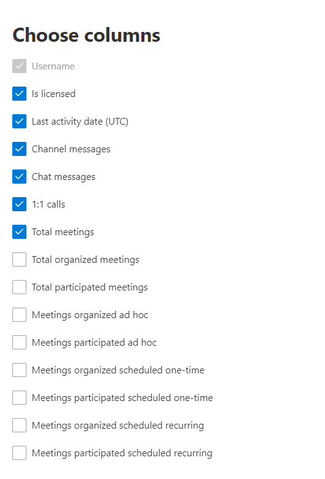

# Microsoft 365-rapporten in het beheercentrum - Gebruikersactiviteit in Microsoft TeamsMicrosoft 365 Reports in the admin center - Microsoft Teams user activity

Het Dashboard Microsoft **365-rapporten** toont een overzicht van de activiteiten voor alle producten in uw organisatie.The Microsoft 365 **Reports** dashboard shows you the activity overview across the products in your organization. U kunt inzoomen op rapporten op het niveau van afzonderlijke producten om een gedetailleerder inzicht te krijgen in de activiteiten binnen elk product.It enables you to drill in to individual product level reports to give you more granular insight about the activities within each product. Bekijk [het overzichtsonderwerp over rapporten](activity-reports.md).Check out [the Reports overview topic](activity-reports.md). Met het rapport Gebruikersactiviteit in Microsoft Teams kunt u meer inzicht krijgen in de Microsoft Teams-activiteiten in uw organisatie.In the Microsoft Teams user activity report, you can gain insights into the Microsoft Teams activity in your organization.
  
> [!NOTE]
> U moet een globale beheerder, globale lezer of lezer van rapporten zijn in Microsoft 365 of een beheerder van Exchange, SharePoint, Teams Service, Teams Communications of Skype voor Bedrijven om rapporten te kunnen zien.You must be a global administrator, global reader or reports reader in Microsoft 365 or an Exchange, SharePoint, Teams Service, Teams Communications, or Skype for Business administrator to see reports.  
 
## Zo gaat u naar het rapport Gebruikersactiviteit in Microsoft TeamsHow to get to the Microsoft Teams user activity report

1. Ga in het beheercentrum naar de pagina **Rapporten** \> <a href="https://go.microsoft.com/fwlink/p/?linkid=2074756" target="_blank">Gebruik</a>.In the admin center, go to the **Reports** \> <a href="https://go.microsoft.com/fwlink/p/?linkid=2074756" target="_blank">Usage</a> page.
2. Klik op de startpagina van het dashboard op **de knop** Meer weergeven op de microsoft Teams-activiteitskaart.From the dashboard homepage, click on the **View more** button on the Microsoft Teams activity card.

## Het rapport Gebruikersactiviteit in Microsoft Teams interpreterenInterpret the Microsoft Teams user activity report

U kunt de gebruikersactiviteit in het Teams-rapport bekijken door het tabblad **Gebruikersactiviteit te** kiezen.You can view the user activity in the Teams report by choosing the **User activity** tab.  

Selecteer **Kolommen kiezen om** kolommen toe te voegen aan of te verwijderen uit het rapport.Select **Choose columns** to add or remove columns from the report.    

U kunt de rapportgegevens ook exporteren naar een CSV-bestand van Excel door de **koppeling Exporteren te** selecteren.You can also export the report data into an Excel .csv file by selecting the **Export** link. Hiermee exporteert u de gegevens van alle gebruikers en kunt u eenvoudige sortering en filtering toepassen voor verdere analyse.This exports data of all users and enables you to do simple sorting and filtering for further analysis. Als u minder dan 2000 gebruikers hebt, kunt u de tabel in het rapport zelf sorteren en filteren.If you have less than 2000 users, you can sort and filter within the table in the report itself. Als u meer dan 2000 gebruikers hebt, moet u de gegevens exporteren om te kunnen filteren en sorteren.If you have more than 2000 users, in order to filter and sort, you will need to export the data. De geëxporteerde indeling **voor audiotijd,** **videotijd** en scherm delen **volgt** de ISO8601-duurindeling.The exported format for **audio time**, **video time**, and **screen share time** follows ISO8601 duration format.

In het rapport **Gebruikersactiviteit in Microsoft Teams** kunnen trends worden weergegeven voor de laatste 7, 30, 90 of 180 dagen.The **Microsoft Teams user activity** report can be viewed for trends over the last 7 days, 30 days, 90 days, or 180 days. Als u echter een bepaalde dag in het rapport selecteert, worden in de tabel (7) gegevens voor een datum tot 28 dagen vanaf de huidige datum (niet de datum waarop het rapport is gegenereerd) tonen.However, if you select a particular day in the report, the table (7) will show data for up to 28 days from the current date (not the date the report was generated).

Om ervoor te zorgen dat de gegevenskwaliteit wordt gecontroleerd, voeren we de afgelopen drie dagen dagelijkse controles uit op gegevensvalidatie en voeren we alle hiaten uit die worden gedetecteerd.To ensure data quality, we perform daily data validation checks for the past three days and will be filling any gaps detected. U ziet mogelijk verschillen in historische gegevens tijdens het proces.You may notice differences in historical data during the process.

|ItemItem|BeschrijvingDescription|
|:-----|:-----|
|**Metrisch****Metric**|**Definitie****Definition**|
|GebruikersnaamUser name    |Het e-mailadres van de gebruiker.The email address of the user. U kunt het feitelijke e-mailadres weergeven of dit veld anoniem maken.You can display the actual email address or make this field anonymous.     |
|KanaalberichtenChannel messages     |Het aantal unieke berichten dat de gebruiker tijdens de opgegeven periode in een teamchat heeft geplaatst.The number of unique messages that the user posted in a team chat during the specified time period.    |
|ChatberichtenChat messages     |Het aantal unieke berichten dat de gebruiker tijdens de opgegeven periode in een privéchat heeft geplaatst.The number of unique messages that the user posted in a private chat during the specified time period.    |
|Totaal aantal vergaderingenTotal meetings     |Het aantal onlinevergaderingen waar de gebruiker in de opgegeven periode aan heeft deelgenomen.The number of online meetings that the user participated in during the specified time period.    |
|1:1-oproepen1:1 calls     | Het aantal 1:1-oproepen waar de gebruiker aan heeft deelgenomen tijdens de opgegeven periode.The number of 1:1 calls that the user participated in during the specified time period.    |
|Datum van laatste activiteit (UTC)Last activity date (UTC)    |De laatste datum waarop de gebruiker heeft deelgenomen aan een Microsoft Teams-activiteit.The last date that the user participated in a Microsoft Teams activity.  |
|Vergaderingen die ad-hoc hebben deelgenomenMeetings participated ad hoc     | Het aantal ad-hocvergaderingen waar een gebruiker aan heeft deelgenomen tijdens de opgegeven periode.The number of ad hoc meetings a user participated in during the specified time period.    |
|Vergaderingen die ad-hoc worden georganiseerdMeetings organized ad hoc   |Het aantal ad-hocvergaderingen dat een gebruiker heeft georganiseerd tijdens de opgegeven periode.The number of ad hoc meetings a user organized during the specified time period.  |
|Totaal aantal georganiseerde vergaderingenTotal organized meetings    |De som van eenmalige, terugkerende, ad-hoc en niet-geclassificeerde vergaderingen die een gebruiker tijdens de opgegeven periode heeft georganiseerd.The sum of one-time scheduled, Recurring, ad hoc and unclassified meetings a user organized during the specified time period.    |
|Totaal aantal vergaderingen dat heeft deelgenomen aanTotal participated meetings    |De som van de eenmalige, terugkerende, ad-hoc en niet-geclassificeerde vergaderingen waarin een gebruiker tijdens de opgegeven periode heeft deelgenomen.The sum of the one-time scheduled, recurring, ad hoc and unclassified meetings a user participated in during the specified time period.    |
|Geplande vergaderingen in één keerMeetings organized scheduled one-time    |Het aantal een time scheduled meetings a user organized during the specified time period.The number of one-time scheduled meetings a user organized during the specified time period.    |
|Geplande terugkerende vergaderingenMeetings organized scheduled recurring    |Het aantal terugkerende vergaderingen dat een gebruiker heeft georganiseerd tijdens de opgegeven periode.The number of recurring meetings a user organized during the specified time period.    |
|Vergaderingen die een keer zijn geplandMeetings participated scheduled one-time    |Het aantal een time scheduled meetings waar een gebruiker aan heeft deelgenomen tijdens de opgegeven periode.The number of the one-time scheduled meetings a user participated in during the specified time period.    |
|Vergaderingen die zijn deelgenomen aan geplande terugkerende vergaderingenMeetings participated scheduled recurring    |Het aantal terugkerende vergaderingen waar een gebruiker aan heeft deelgenomen tijdens de opgegeven periode.The number of the recurring meetings a user participated in during the specified time period.    |
|Is in licentie gegevenIs licensed    |Geselecteerd als de gebruiker een licentie heeft voor het gebruik van Teams.Selected if the user is licensed to use Teams.  |
|Andere activiteitOther activity   |De gebruiker is actief, maar heeft andere activiteiten uitgevoerd dan zichtbare actietypen die in het rapport worden aangeboden (kanaalberichten en chatberichten verzenden of beantwoorden, plannen of deelnemen aan privégesprekken en vergaderingen).The User is active but has performed other activities than exposed action types offered in the report (sending or replying to channel messages and chat messages, scheduling or participating in 1:1 calls and meetings). Voorbeeldenacties zijn wanneer een gebruiker de Teams-status of het Teams-statusbericht wijzigt of een kanaalberichtbericht opent, maar niet beantwoordt.Examples actions are when a user changes the Teams status or the Teams status message or opens a Channel Message post but does not reply.   |
|niet-geclassificeerde vergaderingenunclassified meetings  |De planning die niet kan worden geclassificeerd als planning of als terugkerend of ad-hoc.The one which can not be classified as schedule or recurring or ad hoc. Deze zijn kort van groot en kunnen meestal niet worden geïdentificeerd vanwege geknoeid telemetriegegevens.These are  short in number and mostly can't be identified because of tampered telemetry information. |
|||