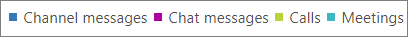

# Microsoft 365-rapporten in het beheercentrum - gebruikersactiviteit van Microsoft TeamsMicrosoft 365 Reports in the admin center - Microsoft Teams user activity

Het dashboard Microsoft 365 **Reports** toont u het activiteitenoverzicht voor de producten in uw organisatie.The Microsoft 365 **Reports** dashboard shows you the activity overview across the products in your organization. U kunt inzoomen op rapporten op het niveau van afzonderlijke producten om een gedetailleerder inzicht te krijgen in de activiteiten binnen elk product.It enables you to drill in to individual product level reports to give you more granular insight about the activities within each product. Bekijk [het overzichtsonderwerp over rapporten](activity-reports.md).Check out [the Reports overview topic](activity-reports.md). Met het rapport Gebruikersactiviteit in Microsoft Teams kunt u meer inzicht krijgen in de Microsoft Teams-activiteiten in uw organisatie.In the Microsoft Teams user activity report, you can gain insights into the Microsoft Teams activity in your organization.
  
> [!NOTE]
> U moet een globale beheerder, globale lezer of rapportenlezer in Microsoft 365 of een Exchange-, SharePoint- of Skype voor Bedrijven-beheerder zijn om rapporten te kunnen bekijken.You must be a global administrator, global reader or reports reader in Microsoft 365 or an Exchange, SharePoint, or Skype for Business administrator to see reports. 
 
## Zo gaat u naar het rapport Gebruikersactiviteit in Microsoft TeamsHow to get to the Microsoft Teams user activity report

1. Ga in het beheercentrum naar de pagina **Rapporten** \> <a href="https://go.microsoft.com/fwlink/p/?linkid=2074756" target="_blank">Gebruik</a>.In the admin center, go to the **Reports** \> <a href="https://go.microsoft.com/fwlink/p/?linkid=2074756" target="_blank">Usage</a> page.

    
2. Selecteer **de gebruikersactiviteit** **van Microsoft Teams** \> in de vervolgkeuzelijst **Een rapport selecteren.**From the **Select a report** drop-down, select **Microsoft Teams** \> **User activity**.
  
## Het rapport Gebruikersactiviteit in Microsoft Teams interpreterenInterpret the Microsoft Teams user activity report

U krijgt inzicht in de gebruikersactiviteit in Microsoft Teams door te kijken naar de grafieken **Activiteit** en **Gebruikers**.You can get a view into Microsoft Teams user activity by looking at the **Activity** and **Users** charts. 
  
|||
|:-----|:-----|
|1.1.    |In het rapport **Gebruikersactiviteit in Microsoft Teams** kunnen trends worden weergegeven voor de laatste 7, 30, 90 of 180 dagen.The **Microsoft Teams user activity** report can be viewed for trends over the last 7 days, 30 days, 90 days, or 180 days. Als u echter een bepaalde dag in het rapport selecteert, worden in de tabel (7) gegevens weergegeven gedurende maximaal 28 dagen na de huidige datum (niet de datum waarop het rapport is gegenereerd).However, if you select a particular day in the report, the table (7) will show data for up to 28 days from the current date (not the date the report was generated).    |
|2.2.    |De gegevens in elk rapport bestrijken meestal tot de laatste 24 tot 48 uur.The data in each report usually covers up to the last 24 to 48 hours.    |
|3.3.    |In de weergave **Activiteit** ziet u het aantal Microsoft Teams-activiteiten per activiteitstype. De activiteitstypen zijn het aantal teamchatberichten, privéchatberichten, gesprekken en vergaderingen.  The **Activity** view shows you the number of Microsoft Teams activities by activity type. The activity types are number of teams chat messages, private chat messages, calls, or meetings.    |
|4.4.    |In de weergave **Gebruikers** ziet u het aantal gebruikers per activiteitstype. De activiteitstypen zijn het aantal teamchatberichten, privéchatberichten, gesprekken en vergaderingen.  The **Users** view shows you the number of users by activity type. The activity types are number of teams chat messages, private chat messages, calls, or meetings.    |
|5.5.    | In de grafiek **Activiteit** is de Y-as het aantal opgegeven activiteiten.On the **Activity** chart, the Y axis is the count of specified activity.     In de grafiek **Bestanden** is de Y-as het aantal gebruikers dat heeft deelgenomen aan teamchats, privéchats, gesprekken, of vergaderingen.On the **Files** chart, the Y axis is the number of users participating in teams chats, private chats, calls, or meetings.     De X-as in de grafieken toont het geselecteerde datumbereik voor het specifieke rapport.The X axis on the charts is the selected date range for the specific report.    |
|6.6.    |U de reeksen die u in de grafiek ziet filteren door een item in de legenda te selecteren.You can filter the series you see on the chart by selecting an item in the legend. Selecteer bijvoorbeeld in het **activiteitsdiagram Kanaalberichten**, **Chatberichten**, **Oproepen**of **Vergaderingen** om alleen de informatie met betrekking tot elk programma te zien. **Activity**For example, on the **Activity** chart, select **Channel messages**, **Chat messages**, **Calls**, or **Meetings** to see only the info related to each one. Door deze selectie te wijzigen, verandert de informatie in de rastertabel niet.Changing this selection doesn't change the info in the grid table.    |
|7.7.    | Welke lijst met groepen wordt weergegeven, wordt bepaald door de groepen die bestaan (niet zijn verwijderd) in de ruimste rapportageperiode (180 dagen). Het aantal activiteiten is afhankelijk van de datumselectie.  The list of groups shown is determined by the set of all groups that existed (weren't deleted) across the widest (180-day) reporting time frame. The activity count will vary according to the date selection.    OPMERKING: Mogelijk zie je niet alle items in de onderstaande lijst in de kolommen totdat je ze toevoegt.NOTE: You might not see all the items in the list below in the columns until you add them. **Gebruikersnaam** is het e-mailadres van de gebruiker.**Username** is the email address of the user. U kunt het feitelijke e-mailadres weergeven of dit veld anoniem maken.You can display the actual email address or make this field anonymous.    **Datum van laatste activiteit (UTC)** verwijst naar de laatste datum waarop de gebruiker heeft deelgenomen aan een Microsoft Teams-activiteit.**Last Activity Date (UTC)** refers to the last date that the user participated in a Microsoft Teams activity.    **Kanaalberichten** is het aantal unieke berichten dat de gebruiker tijdens de opgegeven periode in een teamchat heeft geplaatst.**Channel messages** is the number of unique messages that the user posted in a team chat during the specified time period.    **Chatberichten** is het aantal unieke berichten dat de gebruiker tijdens de opgegeven periode in een privéchat heeft geplaatst.**Chat messages** is the number of unique messages that the user posted in a private chat during the specified time period.    **Gesprekken** is het aantal gesprekken waaraan de gebruiker tijdens de opgegeven periode heeft deelgenomen.**Calls** is the number of calls that the user participated in during the specified time period.    **Vergaderingen** is het aantal onlinevergaderingen waaraan de gebruiker tijdens de opgegeven periode heeft deelgenomen.**Meetings** is the number of online meetings that the user participated in during the specified time period.    **Andere activiteiten** is het aantal andere teamactiviteiten van de gebruiker.**Other activity** is the number of other team activities by the user.    **Verwijderd** geeft aan of het team is verwijderd. Als het team is verwijderd maar activiteiten had in de rapportageperiode, wordt het weergegeven in het raster met Verwijderd ingesteld op Waar.  **Deleted** indicates if the team is deleted. If the team is deleted, but had activity in the reporting period, it will show up in the grid with deleted set to true.    **Verwijderd op** is de datum waarop het team is verwijderd.**Deleted date** is the date that the team was deleted.    **Toegewezen producten** is de lijst met producten die zijn toegewezen aan de gebruiker.**Product assigned** is the list of products that are assigned to the user.     Als het beleid van uw organisatie verhindert dat u rapporten weergeeft waarin gebruikersgegevens kunnen worden geïdentificeerd, kunt u de privacy-instelling voor elk van deze rapporten wijzigen.If your organization's policies prevents you from viewing reports where user information is identifiable, you can change the privacy setting for all these reports. Bekijk de details van het **gebruikersniveau?** [Activity Reports in the Microsoft 365 admin center](activity-reports.md)Check out the **How do I hide user level details?** section in the [Activity Reports in the Microsoft 365 admin center](activity-reports.md).    |
|8.8.    |Selecteer **Kolommen** om kolommen uit het rapport toe te voegen of te verwijderen.Select **Columns** to add or remove columns from the report.    |
|9.9.    |U de rapportgegevens ook exporteren naar een Csv-bestand in Excel door de koppeling **Exporteren** te selecteren.You can also export the report data into an Excel .csv file by selecting the **Export** link. Hiermee exporteert u de gegevens van alle gebruikers en kunt u eenvoudige sortering en filtering toepassen voor verdere analyse.This exports data of all users and enables you to do simple sorting and filtering for further analysis. Als u minder dan 2000 gebruikers hebt, kunt u de tabel in het rapport zelf sorteren en filteren.If you have less than 2000 users, you can sort and filter within the table in the report itself. Als u meer dan 2000 gebruikers hebt, moet u de gegevens exporteren om te kunnen filteren en sorteren.If you have more than 2000 users, in order to filter and sort, you will need to export the data.    |
|||
   

