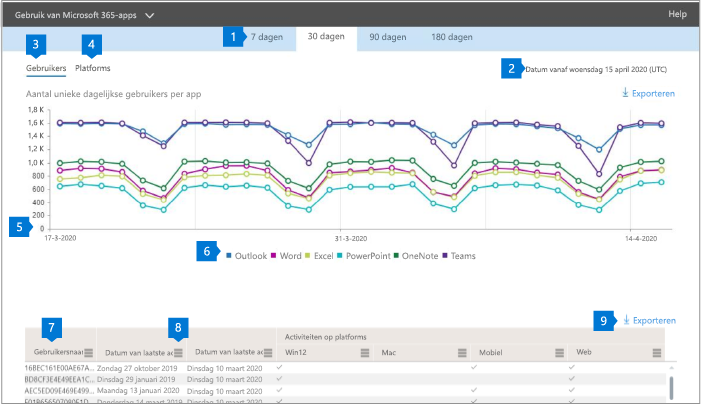

# Microsoft 365-rapporten in het Beheercentrum-gebruik van Microsoft 365 appsMicrosoft 365 Reports in the admin center - Microsoft 365 Apps usage

Het dashboard Microsoft 365 **rapporten** toont u het overzicht van de activiteiten in de producten van uw organisatie.The Microsoft 365 **Reports** dashboard shows you the activity overview across the products in your organization. U kunt inzoomen op rapporten op het niveau van afzonderlijke producten om een gedetailleerder inzicht te krijgen in de activiteiten binnen elk product.It enables you to drill in to individual product level reports to give you more granular insight about the activities within each product. Bekijk [het overzichtsonderwerp over rapporten](activity-reports.md).Check out [the Reports overview topic](activity-reports.md).

 U kunt bijvoorbeeld inzicht krijgen in de activiteiten van elke gebruiker in licentie voor het gebruik van apps van Microsoft 365 apps door hun activiteiten via de apps te bekijken en de manier waarop ze worden gebruikt op meerdere platforms.For example, you can understand the activity of each user licensed to use Microsoft 365 Apps apps by looking at their activity across the apps and how they are utilized across platforms.

 > [!NOTE]
 > U moet een globale beheerder, algemene lezer of rapporten lezer in Microsoft 365 of een beheerder van Exchange, SharePoint of Skype voor bedrijven zijn om rapporten te kunnen zien.You must be a global administrator, global reader or reports reader in Microsoft 365 or an Exchange, SharePoint, or Skype for Business administrator to see reports.

## Naar het rapport gebruik van Microsoft 365-apps gaanHow to get to the Microsoft 365 Apps usage report

1. Ga in het beheercentrum naar de pagina **Rapporten** \> <a href="https://go.microsoft.com/fwlink/p/?linkid=2074756" target="_blank">Gebruik</a>.In the admin center, go to the **Reports** \> <a href="https://go.microsoft.com/fwlink/p/?linkid=2074756" target="_blank">Usage</a> page.

 2. Selecteer in de vervolgkeuzelijst **een rapport selecteren** de optie **Office 365**   \>  **Microsoft 365 apps Usage** .From the **Select a report** drop-down, select **Office 365** \> **Microsoft 365 Apps usage** .

## Het gebruiksrapport voor Microsoft 365-apps interpreterenInterpret the Microsoft 365 Apps usage report

U kunt inzicht krijgen in de activiteiten van de Microsoft 365-app van uw gebruikers door te kijken naar de grafieken **gebruikers** en **platform** .You can get a view into your user's Microsoft 365 Apps activity by looking at the **Users** and **Platform** charts.

|ItemItem|BeschrijvingDescription|
 |:-----|:-----|
 |1.1.   |In het rapport **gebruik van Microsoft 365-apps** kunnen trends worden weergegeven voor de laatste 7, 30, 90 of 180 dagen.The **Microsoft 365 Apps usage** report can be viewed for trends over the last 7 days, 30 days, 90 days, or 180 days. Als u echter een bepaalde dag selecteert in het rapport, worden in de tabel (7) gegevens weergegeven voor tot 28 dagen vanaf de huidige datum (niet de datum waarop het rapport is gegenereerd).However, if you select a particular day in the report, the table (7) will show data for up to 28 days from the current date (not the date the report was generated).   |
 |2.2.   |De gegevens in elk rapport zijn vaak van de laatste zeven dagen.The data in each report usually covers up to the last seven days.   |
 |3.3.   |In de weergave **gebruikers** ziet u de trend van het aantal actieve gebruikers voor elke app – Outlook, Word, Excel, PowerPoint, OneNote en teams.The **Users** view shows the trend in the number of active users for each app – Outlook, Word, Excel, PowerPoint, OneNote, and Teams. ' Actieve gebruikers ' is een van de personen die een onopzettelijke actie uitvoeren binnen deze apps."Active users" are any who perform any intentional actions within these apps.   |
 |4.4.   |In de weergave **platformen** ziet u de trend van actieve gebruikers in alle apps voor elk platform – Windows, Mac, Web en Mobile.The **Platforms** view shows the trend of active users across all apps for each platform – Windows, Mac, Web, and Mobile.   |
 |5.5. |In de grafiek **gebruikers** is de Y-as het aantal unieke actieve gebruikers voor de desbetreffende app.On the **Users** chart, the Y-axis is the number of unique active users for the respective app. In de grafiek **platforms**   is de Y-as het aantal unieke gebruikers voor het desbetreffende platform.On the **Platforms** chart, the Y-axis is the number of unique users for the respective platform. De X-as van beide grafieken is de datum waarop een app op een bepaald platform werd gebruikt.The X-axis on both charts is the date on which an app was used on a given platform. |
 zes.6. |U kunt de reeks die u in de grafiek ziet, filteren door een item te selecteren in de legenda.You can filter the series you see on the chart by selecting an item in the legend. Selecteer in de grafiek **gebruikers** bijvoorbeeld Outlook, Word, Excel, PowerPoint, OneDrive of teams om alleen de informatie weer te geven die betrekking heeft op elk item.For example, on the **Users** chart, select Outlook, Word, Excel, PowerPoint, OneDrive, or Teams to see only the info related to each one. Door deze selectie te wijzigen, verandert de informatie in de rastertabel eronder niet.Changing this selection doesn't change the info in the grid table below it.|
 |7,5.7. |De tabel toont een uitsplitsing van de gegevens per gebruiker.The table shows you a breakdown of data at the per-user level. U kunt kolommen toevoegen aan of verwijderen uit de tabel.You can add or remove columns from the table.   **Gebruikersnaam** is het e-mailadres van de gebruiker die de activiteit heeft uitgevoerd op Microsoft-apps.**Username** is the email address of the user who performed the activity on Microsoft Apps.  **Datum van laatste activering** is de datum waarop de gebruiker zijn of haar abonnement voor microsoft 365-apps heeft geactiveerd.**Last activation date (UTC)** is the latest date on which the user activated their Microsoft 365 Apps subscription.  **Datum van laatste activiteit (UTC)** is de datum waarop de gebruiker de laatste activiteit heeft uitgevoerd.**Last activity date (UTC)** is the latest date an intentional activity was performed by the user. Als u de activiteit van een bepaalde datum wilt zien, selecteert u de datum rechtstreeks in de grafiek.To see activity that occurred on a specific date, select the date directly in the chart.  De volgende kolommen komen overeen met elke app die aangeeft of de gebruiker in de geselecteerde periode actief is geweest op die app.The following columns correspond to each app that identifies if the user was active on that app in the period selected:   **Outlook****Outlook**  **Word****Word**  **Excel****Excel** **PowerPoint****PowerPoint**  **OneNote****OneNote**   De volgende kolommen komen overeen met elk platform waarmee wordt aangegeven of de gebruiker op dat platform voor apps (binnen Microsoft 365-apps) in de periode is geselecteerd.The following columns correspond to each platform that identifies if the user was active on that platform for any app (within Microsoft 365 Apps) in the period selected:  **Outlook (Windows)****Outlook (Windows)** **Outlook (Mac)****Outlook (Mac)** **De webversie van Outlook****Outlook (Web)**  **Outlook (mobiel)****Outlook (Mobile)**  **Word (Windows)****Word (Windows)**  **Word (Mac)****Word (Mac)**  **Word (web)****Word (Web)**  **Word (mobiel)****Word (Mobile)**  **Excel (Windows)****Excel (Windows)**  **Excel (Mac)****Excel (Mac)**  **Excel (web)****Excel (Web)**  **Excel (mobiel)****Excel (Mobile)**  **PowerPoint (Windows)****PowerPoint (Windows)**  **PowerPoint (Mac)****PowerPoint (Mac)** **PowerPoint (web)****PowerPoint (Web)**  **PowerPoint (mobiel)****PowerPoint (Mobile)**  **OneNote (Windows)****OneNote (Windows)**  **OneNote (Mac)****OneNote (Mac)**  **OneNote (web)****OneNote (Web)** **OneNote (mobiel)****OneNote (Mobile)**  **Teams (Windows)****Teams (Windows)**  **Teams (Mac)****Teams (Mac)**  **Teams (web)****Teams (Web)** **Teams (mobiel)****Teams (Mobile)** |
 |8:00.8. |Selecteer het pictogram **kolommen beheren** als u kolommen wilt toevoegen aan of verwijderen uit het rapport.Select the **Manage columns** icon to add or remove columns from the report.|
 |aanhaling.9. |U kunt de rapportgegevens ook exporteren naar een CSV-bestand van Excel door de koppeling **exporteren** te selecteren.You can also export the report data into an Excel .csv file by selecting the **Export** link. Hiermee exporteert u gegevens voor alle gebruikers en kunt u eenvoudige aggregatie, sorteren en filteren voor verdere analyse.This exports data for all users and enables you to do simple aggregation, sorting, and filtering for further analysis. Als u minder dan 100 gebruikers hebt, kunt u in de tabel in het rapport zelf sorteren en filteren.If you have less than 100 users, you can sort and filter within the table in the report itself. Als u meer dan 100 gebruikers hebt, moet u de gegevens exporteren om te filteren en sorteren.If you have more than 100 users, in order to filter and sort, you will need to export the data.|
