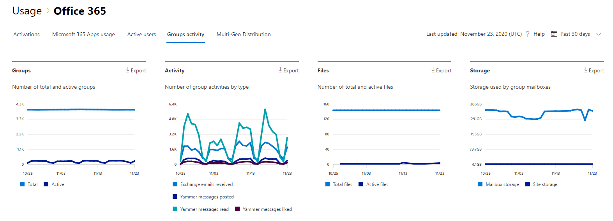

# Microsoft 365-rapporten in het Beheercentrum-Microsoft 365-groepenMicrosoft 365 Reports in the admin center - Microsoft 365 groups

Het dashboard Microsoft 365 **rapporten** toont u het overzicht van de activiteiten in de producten van uw organisatie.The Microsoft 365 **Reports** dashboard shows you the activity overview across the products in your organization. U kunt inzoomen op rapporten op het niveau van afzonderlijke producten om een gedetailleerder inzicht te krijgen in de activiteiten binnen elk product.It enables you to drill in to individual product level reports to give you more granular insight about the activities within each product. Bekijk [het overzichtsonderwerp over rapporten](activity-reports.md).Check out [the Reports overview topic](activity-reports.md). In het rapport Microsoft 365-groepen kunt u inzicht krijgen in de activiteiten van de groepen in uw organisatie en zien hoeveel groepen er worden gemaakt en gebruikt.In the Microsoft 365 groups report, you can gain insights into the activity of groups in your organization and see how many groups are being created and used.
  
> [!NOTE]
> U moet een globale beheerder, algemene lezer of rapporten lezer zijn in Microsoft 365 of een Exchange-, SharePoint-, teams-service, teams-communicatie of Skype voor bedrijven-beheerder om rapporten te zien.You must be a global administrator, global reader or reports reader in Microsoft 365 or an Exchange, SharePoint, Teams Service, Teams Communications, or Skype for Business administrator to see reports.  
  
## Naar het rapportgroepen gaanHow to get to the groups report

1. Ga in het beheercentrum naar de pagina **Rapporten** \> <a href="https://go.microsoft.com/fwlink/p/?linkid=2074756" target="_blank">Gebruik</a>.In the admin center, go to the **Reports** \> <a href="https://go.microsoft.com/fwlink/p/?linkid=2074756" target="_blank">Usage</a> page. 
2. Klik vanaf de startpagina van het dashboard op de knop **meer weergeven** in de microsoft 365-apps of de actieve gebruikers: microsoft 365 Services Card om naar de pagina Office 365-rapporten te gaan.From the dashboard homepage, click on the **View more** button on the Active users - Microsoft 365 Apps or the Active users - Microsoft 365 Services card to get to the Office 365 report page.
  
## Het groepsrapport interpreterenInterpret the groups report

U kunt de activeringen weergeven in het Office 365-rapport door het tabblad **groepen activiteiten** te kiezen.You can view the activations in the Office 365 report by choosing the **Groups activity** tab. 

Selecteer **kolommen kiezen** als u kolommen wilt toevoegen aan of verwijderen uit het rapport.Select **Choose columns** to add or remove columns from the report.    

U kunt de rapportgegevens ook exporteren naar een CSV-bestand van Excel door de koppeling **exporteren** te selecteren.You can also export the report data into an Excel .csv file by selecting the **Export** link. Hiermee exporteert u de gegevens van alle gebruikers en kunt u eenvoudige sortering en filtering toepassen voor verdere analyse.This exports data of all users and enables you to do simple sorting and filtering for further analysis. Als u minder dan 2000 gebruikers hebt, kunt u de tabel in het rapport zelf sorteren en filteren.If you have less than 2000 users, you can sort and filter within the table in the report itself. Als u meer dan 2000 gebruikers hebt, moet u de gegevens exporteren om te kunnen filteren en sorteren.If you have more than 2000 users, in order to filter and sort, you will need to export the data. 

|ItemItem|BeschrijvingDescription|
|:-----|:-----|
|**Gegevens****Metric**|**Definitie****Definition**|
|GroepsnaamGroup name    |De naam van de groep.The name of the group.    |
|DeletedDeleted    |Het aantal verwijderde groepen.The number of deleted groups. Als de groep wordt verwijderd maar voor de groep activiteiten zijn uitgevoerd in de rapportageperiode, wordt de groep weergegeven in het raster, waarbij deze vlag wordt ingesteld op 'waar'.If the group is deleted, but had activity in the reporting period it will show up in the grid with this flag set to true.    |
|GroepseigenaarGroup owner    |De naam van de eigenaar van de groep.The name of the group owner.    |
|Datum van laatste activiteit (UTC)Last activity date (UTC)    |De meest recente datum waarop een bericht is ontvangen door de groep.The latest date a message was received by the group. Dit is de meest recente datum waarop een activiteit heeft plaatsgevonden in een e-mailgesprek, Yammer of de Site.- This is the latest date an activity happened in an email conversation, Yammer, or the Site.    |
|TypeType    |Het type groep.The type of group. Dit kan een persoonlijke of openbare groep zijn.This can be private or public group.    |
|E-mails ontvangen in ExchangeEmails received in Exchange    |Het aantal berichten dat door de groep is ontvangen.The number of messages received by the group.|
|E-mails in Exchange (totaal)Emails in Exchange (total)    |Het totale aantal items in het postvak van de groep.The total number of items in the group's mailbox.    |
|Gebruikte Postvak opslag voor Exchange (MB)Mailbox storage used for Exchange (MB)    |De opslagruimte die wordt gebruikt door het postvak van de groep.The storage used by the group's mailbox.  |
|SharePoint-bestanden (totaal)SharePoint files (total)    |Het aantal bestanden dat is opgeslagen op sites van SharePoint-groepen.The number of files stored in SharePoint group sites.    |
|SharePoint-bestanden (actief)SharePoint files (active)    |Het aantal bestanden in de SharePoint-groepssite waarvoor acties hebben plaatsgevonden (zijn bekeken of gewijzigd, gesynchroniseerd, intern of extern gedeeld) tijdens de rapportageperiode.The number of files in the SharePoint group site that were acted on (viewed or modified, synched , shared internally or externally) during the reporting period.    |
|Totale gebruikte site-opslag voor SharePoint (MB)Total site storage used for SharePoint (MB)    |De hoeveelheid opslagruimte in MB die tijdens de rapportageperiode is gebruikt.The amount of storage in MB used during the reporting period.    |
|Berichten in Yammer (gepubliceerd)Messages in Yammer (posted)    |Het aantal berichten dat gedurende de rapportageperiode is Gepost in de Yammer-groep.The number of messages posted in the Yammer group over the reporting period.    |
|Berichten in Yammer (gelezen)Messages in Yammer (read)    |Het aantal gesprekken dat gedurende de rapportageperiode is gelezen in de Yammer-groep.The number of conversations read in the Yammer group over the reporting period.    |
|Berichten in Yammer (leuk gevonden)Messages in Yammer (liked)    |Het aantal berichten dat gedurende de rapportageperiode is leuk gevonden in de Yammer-groep.The number of messages liked in the Yammer group over the reporting period.    |
|LedenMembers    |Het aantal leden in de groep.The number of members in the group.    |
|Externe ledenExternal members |Het aantal externe gebruikers in de groep.The number of external users in the group.|
|||