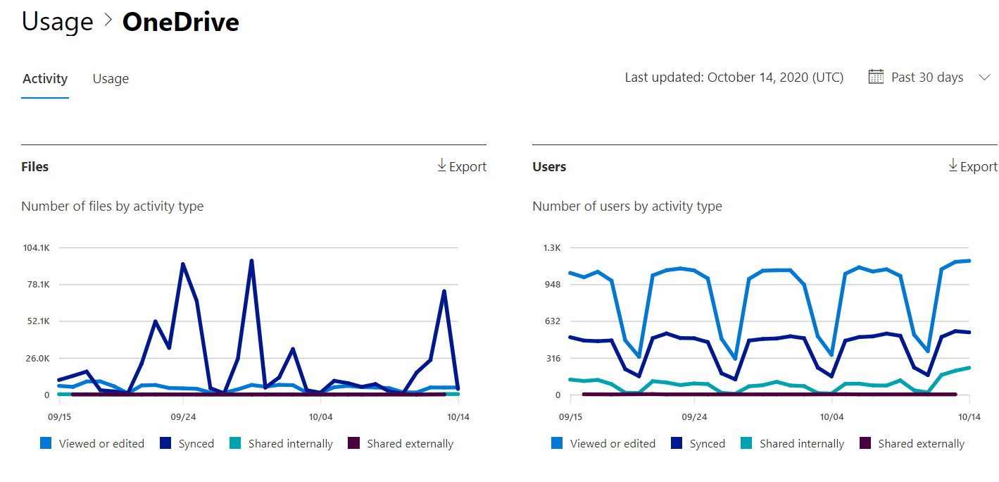

# Microsoft 365-rapporten in het Beheercentrum-activiteit van OneDrive voor bedrijvenMicrosoft 365 Reports in the admin center - OneDrive for Business activity

Het dashboard Microsoft 365 **rapporten** toont u het overzicht van de activiteiten in de producten van uw organisatie.The Microsoft 365 **Reports** dashboard shows you the activity overview across the products in your organization. U kunt inzoomen op rapporten op het niveau van afzonderlijke producten om een gedetailleerder inzicht te krijgen in de activiteiten binnen elk product.It lets you drill in to individual product level reports to give you more granular insight about the activities within each product. Bekijk [het overzichtsonderwerp over rapporten](activity-reports.md).Check out [the Reports overview topic](activity-reports.md).
  
U kunt bijvoorbeeld inzicht krijgen in de activiteiten van elke gebruiker die een licentie voor het gebruik van OneDrive heeft door zijn of haar interactie met bestanden op OneDrive te bekijken. U kunt ook beter begrijpen in hoeverre gebruikers samenwerken door het aantal gedeelde bestanden te bekijken.For example, you can understand the activity of every user licensed to use OneDrive by looking at their interaction with files on OneDrive. It also helps you to understand the level of collaboration going on by looking at the number of files shared.
  
> [!NOTE]
> U moet een globale beheerder, algemene lezer of rapporten lezer zijn in Microsoft 365 of een Exchange-, SharePoint-, teams-service, teams-communicatie of Skype voor bedrijven-beheerder om rapporten te zien.You must be a global administrator, global reader or reports reader in Microsoft 365 or an Exchange, SharePoint, Teams Service, Teams Communications, or Skype for Business administrator to see reports.  
 
## Hoe ga ik naar het OneDrive-activiteitenrapport?How do I get to the OneDrive Activity report?

1. Ga in het beheercentrum naar de pagina **Rapporten** \> <a href="https://go.microsoft.com/fwlink/p/?linkid=2074756" target="_blank">Gebruik</a>.In the admin center, go to the **Reports** \> <a href="https://go.microsoft.com/fwlink/p/?linkid=2074756" target="_blank">Usage</a> page. 
2. Klik op de startpagina van het dashboard op de knop **meer weergeven** op de OneDrive-kaart.From the dashboard homepage, click on the **View more** button on the OneDrive card.
  
## Het OneDrive voor Bedrijven-activiteitenrapport interpreterenInterpret the OneDrive for Business activity report

U kunt de activiteiten in het OneDrive-rapport weergeven door het tabblad **activiteit** te kiezen.You can view the activities in the OneDrive report by choosing the **Activity** tab. 

Selecteer **kolommen kiezen** als u kolommen wilt toevoegen aan of verwijderen uit het rapport.Select **Choose columns** to add or remove columns from the report.    

U kunt de rapportgegevens ook exporteren naar een CSV-bestand van Excel door de koppeling **exporteren** te selecteren.You can also export the report data into an Excel .csv file by selecting the **Export** link. Hiermee exporteert u de gegevens van alle gebruikers en kunt u eenvoudige sortering en filtering toepassen voor verdere analyse.This exports data of all users and enables you to do simple sorting and filtering for further analysis. Als u minder dan 2000 gebruikers hebt, kunt u de tabel in het rapport zelf sorteren en filteren.If you have less than 2000 users, you can sort and filter within the table in the report itself. Als u meer dan 2000 gebruikers hebt, moet u de gegevens exporteren om te kunnen filteren en sorteren.If you have more than 2000 users, in order to filter and sort, you will need to export the data. 
  
|ItemItem|BeschrijvingDescription|
|:-----|:-----|
|**Gegevens****Metric**|**Definitie****Definition**|
|GebruikersnaamUsername    |De gebruikersnaam van de eigenaar van het OneDrive-account.The user name of the owner of the OneDrive account.    |
|Datum van laatste activiteit (UTC)Last activity date (UTC)    |De datum waarop de laatste Bestandsactiviteit op de OneDrive-account voor het geselecteerde datumbereik is uitgevoerd.The latest date a file activity was performed on the OneDrive account for the selected date range. .. Als u de activiteit van een bepaalde datum wilt zien, selecteert u de datum rechtstreeks in de grafiek.To see activity that occurred on a specific date, select the date directly in the chart.    |
|Weergegeven of bewerkte bestandenFiles viewed or edited    |Het aantal bestanden dat door de gebruiker is geüpload, gedownload, gewijzigd of bekeken.The number of files that the user uploaded, downloaded, modified, or viewed.     |
|Gesynchroniseerde bestandenFiles synced    |Het aantal bestanden dat is gesynchroniseerd vanaf het lokale apparaat van een gebruiker naar het OneDrive-account.The number of files that have been synced from a user's local device to the OneDrive account.   |
|Intern gedeelde bestandenFiles shared internally    | Het aantal bestanden dat is gedeeld met gebruikers binnen de organisatie, of met gebruikers in groepen (die mogelijk externe gebruikers zijn).The number of files that have been shared with users within the organization, or with users within groups (that might include external users).    |
|Extern gedeelde bestandenFiles shared externally    |Het aantal bestanden dat is gedeeld met gebruikers buiten de organisatie.The number of files that have been shared with users outside of the organization.  |
|DeletedDeleted    | Hiermee wordt aangegeven dat de licentie van de gebruiker is verwijderd.This indicates that the user's license was removed.    Opmerking: activiteiten voor een verwijderde gebruiker worden nog steeds weergegeven in een rapport, zolang deze op een bepaald moment in de geselecteerde tijdsperiode is toegestaan.NOTE: Activity for a deleted user will still display in a report as long as he or she was licensed at some time during the selected time period. In de kolom **Verwijderd** kunt u zien dat de gebruiker niet meer actief is, maar wel heeft bijgedragen aan de gegevens in het rapport.The **Deleted** column helps you to note that the user may no longer be active, but contributed to the data in the report.    |
|Datum verwijderdDeleted date    |De datum waarop de licentie van de gebruiker is verwijderd.The date on which the user's license was removed.  |
|Product toegewezenProduct assigned    |De Microsoft 365-producten waarvoor de gebruiker een licentie heeft.The Microsoft 365 products that are licensed to the user.|
|||