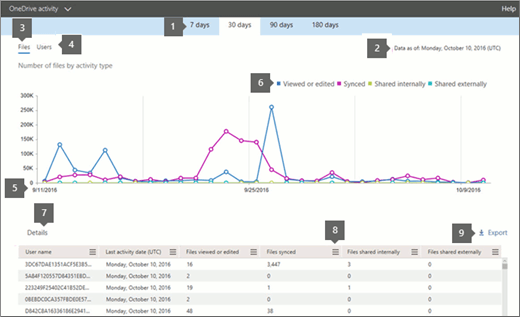

# Microsoft 365-rapporten in het beheercentrum - Activiteit van OneDrive voor BedrijvenMicrosoft 365 Reports in the admin center - OneDrive for Business activity

Het dashboard Microsoft 365 **Rapporten** toont u het activiteitenoverzicht voor de producten in uw organisatie.The Microsoft 365 **Reports** dashboard shows you the activity overview across the products in your organization. U kunt inzoomen op rapporten op het niveau van afzonderlijke producten om een gedetailleerder inzicht te krijgen in de activiteiten binnen elk product.It lets you drill in to individual product level reports to give you more granular insight about the activities within each product. Bekijk [het overzichtsonderwerp over rapporten](activity-reports.md).Check out [the Reports overview topic](activity-reports.md).
  
U kunt bijvoorbeeld inzicht krijgen in de activiteiten van elke gebruiker die een licentie voor het gebruik van OneDrive heeft door zijn of haar interactie met bestanden op OneDrive te bekijken. U kunt ook beter begrijpen in hoeverre gebruikers samenwerken door het aantal gedeelde bestanden te bekijken.For example, you can understand the activity of every user licensed to use OneDrive by looking at their interaction with files on OneDrive. It also helps you to understand the level of collaboration going on by looking at the number of files shared.
  
> [!NOTE]
> Sommige functionaliteiten worden geleidelijk geïntroduceerd. Dit betekent dat u bepaalde functies nog niet kunt zien of dat de functies er anders uit kunnen zien dan beschreven in de Help-artikelen. Maar maak u geen zorgen, ze komen er binnenkort aan!Some functionality is introduced gradually. This means that you may not yet see this feature or it may look different than what is described in the help articles. But don't worry - it's coming soon! 
  
Raadpleeg het [rapport Gebruik van OneDrive](onedrive-for-business-usage.md) om te begrijpen hoeveel activiteit plaatsvindt op elk OneDrive-account en hoe de opslagruimte wordt gebruikt.If you want to understand the amount of activity happening against each OneDrive account and the storage utilization, you can view the [OneDrive usage report](onedrive-for-business-usage.md).
  
> [!NOTE]
> U moet een globale beheerder, wereldwijde lezer of rapportenlezer zijn in Microsoft 365 of een Exchange-, SharePoint- of Skype voor Bedrijven-beheerder om rapporten te bekijken.You must be a global administrator, global reader or reports reader in Microsoft 365 or an Exchange, SharePoint, or Skype for Business administrator to see reports. 
 
## Hoe ga ik naar het OneDrive-activiteitenrapport?How do I get to the OneDrive Activity report?

1. Ga in het beheercentrum naar de pagina **Rapporten** \> <a href="https://go.microsoft.com/fwlink/p/?linkid=2074756" target="_blank">Gebruik</a>.In the admin center, go to the **Reports** \> <a href="https://go.microsoft.com/fwlink/p/?linkid=2074756" target="_blank">Usage</a> page.

    
2. Selecteer **OneDrive-activiteit** \> in de vervolgkeuzelijst **Een rapport** **selecteren**.From the **Select a report** drop-down, select **OneDrive** \> **Activity**.
  
## Het OneDrive voor Bedrijven-activiteitenrapport interpreterenInterpret the OneDrive for Business activity report

U krijgt inzicht in de OneDrive voor Bedrijven-activiteit door de weergaven **Bestanden** en **Gebruikers** te bekijken.You can get a view into OneDrive for Business activity by looking at the **Files** and **Users** views. 
  

  
|||
|:-----|:-----|
|1.1.    |In het **OneDrive voor Bedrijven-activiteitenrapport** kunnen trends worden weergegeven voor de laatste 7, 30, 90 of 180 dagen.The **OneDrive for Business activity** report can be viewed for trends over the last 7 days, 30 days, 90 days, or 180 days. Als u echter een bepaalde dag in het rapport selecteert, worden in de tabel (7) gegevens weergegeven voor maximaal 28 dagen vanaf de huidige datum (niet de datum waarop het rapport is gegenereerd).However, if you select a particular day in the report, the table (7) will show data for up to 28 days from the current date (not the date the report was generated).    |
|2.2.    |De gegevens in elk rapport bestrijken meestal tot de laatste 24 tot 48 uur.The data in each report usually covers up to the last 24 to 48 hours.  |
|3.3.    |De weergave **Bestanden** helpt u inzicht te krijgen in het unieke aantal gebruikers met een licentie dat met bestanden werkt binnen een OneDrive-account.The **Files** view helps you to understand the unique number of licensed users that performed file interactions against any OneDrive account.    |
|4.4.    |De weergave **Gebruikers** geeft inzicht in aantallen actieve OneDrive-gebruikers. Een gebruiker wordt als actief beschouwd wanneer hij of zij een bestandsactiviteit (opslaan, synchroniseren, wijzigen of delen) uitvoert in de opgegeven periode.  The **Users** view helps you to understand the trend in the number of active OneDrive users. A user is considered active if he or she has executed a file activity (save, sync, modify, or share) within the specified time period.    OPMERKING: Een bestandsactiviteit kan meerdere keren plaatsvinden voor één bestand, maar telt slechts als één actief bestand.NOTE: A file activity can occur multiple times for a single file, but will only count as one active file. Zo kunt u bijvoorbeeld hetzelfde bestand meerdere malen opslaan en synchroniseren in een bepaalde periode, maar dit wordt als één actief bestand en één gesynchroniseerd bestand meegeteld in de gegevens.For example, you can save and sync the same file multiple times over a specified time period, but it will only count as one single active file and one single synced file in the data.           |
|5.5.    | In de grafiek **Bestanden** geeft de Y-as het aantal unieke bestanden aan dat een gebruiker heeft opgeslagen, gesynchroniseerd, gewijzigd of gedeeld.On the **Files** chart, the Y axis is the number of unique files that any user either saved, synced, modified, or shared.     In de grafiek **Gebruikers** geeft de Y-as het aantal unieke gebruikers aan dat een bestandsactiviteit heeft uitgevoerd (opslaan, synchroniseren, wijzigen of delen) binnen een OneDrive-account.On the **Users** chart, the Y axis is the number of unique users that performed file interactions (save, sync, modify, or share) on any OneDrive account.     De X-as in alle grafieken is het geselecteerde datumbereik voor dit specifieke rapport.The X axis on all charts is the selected date range for this specific report.    |
|6.6.    |U de reeks die u in de grafiek ziet filteren door een item in de legenda te selecteren.You can filter the series you see on the chart by selecting an item in the legend. Selecteer bijvoorbeeld in de grafiek **Bestanden** **Bekeken of bewerkt** of **Gesynchroniseerd** om alleen de informatie te zien die betrekking heeft op elke grafiek.For example, on the **Files** chart, select **Viewed or edited** or **Synced** to see only the information related to each one. Door deze selectie te wijzigen, verandert de informatie in de rastertabel niet.Changing this selection doesn't change the information in the grid table.    |
|7.7.    | De tabel toont een uitsplitsing van de gegevens per gebruiker.The table shows you a breakdown of data at the per-user level. U kunt kolommen toevoegen aan of verwijderen uit de tabel.You can add or remove columns from the table.      **Gebruikersnaam** is de gebruikersnaam van de eigenaar van het OneDrive-account.**Username** is the user name of the owner of the OneDrive account.    **Datum van laatste activiteit (UTC)** verwijst naar de datum binnen het geselecteerde datumbereik waarop de laatste bestandsactiviteit op de OneDrive-account is waargenomen. Als u activiteit voor een bepaalde datum wilt zien, selecteert u de datum rechtstreeks in de grafiek.  **Last activity date (UTC)** is the latest date a file activity was performed on the OneDrive account for the selected date range. To see activity that occurred on a specific date, select the date directly in the chart.         Hiermee filtert u de tabel om bestandsactiviteitsgegevens alleen weer te geven voor gebruikers die de activiteit op die specifieke dag hebben uitgevoerd.This will filter the table to display file activity data only for users who performed the activity on that specific day.    **Weergegeven of bewerkte bestanden** is het aantal bestanden dat door de gebruiker is geüpload, gedownload, gewijzigd of bekeken.**Files viewed or edited** is the number of files that the user uploaded, downloaded, modified, or viewed.    **Gesynchroniseerde bestanden** is het aantal bestanden dat is gesynchroniseerd vanaf het lokale apparaat van een gebruiker naar het OneDrive-account.**Files synced** is the number of files that have been synced from a user's local device to the OneDrive account.    **Bestanden die intern worden gedeeld,** is het aantal bestanden dat is gedeeld met gebruikers binnen de organisatie of met gebruikers binnen groepen (waaronder mogelijk externe gebruikers).**Files shared internally** is the number of files that have been shared with users within the organization, or with users within groups (that might include external users).    **Extern gedeelde bestanden** is het aantal bestanden dat is gedeeld met gebruikers buiten de organisatie.**Files shared externally** is the number of files that have been shared with users outside of the organization.    **Verwijderd** geeft aan dat de licentie van de gebruiker werd verwijderd.**Deleted** indicates that the user's license was removed.    OPMERKING: Activiteit voor een verwijderde gebruiker wordt nog steeds weergegeven in een rapport zolang hij of zij op een bepaald moment tijdens de geselecteerde periode een licentie heeft.NOTE: Activity for a deleted user will still display in a report as long as he or she was licensed at some time during the selected time period. In de kolom **Verwijderd** kunt u zien dat de gebruiker niet meer actief is, maar wel heeft bijgedragen aan de gegevens in het rapport.The **Deleted** column helps you to note that the user may no longer be active, but contributed to the data in the report. **Datum verwijderd** is de datum waarop de licentie van de gebruiker werd verwijderd.**Deleted date** is the date on which the user's license was removed.    **Toegewezen product** zijn de Microsoft 365-producten waarvoor een licentie is verleend aan de gebruiker.**Product assigned** are the Microsoft 365 products that are licensed to the user.     Als het beleid van uw organisatie voorkomt dat u rapporten bekijkt waarin gebruikersgegevens identificeerbaar zijn, u de privacyinstelling voor al deze rapporten wijzigen.If your organization's policies prevent you from viewing reports where user information is identifiable, you can change the privacy setting for all these reports. Bekijk de **sectie Hoe verberg ik de gegevens op gebruikersniveau?** [Activity Reports in the Microsoft 365 admin center](activity-reports.md)Check out the **How do I hide user level details?** section in the [Activity Reports in the Microsoft 365 admin center](activity-reports.md).    |
|8.8.    |Selecteer **Manage columns** het pictogram  beheren Kolommen beheren om kolommen toe te voegen of te verwijderen uit het rapport.Select the **Manage columns** icon  to add or remove columns from the report.    |
|9.9.    |U de rapportgegevens ook exporteren naar een CSV-bestand in Excel door de koppeling **Exporteren te** selecteren.You can also export the report data into an Excel .csv file, by selecting the **Export** link. Hiermee exporteert u de gegevens van alle gebruikers en kunt u eenvoudige sortering en filtering toepassen voor verdere analyse.This exports data of all users and enables you to do simple sorting and filtering for further analysis. Als u minder dan 2000 gebruikers hebt, kunt u de tabel in het rapport zelf sorteren en filteren.If you have less than 2000 users, you can sort and filter within the table in the report itself. Als u meer dan 2000 gebruikers hebt, moet u de gegevens exporteren om te kunnen filteren en sorteren.If you have more than 2000 users, in order to filter and sort, you will need to export the data.    |
|||
   

