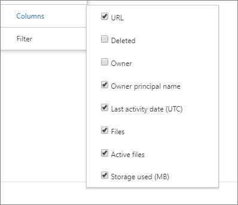

# Microsoft 365-rapporten in het beheercentrum - Gebruik van OneDrive voor BedrijvenMicrosoft 365 Reports in the admin center - OneDrive for Business usage

Het dashboard Microsoft **365-rapporten** toont u het activiteitenoverzicht voor de producten in uw organisatie.The Microsoft 365 **Reports** dashboard shows you the activity overview across the products in your organization. U kunt inzoomen op rapporten op het niveau van afzonderlijke producten om een gedetailleerder inzicht te krijgen in de activiteiten binnen elk product.It enables you to drill in to individual product level reports to give you more granular insight about the activities within each product. Bekijk [het overzichtsonderwerp over rapporten](activity-reports.md).Check out [the Reports overview topic](activity-reports.md).
  
De OneDrive-kaart op het dashboard geeft u bijvoorbeeld een overzicht op hoog niveau van de toegevoegde waarde van OneDrive voor Bedrijven voor wat betreft het totale aantal bestanden en de totale hoeveelheid opslag die in uw organisatie wordt gebruikt. U kunt vervolgens inzoomen om meer informatie te krijgen over de trends in de actieve OneDrive-accounts, te zien hoeveel bestanden worden gebruikt en hoeveel opslag wordt gebruikt. U vindt hier ook details voor de OneDrive van elke gebruiker.For example, the OneDrive card on the dashboard gives you a high-level view of the value you are getting from OneDrive for Business in terms of the total number of files and storage used across your organization. You can then drill into it to understand the trends of active OneDrive accounts, how many files are users interacting with as well as the storage used. It also gives you details for each user's OneDrive.
  
> [!NOTE]
> U moet een globale beheerder, globale lezer of rapportlezer zijn in Microsoft 365 of een Exchange, SharePoint, Teams Service, Teams Communications of Skype voor Bedrijven-beheerder om rapporten te kunnen bekijken.You must be a global administrator, global reader or reports reader in Microsoft 365 or an Exchange, SharePoint, Teams Service, Teams Communications, or Skype for Business administrator to see reports.  
 
## Hoe ga ik naar het OneDrive-gebruiksrapport?How do I get to the OneDrive Usage Report?

1. Ga in het beheercentrum naar **Reports** \> <a href="https://go.microsoft.com/fwlink/p/?linkid=2074756" target="_blank">Rapportgebruik</a>.In the admin center, go to **Reports** \> <a href="https://go.microsoft.com/fwlink/p/?linkid=2074756" target="_blank">Usage</a>.

    
2. Selecteer **OneDrive-gebruik** in de vervolgkeuzelijst **Een rapport** selecteren \> **Usage**.From the **Select a report** drop-down, select **OneDrive** \> **Usage**. 
  
## Het rapport Gebruik van OneDrive interpreterenInterpret the OneDrive usage report

U krijgt inzicht in het gebruik van OneDrive voor Bedrijven door de weergaven **Accounts**, **Bestanden** en **Opslag** te bekijken.You can get a view into OneDrive for Business usage by looking at the **Accounts**, **Files**, and **Storage** views. 
  

  
|||
|:-----|:-----|
|1.1.    |In het rapport **Gebruik van OneDrive** worden trends weergegeven voor de laatste 7, 30, 90 of 180 dagen.The **OneDrive usage** report shows trends over the last 7 days, 30 days, 90 days, or 180 days. Als u echter een bepaalde dag in het rapport selecteert, worden in de tabel (7) gegevens weergegeven gedurende maximaal 28 dagen vanaf de huidige datum (niet de datum waarop het rapport is gegenereerd).However, if you select a particular day in the report, the table (7) will show data for up to 28 days from the current date (not the date the report was generated).    |
|2.2.    |De gegevens in elk rapport bestrijken meestal tot de laatste 24 tot 48 uur.The data in each report usually covers up to the last 24 to 48 hours.  |
|3.3.    |In de weergave **Accounts** wordt de trend weergegeven van het totale aantal en het aantal actieve OneDrive-accounts. 'Actieve accounts' zijn accounts waarmee gebruikers bestanden weergeven, wijzigen, uploaden, downloaden, delen of synchroniseren.  The **Accounts** view shows the trend in the number of total and active OneDrive accounts. "Active accounts" are any in which users view, modify, upload, download, share, or sync files.    |
|4.4.    |De weergave **Bestanden** toont het totale aantal bestanden en het aantal actieve bestanden. Een bestand wordt als actief beschouwd als het is opgeslagen, gesynchroniseerd, gewijzigd of gedeeld in de specifieke periode.  The **Files** view shows the number of number of total and active files. A file is considered active if it has been saved, synced, modified or shared within the specific time period.    OPMERKING: Een bestandsactiviteit kan meerdere keren optreden voor één bestand, maar telt slechts als één actief bestand.NOTE: A file activity can occur multiple times for a single file, but will count only as one active file. Zo kunt u bijvoorbeeld hetzelfde bestand meerdere malen opslaan en synchroniseren in een bepaalde periode, maar dit wordt als één actief bestand en één gesynchroniseerd bestand meegeteld in de gegevens.For example, you can save and sync the same file multiple times over a specified time period, but it will count only as one single active file and one single synced file in the data.           |
|5.5.    |De weergave **Opslag** toont de trend voor de hoeveelheid OneDrive-opslagruimte die u gebruikt.The **Storage** view shows the trend in the amount of OneDrive storage you're using.    > OPMERKING: de grootte bevat alle versies en metagegevens die aan de bestanden zijn gekoppeld.> NOTE: The size includes any versions and metadata associated with the files.           |
|6.6.    | In de grafiek **Accounts** is de Y-as het aantal OneDrive-accounts.On the **Accounts** chart, the Y axis is the number of OneDrive accounts.     In de grafiek **Bestanden** is de Y-as het aantal bestanden dat is opgeslagen in OneDrive.On the **Files** chart, the Y axis is the number of files stored in OneDrive.     In de grafiek **Opslag** is de Y-as de hoeveelheid OneDrive-opslagruimte die wordt gebruikt.On the **Storage** chart, the Y axis is the amount of OneDrive storage used.     De X-as in alle grafieken is het geselecteerde datumbereik voor dit specifieke rapport.The X axis on all charts is the selected date range for this specific report.    |
|7.7.    |U de reeks die u in de grafiek ziet filteren door een item in de legenda te selecteren.You can filter the series you see on the chart by selecting an item in the legend. Selecteer bijvoorbeeld in de grafiek **Bestanden** de optie **Totaalbestanden** of **Actieve bestanden**.For example, on the **Files** chart, select **Total files** or **Active files**. Selecteer in de grafiek **Accounts** de optie **Totaalaccounts** of **Actieve accounts**.On the **Accounts** chart, select **Total accounts** or **Active accounts**. Selecteer **Opslag gebruikt**in het **opslagdiagram.**Or on the **Storage** chart, select **Storage used**. Door deze selectie te wijzigen, wordt de informatie in de tabel niet gewijzigd.Changing your selection doesn't change the information in the table.    |
|8.8.    | De tabel toont een onderverdeling van de gegevens van de OneDrive van elke gebruiker. In de tabel worden alleen gebruikers weergegeven die een toegewezen productlicentie inclusief OneDrive hebben, en die SharePoint Online hebben ingeschakeld. Gebruikers moeten ook zijn aangemeld bij de synchronisatieclient van OneDrive of met een webbrowser naar hun zijn gegaan.  The table shows you a breakdown of data for each user's OneDrive. To appear in the table, a user needs to have been assigned a product license that includes OneDrive, and they need to have SharePoint Online turned on. The user also needed to either sign in to the OneDrive sync client, or browse to their OneDrive using a web browser.     Als er bestandsactiviteit op de OneDrive heeft plaatsgevonden, wordt de laatste datum vermeld waarop bestandsactiviteit heeft plaatsgevonden. De rijen in de tabel zijn gesorteerd op **Datum van laatste activiteit**. De OneDrive met de meest recente bestandsactiviteit staat dus bovenaan in de lijst.  If the OneDrive has had file activity, it will have the latest date that the file activity was performed. The rows in the table are sorted by **Last activity date** so the OneDrive with the most recent file activity appears at the top of the list.     U kunt kolommen toevoegen aan of verwijderen uit de tabel.You can add or remove columns from the table.        **URL** is het webadres voor onedrive van de gebruiker.**URL** is the web address for the user's OneDrive.    **Verwijderd** is de verwijderstatus van de OneDrive. Het duurt ten minste zeven dagen voor accounts kunnen worden gemarkeerd als verwijderd.  **Deleted** is the deletion status of the OneDrive. It takes at least 7 days for accounts to be marked as deleted.    **Eigenaar** is de gebruikersnaam van de primaire beheerder van de OneDrive.**Owner** is the username of the primary administrator of the OneDrive.    **De hoofdnaam van** de eigenaar is het e-mailadres van de eigenaar van de OneDrive.**Owner principal name** is the email address of the owner of the OneDrive.    **Datum van laatste activiteit (UTC)** verwijst naar de datum waarop de laatste bestandsactiviteit in de OneDrive is uitgevoerd. Als er geen bestandsactiviteit voor OneDrive heeft plaatsgevonden, is de waarde leeg.  **Last activity date (UTC)** is the latest date a file activity was performed in the OneDrive. If the OneDrive has had no file activity, the value will be blank.    **Bestanden** is het aantal bestanden in de OneDrive.**Files** is the number of files in the OneDrive.    **Actieve bestanden** is het aantal actieve bestanden gedurende de tijdsperiode.**Active files** is the number of active files within the time period.  OPMERKING: Als bestanden zijn verwijderd tijdens de opgegeven periode voor het rapport, kan het aantal actieve bestanden in het rapport groter zijn dan het huidige aantal bestanden in OneDrive.NOTE: If files were removed during the specified time period for the report, the number of active files shown in the report may be larger than the current number of files in the OneDrive. >  Verwijderde gebruikers kunnen nog 180 dagen nadat ze zijn verwijderd in rapporten worden vermeld.>  Deleted users will continue to appear in reports for 180 days. **Opslag gebruikt (MB)** is de hoeveelheid opslagruimte in MB die door de OneDrive wordt gebruikt.**Storage used (MB)** is the amount of storage the OneDrive uses in MB.    Als het beleid van uw organisatie voorkomt dat u rapporten bekijkt waarin gebruikersgegevens identificeerbaar zijn, u de privacyinstelling voor al deze rapporten wijzigen.If your organization's policies prevent you from viewing reports where user information is identifiable, you can change the privacy setting for all these reports. Bekijk de sectie **Hoe verberg ik details op gebruikersniveau?** [Activity Reports in the Microsoft 365 admin center](activity-reports.md)Check out the **How do I hide user level details?** section in the [Activity Reports in the Microsoft 365 admin center](activity-reports.md).    |
|9.9.    |Selecteer het pictogram **Kolommen beheren** Kolommen beheren om kolommen uit het rapport toe te voegen of  verwijderen.Select the **Manage columns** icon  to add or remove columns from the report.    |
|10.10.    |U de rapportgegevens ook exporteren naar een Excel .csv-bestand door de koppeling **Exporteren te** selecteren.You can also export the report data into an Excel .csv file, by selecting the **Export** link. Hiermee exporteert u de gegevens van elke OneDrive en kunt u eenvoudige sortering en filtering toepassen voor verdere analyse.This exports the date for each OneDrive and allows you to do simple sorting and filtering for further analysis. Als u minder dan 2000 OneDrive-accounts hebt, kunt u de tabel in het rapport zelf sorteren en filteren.If you have less than 2000 OneDrive accounts, you can sort and filter within the table in the report itself. Als u meer dan 2000 OneDrive-accounts hebt, moet u de gegevens exporteren om te kunnen filteren en sorteren.If you have more than 2000 OneDrive accounts, you need to export the data to filter and sort.    OPMERKING: Wanneer de gegevens naar een Excel-bestand worden geëxporteerd, wordt de datum waarop het inhoudsrapport is gegenereerd, weergegeven in het bestand in de **kolom Gegevens.**NOTE: When the data is exported to an Excel file, the date the content report was generated is reflected in the file in the **Data as of** column.    |
|||
   

