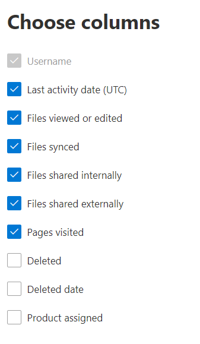

# Microsoft 365 Rapporten in het beheercentrum - SharePoint activiteitMicrosoft 365 Reports in the admin center - SharePoint activity

Als een Microsoft 365 beheerder, toont het dashboard **Rapporten** u het activiteitenoverzicht voor verschillende producten in uw organisatie.As an Microsoft 365 admin, the **Reports** dashboard shows you the activity overview across various products in your organization. Hiermee kunt u inzoomen om meer inzicht te krijgen in de activiteiten die specifiek zijn voor elk product.It enables you to drill in to get more granular insight about the activities specific to each product. Bekijk de [activiteitenrapporten in het Microsoft 365 beheercentrum.](activity-reports.md)Check out the [activity reports in the Microsoft 365 admin center](activity-reports.md).
  
U kunt bijvoorbeeld inzicht krijgen in de activiteiten van elke gebruiker die een licentie voor het gebruik van SharePoint heeft door zijn of haar interactie met bestanden te bekijken. U kunt ook beter begrijpen in hoeverre gebruikers samenwerken door het aantal gedeelde bestanden te bekijken.For example, you can understand the activity of every user licensed to use SharePoint by looking at their interaction with files. It also helps you to understand the level of collaboration going on by looking at the number of files shared.
  
> [!NOTE]
> U moet een globale beheerder, globale lezer of rapportlezer zijn in Microsoft 365 of een Exchange, SharePoint, Teams Service, Teams Communications of Skype voor Bedrijven-beheerder om rapporten te kunnen zien.You must be a global administrator, global reader or reports reader in Microsoft 365 or an Exchange, SharePoint, Teams Service, Teams Communications, or Skype for Business administrator to see reports. 
 
## Hoe kom ik aan het rapport met SharePoint-activiteiten?How do I get to the to the SharePoint activity report?

1. Ga in het beheercentrum naar de pagina **Rapporten** \> <a href="https://go.microsoft.com/fwlink/p/?linkid=2074756" target="_blank">Gebruik</a>.In the admin center, go to the **Reports** \> <a href="https://go.microsoft.com/fwlink/p/?linkid=2074756" target="_blank">Usage</a> page. 
2. Klik op de startpagina van het dashboard op de knop **Meer** weergeven op de SharePoint kaart.From the dashboard homepage, click on the **View more** button on the SharePoint card.
  
## Het rapport SharePoint activiteiten interpreterenInterpret the SharePoint activity report

U kunt de activiteiten in het SharePoint bekijken door het tabblad **Activiteit te** kiezen.You can view the activities in the SharePoint report by choosing the **Activity** tab. 

Selecteer **Kolommen kiezen** om kolommen toe te voegen of te verwijderen uit het rapport.Select **Choose columns** to add or remove columns from the report.    

U kunt de rapportgegevens ook exporteren naar een Excel .csv bestand door de **koppeling Exporteren te** selecteren.You can also export the report data into an Excel .csv file by selecting the **Export** link. Hiermee exporteert u de gegevens van alle gebruikers en kunt u eenvoudige sortering en filtering toepassen voor verdere analyse.This exports data of all users and enables you to do simple sorting and filtering for further analysis. Als u minder dan 2000 gebruikers hebt, kunt u de tabel in het rapport zelf sorteren en filteren.If you have less than 2000 users, you can sort and filter within the table in the report itself. Als u meer dan 2000 gebruikers hebt, moet u de gegevens exporteren om te kunnen filteren en sorteren.If you have more than 2000 users, in order to filter and sort, you will need to export the data. 
  
|ItemItem|BeschrijvingDescription|
|:-----|:-----|
|**Metrische****Metric**|**Definitie****Definition**|
|GebruikersnaamUsername    |Het e-mailadres van de gebruiker die de activiteit heeft uitgevoerd op de SharePoint Site.The email address of the user who performed the activity on the SharePoint Site.    |
|Laatste activiteitsdatum (UTC)Last activity date (UTC)    |De laatste datum waarop een bestandsactiviteit is uitgevoerd of een pagina is bezocht voor het geselecteerde datumbereik.The latest date a file activity was performed or a page was visited for the selected date range. Als u de activiteit van een bepaalde datum wilt zien, selecteert u de datum rechtstreeks in de grafiek.To see activity that occurred on a specific date, select the date directly in the chart.    |
|Bekeken of bewerkte bestandenFiles viewed or edited    |Het aantal bestanden dat de gebruiker heeft geüpload, gedownload, gewijzigd of bekeken.The number of files that the user uploaded, downloaded, modified, or viewed.     |
|Bestanden gesynchroniseerdFiles synced    |Het aantal bestanden dat is gesynchroniseerd vanaf het lokale apparaat van een gebruiker met de SharePoint site.The number of files that have been synced from a user's local device to the SharePoint site.   |
|Bestanden die intern worden gedeeldFiles shared internally    | Het aantal bestanden dat is gedeeld met gebruikers binnen de organisatie of met gebruikers binnen groepen (waaronder mogelijk externe gebruikers).The count of files that have been shared with users within the organization, or with users within groups (that might include external users).    |
|Bestanden die extern worden gedeeldFiles shared externally    |Het aantal bestanden dat is gedeeld met gebruikers buiten de organisatie.The number of files that have been shared with users outside of the organization.  |
|Bezochte pagina'sPages visited    |De bezoeken aan unieke pagina's door de gebruiker.The visits to unique pages by the user.  |
|VerwijderdDeleted    | Dit geeft aan dat de licentie van de gebruiker is verwijderd.This indicates that the user's license was removed.     **OPMERKING:** Activiteit voor een verwijderde gebruiker wordt nog steeds weergegeven in het rapport zolang hij of zij een licentie heeft gekregen gedurende de geselecteerde periode.**NOTE:** Activity for a deleted user will still display in the report as long as he or she was licensed at some time during the selected time period. In de kolom Verwijderd kunt u zien dat de gebruiker niet meer actief is, maar wel heeft bijgedragen aan de gegevens in het rapport.The Deleted column helps you to note that the user may no longer be active, but contributed to the data in the report.    |
|Verwijderde datumDeleted date    |De datum waarop de licentie van de gebruiker is verwijderd.The date on which the user's license was removed.  |
|Product toegewezenProduct assigned    |De Microsoft 365 producten die zijn gelicentieerd aan de gebruiker.The Microsoft 365 products that are licensed to the user.|
|||