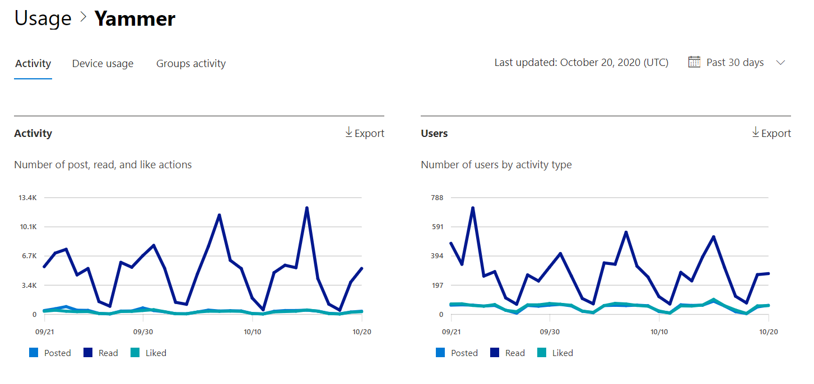

# Microsoft 365-rapporten in het Beheercentrum-Yammer-activiteitenrapportMicrosoft 365 Reports in the admin center - Yammer activity report

Als Microsoft 365-beheerder toont het dashboard **rapporten** informatie over het gebruik van de producten binnen uw organisatie.As Microsoft 365 admin, the **Reports** dashboard shows you data on the usage of the products within your organization. Bekijk [activiteitenrapporten in het Beheercentrum](activity-reports.md).Check out [activity reports in the admin center](activity-reports.md). Met het **Yammer-activiteitenoverzicht** kunt u meer informatie krijgen over het gebruiksniveau van Yammer binnen uw organisatie door naar het aantal unieke gebruikers te kijken die werken met Yammer voor het plaatsen, leuk vinden of lezen van een bericht en naar de hoeveelheid activiteit die in de gehele organisatie wordt gegenereerd.With the **Yammer Activity report** , you can understand the level of engagement of your organization with Yammer by looking at the number of unique users using Yammer to post, like or read a message and the amount of activity generated across the organization. 
  
> [!NOTE]
> U moet een globale beheerder, algemene lezer of rapporten lezer zijn in Microsoft 365 of een Exchange-, SharePoint-, teams-service, teams-communicatie of Skype voor bedrijven-beheerder om rapporten te zien.You must be a global administrator, global reader or reports reader in Microsoft 365 or an Exchange, SharePoint, Teams Service, Teams Communications, or Skype for Business administrator to see reports.  
 
## Hoe ga ik naar het Yammer-activiteitenrapport?How do I get to the Yammer activity report?

1. Ga in het beheercentrum naar de pagina **Rapporten** \> <a href="https://go.microsoft.com/fwlink/p/?linkid=2074756" target="_blank">Gebruik</a>.In the admin center, go to the **Reports** \> <a href="https://go.microsoft.com/fwlink/p/?linkid=2074756" target="_blank">Usage</a> page. 
2. Klik op de startpagina van het dashboard op de knop **meer weergeven** op de Yammer-kaart.From the dashboard homepage, click on the **View more** button on the Yammer card.

  
## Het Yammer-activiteitsrapport interpreterenInterpret the Yammer activity report

U kunt de activiteiten in het Yammer-rapport weergeven door het tabblad **activiteit** te kiezen.You can view the activities in the Yammer report by choosing the **Activity** tab. 

Selecteer **kolommen kiezen** als u kolommen wilt toevoegen aan of verwijderen uit het rapport.Select **Choose columns** to add or remove columns from the report.    

U kunt de rapportgegevens ook exporteren naar een CSV-bestand van Excel door de koppeling **exporteren** te selecteren.You can also export the report data into an Excel .csv file by selecting the **Export** link. Hiermee exporteert u de gegevens van alle gebruikers en kunt u eenvoudige sortering en filtering toepassen voor verdere analyse.This exports data of all users and enables you to do simple sorting and filtering for further analysis. Als u minder dan 2000 gebruikers hebt, kunt u de tabel in het rapport zelf sorteren en filteren.If you have less than 2000 users, you can sort and filter within the table in the report itself. Als u meer dan 2000 gebruikers hebt, moet u de gegevens exporteren om te kunnen filteren en sorteren.If you have more than 2000 users, in order to filter and sort, you will need to export the data. 
  
|ItemItem|BeschrijvingDescription|
|:-----|:-----|
|**Gegevens****Metric**|**Definitie****Definition**|
|GebruikersnaamUsername    |Het e-mailadres van de gebruiker.The email address of the user. U kunt het feitelijke e-mailadres weergeven of dit veld anoniem maken.You can display the actual email address or make this field anonymous. Dit raster toont gebruikers die zich bij Yammer hebben aangemeld met behulp van het Microsoft 365-account, of die zich in het netwerk hebben aangemeld via een eenmalige aanmelding.This grid shows users who logged into Yammer using the Microsoft 365 account or who logged into the network using single sign-on.   |
|WeergavenaamDisplay name    |De volledige naam van de gebruiker.The full name of the user. U kunt het feitelijke e-mailadres weergeven of dit veld anoniem maken.You can display the actual email address or make this field anonymous.    |
|GebruikersstatusUser state    |Een van drie waarden: geactiveerd, verwijderd of onderbroken.One of three values: Activated, Deleted, or Suspended. Deze rapporten tonen gegevens over actieve, onderbroken en verwijderde gebruikers.These reports show data for active, suspended, and deleted users. Ze tonen geen gebruikers die in behandeling zijn, omdat deze gebruikers geen bericht kunnen plaatsen, lezen of leuk vinden.They do not reflect pending users, because pending users cannot post, read, or like a message.    |
|Datum statuswijziging (UTC)State change date (UTC)    |De datum waarop de status van de gebruiker is gewijzigd in Yammer.The date on which the user's state was changed in Yammer.    |
|Datum van laatste activiteit (UTC)Last activity date (UTC)    | De laatste datum waarop de gebruiker een bericht heeft geplaatst, gelezen of leuk vindt.The last date that the user posted, read, or liked a message.    |
|UitgevoerdPosted    |Het aantal berichten dat de gebruiker heeft geplaatst tijdens de door u opgegeven tijdsperiode.The number of messages the user posted during the time period you specified.  |
|LezenRead    |Het aantal conversaties dat de gebruiker heeft gelezen tijdens de door u opgegeven tijdsperiode.The number of conversations that the user read during the time period you specified.    |
|VondLiked    |Het aantal berichten dat de gebruiker heeft leuk vond tijdens de door u opgegeven tijdsperiode.The number of messages that the user liked during the time period you specified.   |
|Product toegewezenProduct assigned    |De producten die zijn toegewezen aan deze gebruiker.The products that are assigned to this user.|
|||