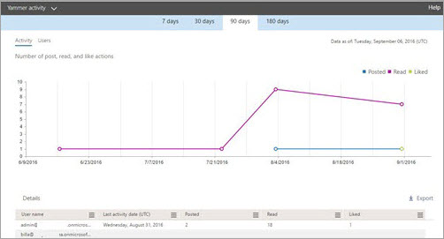
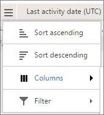

# Office 365-rapporten in het beheercentrum - Yammer-activiteitenrapportOffice 365 Reports in the admin center - Yammer activity report

Als Microsoft 365-beheerder worden in het dashboard **Rapporten** u gegevens weergegeven over het gebruik van de producten binnen uw organisatie.As Microsoft 365 admin, the **Reports** dashboard shows you data on the usage of the products within your organization. Bekijk [activiteitenrapporten in het beheercentrum](activity-reports.md).Check out [activity reports in the admin center](activity-reports.md). Met het **Yammer-activiteitenoverzicht** kunt u meer informatie krijgen over het gebruiksniveau van Yammer binnen uw organisatie door naar het aantal unieke gebruikers te kijken die werken met Yammer voor het plaatsen, leuk vinden of lezen van een bericht en naar de hoeveelheid activiteit die in de gehele organisatie wordt gegenereerd.With the **Yammer Activity report**, you can understand the level of engagement of your organization with Yammer by looking at the number of unique users using Yammer to post, like or read a message and the amount of activity generated across the organization. 
  
> [!NOTE]
> U moet een globale beheerder, wereldwijde lezer of rapportenlezer zijn in Microsoft 365 of een Exchange-, SharePoint- of Skype voor Bedrijven-beheerder om rapporten te bekijken.You must be a global administrator, global reader or reports reader in Microsoft 365 or an Exchange, SharePoint, or Skype for Business administrator to see reports. 
 
## Hoe u toegang tot het Yammer-activiteitsrapport krijgtHow to get to the Yammer activity report

1. Ga in het beheercentrum naar de pagina **Rapporten** \> <a href="https://go.microsoft.com/fwlink/p/?linkid=2074756" target="_blank">Gebruik</a>.In the admin center, go to the **Reports** \> <a href="https://go.microsoft.com/fwlink/p/?linkid=2074756" target="_blank">Usage</a> page.

    
2. Selecteer **Yammer-activiteit** \> **Activity**in de vervolgkeuzelijst **Een rapport** selecteren .From the **Select a report** drop-down, select **Yammer** \> **Activity**.
  
## Het Yammer-activiteitsrapport interpreterenInterpret the Yammer activity report

U krijgt inzicht in de Yammer-activiteit van uw gebruikers door te kijken naar de grafieken Activiteit en Gebruikers.You can get a view into your user's Yammer activity by looking at the Activity and Users charts.
  

  
Het activiteitsrapport bevat de volgende informatie.The activity report contains the following information.
  
- Gebruik de dagtabs om de trends in het **Yammer-activiteitenrapport** voor de laatste 28, 30, 90 of 180 dagen te bekijken.Use the day tabs to view the **Yammer activity** report trends over the last 7 days, 30 days, 90 days, or 180 days. Als u echter een bepaalde dag in het rapport selecteert, worden in de tabel gegevens weergegeven voor maximaal 28 dagen vanaf de huidige datum (niet de datum waarop het rapport is gegenereerd).However, if you select a particular day in the report, the table will show data for up to 28 days from the current date (not the date the report was generated). 
    
- Elk rapport heeft een datum waarop het is gegenereerd. De rapporten weerspiegelen meestal een vertraging van 24 tot 48 uur na de tijd van de activiteit.Each report has a date for when the report was generated. The reports usually reflect a 24 to 48 hour latency from time of activity.
    
- U kunt de grafiek **Activiteit** bekijken om inzicht te krijgen in de trend van de hoeveelheid Yammer-activiteit die zich afspeelt binnen uw organisatie. U krijgt een beeld van de onderverdeling van geplaatste, gelezen of leuk gevonden berichten.You can view the **Activity** chart to understand the trend of the amount of Yammer activity going on in your organization. You can understand the split of messages posted, read, or liked. 
    
    
  
  - In de grafiek **Activiteit** is de Y-as de totale activiteit met betrekking tot geplaatste, gelezen of leuk gevonden berichten.On the **Activity** chart, the Y axis is the count of activity of the messages posted, read, or liked. 
    
- U kunt de grafiek **Gebruiker** bekijken om een beeld te krijgen van de trend van het aantal unieke gebruikers die Yammer-activiteiten genereren. U kunt de trend bekijken van gebruikers die Yammer-berichten plaatsen, lezen of leuk vinden.You can view the **User** chart to understand the trend of the amount of unique users who are generating the Yammer activities. You can look at the trend of users posting, reading, or liking Yammer messages. 
    
    
  
  - In de grafiek **Gebruikers** staat de Y-as voor de gebruiker die Yammer-berichten plaatst, leest of leuk vindt.On the **Users** activity chart, the Y axis is the user posting, reading, or liking Yammer messages. 
    
  - De X-as van beide grafieken is het geselecteerde datumbereik voor dit specifieke rapport.The X axis on both charts is the selected date range for this specific report.
    
- U de reeks die u in de grafiek ziet filteren door een item in de legenda te selecteren.You can filter the series you see on the chart by selecting an item in the legend. Selecteer bijvoorbeeld in de **grafiek Activiteit** de optie **Geplaatst,** **Lezen**of **Leuk om** alleen de informatie te zien die betrekking heeft op elke grafiek.For example, on the **Activity** chart, select **Posted**, **Read**, or **Liked** to see only the info related to each one. 
    
    
  
    Door deze selectie te wijzigen, verandert de informatie in de rastertabel niet.Changing this selection doesn't change the info in the grid table.
    
- De tabel onder de grafiek toont een onderverdeling van de Yammer-activiteiten op gebruikersniveau.The table under the graph shows you a breakdown of the Yammer activities at the per-user level.
    
    U kunt het menu gebruiken om de gegevens te filteren en sorteren.You can use the menu to filter and sort the data.
    
    
  
    U kunt ook kolommen toevoegen en verwijderen.You can also add and remove columns. De beschikbare kolommen zijn:The available columns are:
    
  - **Gebruikersnaam** is het e-mailadres van de gebruiker.**Username** is the email address of the user. U kunt het feitelijke e-mailadres weergeven of dit veld anoniem maken.You can display the actual email address or make this field anonymous. 
    
    Dit raster toont gebruikers die zich bij Yammer hebben aangemeld met behulp van de Office 365-account, of die zich in het netwerk hebben aangemeld via een eenmalige aanmelding.This grid shows users who logged into Yammer using the Office 365 account or who logged into the network using single sign-on.
    
  - **Weergavenaam** is de volledige naam van de gebruiker. U kunt het feitelijke e-mailadres weergeven of dit veld anoniem maken.**Display name** is the full name of the user. You can display the actual email address or make this field anonymous. 
    
  - **Gebruikersstatus** is een van drie waarden: Geactiveerd, Verwijderd of Onderbroken.**User state** is one of three values: Activated, Deleted, or Suspended. 
    
    Deze rapporten tonen gegevens over actieve, onderbroken en verwijderde gebruikers. Ze tonen geen gebruikers die in behandeling zijn, omdat deze gebruikers geen bericht kunnen plaatsen, lezen of leuk vinden.These reports show data for active, suspended, and deleted users. They do not reflect pending users, because pending users cannot post, read, or like a message.
    
  - **Datum statuswijziging (UTC)** is de datum waarop de status van de gebruiker is gewijzigd in Yammer.**State change date (UTC)** is the date on which the user's state was changed in Yammer. 
    
  - **Laatste Activiteitsdatum (UTC)** verwijst naar de laatste datum waarop de gebruiker een bericht heeft geplaatst, gelezen of leuk gevonden.**Last activity date (UTC)** refers to the last date that the user posted, read, or liked a message. 
    
  - **Geplaatst** is het aantal berichten dat de gebruiker heeft geplaatst tijdens de door u opgegeven tijdsperiode.**Posted** is the number of messages the user posted during the time period you specified. 
    
  - **Gelezen** is het aantal unieke conversaties dat de gebruiker heeft gelezen tijdens de door u opgegeven tijdsperiode.**Read** is the number of conversations that the user read during the time period you specified. 
    
  - **Leuk gevonden** is het aantal berichten dat de gebruiker heeft leuk heeft gevonden tijdens de door u opgegeven tijdsperiode.**Liked** is the number of messages that the user liked during the time period you specified. 
    
  - **Toegewezen product** zijn de producten die aan deze gebruiker zijn toegewezen.**Product assigned** is the products that are assigned to this user. 
    
    Als het beleid van uw organisatie verhindert dat u rapporten weergeeft waarin gebruikersgegevens kunnen worden geïdentificeerd, kunt u de privacy-instelling voor elk van deze rapporten wijzigen.If your organization's policies prevents you from viewing reports where user information is identifiable, you can change the privacy setting for all these reports. Bekijk de **sectie Hoe verberg ik de gegevens op gebruikersniveau?** [Activity reports in the Microsoft 365 admin center](activity-reports.md)Check out the **How do I hide user level details?** section in [Activity reports in the Microsoft 365 admin center](activity-reports.md).
    
- U de rapportgegevens ook exporteren naar een CSV-bestand in Excel door de koppeling **Exporteren te** selecteren.You can also export the report data into an Excel .csv file, by selecting the **Export** link. Hiermee exporteert u de gegevens van alle gebruikers en kunt u eenvoudige sortering en filtering toepassen voor verdere analyse.This exports data of all users and enables you to do simple sorting and filtering for further analysis. Als u minder dan 2000 gebruikers hebt, kunt u de tabel in het rapport zelf sorteren en filteren.If you have less than 2000 users, you can sort and filter within the table in the report itself. Als u meer dan 2000 gebruikers hebt, moet u de gegevens exporteren om te kunnen filteren en sorteren.If you have more than 2000 users, in order to filter and sort, you will need to export the data. 
    
## Welke gegevens vindt u in deze rapporten?What data is in these reports?

- **Alle klanten** Deze rapporten voegen gegevens over alle klanten samen, inclusief het gebruik van Yammer in een browser of in een iOS- of Android-app.**All clients** These reports aggregate data across all clients, including using Yammer in a browser or on an iOS or Android app. 
    
- **Geen gegevens van het externe netwerk** Gegevens van externe netwerken worden niet opgenomen in deze rapporten.**No external network data** External network data is not included in these reports. 
    
- **Geactiveerde netwerken** In deze rapporten worden gegevens getoond over het Yammer-netwerk dat onderdeel is van uw Office 365-abonnement. In de grafiek wordt het gebruik samengevoegd van alle gebruikers die zich hebben aangemeld bij het Yammer-netwerk, ongeacht of ze Office 365 dan wel Yammer hebben gebruikt om zich aan te melden.**Activated networks** These reports show data for the Yammer network that is part of your Office 365 subscription. The chart aggregates usage of all users who logged into the Yammer network, irrespective of whether they used Office 365 or Yammer to log in. 
    

