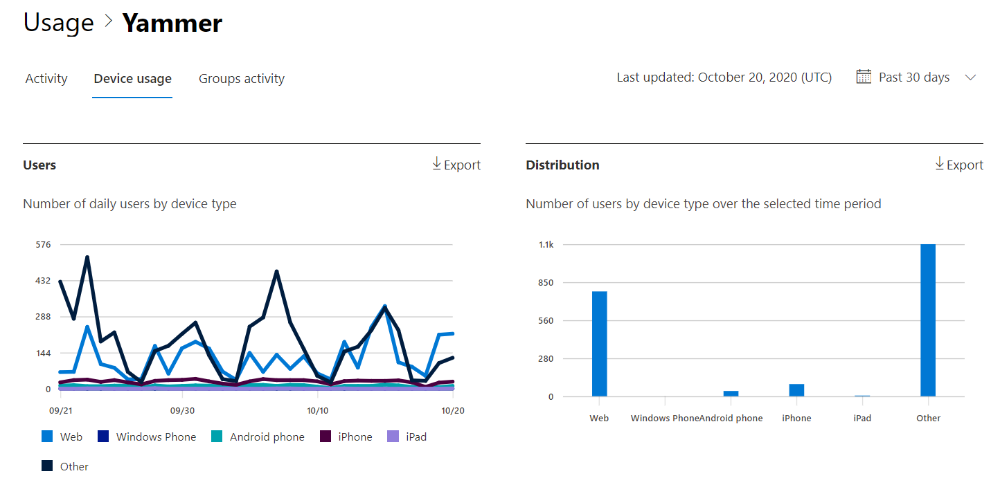
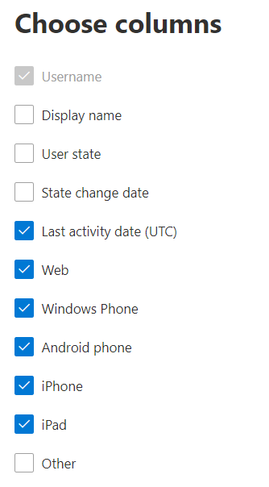

# Microsoft 365-rapporten in het beheercentrum - Yammer-rapport apparaatgebruik

In het dashboard  Microsoft 365-rapporten ziet u het activiteitenoverzicht voor alle producten in uw organisatie. U kunt inzoomen op rapporten op het niveau van afzonderlijke producten om een gedetailleerder inzicht te krijgen in de activiteiten binnen elk product. Bekijk [het overzichtsonderwerp over rapporten](activity-reports.md).
  
Het Yammer-apparaatgebruiksrapport geeft u informatie over de apparaten waarop uw gebruikers gebruikmaken van Yammer. U kunt het dagelijkse aantal gebruikers bekijken per apparaattype, en het aantal gebruikers per apparaattype. U kunt beide bekijken over een geselecteerd tijdvak. U kunt ook details per gebruiker weergeven.
  
> [!NOTE]
> U moet een globale beheerder, globale lezer of rapportlezer zijn in Microsoft 365 of een Exchange-, SharePoint-, Teams-, Teams-, Teams-, of Skype voor Bedrijven-beheerder om rapporten te kunnen zien.  
 
## Hoe ga ik naar het Yammer-apparaatgebruiksrapport?

1. Ga in het beheercentrum naar de pagina **Rapporten** \> <a href="https://go.microsoft.com/fwlink/p/?linkid=2074756" target="_blank">Gebruik</a>. 
2. Klik op de startpagina van het dashboard op **de knop Meer** weergeven op de Yammer-kaart.
  
## Het rapport Gebruik van Yammer-apparaten interpreteren

U kunt het gebruik in het OneDrive-rapport bekijken door het tabblad **Apparaatgebruik te** kiezen. 

Selecteer **Kolommen kiezen** om kolommen toe te voegen of te verwijderen uit het rapport.    

U kunt de rapportgegevens ook exporteren naar een CSV-bestand van Excel door de **koppeling Exporteren te** selecteren. Hiermee exporteert u de gegevens van alle gebruikers en kunt u eenvoudige sortering en filtering toepassen voor verdere analyse. Als u minder dan 2000 gebruikers hebt, kunt u de tabel in het rapport zelf sorteren en filteren. Als u meer dan 2000 gebruikers hebt, moet u de gegevens exporteren om te kunnen filteren en sorteren. 
  
|Item|Beschrijving|
|:-----|:-----|
|**Metrische**|**Definitie**|
|Gebruikersnaam    |Het e-mailadres van de gebruiker. U kunt het feitelijke e-mailadres weergeven of dit veld anoniem maken. In dit raster ziet u gebruikers die zich hebben aangemeld bij Yammer met het Microsoft 365-account of die zich met één aanmelding bij het netwerk hebben aangemeld.   |
|Weergavenaam    |De volledige naam van de gebruiker. U kunt het feitelijke e-mailadres weergeven of dit veld anoniem maken.    |
|Gebruikerstoestand    |Een van de drie waarden: Actief, Verwijderd of Opgeschort. Deze rapporten tonen gegevens over actieve, onderbroken en verwijderde gebruikers. Ze tonen geen gebruikers die in behandeling zijn, omdat deze gebruikers geen bericht kunnen plaatsen, lezen of leuk vinden.     |
|Datum van staatswijziging (UTC)    |De datum waarop de status van de gebruiker is gewijzigd in Yammer.    |
|Laatste activiteitsdatum (UTC)    |De laatste datum (UTC) die de gebruiker heeft deelgenomen aan een Yammer-activiteit.    |
|Web    |Hiermee wordt aangegeven of de gebruiker Yammer op het web heeft gebruikt.    |
|Windows Phone    | Hiermee wordt aangegeven of de gebruiker Yammer heeft gebruikt op een Windows-telefoon.    |
|Android-telefoon    |Hiermee wordt aangegeven of de gebruiker Yammer heeft gebruikt op een Android-telefoon.  |
|iphone   | Hiermee wordt aangegeven of de gebruiker Yammer op een iPhone heeft gebruikt.    |
|ipad    |Hiermee wordt aangegeven of de gebruiker Yammer op een iPad heeft gebruikt.  |
|andere    |Hiermee wordt aangegeven of de gebruiker Yammer heeft gebruikt op een ander apparaat, niet eerder vermeld.  |
|||