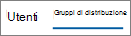
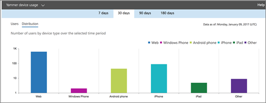

# Microsoft 365-rapporten in het beheercentrum - Yammer-rapport apparaatgebruik

In het dashboard  Microsoft 365-rapporten ziet u het activiteitenoverzicht voor alle producten in uw organisatie. U kunt inzoomen op rapporten op het niveau van afzonderlijke producten om een gedetailleerder inzicht te krijgen in de activiteiten binnen elk product. Bekijk [het overzichtsonderwerp over rapporten](activity-reports.md).
  
Het Yammer-apparaatgebruiksrapport geeft u informatie over de apparaten waarop uw gebruikers gebruikmaken van Yammer. U kunt het dagelijkse aantal gebruikers bekijken per apparaattype, en het aantal gebruikers per apparaattype. U kunt beide bekijken over een geselecteerd tijdvak. U kunt ook details per gebruiker weergeven.
  
> [!NOTE]
> U moet een globale beheerder, globale lezer of rapportlezer zijn in Microsoft 365 of een Exchange-, SharePoint-, Teams-, Teams-, Teams-, of Skype voor Bedrijven-beheerder om rapporten te kunnen zien. 
  
## Hoe ga ik naar het Yammer-apparaatgebruiksrapport?

1. Ga in het beheercentrum naar de pagina **Rapporten** \> <a href="https://go.microsoft.com/fwlink/p/?linkid=2074756" target="_blank">Gebruik</a>.

    
2. Selecteer in **de vervolgkeuze** selecteren een rapport de optie **Gebruik van Yammer-apparaat.** \> 
  
## Het Yammer-activiteitsrapport interpreteren

U kunt inzicht krijgen in het gebruik van Yammer-apparaten door uw gebruikers door de grafieken **Gebruikers** en **Distributie** te bekijken. 
  
Het apparaatgebruiksrapport bevat de volgende informatie.
  
- Gebruik de dagtabs om de trends in het activiteitenrapport over **Yammer-apparaatgebruik** voor de laatste 7, 30, 90 of 180 dagen te bekijken. Als u echter een bepaalde dag in het rapport selecteert, worden in de tabel gegevens voor maximaal 28 dagen vanaf de huidige datum (niet de datum waarop het rapport is gegenereerd) weer te geven. 
    
- Elk rapport heeft een datum waarop het is gegenereerd. De rapporten weerspiegelen meestal een vertraging van 24 tot 48 uur na de tijd van de activiteit.
    
- U kunt de grafiek **Gebruikers** bekijken om het aantal gebruikers per dag per apparaattype te zien.  
  
- U kunt de grafiek **Distributie** bekijken om het aantal gebruikers per apparaattype te zien.  
  
- De tabel **Details** onder de grafiek toont een onderverdeling van het Yammer-apparaatgebruik op gebruikersniveau. 
    
    U kunt ook kolommen toevoegen en verwijderen. De beschikbare kolommen zijn:
    
  - **Gebruikersnaam** is het e-mailadres van de gebruiker. U kunt het feitelijke e-mailadres weergeven of dit veld anoniem maken. 
    
    In dit raster ziet u gebruikers die zich hebben aangemeld bij Yammer met het Microsoft 365-account of die zich met één aanmelding bij het netwerk hebben aangemeld.
    
  - **Weergavenaam** is de volledige naam van de gebruiker. U kunt het feitelijke e-mailadres weergeven of dit veld anoniem maken. 
    
  - **Gebruikersstatus** is een van de drie waarden Actief, Verwijderd of Onderbroken. 
    
    Deze rapporten tonen gegevens over actieve, onderbroken en verwijderde gebruikers. Ze tonen geen gebruikers die in behandeling zijn, omdat deze gebruikers geen bericht kunnen plaatsen, lezen of leuk vinden.
    
  - **Web** geeft aan of de gebruiker Yammer heeft gebruikt op het web. 
    
  - **Windows Phone** geeft aan of de gebruiker Yammer heeft gebruikt op een Windows Phone. 
    
  - **Android-telefoon** geeft aan of de gebruiker Yammer heeft gebruikt op een Android-telefoon. 
    
  - **iPhone** geeft aan of de gebruiker Yammer heeft gebruikt op een iPhone. 
    
  - **iPad** geeft aan of de gebruiker Yammer heeft gebruikt op een iPad. 
    
  - **Overige** geeft aan of de gebruiker Yammer heeft gebruikt op een ander apparaat dat niet eerder is vermeld. 
    
    Als het beleid van uw organisatie verhindert dat u rapporten weergeeft waarin gebruikersgegevens kunnen worden geïdentificeerd, kunt u de privacy-instelling voor elk van deze rapporten wijzigen. Bekijk de sectie **Details op gebruikersniveau** verbergen in de [activiteitenrapporten in het Microsoft 365-beheercentrum.](activity-reports.md)
    
- U kunt de rapportgegevens ook exporteren naar een CSV-bestand van Excel door de koppeling Exporteren **te** selecteren. Hiermee exporteert u de gegevens van alle gebruikers en kunt u eenvoudige sortering en filtering toepassen voor verdere analyse. Als u minder dan 2000 gebruikers hebt, kunt u de tabel in het rapport zelf sorteren en filteren. Als u meer dan 2000 gebruikers hebt, moet u de gegevens exporteren om te kunnen filteren en sorteren. 
    

