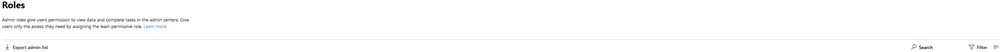

# Aan de slag met de pagina Rollen

Op de pagina Rollen kunt u gebruikers machtigingen geven om taken uit te voeren in de beheercentra. Dit helpt uw organisatie bij het verspreiden van taken naar de juiste personen en helpt uw gegevens veilig te houden.

> [!TIP]
> Op zoek naar de gedetailleerde rolbeschrijvingen? Bekijk [Beheerdersrolmachtigingen in Azure Active Directory](/azure/active-directory/users-groups-roles/directory-assign-admin-roles#available-roles) en [Over beheerdersrollen.](/microsoft-365/admin/add-users/about-admin-roles)

## Informatie over de pagina beheerdersrollen

U kunt de lijst met beheerders exporteren en zoeken en filteren op rol.

|||
|:-----|:-----|
|    |Gebruik **exportbeheerderlijst om** een volledige lijst te krijgen met alle beheerdersgebruikers in uw organisatie. De lijst wordt opgeslagen in een Excel .csv bestand.     |
|    |Gebruik **Zoeken** om te zoeken naar een beheerdersrol en uw gebruikers te zien die aan die rol zijn toegewezen.     |
|    |Gebruik **Filter om** de weergave van weergegeven beheerdersrollen te wijzigen.     |

## Haal het meeste uit de rollen

Lees de inhoud hieronder voor meer informatie over de verschillende beheerdersrollen en welke taken de rollen in uw organisatie kunnen uitvoeren.

> [!NOTE]
Dit is geen volledige lijst met alle machtigingen die deze rollen hebben. Selecteer de **koppeling Meer informatie** voor meer informatie over elke rol.

### Exchange-beheerder

Wijs de Exchange beheerdersrol toe aan gebruikers die de e-mailpostvakken, Microsoft 365 groepen en Exchange Online. Ze kunnen ook serviceaanvragen voor Microsoft-ondersteuning openen en beheren. [Meer informatie](/microsoft-365/admin/add-users/about-exchange-online-admin-role)

### Bedrijfsbeheerder

Wijs de rol van globale beheerder toe aan gebruikers die globale toegang nodig hebben tot de meeste beheerfuncties en gegevens in de onlineservices van Microsoft. Te veel gebruikers globale toegang geven is een beveiligingsrisico, we raden u dan ook aan om 2 tot 4 globale beheerders te hebben. Alleen globale beheerders kunnen wachtwoorden opnieuw instellen voor alle gebruikers en domeinen toevoegen en beheren. Ze kunnen ook serviceaanvragen voor Microsoft-ondersteuning openen en beheren. De persoon die zich heeft aangemeld voor Microsoft Online Services, wordt automatisch een globale beheerder. [Meer informatie](/microsoft-365/admin/add-users/about-admin-roles#roles-available-in-the-microsoft-365-admin-center)

### Algemene lezer

Wijs de rol van globale lezerbeheerder toe aan gebruikers die beheerdersfuncties en -instellingen moeten bekijken in alle beheercentra die de globale beheerder kan bekijken. De rol globale lezerbeheerder kan geen instellingen bewerken. [Meer informatie](/microsoft-365/admin/add-users/about-admin-roles#roles-available-in-the-microsoft-365-admin-center)

### Helpdesk-beheerder

Wijs de rol van helpdeskbeheerder toe aan gebruikers die wachtwoorden opnieuw willen instellen, en dwing gebruikers zich af te melden voor eventuele beveiligingsproblemen. Ze kunnen ook serviceaanvragen voor Microsoft-ondersteuning openen en beheren. De helpdeskbeheerder kan alleen niet-beheerders en gebruikers helpen die deze rollen hebben toegewezen: Adreslijstlezer, Gast-genodigde, Helpdeskbeheerder, Berichtcentrumlezer en Rapportenlezer. [Meer informatie](/microsoft-365/admin/add-users/about-admin-roles#roles-available-in-the-microsoft-365-admin-center)

### Servicebeheerder

Wijs de rol van servicebeheerder toe aan gebruikers die serviceaanvragen moeten maken voor Azure Microsoft 365 en Office 365 services. [Meer informatie](/microsoft-365/admin/add-users/about-admin-roles#roles-available-in-the-microsoft-365-admin-center)

### SharePoint-beheerder

Wanneer u een abonnement Microsoft 365, wordt automatisch een teamsite gemaakt en wordt de globale beheerder ingesteld als de primaire beheerder van de siteverzameling. Wijs de SharePoint beheerdersrol toe aan gebruikers die u toegang wilt geven tot het SharePoint beheercentrum. Gebruikers met de SharePoint beheerdersrol kunnen siteverzamelingen maken en beheren, beheerders van siteverzamelingen aanwijzen en gebruikersprofielen beheren. Gebruikers met de SharePoint beheerdersrol kunnen ook Microsoft 365 groepen beheren en serviceaanvragen openen via Microsoft-ondersteuning. [Meer informatie](/sharepoint/sharepoint-admin-role)

### Teams-servicebeheerder

Wijs de Teams beheerdersrol toe aan gebruikers die u wilt openen en beheren van het Teams & Skype beheercentrum. Gebruikers met de Teams beheerdersrol kunnen ook Microsoft 365 groepen beheren en serviceaanvragen openen via Microsoft-ondersteuning. [Meer informatie](/MicrosoftTeams/using-admin-roles)

### Gebruikersbeheerder

Wijs de rol van de gebruikerbeheerder toe aan gebruikers die u wilt openen en beheren met wachtwoordinstellingen voor gebruikers en groepen. Ze kunnen ook serviceaanvragen voor Microsoft-ondersteuning openen en beheren. [Meer informatie](/microsoft-365/admin/add-users/about-admin-roles#roles-available-in-the-microsoft-365-admin-center)

## Rollen vergelijken

U kunt nu machtigingen voor maximaal 3 rollen tegelijk vergelijken, zodat u de minst permissieve rol kunt vinden die u wilt toewijzen.

In het beheercentrum:

- Selecteer maximaal 3 rollen en kies **Rollen vergelijken om** de machtigingen te zien die elke rol heeft.

## Verwante inhoud

[Over Microsoft 365 beheerdersrollen](about-admin-roles.md) (artikel)\
[Beheerdersrollen toewijzen](assign-admin-roles.md) (artikel)