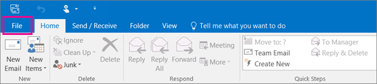
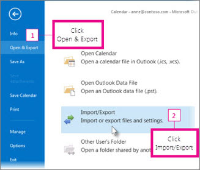

# Stap 4: een andere werknemer toegang geven tot OneDrive en Outlook gegevensStep 4 - Give another employee access to OneDrive and Outlook data

Wanneer een werknemer uw organisatie verlaat, wilt u toegang krijgen tot de OneDrive en Outlook gegevens, een back-up maken en kiezen of u deze aan een andere werknemer wilt geven.When an employee leaves your organization, you'll want to access their OneDrive and Outlook data, back it up, and choose whether to give it to another employee.
  
## De documenten van een voormalige gebruiker OneDrive openenAccess a former user's OneDrive documents

Als u de licentie van een gebruiker verwijdert, maar het account niet verwijdert, kunt u uzelf toegang geven tot de inhoud in de OneDrive.If you remove a user's license but don't delete the account, you can give yourself access to the content in the user's OneDrive. Als u het account van de gebruiker verwijdert, hebt u standaard 30 dagen de tijd om toegang te krijgen tot de gegevens van OneDrive gebruiker.If you delete the user's account, you have 30 days by default to access the former user's OneDrive data. [Meer informatie over het instellen van de OneDrive voor verwijderde gebruikers.](/onedrive/set-retention)[Learn how to set the OneDrive retention for deleted users](/onedrive/set-retention). Als u een [gebruikersaccount niet binnen deze](/office365/admin/add-users/restore-user) tijd herstelt, wordt de OneDrive verwijderd.If you don't [restore a user account](/office365/admin/add-users/restore-user) within this time, their OneDrive content is deleted.

Als u de bestanden van een voormalige gebruiker OneDrive wilt behouden, geeft u uzelf eerst toegang tot hun OneDrive en verplaatst u vervolgens de bestanden die u wilt bewaren.To preserve a former user's OneDrive files, first give yourself access to their OneDrive, and then move the files you want to keep.

1. Ga in het beheercentrum naar de pagina **Gebruikers** \> <a href="https://go.microsoft.com/fwlink/p/?linkid=834822" target="_blank">Actieve gebruikers</a>.In the admin center, go to the **Users** \> <a href="https://go.microsoft.com/fwlink/p/?linkid=834822" target="_blank">Active users</a> page.  

2. Selecteer een gebruiker.Select a user.

3. Selecteer in het **rechterdeelvenster OneDrive.**In the right pane, select **OneDrive**. Selecteer **onder Toegang tot bestanden krijgen** de optie Koppeling maken naar **bestanden.**Under **Get access to files**, select **Create link to files**.

4. Selecteer de koppeling om de bestandslocatie te openen.Select the link to open the file location. Download de bestanden naar uw computer of selecteer **Verplaatsen** naar of Kopiëren **om** ze te verplaatsen of te kopiëren naar uw eigen OneDrive of naar een gedeelde bibliotheek.Download the files to your computer, or select **Move to** or **Copy to** to move or copy them to your own OneDrive or to a shared library.

> [!NOTE]
> U kunt maximaal 500 MB aan bestanden en mappen tegelijk verplaatsen of kopiëren.You can move or copy up to 500 MB of files and folders at a time. 
> Wanneer u documenten met versiegeschiedenis verplaatst of kopieert, wordt alleen de nieuwste versie verplaatst.When you move or copy documents that have version history, only the latest version is moved.  

U kunt ook toegang verlenen aan een andere gebruiker om toegang te krijgen tot de OneDrive.You can also grant access to another user to access a former employee's OneDrive.

1. Meld u aan bij <a href="https://go.microsoft.com/fwlink/p/?linkid=2024339" target="_blank">het beheercentrum</a> als globale beheerder of SharePoint beheerder.Sign in to the <a href="https://go.microsoft.com/fwlink/p/?linkid=2024339" target="_blank">admin center</a> as a global admin or SharePoint admin.

    Als u een bericht krijgt dat u geen toegang hebt tot het beheercentrum, hebt u geen beheerdersmachtigingen in uw organisatie.If you get a message that you don't have permission to access the admin center, then you don't have administrator permissions in your organization.

2. Selecteer beheercentra in  het \> **linkerdeelvenster SharePoint.**In the left pane, select **Admin centers** \> **SharePoint**. (Mogelijk moet u Alles tonen **selecteren om** de lijst met beheercentra weer te geven.)(You might need to select **Show all** to see the list of admin centers.)

3. Als het klassieke SharePoint wordt weergegeven,  selecteert u Nu openen boven aan de pagina om het SharePoint openen.If the classic SharePoint admin center appears, select **Open it now** at the top of the page to open the SharePoint admin center.

4. Selecteer meer functies in **het linkerdeelvenster.**In the left pane, select **More features**.

5. Selecteer **onder Gebruikersprofielen** de optie **Openen.**Under **User profiles**, select **Open**.

6. Selecteer **onder Personen** de optie **Gebruikersprofielen beheren.**Under **People**, select **Manage User Profiles**.

7. Voer de naam van de voormalige werknemer in en selecteer **Zoeken.**Enter the former employee's name and select **Find**.

8. Klik met de rechtermuisknop op de gebruiker en kies **siteverzamelingseigenaren beheren.**Right-click the user, and then choose **Manage site collection owners**.

9. Voeg de gebruiker toe aan **beheerders van siteverzamelingen** en selecteer **Ok.**Add the user to **Site collection administrators** and select **Ok**.

10. De gebruiker kan nu de gegevens van de voormalige werknemer OneDrive met de OneDrive URL.The user will now be able to access the former employee's OneDrive using the OneDrive URL. 

### Beheerderstoegang tot de gebruikersaccounts intrekken OneDriveRevoke admin access to a user's OneDrive

U kunt uzelf toegang geven tot de inhoud in de OneDrive van een gebruiker, maar mogelijk wilt u uw toegang verwijderen wanneer u deze niet meer nodig hebt.You can give yourself access to the content in a user's OneDrive, but you may want to remove your access when you no longer need it.

1. Meld u aan bij <a href="https://go.microsoft.com/fwlink/p/?linkid=2024339" target="_blank">het beheercentrum</a> als globale beheerder of SharePoint beheerder.Sign in to the <a href="https://go.microsoft.com/fwlink/p/?linkid=2024339" target="_blank">admin center</a> as a global admin or SharePoint admin.

    Als u een bericht krijgt dat u geen toegang hebt tot het beheercentrum, hebt u geen beheerdersmachtigingen in uw organisatie.If you get a message that you don't have permission to access the admin center, then you don't have administrator permissions in your organization.

2. Selecteer beheercentra in  het \> **linkerdeelvenster SharePoint.**In the left pane, select **Admin centers** \> **SharePoint**. (Mogelijk moet u Alles tonen **selecteren om** de lijst met beheercentra weer te geven.)(You might need to select **Show all** to see the list of admin centers.)

3. Als het klassieke SharePoint wordt weergegeven,  selecteert u Nu openen boven aan de pagina om het SharePoint openen.If the classic SharePoint admin center appears, select **Open it now** at the top of the page to open the SharePoint admin center.

4. Selecteer meer functies in **het linkerdeelvenster.**In the left pane, select **More features**.

5. Selecteer **onder Gebruikersprofielen** de optie **Openen.**Under **User profiles**, select **Open**.

6. Selecteer **onder Personen** de optie **Gebruikersprofielen beheren.**Under **People**, select **Manage User Profiles**.

7. Voer de naam van de gebruiker in en selecteer **Zoeken**.Enter the user's name and select **Find**.

8. Klik met de rechtermuisknop op de gebruiker en kies **siteverzamelingseigenaren beheren.**Right-click the user, and then choose **Manage site collection owners**.

9. Verwijder de persoon die geen toegang meer nodig heeft tot de gegevens van de gebruiker en selecteer **OK.**Remove the person who no longer needs access to the user's data, and then select **OK**.

## Toegang tot Outlook gegevens van een voormalige gebruikerAccess the Outlook data of a former user

Als u de e-mailberichten, agenda, taken en contactpersonen van de voormalige werknemer wilt behouden, exporteert u de gegevens naar een Outlook-gegevensbestand (.pst).To save the email messages, calendar, tasks, and contacts of the former employee, export the information to an Outlook Data File (.pst).
  
1. [Voeg de e-mail van](https://support.microsoft.com/office/6e27792a-9267-4aa4-8bb6-c84ef146101b) de voormalige werknemer toe aan uw Outlook (Als u het wachtwoord van de gebruiker opnieuw in [stelt,](reset-passwords.md)kunt u het instellen op iets dat alleen u kent.)[Add the former employee's email](https://support.microsoft.com/office/6e27792a-9267-4aa4-8bb6-c84ef146101b) to your Outlook (If you [reset the user's password](reset-passwords.md), you can set it to something only you know.)

2. Selecteer Outlook **bestand**.In Outlook, select **File**.

    
  
3. Selecteer **Exporteren &amp; openen** \> **Import/Export**.Select **Open &amp; Export** \> **Import/Export**.

    
  
4. Selecteer **Exporteren naar een bestand** en selecteer vervolgens **Volgende**.Select **Export to a file**, and then select **Next**.

    
  
5. Selecteer **Outlook Gegevensbestand (.pst)** en selecteer vervolgens **Volgende**.Select **Outlook Data File (.pst)**, and then select **Next**.

6. Selecteer het account dat u wilt exporteren door de naam of het e-mailadres te selecteren, zoals Postvak - Anne Weiler of anne@contoso.com.Select the account you want to export by selecting the name or email address, such as Mailbox - Anne Weiler or anne@contoso.com. Als u alles in het account wilt exporteren, inclusief e-mail, de agenda, contactpersonen, taken en notities, moet het selectievakje **Inclusief submappen** zijn ingeschakeld.If you want to export everything in your account, including mail, calendar, contacts, tasks, and notes, make sure the **Include subfolders** check box is selected.

    > [!NOTE]
    > U kunt slechts één account tegelijkertijd exporteren. Als u meerdere accounts wilt exporteren, herhaalt u deze stappen voor de volgende accounts.You can export one account at a time. If you want to export multiple accounts, after one account is exported, repeat these steps.
  
    
  
7. Selecteer **Volgende**.Select **Next**.

8. Selecteer **Bladeren** om te selecteren waar u het Outlook gegevensbestand (.pst) wilt opslaan.Select **Browse** to select where to save the Outlook Data File (.pst). Typ een  *bestandsnaam* en selecteer **OK om door** te gaan.Type a  *file name*, and then select **OK** to continue.

    > [!NOTE]
    > Als u de exportfunctie eerder hebt gebruikt, worden de vorige maplocatie en bestandsnaam weergegeven.If you've used export before, the previous folder location and file name appear. Typ een *andere bestandsnaam voordat* u **OK selecteert.**Type a  *different file name*  before selecting **OK**.
  
9. Als u naar een bestaand Outlook-gegevensbestand (.pst) exporteert, geeft u onder **Opties** aan wat er moet gebeuren wanneer items worden geëxporteerd die al in het bestand bestaan.If you are exporting to an existing Outlook Data File (.pst), under **Options**, specify what to do when exporting items that already exist in the file.

10. Klik op **Voltooien**.Select **Finish**.

De export wordt direct gestart in Outlook, tenzij er een nieuw Outlook-gegevensbestand (.pst) wordt gemaakt of een bestand wordt gebruikt dat met een wachtwoord is beveiligd.Outlook begins the export immediately unless a new Outlook Data File (.pst) is created or a password-protected file is used.
  
- Als u een Outlook-gegevensbestand (.pst) maakt, kunt u het bestand desgewenst met een wachtwoord beveiligen.If you're creating an Outlook Data File (.pst), an optional password can help protect the file. Wanneer het **dialoogvenster Outlook gegevensbestand** maken wordt weergegeven, typt  u het wachtwoord *in* de vakken Wachtwoord en Wachtwoord verifiëren en selecteert u  **OK.**When the **Create Outlook Data File** dialog box appears, type the  *password*  in the **Password** and **Verify Password** boxes, and then select **OK**. Typ in **Outlook dialoogvenster Wachtwoord voor** gegevensbestand het *wachtwoord* en selecteer **OK.**In the **Outlook Data File Password** dialog box, type the  *password*, and then select **OK**.

- Als u exporteert naar een bestaand Outlook-gegevensbestand (.pst) dat met een wachtwoord is beveiligd, typt u in het dialoogvenster Wachtwoord voor gegevensbestand **Outlook** het wachtwoord *en* selecteert u **OK**.If you're exporting to an existing Outlook Data File (.pst) that is password protected, in the **Outlook Data File Password** dialog box, type the  *password*, and then select **OK**.

Bekijk hoe u [e-mail,](https://support.microsoft.com/office/14252b52-3075-4e9b-be4e-ff9ef1068f91) contactpersonen en agenda exporteert of back-upt naar Outlook PST-bestand in Outlook 2010.See how to [Export or backup email, contacts, and calendar to an Outlook .pst file](https://support.microsoft.com/office/14252b52-3075-4e9b-be4e-ff9ef1068f91) in Outlook 2010.

  > [!NOTE]
  > Standaard is uw e-mail offline beschikbaar voor een periode van 12 maanden.By default, your email is available offline for a period of 12 months. Zie indien nodig hoe u de offline beschikbare [gegevens kunt vergroten.](/outlook/troubleshoot/mailboxes/only-subset-items-synchronized)If required, see how to [increase the data available offline](/outlook/troubleshoot/mailboxes/only-subset-items-synchronized).

### Een andere gebruiker toegang geven tot e-mail van een voormalige gebruikerGive another user access to a former user's email

Als u toegang wilt geven tot de e-mailberichten, agenda, taken en contactpersonen van de voormalige werknemer aan een andere werknemer, importeert u de gegevens in het postvak OUTLOOK van een andere werknemer.To give access to the email messages, calendar, tasks, and contacts of the former employee to another employee, import the information to another employee's Outlook inbox.

> [!NOTE]
> U kunt ook [het postvak van](/office365/admin/email/convert-user-mailbox-to-shared-mailbox) de voormalige gebruiker converteren naar een gedeeld postvak of het e-mailbericht van een voormalige werknemer doorsturen naar een andere [werknemer.](/office365/admin/add-users/remove-former-employee#forward-a-former-employees-email-to-another-employee-or-convert-to-a-shared-mailbox)You can also [convert the former user's mailbox to a shared mailbox](/office365/admin/email/convert-user-mailbox-to-shared-mailbox) or [forward a former employee's email to another employee](/office365/admin/add-users/remove-former-employee#forward-a-former-employees-email-to-another-employee-or-convert-to-a-shared-mailbox).

1. Ga Outlook naar **Exportbestand** \> **openen &amp;** \> Import/Export.In Outlook, go to **File** \> **Open &amp; Export** \> **Import/Export**.

    Hiermee wordt de wizard Importeren en exporteren gestart.This starts the Import and Export Wizard.

2. Selecteer **Importeren uit een ander programma of bestand** en selecteer vervolgens **Volgende.**Select **Import from another program or file**, and then select **Next**.

    
  
3. Selecteer **Outlook Gegevensbestand (.pst)** en selecteer **Volgende**.Select **Outlook Data File (.pst)**, and select **Next**.

4. Blader naar het PST-bestand dat u wilt importeren.Browse to the .pst file you want to import.

5. Kies onder **Opties** hoe u dubbele contactpersonen wilt verwerken.Under **Options**, choose how you want to deal with duplicates

6. Selecteer **Volgende**.Select **Next**.

7. Als een wachtwoord is toegewezen aan het Outlook (.pst), voert u het wachtwoord in en selecteert u **OK.**If a password was assigned to the Outlook Data File (.pst), enter the password, and then select **OK**.

8. Stel de opties voor het importeren van items in. De standaardinstellingen hoeft u meestal niet te wijzigen.Set the options for importing items. The default settings usually don't need to be changed.

9. Klik op **Voltooien**.Select **Finish**.

> [!NOTE]
> De stappen blijven hetzelfde voor het openen van de OneDrive en e-mailgegevens van een bestaande gebruiker.The steps remain the same for accessing an existing user's OneDrive and email data.

> [!TIP]
> Als u slechts een paar items uit een Outlook gegevensbestand (.pst) wilt importeren of herstellen, kunt u het Outlook gegevensbestand openen.If you want to import or restore only a few items from an Outlook Data File (.pst), you can open the Outlook Data File. Sleep vervolgens in het navigatiedeelvenster de items van Outlook mappen met gegevensbestand naar uw bestaande Outlook mappen.Then, in the navigation pane, drag the items from Outlook Data File folders to your existing Outlook folders. 

## Verwante inhoudRelated content

[Beheerders toevoegen en verwijderen op een OneDrive account](/sharepoint/manage-user-profiles#add-and-remove-admins-for-a-users-onedrive) (artikel)[Add and remove admins on a OneDrive account](/sharepoint/manage-user-profiles#add-and-remove-admins-for-a-users-onedrive) (article)\
[Een verwijderde OneDrive](/onedrive/restore-deleted-onedrive) (artikel)\ herstellen[Restore a deleted OneDrive](/onedrive/restore-deleted-onedrive) (article)\
[OneDrive bewaren en verwijderen](/onedrive/retention-and-deletion) (artikel)[OneDrive retention and deletion](/onedrive/retention-and-deletion) (article)
