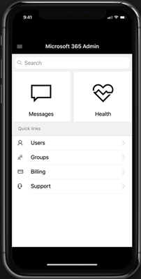

# Info over de mobiele app Microsoft 365 admin

Bent u een beheerder die meestal onderweg is? Ga vervolgens naar de [Microsoft 365 admin-app](https://go.microsoft.com/fwlink/?LinkID=627216). U kunt de app gebruiken voor het beheren van uw online organisatie op uw telefoon of Tablet. U kunt de app in de Apple Store en in Google Play vinden.   

De beheer-app is een uitgebreide app met uitgebreide functies die meer 80-functies biedt om u te helpen bij het beheren van uw organisatie wanneer u geen computer kunt bereiken. Hier is een overzicht van slechts enkele taken die u kunt uitvoeren vanuit de app:

- Servicestatus ontvangen en meldingen wijzigen
- Een serviceaanvraag maken
- Het wachtwoord van een gebruiker opnieuw instellen
- Licenties toewijzen
- Groepslidmaatschappen toevoegen of verwijderen
- Gebruikers toevoegen 

En als u iemand bent die verantwoordelijk is voor meer dan één online organisatie, meldt u zich aan bij meerdere organisaties en snel schakelen tussen de personen. 
  
> [!IMPORTANT]
> Als u problemen ondervindt bij het gebruiken van de mobiele app voor beheerders in iOS of Android, kunt u via e-mail contact opnemen via [feedback365@microsoft.com](mailto:feedback365@microsoft.com) om ons te laten weten. 
  
## Download de mobiele app voor beheerders

[Mobiele app Microsoft 365 admin](https://go.microsoft.com/fwlink/?LinkID=627216).
  
Bekijk een korte video over het installeren van de mobiele app voor beheerders.  

> [!VIDEO https://www.microsoft.com/videoplayer/embed/05c1d439-9ec2-415f-9178-250f64dec64c] 

Als u deze video nuttig vond, raadpleegt u dan de [complete reeks trainingen voor kleine bedrijven en nieuwe gebruikers van Microsoft 365](https://support.microsoft.com/office/6ab4bbcd-79cf-4000-a0bd-d42ce4d12816).

 
## Veelgestelde vragen

Hieronder vindt u antwoorden op enkele veelgestelde vragen over de app.
  
### Wat moet ik doen om de app te kunnen gebruiken?

U moet een geldig abonnement voor Microsoft 365-apps voor bedrijven of Microsoft 365 Business Premium met beheerdersrechten hebben om u aan te melden en de app te gebruiken. De mobiele app voor beheerders is geen e-mailclient. Dit is een uitgebreide beheer-app met meer dan 80 functies waarmee u uw organisatie overal ter ondersteuning kunt ondersteunen.
  
### Kan ik de app gebruiken met mijn Microsoft 365-gezins abonnement?

Nee, de app werkt alleen met Microsoft 365-apps voor bedrijven en Microsoft 365 Business Premium-abonnementen. 
  
### Werkt de app als mijn organisatie adreslijstsynchronisatie heeft ingeschakeld?

Ja, maar met beperkte functionaliteit. U kunt zich aanmelden bij en informatie over de service, maar de meeste Gebruikersbeheer functies hebben alleen-lezen. U kunt gebruikers niet toevoegen, bewerken of verwijderen. U kunt echter wel licenties toewijzen aan gebruikers in uw organisatie en meldingen ontvangen.
  
### Welke talen worden ondersteund door de app?

De app ondersteunt alle 39-talen die door het webonderdeel Microsoft 365 van Microsoft worden ondersteund. 
  
### Waarom toont de tegel Berichten op het startscherm nummers, zelfs nadat ik de nieuwe berichten hebt gelezen?

De nummers betreffen het totaal aantal berichten van vorige week, en niet de ongelezen berichten.
  
### Hoe kan ik de Service-incidenten en Berichten delen met de rest van mijn organisatie?

Als u een specifiek service-incident of een bericht selecteert, wordt de optie delen in de rechterbovenhoek weergegeven. We ondersteunen momenteel delen van e-mail.
  
### Kan ik deze app gebruiken met meerdere accounts of tenants?

Ja, u kunt meerdere accounts of tenants instellen.
  
### Mijn app doet raar. Wat kan ik doen voor het oplossen van problemen bij vreemd gedrag van de app?

U kunt enkele veelgebruikte stappen voor foutoplossing bij de mobiele app proberen:
  
1. Sluit de app en open deze opnieuw.
    
2. Verwijder de app en installeer deze opnieuw.

3. Als dat niet werkt, kunt u ons via e-mail een e-mail sturen op [feedback365@microsoft.com](mailto:feedback365@microsoft.com) om ons te laten weten.
    
### Wat moet ik doen als mijn vraag niet wordt beantwoord?

E- [feedback365@microsoft.com](mailto:feedback365@microsoft.com) om een probleem met de app te melden. U kunt ook aan het einde van dit artikel feedback geven. 
  
## Zie ook

[Trainingsvideo's voor Microsoft 365 voor bedrijven](https://support.microsoft.com/office/6ab4bbcd-79cf-4000-a0bd-d42ce4d12816)
