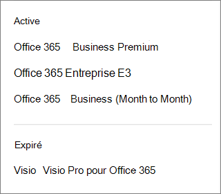

# Welk abonnement heb ik?What subscription do I have?

Als u een beheerder bent, u controleren welke abonnementen uw organisatie heeft door naar het beheercentrum te gaan.If you're an admin, you can verify which subscriptions your organization has by going to the admin center.
  
 **Bent u geen beheerder?****Not an admin?** Zie [Wat Microsoft 365 voor zakelijke producten of licenties heb ik?](https://support.microsoft.com/office/f8ab5e25-bf3f-4a47-b264-174b1ee925fd)See [What Microsoft 365 for business product or license do I have?](https://support.microsoft.com/office/f8ab5e25-bf3f-4a47-b264-174b1ee925fd)

::: moniker range="o365-worldwide"

1. Ga in het beheercentrum naar de pagina **Facturering** \> <a href="https://go.microsoft.com/fwlink/p/?linkid=842054" target="_blank">Mijn producten</a>.In the admin center, go to the **Billing** \> <a href="https://go.microsoft.com/fwlink/p/?linkid=842054" target="_blank">Your products</a> page.

2. Uw abonnementen worden weergegeven op de pagina **Uw producten,** samen met de abonnementsnaam, informatie over het abonnement en de status ervan.Your subscriptions are displayed on the **Your products** page, together with the subscription name, information about the subscription, and its status. Als u een verkorte weergave wilt weergeven, selecteert u **Tabelweergave**.To see a condensed view, select **Table view**.

::: moniker-end
  
::: moniker range="o365-germany"

1. Ga in het beheercentrum naar de pagina **Billing** \> <a href="https://go.microsoft.com/fwlink/p/?linkid=847745" target="_blank">Factureringsabonnementen.</a>  In the admin center, go to the **Billing** \>  <a href="https://go.microsoft.com/fwlink/p/?linkid=847745" target="_blank">Subscriptions</a> page.

2. Als u maar één abonnement hebt, wordt dit weergegeven op de pagina **Abonnementen**, samen met de naam van het abonnement, informatie over het abonnement en de status.If you have only one subscription, it will be displayed on the **Subscriptions** page, along with the subscription name, information about the subscription, and its status. In de volgende screenshot, u zien dat ik een Microsoft 365 Apps voor zaken abonnement.In the following screenshot, you can see that I have an Microsoft 365 Apps for business subscription.

    
  
3. Als u meerdere abonnementen hebt, ziet u naast de gedetailleerde informatie over het abonnement een kolom met de gekochte abonnementen, evenals eventuele proefabonnementen. De standaardinstelling is dat het abonnement boven aan de lijst automatisch wordt geselecteerd en dat de gedetailleerde informatie voor dat abonnement wordt weergegeven.If you have multiple subscriptions, you'll see a column next to the detailed subscription information that lists the subscriptions that have been purchased, as well as any trial subscriptions. By default, the subscription at the top of the list is automatically selected, and the detailed information for that subscription is shown.

    Als u meerdere abonnementen hebt, kiest u de abonnementen waarvoor u gedetailleerde informatie wilt zien.If you have multiple subscriptions, choose the one for which you want to see detailed information. De abonnementsgegevens worden dan bijgewerkt met informatie over dat abonnement.The subscription card will update with information about that subscription.

    
  
    > [!NOTE]
    > Als u abonnementen hebt die zijn verlopen of uitgeschakeld, worden deze weergegeven op basis van hun huidige status.If you have subscriptions that have expired or have been disabled, they'll be listed based on their current state.

::: moniker-end

::: moniker range="o365-21vianet"

1. Ga in het beheercentrum naar de pagina **Billing** \> <a href="https://go.microsoft.com/fwlink/p/?linkid=850626" target="_blank">Factureringsabonnementen.</a>  In the admin center, go to the **Billing** \>  <a href="https://go.microsoft.com/fwlink/p/?linkid=850626" target="_blank">Subscriptions</a> page.

2. Als u maar één abonnement hebt, wordt dit weergegeven op de pagina **Abonnementen**, samen met de naam van het abonnement, informatie over het abonnement en de status.If you have only one subscription, it will be displayed on the **Subscriptions** page, along with the subscription name, information about the subscription, and its status. In de volgende screenshot, u zien dat ik een Microsoft 365 Apps voor zaken abonnement.In the following screenshot, you can see that I have an Microsoft 365 Apps for business subscription.

    
  
3. Als u meerdere abonnementen hebt, ziet u naast de gedetailleerde informatie over het abonnement een kolom met de gekochte abonnementen, evenals eventuele proefabonnementen. De standaardinstelling is dat het abonnement boven aan de lijst automatisch wordt geselecteerd en dat de gedetailleerde informatie voor dat abonnement wordt weergegeven.If you have multiple subscriptions, you'll see a column next to the detailed subscription information that lists the subscriptions that have been purchased, as well as any trial subscriptions. By default, the subscription at the top of the list is automatically selected, and the detailed information for that subscription is shown.

    Als u meerdere abonnementen hebt, kiest u de abonnementen waarvoor u gedetailleerde informatie wilt zien.If you have multiple subscriptions, choose the one for which you want to see detailed information. De abonnementsgegevens worden dan bijgewerkt met informatie over dat abonnement.The subscription card will update with information about that subscription.

    
  
    > [!NOTE]
    > Als u abonnementen hebt die zijn verlopen of uitgeschakeld, worden deze weergegeven op basis van hun huidige status.If you have subscriptions that have expired or have been disabled, they'll be listed based on their current state.

::: moniker-end

## Verwante artikelenRelated articles
  
[Abonnementen en factureringSubscriptions and billing](../../commerce/index.yml)