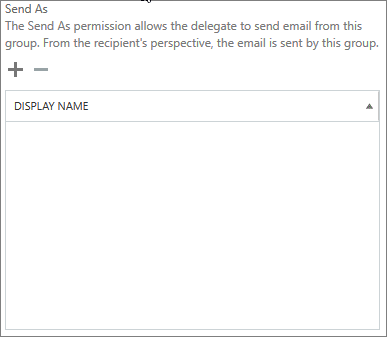

# Leden toestaan om namens een groep te verzenden of te verzenden

Een lid van een Microsoft 365-groep die namens machtigingen **verzenden of** **verzenden** heeft gekregen, kan e-mail verzenden als groep of namens de groep. In dit onderwerp wordt uitgelegd hoe een beheerder deze machtigingen kan instellen.
  
Als Megan Bowen bijvoorbeeld deel uitmaakt van de Microsoft 365-groep **Training** en **als** machtigingen voor de groep heeft verzonden, lijkt het erop dat de **groep Training** de e-mail heeft verzonden als ze een e-mail stuurt als de groep. 
  
Met de machtiging **Verzenden namens naam** kan een gebruiker e-mail verzenden namens een Microsoft 365-groep. Als Alex Wilber bijvoorbeeld deel uitmaakt van de **Marketing** Microsoft 365-groep en **machtigingen namens verzenden** heeft en een e-mail als groep verzendt, ziet de e-mail eruit alsof deze is verzonden door Alex **Wilber namens Marketing.**

> [!IMPORTANT]
> U **Verzenden als** of Verzenden **namens** een bepaalde gebruiker configureren, maar niet beide. Als u beide configureert, wordt deze standaard **verzonden als**.

> [!TIP]
> Zie [E-mail verzenden vanuit of namens een Microsoft 365-groep](https://support.microsoft.com/office/0f4964af-aec6-484b-a65c-0434df8cdb6b) voor meer informatie over het gebruik van Outlook en Outlook op internet om e-mail vanuit een groep te verzenden.
    
## Leden toestaan om e-mail als groep te verzenden

In deze sectie wordt uitgelegd hoe gebruikers e-mail als groep kunnen verzenden in het [Exchange-beheercentrum](https://go.microsoft.com/fwlink/p/?linkid=2059104) (EAC) in Exchange Online.
  
1. Ga in het <a href="https://go.microsoft.com/fwlink/p/?linkid=2059104" target="_blank">Exchange-beheercentrum</a>naar **Groepen ontvangers** \> **Groups**.
    
2. Selecteer **Het**  als of te sturen wilt toestaan.   
    
3. Selecteer **delegering van groepen**.
    
4. Selecteer **in** de sectie Verzenden als het **+** teken om de gebruikers toe te voegen die u als groep wilt verzenden. 
    
    
  
5. Typ om te zoeken of kies een gebruiker uit de lijst. Selecteer **OK** en **Opslaan**.
    
    
  
## Leden toestaan om namens een groep e-mail te verzenden

In deze sectie wordt uitgelegd hoe gebruikers e-mail namens een groep kunnen verzenden in het Exchange-beheercentrum (EAC) in Exchange Online.
  
1. Ga in het <a href="https://go.microsoft.com/fwlink/p/?linkid=2059104" target="_blank">Exchange-beheercentrum</a>naar **Groepen ontvangers** \> **Groups**.
    
2. Selecteer **Het**  gebruikers als of te sturen wilt toestaan. 
    
3. Selecteer **delegering van groepen**.
    
4. Selecteer in de sectie Verzenden namens naam het **+** teken om de gebruikers toe te voegen die u als groep wilt verzenden. 
    
    
  
5. Typ om te zoeken of kies een gebruiker uit de lijst. Selecteer **OK** en **Opslaan**.
    
    

## Verwante artikelen

[Meer informatie over Microsoft 365-groepen](https://support.microsoft.com/office/b565caa1-5c40-40ef-9915-60fdb2d97fa2)

[Bijvoegtoepassing Permissie](https://go.microsoft.com/fwlink/p/?LinkId=723960)

[Set-UnifiedGroup](https://go.microsoft.com/fwlink/p/?LinkId=616189)
