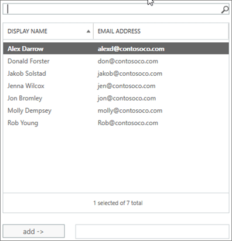

# Leden toestaan om namens een groep te verzenden of te verzendenAllow members to send as or send on behalf of a Group

Een lid van een Microsoft 365-groep die namens machtigingen **verzenden of** **verzenden** heeft gekregen, kan e-mail verzenden als groep of namens de groep.A member of a Microsoft 365 group who has been granted **Send as** or **Send on behalf** permissions can send email as the group, or on behalf of the group. In dit onderwerp wordt uitgelegd hoe een beheerder deze machtigingen kan instellen.This topic explains how an admin can set these permissions.
  
Als Megan Bowen bijvoorbeeld deel uitmaakt van de Microsoft 365-groep **Training** en **als** machtigingen voor de groep heeft verzonden, lijkt het erop dat de **groep Training** de e-mail heeft verzonden als ze een e-mail stuurt als de groep.For example, if Megan Bowen is part of the **Training** Microsoft 365 group, and has **Send as** permissions on the group, if she sends an email as the group, it will look like the **Training** group sent the email. 
  
Met de machtiging **Verzenden namens naam** kan een gebruiker e-mail verzenden namens een Microsoft 365-groep.The **Send on Behalf** permission lets a user send email on behalf of a Microsoft 365 group. Als Alex Wilber bijvoorbeeld deel uitmaakt van de **Marketing** Microsoft 365-groep en **machtigingen namens verzenden** heeft en een e-mail als groep verzendt, ziet de e-mail eruit alsof deze is verzonden door Alex **Wilber namens Marketing.**For example, if Alex Wilber is a part of the **Marketing** Microsoft 365 group, and has **Send on Behalf** permissions and sends an email as the group, the email looks like it was sent by **Alex Wilber on behalf of Marketing**.

> [!IMPORTANT]
> U **Verzenden als** of Verzenden **namens** een bepaalde gebruiker configureren, maar niet beide.You can configure **Send as** or **Send on behalf** for a given user, but not both. Als u beide configureert, wordt deze standaard **verzonden als**.If you configure both, it will default to **Send as**.

> [!TIP]
> Zie [E-mail verzenden vanuit of namens een Microsoft 365-groep](https://support.microsoft.com/office/0f4964af-aec6-484b-a65c-0434df8cdb6b) voor meer informatie over het gebruik van Outlook en Outlook op internet om e-mail vanuit een groep te verzenden.See [Send email from or on behalf of a Microsoft 365 group](https://support.microsoft.com/office/0f4964af-aec6-484b-a65c-0434df8cdb6b) to learn how to use Outlook and Outlook on the Web to send email from a group.
    
## Leden toestaan om e-mail als groep te verzendenAllow members to send email as a group

In deze sectie wordt uitgelegd hoe gebruikers e-mail als groep kunnen verzenden in het [Exchange-beheercentrum](https://go.microsoft.com/fwlink/p/?linkid=2059104) (EAC) in Exchange Online.This section explains how to allow users to send email as a group in the [Exchange admin center](https://go.microsoft.com/fwlink/p/?linkid=2059104) (EAC) in Exchange Online.
  
1. Ga in het <a href="https://go.microsoft.com/fwlink/p/?linkid=2059104" target="_blank">Exchange-beheercentrum</a>naar **Groepen ontvangers** \> **Groups**.In the <a href="https://go.microsoft.com/fwlink/p/?linkid=2059104" target="_blank">Exchange admin center</a>, go to **Recipients** \> **Groups**.
    
2. Selecteer **Het**  als of te sturen wilt toestaan.  Select **Edit**   on Group that you want to allow users to send as. 
    
3. Selecteer **delegering van groepen**.Select **group delegation**.
    
4. Selecteer **in** de sectie Verzenden als het **+** teken om de gebruikers toe te voegen die u als groep wilt verzenden.In the **Send As** section, select the **+** sign to add the users that you want to send as the Group. 
    
    
  
5. Typ om te zoeken of kies een gebruiker uit de lijst.Type to search or pick a user from the list. Selecteer **OK** en **Opslaan**.Select **OK** and **Save**.
    
    
  
## Leden toestaan om namens een groep e-mail te verzendenAllow members to send email on behalf of a group

In deze sectie wordt uitgelegd hoe gebruikers e-mail namens een groep kunnen verzenden in het Exchange-beheercentrum (EAC) in Exchange Online.This section explains how to allow users to send email on behalf of a group in the Exchange admin center (EAC) in Exchange Online.
  
1. Ga in het <a href="https://go.microsoft.com/fwlink/p/?linkid=2059104" target="_blank">Exchange-beheercentrum</a>naar **Groepen ontvangers** \> **Groups**.In the <a href="https://go.microsoft.com/fwlink/p/?linkid=2059104" target="_blank">Exchange admin center</a>, go to **Recipients** \> **Groups**.
    
2. Selecteer **Het**  gebruikers als of te sturen wilt toestaan.Select **Edit**  on the Group that you want to allow users to send as. 
    
3. Selecteer **delegering van groepen**.Select **group delegation**.
    
4. Selecteer in de sectie Verzenden namens naam het **+** teken om de gebruikers toe te voegen die u als groep wilt verzenden.In the Send on Behalf section, select the **+** sign to add the users that you want to send as the Group. 
    
    
  
5. Typ om te zoeken of kies een gebruiker uit de lijst.Type to search or pick a user from the list. Selecteer **OK** en **Opslaan**.Select **OK** and **Save**.
    
    

## Verwante artikelenRelated articles

[Meer informatie over Microsoft 365-groepenLearn more about Microsoft 365 groups](https://support.microsoft.com/office/b565caa1-5c40-40ef-9915-60fdb2d97fa2)

[Bijvoegtoepassing PermissieAdd-RecipientPermission](https://go.microsoft.com/fwlink/p/?LinkId=723960)

[Set-UnifiedGroupSet-UnifiedGroup](https://go.microsoft.com/fwlink/p/?LinkId=616189)
