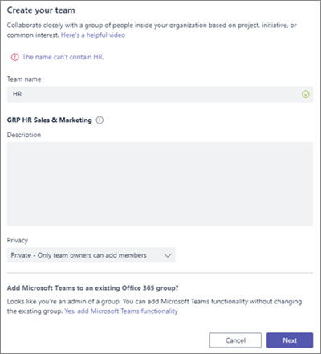

# Naamgevingsbeleid voor Office 365-groepen

U gebruikt een groepsnaamgevingsbeleid om een consistente naamgevingsstrategie af te dwingen voor groepen die zijn gemaakt door gebruikers in uw organisatie. Een naamgevingsbeleid kan u en uw gebruikers helpen de functie van de groep, het lidmaatschap, de geografische regio of de persoon die de groep heeft gemaakt te identificeren. Het naamgevingsbeleid kan ook helpen bij het categoriseren van groepen in het adresboek. U het beleid gebruiken om te voorkomen dat specifieke woorden worden gebruikt in groepsnamen en aliassen.

Het naamgevingsbeleid wordt toegepast op groepen die zijn gemaakt voor alle groepsworkloads (zoals Outlook, Microsoft Teams, SharePoint, Planner, Yammer, enz.). Het wordt toegepast op zowel de groepsnaam als de groepsalias. Deze wordt toegepast wanneer een gebruiker een groep maakt en wanneer groepsnaam of alias wordt bewerkt voor een bestaande groep.

> [!TIP]
> Een office 365-groepsnaamgevingsbeleid is alleen van toepassing op Office 365-groepen. Het is niet van toepassing op distributiegroepen die zijn gemaakt in Exchange Online. Zie [Een naamgevingsbeleid](https://docs.microsoft.com/exchange/recipients-in-exchange-online/manage-distribution-groups/create-group-naming-policy)voor distributiegroepen maken als u een naamgevingsbeleid wilt maken.

Het groepsnaambeleid bestaat uit de volgende functie:

- **Naamgevingsbeleid voorvoegsel**:U voorvoegsels of achtervoegsels gebruiken om de naamgevingsconventie\_\_van\_groepen te definiëren (bijvoorbeeld: GRP US My Group Engineering). De voorvoegsels/achtervoegsels kunnen bestaan uit vaste tekenreeksen of gebruikerskenmerken (zoals [Department]) die worden vervangen op basis van de gebruiker die de groep maakt.

- **Aangepaste geblokkeerde woorden:** u een set geblokkeerde woorden uploaden die specifiek zijn voor hun organisatie en die worden geblokkeerd in groepen die door gebruikers zijn gemaakt. (Bijvoorbeeld: "CEO, Payroll, HR").

## Licentievereisten

Voor het gebruik van Azure AD-naamgevingsbeleid voor Office 365-groepen moet u beschikken over een Azure Active Directory Premium P1-licentie of Azure AD Basic EDU-licentie voor elke unieke gebruiker (inclusief gasten) die lid is van een of meer Office 365-groepen.
Dit is ook vereist voor de beheerder die het naamgevingsbeleid Groepen maakt.

## Naamgevingsbeleid voor voorvoegsel

Voorvoegsels en achtervoegsels kunnen vaste tekenreeksen of gebruikerskenmerken zijn.

### Vaste tekenreeksen

U korte tekenreeksen gebruiken waarmee u groepen differentiëren in het gal- en linkernavigatienav van de groepsworkloads. Enkele van de gemeenschappelijke voorvoegsels zijn trefwoorden\_zoals 'Grp Name' , 'Naam',\#'Naam'\_

### Kenmerken

U kenmerken gebruiken waarmee u bepalen wie de groep heeft gemaakt, zoals [Afdeling] en waar deze is gemaakt, zoals [Land].

|||
|:-----|:-----|
|**Voorbeelden**|Beleid = "GRP [GroupName] [Department]"|
||Afdeling van de gebruiker = Engineering|
||Gemaakte groepsnaam = "GRP My Group Engineering"|

Ondersteunde Azure Active Directory-kenmerken (Azure AD) zijn [Afdeling], [Bedrijf], [Office], [StateOrProvince], [CountryOrRegion], [Titel]

- Niet-ondersteunde gebruikerskenmerken worden als vaste tekenreeksen beschouwd. Bijvoorbeeld "[postalCode]"

- Extensiekenmerken en aangepaste kenmerken worden niet ondersteund.

Het wordt aangeraden kenmerken te gebruiken met waarden die voor alle gebruikers in uw organisatie zijn ingevuld en geen kenmerken met lange waarden te gebruiken.

### Dingen om op te letten

- Bij het maken van beleid mag de totale tekenreekslengte van voor- en achtervoegsel niet langer zijn dan 53 tekens.

- Voor- en achtervoegsels kunnen speciale tekens bevatten die voor de groepsnaam en de groepsalias worden ondersteund. Als de voor- en achtervoegsels speciale tekens bevatten die niet in de groepsalias zijn toegestaan, worden ze verwijderd en op de groepsalias toegepast. In dit geval zouden de voor- en achtervoegsels die op de groepsnaam worden toegepast verschillen van degene die op de groepsalias worden toegepast.

- Als u yammer Office 365-verbonden groepen gebruikt, gebruikt u de \# \[volgende \] \<tekens \>in uw naamgevingsbeleid: @, , , en . Als deze tekens zich in het naamgevingsbeleid bevinden, kunnen gewone Yammer-gebruikers geen groepen maken.

## Aangepaste geblokkeerde woorden

U een door komma gescheiden lijst met geblokkeerde woorden invoeren die worden geblokkeerd in groepsnamen en aliassen.

De geblokkeerde woordencontrole wordt uitgevoerd op de door de gebruiker ingevoerde groepsnaam. Dus als de gebruiker 'darnit'\_binnenkomt en 'Prefix' het naamgevingsbeleid is, zal 'Prefix\_darnit' mislukken.

Er worden geen zoekopdrachten uitgevoerd in subtekenreeksen; specifiek is een exacte overeenkomst tussen de ingevoerde naam van de gebruiker en de aangepaste geblokkeerde woorden vereist om een fout te activeren. Sub-string zoeken wordt niet gedaan, zodat gebruikers kunnen een aantal van de gemeenschappelijke woorden zoals 'Klasse' te gebruiken, zelfs als 'kont' is een geblokkeerd woord.

**Dingen om op te letten:**

- De geblokkeerde woorden zijn hoofdlettergevoelig.

- Als er een geblokkeerd woord wordt ingevoerd, wordt een foutbericht met het geblokkeerde woord erin weergegeven.

- Er bestaan geen restricties op tekens in het gebruikte geblokkeerde woord.

- Er is een bovengrens van 5000 woorden die kunnen worden ingesteld als geblokkeerde woorden.

## Overschrijven door beheerder

Bepaalde beheerders zijn voor alle groepswerkbelastingen en eindpunten vrijgesteld van dit beleid, zodat ze groepen kunnen maken met deze geblokkeerde woorden en met eigen naamgevingsconventies. Hierna volgt een lijst van beheerdersrollen die zijn vrijgesteld van het groepsnaambeleid.

- Globale beheerder

- Partnerondersteuning voor laag 1

- Partnerondersteuning voor laag 2

- Beheerder van het gebruikersaccount

- Schrijvers van adreslijsten

## Het naamgevingsbeleid instellen

Ga als u een naamgevingsbeleid instellen:

1. Klik in [Azure Active Directory](https://aad.portal.azure.com)onder **Beheren**op **Groepen**.
2. Klik onder **Instellingen**op **Naamgevingsbeleid**.
3. Kies het tabblad **Groepsnaamgevingsbeleid.**
4. Kies onder **Huidig beleid**of u een voorvoegsel of achtervoegsel of beide wilt vereisen en schakel de juiste selectievakjes in.
5. Kies tussen **Kenmerk** en **Tekenreeks** voor elke regel en geef vervolgens het kenmerk of de tekenreeks op.
6. Wanneer u de voorvoegsels en achtervoegsels hebt toegevoegd die u nodig hebt, klikt u op **Opslaan**.

## Naamgevingsbeleid in Office 365-apps

De Office 365-apps zijn bijgewerkt zodat ze een preview laten zien van de groepsnaam van het naamgevingsbeleid (inclusief voor- en achtervoegsels) als de gebruiker de groepsnaam en -alias typt. Als de gebruiker geblokkeerde woorden invoert, verschijnt een foutbericht zodat ze de geblokkeerde woorden kunnen verwijderen.

## Web van Outlook op de website

In Outlook op internet (voorheen Outlook Web App of OWA genoemd) wordt de naam van het naamgevingsbeleid weergegeven wanneer de gebruiker een groepsnaam of groepsalias typt. Als een gebruiker een geblokkeerd woord typt, wordt in de gebruikersinterface een foutbericht met het geblokkeerde woord weergegeven, zodat de gebruiker dit kan verwijderen. Outlook on the web experience snapshots worden hieronder weergegeven.

## Outlook (bureaublad)

Groepen die in de bureaubladversie van Outlook zijn gemaakt, voldoen aan het naamgevingsbeleid. In de Outlook-bureaubladapp wordt nog geen preview weergegeven van het naamgevingsbeleid en retourneert de fouten voor aangepaste, geblokkeerde woorden niet als de gebruiker een groepsnaam invoert. Het naamgevingsbeleid wordt echter automatisch toegepast bij het selecteren van maken/bewerken en gebruikers krijgen fouten als er aangepaste geblokkeerde woorden in de groepsnaam of alias zijn.

## Microsoft Teams

Microsoft Teams toont de naam van het naamgevingsbeleid wanneer de gebruiker een teamnaam typt. Wanneer een gebruiker een aangepast geblokkeerd woord invoert, wordt een foutbericht weergegeven samen met het geblokkeerde woord, zodat de gebruiker het kan verwijderen.

## Sharepoint

SharePoint toont de naam van het naamgevingsbeleid wanneer de gebruiker een sitenaam of groepse-mailadres typt. Als een gebruiker een geblokkeerd woord typt, wordt een foutbericht met het geblokkeerde woord weergegeven, zodat de gebruiker dit kan verwijderen.

## Microsoft Stream

In Microsoft Stream wordt de gedecoreerde naam van het naamgevingsbeleid getoond als de gebruiker een groepsnaam of -e-mailalias typt. Als een gebruiker een geblokkeerd woord typt, wordt een foutbericht met het geblokkeerde woord weergegeven, zodat de gebruiker dit kan verwijderen.

## Outlook IOS- en Android-app

Groepen die in Outlook-apps zijn gemaakt, voldoen aan het naamgevingsbeleid. In Outlook mobile wordt de voorbeeld van het naamgevingsbeleid weergegeven bij het invoeren van de groepsnaam. Wanneer een gebruiker een aangepast geblokkeerd woord invoert, wordt een foutbericht weergegeven bij het maken van de groep, zodat de gebruiker het geblokkeerde woord kan verwijderen.

## Planner

Planner voldoet aan het naamgevingsbeleid. Planner toont de voorbeeld van het naamgevingsbeleid bij het invoeren van de naam Plan. Wanneer een gebruiker een aangepast geblokkeerd woord invoert, wordt een foutbericht weergegeven bij het maken van het plan, zodat de gebruiker het geblokkeerde woord kan verwijderen.

## Dynamics 365 voor klantbetrokkenheid

Dynamics 365 voor Customer Engagement voldoet aan het naamgevingsbeleid. Dynamics 365 toont de naam van het naamgevingsbeleid wanneer de gebruiker een groepsnaam of groepse-mailalias typt. Wanneer de gebruiker een aangepast geblokkeerd woord invoert, wordt een foutbericht weergegeven met het geblokkeerde woord, zodat de gebruiker het kan verwijderen.

## School Data Sync (SDS)

Groepen die via SDS worden gemaakt, voldoen aan het naamgevingsbeleid, maar dit wordt niet automatisch toegepast. SDS-beheerders moeten de voor- en achtervoegsels zelf toevoegen aan de klassennamen waarvoor groepen moeten worden gemaakt en deze uploaden naar SDS. Als ze dit niet doen, mislukt het maken/bewerken van groepen.

## Outlook Customer Manager (OCM)

Outlook Customer Manager voldoet aan het naamgevingsbeleid. Het naamgevingsbeleid wordt automatisch toegepast op de groep die is gemaakt in Outlook Customer Manager. Als een van de woorden in 'All Sales Team' wordt gedefinieerd als een aangepast geblokkeerd woord, wordt de groepcreatie in OCM geblokkeerd. De gebruiker kan de OCM-groep niet maken en wordt geblokkeerd voor het gebruik van de OCM-app."

## Classroom-app

Groepen die in de Classroom-app worden gemaakt, voldoen aan het naamgevingsbeleid, maar het naamgevingsbeleid wordt niet automatisch toegepast, en de preview van het naamgevingsbeleid wordt niet aan de gebruikers getoond bij het invoeren van de groepsnaam voor een klaslokaal. Gebruikers moeten dus de gedecoreerde groepsnaam van het klaslokaal met de voor- en achtervoegsels invoeren. Als dat niet gebeurd, mislukt het maken of bewerken van de klaslokaalgroep en worden fouten weergegeven.

## Power BI

Groepen die zijn gemaakt in Power BI-werkruimten voldoen aan het naamgevingsbeleid, maar het naamgevingsbeleid wordt niet automatisch toegepast. En de voorbeelding van het naamgevingsbeleid wordt niet weergegeven aan gebruikers wanneer ze een Naam van power BI-werkruimte invoeren.

De aanbevolen naam - waarbij het naamgevingsbeleid is toegepast - wordt weergegeven in de foutdetails van werkruimten maken of bewerken. Dit betekent dat gebruikers de versierde werkruimtenaam moeten invoeren met voorvoegsels en achtervoegsels. Anders mislukt de werkruimte die wordt gemaakt of bewerkt met fouten.

## Yammer

Wanneer een gebruiker die zich met zijn Azure Active Directory-account heeft aangemeld bij Yammer een groep maakt of een groepsnaam bewerkt, voldoet de groepsnaam aan het naamgevingsbeleid. Dit geldt zowel voor verbonden Office 365-groepen als voor alle andere Yammer-groepen.

Als een verbonden Office 365-groep is gemaakt voordat het naamgevingsbeleid is ingevoerd, volgt de groepsnaam niet automatisch het naamgevingsbeleid. Wanneer een gebruiker de groepsnaam bewerkt, wordt deze gevraagd het voorvoegsel en achtervoegsel toe te voegen.

Als het naamgevingsbeleid tekens bevat die niet in yammer-groepsnamen kunnen staan, kunnen alleen beheerders een verbonden groep maken in Yammer.

## StaffHub StaffHub

StaffHub-teams volgen het naamgevingsbeleid niet, maar de onderliggende Office 365-groep wel. De teamnaam van StaffHub past de voorvoegsels en achtervoegsels niet toe en controleert niet op aangepaste geblokkeerde woorden. Maar StaffHub past wel de voorvoegsels en achtervoegsels toe en verwijdert geblokkeerde woorden uit de onderliggende Office 365-groep.

## Exchange PowerShell

Exchange PowerShell-cmdlets voldoen aan het naamgevingsbeleid. Als de naamsconventie niet voor groepsnamen en -aliassen wordt gebruikt, krijgen gebruikers passende foutberichten met voorgestelde voor- en achtervoegsels, en ook bij aangepaste, geblokkeerde woorden.

## Azure Active Directory PowerShell-cmdlets

Azure Active Directory PowerShell-cmdlets voldoen aan het naamgevingsbeleid. Als de naamsconventie niet voor groepsnamen en -aliassen wordt gebruikt, krijgen gebruikers passende foutberichten met voorgestelde voor- en achtervoegsels, en ook bij aangepaste, geblokkeerde woorden.

## Exchange-beheercentrum

Het Exchange-beheercentrum (EAC) voldoet aan het naamgevingsbeleid. Als de naamsconventie niet voor groepsnamen en -aliassen wordt gebruikt, krijgen gebruikers bij het maken en bewerken van namen passende foutberichten met voorgestelde voor- en achtervoegsels, en ook bij aangepaste, geblokkeerde woorden.

## Microsoft 365-beheercentrum

Het Microsoft 365-beheercentrum voldoet aan het naamgevingsbeleid. Bij het maken en bewerken van namen, wordt het naamgevingsbeleid automatisch toegepast. Gebruikers krijgen passende foutberichten wanneer ze aangepaste, geblokkeerde woorden invoeren. In het Microsoft 365-beheercentrum wordt de voorbeeldvan het naamgevingsbeleid nog niet weergegeven en worden de aangepaste geblokkeerde woordfouten niet weergegeven wanneer de gebruiker de groepsnaam invoert.

## Azure Active Directory-portal

De Azure Active Directory-portal voldoet aan het naamgevingsbeleid. De Azure Active Directory-portal toont de voorbeeld van het naamgevingsbeleid bij het invoeren van de groepsnaam. Wanneer een gebruiker een aangepast geblokkeerd woord invoert, wordt een foutbericht weergegeven bij het maken van de groep, zodat de gebruiker het geblokkeerde woord kan verwijderen.

## Meer artikelen over naamgevingsbeleid

[Een naamgevingsbeleid afdwingen voor Office 365-groepen in Azure Active Directory](https://go.microsoft.com/fwlink/?linkid=868340)

[Azure Active Directory-cmdlets voor het configureren van groepsinstellingen](https://go.microsoft.com/fwlink/?linkid=868341)
