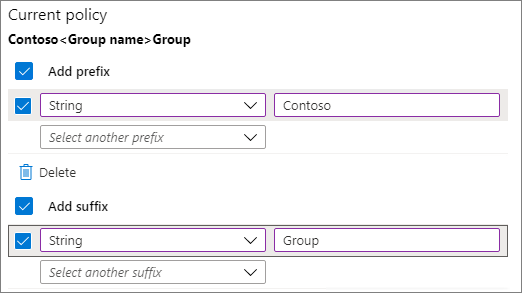
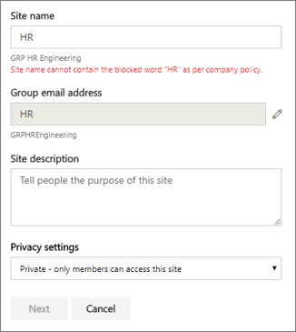
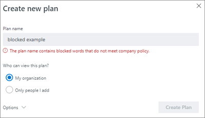
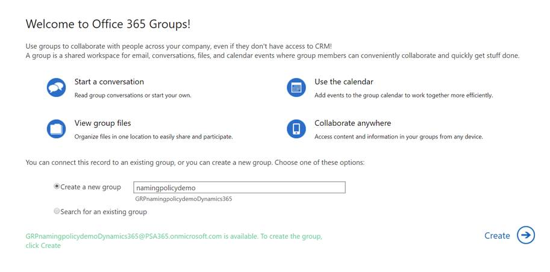

# Naamgevingsbeleid voor Office 365-groepenOffice 365 Groups naming policy

U gebruikt een groepsnaamgevingsbeleid om een consistente naamgevingsstrategie af te dwingen voor groepen die zijn gemaakt door gebruikers in uw organisatie.You use a group naming policy to enforce a consistent naming strategy for groups created by users in your organization. Een naamgevingsbeleid kan u en uw gebruikers helpen de functie van de groep, het lidmaatschap, de geografische regio of de persoon die de groep heeft gemaakt te identificeren.A naming policy can help you and your users identify the function of the group, membership, geographic region, or who created the group. Het naamgevingsbeleid kan ook helpen bij het categoriseren van groepen in het adresboek.The naming policy can also help categorize groups in the address book. U het beleid gebruiken om te voorkomen dat specifieke woorden worden gebruikt in groepsnamen en aliassen.You can use the policy to block specific words from being used in group names and aliases.

Het naamgevingsbeleid wordt toegepast op groepen die zijn gemaakt voor alle groepsworkloads (zoals Outlook, Microsoft Teams, SharePoint, Planner, Yammer, enz.).The naming policy is applied to groups that are created across all groups workloads (like Outlook, Microsoft Teams, SharePoint, Planner, Yammer, etc). Het wordt toegepast op zowel de groepsnaam als de groepsalias.It gets applied to both the group name and group alias. Deze wordt toegepast wanneer een gebruiker een groep maakt en wanneer groepsnaam of alias wordt bewerkt voor een bestaande groep.It gets applied when a user creates a group and when group name or alias is edited for an existing group.

> [!TIP]
> Een office 365-groepsnaamgevingsbeleid is alleen van toepassing op Office 365-groepen.An Office 365 group naming policy only applies to Office 365 Groups. Het is niet van toepassing op distributiegroepen die zijn gemaakt in Exchange Online.It doesn't apply to distribution groups created in Exchange Online. Zie [Een naamgevingsbeleid](https://docs.microsoft.com/exchange/recipients-in-exchange-online/manage-distribution-groups/create-group-naming-policy)voor distributiegroepen maken als u een naamgevingsbeleid wilt maken.To create a naming policy for distribution groups, see [Create a distribution group naming policy](https://docs.microsoft.com/exchange/recipients-in-exchange-online/manage-distribution-groups/create-group-naming-policy).

Het groepsnaambeleid bestaat uit de volgende functie:The group naming policy consists of the following features:

- **Naamgevingsbeleid voorvoegsel**:U voorvoegsels of achtervoegsels gebruiken om de naamgevingsconventie\_\_van\_groepen te definiëren (bijvoorbeeld: GRP US My Group Engineering).**Prefix-Suffix naming policy**: You can use prefixes or suffixes to define the naming convention of groups (for example: "GRP\_US\_My Group\_Engineering"). De voorvoegsels/achtervoegsels kunnen bestaan uit vaste tekenreeksen of gebruikerskenmerken (zoals [Department]) die worden vervangen op basis van de gebruiker die de groep maakt.The prefixes/suffixes can either be fixed strings or user attributes like [Department] that will get substituted based on the user who is creating the group.

- **Aangepaste geblokkeerde woorden:** u een set geblokkeerde woorden uploaden die specifiek zijn voor hun organisatie en die worden geblokkeerd in groepen die door gebruikers zijn gemaakt.**Custom Blocked Words**: You can upload a set of blocked words specific to their organization that would be blocked in groups created by users. (Bijvoorbeeld: "CEO, Payroll, HR").(For example: "CEO, Payroll, HR").

## LicentievereistenLicensing requirements

Voor het gebruik van Azure AD-naamgevingsbeleid voor Office 365-groepen moet u beschikken over een Azure Active Directory Premium P1-licentie of Azure AD Basic EDU-licentie voor elke unieke gebruiker (inclusief gasten) die lid is van een of meer Office 365-groepen.Using Azure AD naming policy for Office 365 groups requires that you possess but not necessarily assign an Azure Active Directory Premium P1 license or Azure AD Basic EDU license for each unique user (including guests) that is a member of one or more Office 365 groups.
Dit is ook vereist voor de beheerder die het naamgevingsbeleid Groepen maakt.This is also required for the administrator that creates the Groups naming policy.

## Naamgevingsbeleid voor voorvoegselPrefix-Suffix naming policy

Voorvoegsels en achtervoegsels kunnen vaste tekenreeksen of gebruikerskenmerken zijn.Prefixes and suffixes can either be fixed strings or user attributes.

### Vaste tekenreeksenFixed strings

U korte tekenreeksen gebruiken waarmee u groepen differentiëren in het gal- en linkernavigatienav van de groepsworkloads.You can use short strings that can help you differentiate groups in the GAL and Left nav of the group workloads. Enkele van de gemeenschappelijke voorvoegsels zijn trefwoorden\_zoals 'Grp Name' , 'Naam',\#'Naam'\_Some of the common prefixes suffixes are Keywords like 'Grp\_Name' , '\#Name', '\_Name'

### KenmerkenAttributes

U kenmerken gebruiken waarmee u bepalen wie de groep heeft gemaakt, zoals [Afdeling] en waar deze is gemaakt, zoals [Land].You can use attributes that can help identify who created the group like [Department] and where it was created from like [Country].

|||
|:-----|:-----|
|**Voorbeelden****Examples**|Beleid = "GRP [GroupName] [Department]"Policy = "GRP [GroupName] [Department]"|
||Afdeling van de gebruiker = EngineeringUser's department = Engineering|
||Gemaakte groepsnaam = "GRP My Group Engineering"Created group name = "GRP My Group Engineering"|

Ondersteunde Azure Active Directory-kenmerken (Azure AD) zijn [Afdeling], [Bedrijf], [Office], [StateOrProvince], [CountryOrRegion], [Titel]Supported Azure Active Directory (Azure AD) attributes are [Department], [Company], [Office], [StateOrProvince], [CountryOrRegion], [Title]

- Niet-ondersteunde gebruikerskenmerken worden als vaste tekenreeksen beschouwd. Bijvoorbeeld "[postalCode]"Unsupported user attributes are considered as fixed strings. E.g. "[postalCode]"

- Extensiekenmerken en aangepaste kenmerken worden niet ondersteund.Extension attributes and custom attributes aren't supported.

Het wordt aangeraden kenmerken te gebruiken met waarden die voor alle gebruikers in uw organisatie zijn ingevuld en geen kenmerken met lange waarden te gebruiken.It's recommended that you use attributes that have values filled in for all users in your organization and don't use attributes that have longer values.

### Dingen om op te lettenThings to look out for

- Bij het maken van beleid mag de totale tekenreekslengte van voor- en achtervoegsel niet langer zijn dan 53 tekens.During policy creation, the total prefixes and suffixes string length is restricted to 53 characters.

- Voor- en achtervoegsels kunnen speciale tekens bevatten die voor de groepsnaam en de groepsalias worden ondersteund. Als de voor- en achtervoegsels speciale tekens bevatten die niet in de groepsalias zijn toegestaan, worden ze verwijderd en op de groepsalias toegepast. In dit geval zouden de voor- en achtervoegsels die op de groepsnaam worden toegepast verschillen van degene die op de groepsalias worden toegepast.Prefixes and suffixes can contain special characters supported in group name and group alias. When the prefixes and suffixes contain special characters that are not allowed in the group alias, they are removed and applied to the group alias. So in this case, the prefixes and suffixes applied to group name would be different from the ones applied to the group alias.

- Als u yammer Office 365-verbonden groepen gebruikt, gebruikt u de \# \[volgende \] \<tekens \>in uw naamgevingsbeleid: @, , , en .If you are using Yammer Office 365 connected groups, avoid using the following characters in your naming policy: @, \#, \[, \], \<, and \>. Als deze tekens zich in het naamgevingsbeleid bevinden, kunnen gewone Yammer-gebruikers geen groepen maken.If these characters are in the naming policy, regular Yammer users will not be able to create groups.

## Aangepaste geblokkeerde woordenCustom blocked words

U een door komma gescheiden lijst met geblokkeerde woorden invoeren die worden geblokkeerd in groepsnamen en aliassen.You can enter a comma separated list of blocked words that will be blocked in group names and aliases.

De geblokkeerde woordencontrole wordt uitgevoerd op de door de gebruiker ingevoerde groepsnaam.The blocked words check is done on the user entered group name. Dus als de gebruiker 'darnit'\_binnenkomt en 'Prefix' het naamgevingsbeleid is, zal 'Prefix\_darnit' mislukken.So if user enters 'darnit' and 'Prefix\_' is the naming policy, 'Prefix\_darnit' will fail.

Er worden geen zoekopdrachten uitgevoerd in subtekenreeksen; specifiek is een exacte overeenkomst tussen de ingevoerde naam van de gebruiker en de aangepaste geblokkeerde woorden vereist om een fout te activeren.No sub-string searches are carried out; specifically, an exact match between the user entered name and the custom blocked words is required to trigger a failure. Sub-string zoeken wordt niet gedaan, zodat gebruikers kunnen een aantal van de gemeenschappelijke woorden zoals 'Klasse' te gebruiken, zelfs als 'kont' is een geblokkeerd woord.Sub-string search isn't done so that users can use some of the common words like 'Class' even if 'ass' is a blocked word.

**Dingen om op te letten:****Things to look out for**:

- De geblokkeerde woorden zijn hoofdlettergevoelig.The blocked words are case-insensitive.

- Als er een geblokkeerd woord wordt ingevoerd, wordt een foutbericht met het geblokkeerde woord erin weergegeven.When a user enters a blocked word, the group client will show an error message with the blocked word.

- Er bestaan geen restricties op tekens in het gebruikte geblokkeerde woord.There are no character restrictions in the blocked words used.

- Er is een bovengrens van 5000 woorden die kunnen worden ingesteld als geblokkeerde woorden.There is an upper limit of 5000 words that can be set as blocked words.

## Overschrijven door beheerderAdmin override

Bepaalde beheerders zijn voor alle groepswerkbelastingen en eindpunten vrijgesteld van dit beleid, zodat ze groepen kunnen maken met deze geblokkeerde woorden en met eigen naamgevingsconventies. Hierna volgt een lijst van beheerdersrollen die zijn vrijgesteld van het groepsnaambeleid.Selective administrators are exempted from these policies, across all group workloads and endpoints, so that they can create groups with these blocked words and with their desired naming conventions. The following are the list of administrator roles exempted from the group naming policy.

- Globale beheerderGlobal admin

- Partnerondersteuning voor laag 1Partner Tier 1 Support

- Partnerondersteuning voor laag 2Partner Tier 2 Support

- Beheerder van het gebruikersaccountUser account admin

- Schrijvers van adreslijstenDirectory writers

## Het naamgevingsbeleid instellenHow to set up the naming policy

Ga als u een naamgevingsbeleid instellen:To set up a naming policy:

1. Klik in [Azure Active Directory](https://aad.portal.azure.com)onder **Beheren**op **Groepen**.In [Azure Active Directory](https://aad.portal.azure.com), under **Manage**, click **Groups**.
2. Klik onder **Instellingen**op **Naamgevingsbeleid**.Under **Settings**, click **Naming policy**.
3. Kies het tabblad **Groepsnaamgevingsbeleid.**Choose the **Group naming policy** tab.
4. Kies onder **Huidig beleid**of u een voorvoegsel of achtervoegsel of beide wilt vereisen en schakel de juiste selectievakjes in.Under **Current policy**, choose if you want to require a prefix or suffix or both, and select the appropriate check boxes.
5. Kies tussen **Kenmerk** en **Tekenreeks** voor elke regel en geef vervolgens het kenmerk of de tekenreeks op.Choose between **Attribute** and **String** for each line and then specify the attribute or string.
6. Wanneer u de voorvoegsels en achtervoegsels hebt toegevoegd die u nodig hebt, klikt u op **Opslaan**.When you have added the prefixes and suffixes that you need, click **Save**.

## Naamgevingsbeleid in Office 365-appsNaming policy experiences across Office 365 apps

De Office 365-apps zijn bijgewerkt zodat ze een preview laten zien van de groepsnaam van het naamgevingsbeleid (inclusief voor- en achtervoegsels) als de gebruiker de groepsnaam en -alias typt. Als de gebruiker geblokkeerde woorden invoert, verschijnt een foutbericht zodat ze de geblokkeerde woorden kunnen verwijderen.The Office 365 apps have been updated to show a preview of the naming policy group name (with prefixes and suffixes) when the user types in the group name and alias. When the user enters blocked words, they'll see an error message so they can remove the blocked words.

## Web van Outlook op de websiteOutlook on the web

In Outlook op internet (voorheen Outlook Web App of OWA genoemd) wordt de naam van het naamgevingsbeleid weergegeven wanneer de gebruiker een groepsnaam of groepsalias typt.Outlook on the web (formerly known as Outlook Web App or OWA) shows the naming policy decorated name when the user types a group name or group alias. Als een gebruiker een geblokkeerd woord typt, wordt in de gebruikersinterface een foutbericht met het geblokkeerde woord weergegeven, zodat de gebruiker dit kan verwijderen.When an user enters a custom blocked word, an error message is shown in the UI along with the blocked word so that the user can remove it. Outlook on the web experience snapshots worden hieronder weergegeven.Outlook on the web experience snapshots are shown below.

## Outlook (bureaublad)Outlook Desktop

Groepen die in de bureaubladversie van Outlook zijn gemaakt, voldoen aan het naamgevingsbeleid.Groups created in Outlook desktop are compliant with naming policy. In de Outlook-bureaubladapp wordt nog geen preview weergegeven van het naamgevingsbeleid en retourneert de fouten voor aangepaste, geblokkeerde woorden niet als de gebruiker een groepsnaam invoert.Outlook desktop app doesn't yet show the preview of the naming policy and doesn't return the custom blocked word errors, when the user enters the group name. Het naamgevingsbeleid wordt echter automatisch toegepast bij het selecteren van maken/bewerken en gebruikers krijgen fouten als er aangepaste geblokkeerde woorden in de groepsnaam of alias zijn.However, naming policy will be automatically applied on selecting create/edit and users will be presented with errors if there are custom blocked words in the group name or alias.

## Microsoft TeamsMicrosoft Teams

Microsoft Teams toont de naam van het naamgevingsbeleid wanneer de gebruiker een teamnaam typt.Microsoft Teams shows the naming policy decorated name when the user types a team name. Wanneer een gebruiker een aangepast geblokkeerd woord invoert, wordt een foutbericht weergegeven samen met het geblokkeerde woord, zodat de gebruiker het kan verwijderen.When a user enters a custom blocked word, an error message is shown along with the blocked word so that the user can remove it.

## SharepointSharePoint

SharePoint toont de naam van het naamgevingsbeleid wanneer de gebruiker een sitenaam of groepse-mailadres typt.SharePoint shows the naming policy name when the user types a site name or group email address. Als een gebruiker een geblokkeerd woord typt, wordt een foutbericht met het geblokkeerde woord weergegeven, zodat de gebruiker dit kan verwijderen.When an user enters a custom blocked word, an error message is shown, along with the blocked word so that the user can remove it.

## Microsoft StreamMicrosoft Stream

In Microsoft Stream wordt de gedecoreerde naam van het naamgevingsbeleid getoond als de gebruiker een groepsnaam of -e-mailalias typt. Als een gebruiker een geblokkeerd woord typt, wordt een foutbericht met het geblokkeerde woord weergegeven, zodat de gebruiker dit kan verwijderen.Microsoft Stream shows the naming policy decorated name when the user types a group name or group email alias. When an user enters a custom blocked word, an error message is shown with the blocked word so the user can remove it.

## Outlook IOS- en Android-appOutlook iOS and Android App

Groepen die in Outlook-apps zijn gemaakt, voldoen aan het naamgevingsbeleid.Groups created in Outlook apps are compliant with naming policy. In Outlook mobile wordt de voorbeeld van het naamgevingsbeleid weergegeven bij het invoeren van de groepsnaam.Outlook mobile shows the naming policy preview when entering the Group name. Wanneer een gebruiker een aangepast geblokkeerd woord invoert, wordt een foutbericht weergegeven bij het maken van de groep, zodat de gebruiker het geblokkeerde woord kan verwijderen.When a user enters a custom blocked word, an error message is shown on creating the group, so the user can remove the blocked word.

## PlannerPlanner

Planner voldoet aan het naamgevingsbeleid.Planner is compliant with naming policy. Planner toont de voorbeeld van het naamgevingsbeleid bij het invoeren van de naam Plan.Planner shows the naming policy preview when entering the Plan name. Wanneer een gebruiker een aangepast geblokkeerd woord invoert, wordt een foutbericht weergegeven bij het maken van het plan, zodat de gebruiker het geblokkeerde woord kan verwijderen.When a user enters a custom blocked word, an error message is shown on creating the plan, so the user can remove the blocked word.

## Dynamics 365 voor klantbetrokkenheidDynamics 365 for Customer Engagement

Dynamics 365 voor Customer Engagement voldoet aan het naamgevingsbeleid.Dynamics 365 for Customer Engagement is compliant with naming policy. Dynamics 365 toont de naam van het naamgevingsbeleid wanneer de gebruiker een groepsnaam of groepse-mailalias typt.Dynamics 365 shows the naming policy decorated name when the user types a group name or group email alias. Wanneer de gebruiker een aangepast geblokkeerd woord invoert, wordt een foutbericht weergegeven met het geblokkeerde woord, zodat de gebruiker het kan verwijderen.When the user enters a custom blocked word, an error message is shown with the blocked word so the user can remove it.

## School Data Sync (SDS)School Data Sync (SDS)

Groepen die via SDS worden gemaakt, voldoen aan het naamgevingsbeleid, maar dit wordt niet automatisch toegepast. SDS-beheerders moeten de voor- en achtervoegsels zelf toevoegen aan de klassennamen waarvoor groepen moeten worden gemaakt en deze uploaden naar SDS. Als ze dit niet doen, mislukt het maken/bewerken van groepen.Groups created through SDS comply with naming policy, but the naming policy isn't applied automatically. SDS administrators have to append the prefixes and suffixes to class names for which groups need to be created and then upload to SDS. Groups creation/edit would fail otherwise.

## Outlook Customer Manager (OCM)Outlook Customer Manager (OCM)

Outlook Customer Manager voldoet aan het naamgevingsbeleid.Outlook Customer Manager is compliant with naming policy. Het naamgevingsbeleid wordt automatisch toegepast op de groep die is gemaakt in Outlook Customer Manager.The naming policy gets automatically applied to the group created in Outlook Customer Manager. Als een van de woorden in 'All Sales Team' wordt gedefinieerd als een aangepast geblokkeerd woord, wordt de groepcreatie in OCM geblokkeerd.If any of the words within "All Sales Team" is defined as a custom blocked word, the group creation in OCM will be blocked. De gebruiker kan de OCM-groep niet maken en wordt geblokkeerd voor het gebruik van de OCM-app."The user will not be able to create the OCM group and will be blocked from using the OCM app."

## Classroom-appClassroom App

Groepen die in de Classroom-app worden gemaakt, voldoen aan het naamgevingsbeleid, maar het naamgevingsbeleid wordt niet automatisch toegepast, en de preview van het naamgevingsbeleid wordt niet aan de gebruikers getoond bij het invoeren van de groepsnaam voor een klaslokaal. Gebruikers moeten dus de gedecoreerde groepsnaam van het klaslokaal met de voor- en achtervoegsels invoeren. Als dat niet gebeurd, mislukt het maken of bewerken van de klaslokaalgroep en worden fouten weergegeven.Groups created in classroom app comply with naming policy, but the naming policy isn't applied automatically, and the naming policy preview isn't shown to the users while entering a classroom group name. So users would have to enter the decorated classroom group name with prefixes and suffixes. Otherwise the classroom group create or edit will fail with errors.

## Power BIPower BI

Groepen die zijn gemaakt in Power BI-werkruimten voldoen aan het naamgevingsbeleid, maar het naamgevingsbeleid wordt niet automatisch toegepast.Groups created in Power BI workspaces comply with the naming policy, but the naming policy isn't applied automatically. En de voorbeelding van het naamgevingsbeleid wordt niet weergegeven aan gebruikers wanneer ze een Naam van power BI-werkruimte invoeren.And, the naming policy preview isn't shown to users when they enter a Power BI workspace name.

De aanbevolen naam - waarbij het naamgevingsbeleid is toegepast - wordt weergegeven in de foutdetails van werkruimten maken of bewerken.The recommended name - with the naming policy applied - is shown in the error details on create or edit workspaces. Dit betekent dat gebruikers de versierde werkruimtenaam moeten invoeren met voorvoegsels en achtervoegsels.This means users have to enter the decorated workspace name with prefixes and suffixes. Anders mislukt de werkruimte die wordt gemaakt of bewerkt met fouten.Otherwise the workspace create or edit will fail with errors.

## YammerYammer

Wanneer een gebruiker die zich met zijn Azure Active Directory-account heeft aangemeld bij Yammer een groep maakt of een groepsnaam bewerkt, voldoet de groepsnaam aan het naamgevingsbeleid.When a user signed in to Yammer with their Azure Active Directory account creates a group or edits a group name, the group name will comply with naming policy. Dit geldt zowel voor verbonden Office 365-groepen als voor alle andere Yammer-groepen.This applies both to Office 365 connected groups and all other Yammer groups.

Als een verbonden Office 365-groep is gemaakt voordat het naamgevingsbeleid is ingevoerd, volgt de groepsnaam niet automatisch het naamgevingsbeleid.If an Office 365 connected group was created before the naming policy is in place, the group name will not automatically follow the naming policies. Wanneer een gebruiker de groepsnaam bewerkt, wordt deze gevraagd het voorvoegsel en achtervoegsel toe te voegen.When a user edits the group name, they will be prompted to add the prefix and suffix.

Als het naamgevingsbeleid tekens bevat die niet in yammer-groepsnamen kunnen staan, kunnen alleen beheerders een verbonden groep maken in Yammer.If the naming policy includes characters that can't be in Yammer group names, only admins will be able to create a connected group in Yammer.

## StaffHub StaffHubStaffHub

StaffHub-teams volgen het naamgevingsbeleid niet, maar de onderliggende Office 365-groep wel.StaffHub teams do not follow the naming policy, but the underlying Office 365 group does. De teamnaam van StaffHub past de voorvoegsels en achtervoegsels niet toe en controleert niet op aangepaste geblokkeerde woorden.StaffHub team name does not apply the prefixes and suffixes and does not check for custom blocked words. Maar StaffHub past wel de voorvoegsels en achtervoegsels toe en verwijdert geblokkeerde woorden uit de onderliggende Office 365-groep.But StaffHub does apply the prefixes and suffixes and removes blocked words from the underlying Office 365 group.

## Exchange PowerShellExchange PowerShell

Exchange PowerShell-cmdlets voldoen aan het naamgevingsbeleid. Als de naamsconventie niet voor groepsnamen en -aliassen wordt gebruikt, krijgen gebruikers passende foutberichten met voorgestelde voor- en achtervoegsels, en ook bij aangepaste, geblokkeerde woorden.Exchange PowerShell cmdlets are compliant with naming policy. Users will get appropriate error messages with suggested prefixes and suffixes and for custom blocked words if naming convention isn't used in the group names and group alias.

## Azure Active Directory PowerShell-cmdletsAzure Active Directory PowerShell cmdlets

Azure Active Directory PowerShell-cmdlets voldoen aan het naamgevingsbeleid.Azure Active Directory PowerShell cmdlets are compliant with naming policy. Als de naamsconventie niet voor groepsnamen en -aliassen wordt gebruikt, krijgen gebruikers passende foutberichten met voorgestelde voor- en achtervoegsels, en ook bij aangepaste, geblokkeerde woorden.Users will get appropriate error messages with suggested prefixes and suffixes and for custom blocked words if naming convention isn't used in the group names and group alias.

## Exchange-beheercentrumExchange admin center

Het Exchange-beheercentrum (EAC) voldoet aan het naamgevingsbeleid.The Exchange admin center (EAC) is compliant with naming policy. Als de naamsconventie niet voor groepsnamen en -aliassen wordt gebruikt, krijgen gebruikers bij het maken en bewerken van namen passende foutberichten met voorgestelde voor- en achtervoegsels, en ook bij aangepaste, geblokkeerde woorden.On create or edit actions, users will get appropriate error messages with suggested prefixes and suffixes and for custom blocked words if naming convention isn't used in the group names and group alias.

## Microsoft 365-beheercentrumMicrosoft 365 admin center

Het Microsoft 365-beheercentrum voldoet aan het naamgevingsbeleid.The Microsoft 365 admin center is compliant with naming policy. Bij het maken en bewerken van namen, wordt het naamgevingsbeleid automatisch toegepast.On create or edit actions, naming policy will automatically get applied. Gebruikers krijgen passende foutberichten wanneer ze aangepaste, geblokkeerde woorden invoeren.Users will get appropriate errors when they enter custom blocked words. In het Microsoft 365-beheercentrum wordt de voorbeeldvan het naamgevingsbeleid nog niet weergegeven en worden de aangepaste geblokkeerde woordfouten niet weergegeven wanneer de gebruiker de groepsnaam invoert.The Microsoft 365 admin center doesn't yet show the preview of the naming policy and doesn't return the custom blocked word errors, when the user enters the group name.

## Azure Active Directory-portalAzure Active Directory portal

De Azure Active Directory-portal voldoet aan het naamgevingsbeleid.The Azure Active Directory portal is compliant with naming policy. De Azure Active Directory-portal toont de voorbeeld van het naamgevingsbeleid bij het invoeren van de groepsnaam.Azure Active Directory portal shows the naming policy preview when entering the Group name. Wanneer een gebruiker een aangepast geblokkeerd woord invoert, wordt een foutbericht weergegeven bij het maken van de groep, zodat de gebruiker het geblokkeerde woord kan verwijderen.When a user enters a custom blocked word, an error message is shown on creating the group, so the user can remove the blocked word.

## Meer artikelen over naamgevingsbeleidMore articles on naming policy

[Een naamgevingsbeleid afdwingen voor Office 365-groepen in Azure Active DirectoryEnforce a naming policy for Office 365 groups in Azure Active Directory](https://go.microsoft.com/fwlink/?linkid=868340)

[Azure Active Directory-cmdlets voor het configureren van groepsinstellingenAzure Active Directory cmdlets for configuring group settings](https://go.microsoft.com/fwlink/?linkid=868341)
