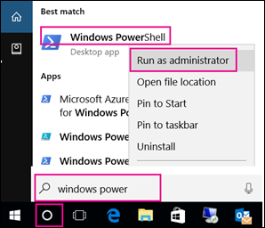

# <a name="manage-who-can-create-office-365-groups"></a>Beheren wie Office 365-groepen kunnen maken

  
Gebruikers kunnen eenvoudig zelf Office 365-groepen maken, dus u wordt niet langer overspoeld met aanvragen ze namens anderen te maken. Afhankelijk van uw bedrijf wilt u wellicht zelf bepalen wie er groepen kunnen maken.
  
In dit artikel wordt uitgelegd hoe u de mogelijkheid om groepen te maken kunt uitschakelen **in alle Office 365-services met groepen**: 
  
- Outlook
    
- Sharepoint
    
- Yammer
    
- Microsoft Teams

- Microsoft Stream
    
- StaffHub StaffHub
    
- Planner
    
- PowerBI (PowerBI)

- Routekaart
    
U het maken van Office 365-groepen beperken tot de leden van een bepaalde beveiligingsgroep. Als u dit wilt configureren, gebruikt u Windows PowerShell. Dit artikel leidt u door de benodigde stappen.
  
De stappen in dit artikel verhinderen niet dat leden van bepaalde rollen groepen kunnen maken. Office 365 Global-beheerders kunnen groepen maken op alle mogelijke manieren, zoals het Microsoft 365-beheercentrum, Planner, Teams, Exchange en SharePoint Online. Andere rollen kunnen groepen maken via beperkte middelen, hieronder vermeld.
        
  - Exchange-beheerder: Exchange-beheercentrum, Azure AD
    
  - Ondersteuning voor partnerniveau 1: Microsoft 365-beheercentrum, Exchange-beheercentrum, Azure AD
    
  - Ondersteuning voor partnerniveau 2: Microsoft 365-beheercentrum, Exchange-beheercentrum, Azure AD
    
  - Directory-schrijvers: Azure AD

  - SharePoint-beheerder: SharePoint-beheercentrum, Azure AD
  
  - Teams Service Administrator: Teams Admin center, Azure AD
  
  - Beheerder van gebruikersbeheer: Microsoft 365-beheercentrum, Yammer, Azure AD
     
Als u lid bent van een van deze rollen, kunt u Office 365 Groepen maken voor gebruikers met beperkte toegang, en vervolgens de gebruiker instellen als de eigenaar van de groep. Gebruikers met deze rol kunnen verbonden groepen maken in Yammer, ongeacht de PowerShell-instellingen die het maken van het maken kunnen voorkomen.

## <a name="licensing-requirements"></a>Licentievereisten

Als u wilt beheren wie groepen maakt, hebben de volgende personen Azure AD Premium-licenties of Azure AD Basic EDU-licenties nodig:

- De beheerder die deze instellingen voor het maken van groepen configureert
- De leden van de beveiligingsgroep die groepen mogen maken

De volgende personen hebben azure AD Premium- of Azure AD Basic EDU-licenties niet nodig:

- Mensen die lid zijn van Office 365-groepen en die niet de mogelijkheid hebben om andere groepen te maken.

## <a name="step-1-create-a-security-group-for-users-who-need-to-create-office-365-groups"></a>Stap 1: een beveiligingsgroep maken voor gebruikers die Office 365 Groepen moeten kunnen maken

Er kan slechts één beveiligingsgroep in uw organisatie worden gebruikt om te bepalen wie groepen kan maken. U kunt wel andere beveiligingsgroepen nesten als leden van deze groep. Voorbeeld: de groep met de naam Groep maken toestaan is de aangewezen beveiligingsgroep en de groepen met de naam Microsoft Planner-gebruikers en Exchange Online-gebruikers zijn lid van die groep.

Beheerders in de hierboven genoemde rollen hoeven geen lid te zijn van deze groep: ze behouden hun vermogen om groepen te maken.

> [!IMPORTANT]
> Zorg ervoor dat u een **beveiligingsgroep** gebruikt om te beperken wie groepen kan maken. Als u hiervoor een Office 365-groep gebruikt, kunnen leden geen groep maken vanuit SharePoint, omdat er op een beveiligingsgroep wordt gecontroleerd. 
    
1. Ga in het beheercentrum naar de pagina \> <a href="https://go.microsoft.com/fwlink/p/?linkid=2052855" target="_blank">Groepengroepen.</a> **Groups**

2. Klik op **Een groep toevoegen**.

3. Kies **Beveiliging** als groepstype. Onthoud de naam van de groep goed. Deze hebt u later nodig.
  
4. Werk de beveiligingsgroep in en voeg mensen of andere beveiligingsgroepen toe die u groepen in uw organisatie wilt kunnen maken.
    
Zie [Een beveiligingsgroep maken, bewerken of verwijderen in het Microsoft 365-beheercentrum](../email/create-edit-or-delete-a-security-group.md)voor gedetailleerde instructies.
  
## <a name="step-2-install-the-preview-version-of-the-azure-active-directory-powershell-for-graph"></a>Stap 2: De preview-versie van de Azure Active Directory PowerShell voor Grafiek installeren

Deze procedures vereisen de preview-versie van de Azure Active Directory PowerShell voor Grafiek. De GA-versie werkt niet.


> [!IMPORTANT]
> U de preview- en GA-versies niet tegelijkertijd op dezelfde computer installeren. U de module installeren op Windows 10, Windows Server 2016.

  
Als aanbevolen procedure wordt aangeraden  *altijd*  bij te blijven: verwijder de oude AzureADPreview- of AzureAD-versie en installeer de meest recente versie. 
  
1. Type Windows PowerShell in de zoekbalk.
    
2. Klik met de rechtermuisknop op **Windows PowerShell** en selecteer **Als administrator uitvoeren**.
    
    
    
3. Stel het beleid in op RemoteSigned met [het beleid voor uitvoering instellen](https://docs.microsoft.com/powershell/module/microsoft.powershell.security/set-executionpolicy).
    
    ```
    Set-ExecutionPolicy RemoteSigned
    ```
  
4. Controleer de geïnstalleerde module:
    
    ```
    Get-InstalledModule -Name "AzureAD*"
    ```

5. Als u een eerdere versie van AzureADPreview of AzureAD wilt verwijderen, moet u deze opdracht uitvoeren:
  
    ```
    Uninstall-Module AzureADPreview
    ```

    of
  
    ```
    Uninstall-Module AzureAD
    ```

6. Als u de meest recente versie van AzureADPreview wilt installeren, moet u deze opdracht uitvoeren:
  
    ```
    Install-Module AzureADPreview
    ```

    Typ bij het bericht over een niet-vertrouwde opslagplaats: **Y**. Het installeren van de nieuwe module duurt ongeveer een minuut.

Laat het PowerShell-venster open voor stap 3, hieronder.
  
## <a name="step-3-run-powershell-commands"></a>Stap 3: PowerShell-opdrachten uitvoeren

Kopieer het onderstaande script naar een teksteditor, zoals Kladblok of het [Windows PowerShell ISE.](https://docs.microsoft.com/powershell/scripting/components/ise/introducing-the-windows-powershell-ise)

* \<Vervang SecurityGroupName\> * door de naam van de beveiligingsgroep die u hebt gemaakt. Bijvoorbeeld:

`$GroupName = "Group Creators"`

Sla het bestand op als GroupCreators.ps1. 

Navigeer in het PowerShell-venster naar de locatie waar <FileLocation>u het bestand hebt opgeslagen (typ 'CD').

Voer het script uit door te typen:

`.\GroupCreators.ps1`

en [meld u aan met uw beheerdersaccount](https://docs.microsoft.com/office365/enterprise/powershell/connect-to-office-365-powershell#step-2-connect-to-azure-ad-for-your-office-365-subscription) wanneer daarom wordt gevraagd.

```PowerShell
$GroupName = "<SecurityGroupName>"
$AllowGroupCreation = "False"

Connect-AzureAD

$settingsObjectID = (Get-AzureADDirectorySetting | Where-object -Property Displayname -Value "Group.Unified" -EQ).id
if(!$settingsObjectID)
{
      $template = Get-AzureADDirectorySettingTemplate | Where-object {$_.displayname -eq "group.unified"}
    $settingsCopy = $template.CreateDirectorySetting()
    New-AzureADDirectorySetting -DirectorySetting $settingsCopy
    $settingsObjectID = (Get-AzureADDirectorySetting | Where-object -Property Displayname -Value "Group.Unified" -EQ).id
}

$settingsCopy = Get-AzureADDirectorySetting -Id $settingsObjectID
$settingsCopy["EnableGroupCreation"] = $AllowGroupCreation

if($GroupName)
{
    $settingsCopy["GroupCreationAllowedGroupId"] = (Get-AzureADGroup -SearchString $GroupName).objectid
}
 else {
$settingsCopy["GroupCreationAllowedGroupId"] = $GroupName
}
Set-AzureADDirectorySetting -Id $settingsObjectID -DirectorySetting $settingsCopy

(Get-AzureADDirectorySetting -Id $settingsObjectID).Values
```

De laatste regel van het script geeft de bijgewerkte instellingen weer:


Als u in de toekomst wilt wijzigen welke beveiligingsgroep wordt gebruikt, u het script opnieuw uitvoeren met de naam van de nieuwe beveiligingsgroep.

Als u de beperking voor het maken van groepen wilt uitschakelen en alle gebruikers opnieuw wilt toestaan groepen te maken, stelt u $GroupName in op '' en $AllowGroupCreation op 'Waar' en voert u het script opnieuw uit.
    
## <a name="step-4-verify-that-it-works"></a>Stap 4: Controleren of het werkt

1. Meld u aan bij Office 365 met een gebruikersaccount van iemand die NIET in staat mag zijn om groepen te maken. Dat wil zeggen dat ze geen lid zijn van de beveiligingsgroep die u hebt gemaakt of een beheerder.
    
2. Selecteer de tegel **Planner.** 
    
3. Selecteer in Planner **Nieuw plan** in de linkernavigatie om een plan te maken. 
  
4. U moet een bericht ontvangen dat het plannen en het maken van groepen is uitgeschakeld.

Probeer dezelfde procedure opnieuw met een lid van de beveiligingsgroep.

> [!NOTE]
> Als leden van de beveiligingsgroep geen groepen kunnen maken, controleert u of ze niet worden geblokkeerd via hun [OWA-postvakbeleid.](https://go.microsoft.com/fwlink/?linkid=852135)
    
## <a name="related-articles"></a>Verwante artikelen

[Getting started with Office 365 PowerShell](https://go.microsoft.com/fwlink/p/?LinkId=808033)

[Selfservicegroepsbeheer instellen in Azure Active Directory](https://docs.microsoft.com/azure/active-directory/users-groups-roles/groups-self-service-management)

[Beleid voor setuitvoering](https://docs.microsoft.com/powershell/module/microsoft.powershell.security/set-executionpolicy)

[Azure Active Directory-cmdlets voor het configureren van groepsinstellingen](https://docs.microsoft.com/azure/active-directory/users-groups-roles/groups-settings-cmdlets)
