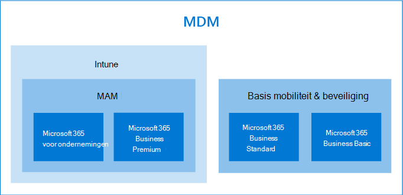

# Opties voor het beschermen van uw apparaten en app-gegevensOptions for protecting your devices and app data

U kunt op verschillende manieren uw organisatie apparaten en-gegevens beveiligen met Microsoft 365 voor bedrijven en Enterprise.You have several ways to secure your organizations devices and data on them with Microsoft 365 for business and enterprise. U kunt de volgende zelfstandige abonnementen gebruiken:You can use the following stand-alone plans:

- InTune (onderdeel van Microsoft-eindpunt beheer)Intune (a part of Microsoft Endpoint Management)
- Azure Active Directory Premium-abonnementen.Azure Active Directory Premium plans.
- Basis mobiliteit en beveiliging (beschikbaar in de meeste Microsoft 365 voor bedrijven-en Enterprise-abonnementen) of de abonnementen gebruiken die enkele of alle eerdere zelfstandige abonnementen bevatten.Basic Mobility and Security (included in most Microsoft 365 for business and enterprise plans) Or use the subscriptions that include some, or all of the previous standalone plans.

- Een Microsoft 365 Business Premium-abonnement, waaronder beveiliging en bedreigings bescherming voor professionals en kleine bedrijven onder 300-gebruikers.A Microsoft 365 Business Premium subscription, which includes security and threat protection for small business under 300 users.
- Microsoft 365 Enterprise-abonnementen, waaronder Advanced beveiliging en bedreigings bescherming.Microsoft 365 Enterprise plans that include advanced security and threat protection.

## Opties voor ApparaatbeheerDevice management options

- Voor de meeste Microsoft 365-abonnementen is **eenvoudige mobiliteit en beveiliging** beschikbaar, en de enige ingebouwde keuze voor microsoft 365 Business Standard en microsoft 365 Business Basic.**Basic Mobility and Security** is offered with most Microsoft 365 plans, and is the only built-in choice offered for Microsoft 365 Business Standard and Microsoft 365 Business Basic. Voor meer informatie raadpleegt u de [beschikbaarheid van basis mobiliteit en beveiliging](../basic-mobility-security/choose-between-basic-mobility-and-security-and-intune.md#availability-of-basic-mobility-and-security-and-intune).For more information, see [availability of Basic Mobility and Security](../basic-mobility-security/choose-between-basic-mobility-and-security-and-intune.md#availability-of-basic-mobility-and-security-and-intune). 

    Als u Microsoft 365 Business Basic of Microsoft 365 Business Standard hebt, kunt u ook intune kopen als uw organisatie meer ingewikkelde beveiligingsbehoeften heeft.If you have either Microsoft 365 Business Basic or Microsoft 365 Business Standard, you can also purchase Intune if your organization has more complex security needs.
 
- **Microsoft intune** is een zelfstandig abonnement dat ook is opgenomen in sommige microsoft 365 voor bedrijven-of Enterprise-abonnementen.**Microsoft Intune** is a stand-alone plan that is also included with some Microsoft 365 for business or enterprise plans. Als u intune als een zelfstandig of onderdeel van uw abonnement hebt, biedt het u de mogelijkheid uw apparaat en app-gegevensbeheer te verfijnen.If you have Intune either as a stand-alone or a part of your subscription, it provides ability to fine-tune your device and app-data management. Zie [beschikbaarheid van intune](../basic-mobility-security/choose-between-basic-mobility-and-security-and-intune.md#availability-of-basic-mobility-and-security-and-intune)voor meer informatie over de beschikbaarheid met microsoft 365.For more information on availability with Microsoft 365, see [availability of Intune](../basic-mobility-security/choose-between-basic-mobility-and-security-and-intune.md#availability-of-basic-mobility-and-security-and-intune).

    Microsoft intune is een cloudservice die gericht is op MDM (Mobile Device Management) en Mobile Application Management (MAM).Microsoft Intune is a cloud-based service that focuses on mobile device management (MDM) and mobile application management (MAM). U bepaalt hoe de apparaten van uw organisatie worden gebruikt, waaronder mobiele telefoons, Tablets en laptops.You control how your organization’s devices are used, including mobile phones, tablets, and laptops. U kunt ook specifieke beleidsregels configureren om toepassingen te beheren.You can also configure specific policies to control applications. Zie [Microsoft intune-documentatie](https://docs.microsoft.com/mem/intune/)voor meer informatie.For more information, see [Microsoft Intune documentation](https://docs.microsoft.com/mem/intune/).

- **Azure Active Directory (AD) Premium** -abonnementen zijn zelfstandige abonnementen die ook worden geleverd bij enkele microsoft 365 voor bedrijven-en Enterprise-abonnementen.**Azure Active Directory (AD) Premium** plans are standalone plans that also come with some of the Microsoft 365 for business and enterprise plans. Zie voor meer informatie [Azure ad-tarieven](https://azure.microsoft.com/pricing/details/active-directory/).For more information, see [Azure AD pricing](https://azure.microsoft.com/pricing/details/active-directory/).

     Met Azure AD Premium P1 en Azure AD Premium, kunt u voorwaardelijke toegang instellen, functies voor het zelf opnieuw instellen van wachtwoorden, enzovoort. Zie voor meer informatie over de mogelijkheden van de Premium-abonnementen de pagina [prijzen van Azure AD](https://azure.microsoft.com/pricing/details/active-directory/) .Azure AD Premium P1 and Azure AD Premium P2 allow you to set conditional access features, self-service password reset, etc. For more information on the capabilities of the Premium plans, see [Azure AD pricing](https://azure.microsoft.com/pricing/details/active-directory/) page.
- **Microsoft 365 Business Premium** omvat intune en Azure Active Directory Premium P1 en Office 365 Advanced Threat Protection.**Microsoft 365 Business Premium** includes Intune and Azure Active Directory Premium P1 and Office 365 Advanced Threat Protection. 
 
    Microsoft 365 Business Premium biedt een reeks beleidssjablonen voor het beveiligen van uw apparaten en app-gegevens.Microsoft 365 Business Premium offers a set of policy templates for securing your devices and app data. Het biedt een goede bescherming tegen beveiliging en bedreiging voor de meeste bedrijven onder 300-gebruikers.It offers a good level of security and threat protection for most businesses under 300 users. Zie [Microsoft 365 Business Premium instellen voor meer informatie over het instellen van de installatiewizard, het beveiligen van](../../business/set-up.md) [Windows 10-computers](../../business/secure-win-10-pcs.md)en de functies voor [beveiliging en compliance van Microsoft 365 Business Premium](../../business/security-features.md).For more information, see [set up Microsoft 365 Business Premium in the setup wizard](../../business/set-up.md), [secure Windows 10 computers](../../business/secure-win-10-pcs.md),  and [Microsoft 365 Business Premium security and compliance features](../../business/security-features.md).

- **Microsoft 365 voor Enterprise** -abonnementen zijn inclusief Microsoft intune en E5 omvat ook de Azure AD Premium-abonnementen 1 en 2.**Microsoft 365 for enterprise** subscriptions include Microsoft Intune and E5 also includes the Azure AD premium plans 1 and 2.

    Microsoft 365 E5 biedt het hoogste beveiligingsniveau voor beveiliging en bedreiging van alle Microsoft 365-abonnementen.Microsoft 365 E5 offers the highest level of security and threat protection of all the Microsoft 365 subscriptions. Zie voor meer informatie [Microsoft 365 for Enterprise Overview](../../enterprise/microsoft-365-overview.md).For more information, see [Microsoft 365 for enterprise overview](../../enterprise/microsoft-365-overview.md).
