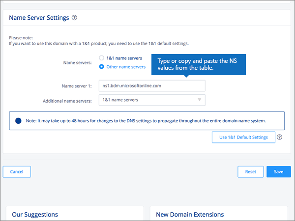
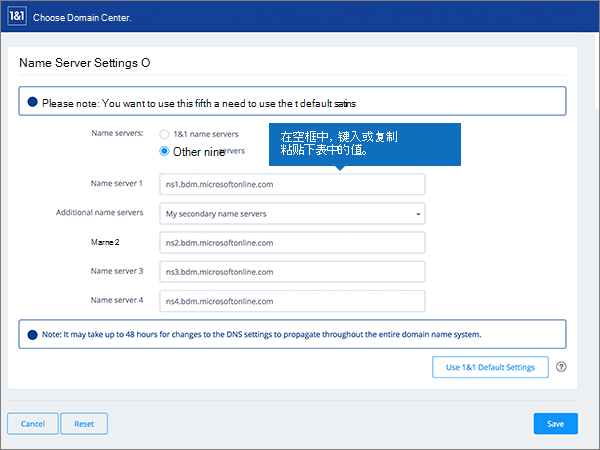

# Naamservers wijzigen om Microsoft 365 in te stellen met 1&1 IONOS

 **[Raadpleeg de veelgestelde vragen over domeinen](../setup/domains-faq.md)** als u niet kunt vinden wat u zoekt. 
  
Volg deze instructies als u wilt dat Microsoft 365 uw Microsoft 365 DNS-records voor u beheert. (Als u dat liever hebt, u [al uw Microsoft 365 DNS-records beheren op 1&1 IONOS](create-dns-records-at-1-1-internet.md).) 
  

    
## Een TXT-record toevoegen voor verificatie

Voordat u uw domein met Microsoft 365 gebruikt, moeten we ervoor zorgen dat u eigenaar bent. Uw mogelijkheid om in te loggen op uw account bij uw domeinregistrar en de DNS-record te maken bewijst microsoft 365 dat u eigenaar bent van het domein.
  
> [!NOTE]
> Deze record wordt alleen gebruikt om te verifiëren dat u de eigenaar van uw domein bent. Dit heeft verder geen invloed. U kunt deze record later desgewenst verwijderen. 
  
Volg onderstaande stappen of [bekijk de video (start op 0:42)](https://support.office.com/article/Video-Change-nameservers-to-set-up-Office-365-with-1-1-Internet-0ef1b3b5-d27a-4004-8ca1-fbe0453a0ea3?ui=en-US&amp;rs=en-US&amp;ad=US).
  
1. Om aan de slag te gaan, ga je naar je domeinenpagina op 1&1 IONOS via [deze link.](https://account.1and1.com/?redirect_url=https%3A%2F%2Fmy.1and1.com%2F) U wordt gevraagd u aan te melden. 
    
2. Selecteer onder **MY DOMAINS** de optie **Manage domains**.
    
3. Zoek op de pagina **Domain Center** het domein dat u wilt bijwerken. selecteer vervolgens het **besturingselement Paneel** **(v)** voor dat domein.
    
4. Selecteer **DNS-instellingen bewerken**in het gebied **Domeininstellingen** .
    
5. Selecteer **Record toevoegen**in de sectie **TXT- en SRV-records** .
    
    (Mogelijk moet u omlaag schuiven.) 
    
6. Ga naar het gebied **Add Record**. In de vakken voor de nieuwe record in dit gebied kunt u vervolgens de waarden uit de volgende tabel typen of kopiëren en plakken. 
    
||||
|:-----|:-----|:-----|
|**Type**   |**Voorvoegsel**   |**Naamwaarde**   |
|TXT    |(Laat dit veld leeg.)    |MS=ms *XXXXXXXX*   **Opmerking:** Dit is een voorbeeld. Gebruik hier de waarde van uw specifieke **bestemming of adresinrichten** in de tabel in Microsoft 365. [Hoe kan ik dit vinden?](../get-help-with-domains/information-for-dns-records.md)   |

   
7. Selecteer **Opslaan**en vervolgens opnieuw **opslaan.** 
    
8. Selecteer **Ja**. in het dialoogvenster **DNS-instellingen bewerken** .
    
9. Wacht enkele minuten voordat u verder gaat, zodat de record die u zojuist hebt gemaakt via internet kan worden bijgewerkt.
    
Nu u de record op de site van uw domeinregistrar hebt toegevoegd, gaat u terug naar Microsoft 365 en vraagt u Microsoft 365 om de record te zoeken.
  
Wanneer Microsoft 365 de juiste TXT-record vindt, wordt uw domein geverifieerd.
  
1. Ga in het beheercentrum naar **Instellingen** \> <a href="https://go.microsoft.com/fwlink/p/?linkid=834818" target="_blank">Domeinen</a>-pagina.
    
2. Kies op de pagina **Domeinen** de naam van het domein dat u verifieert. 
    
3. Kies **Start setup** op de pagina **Setup**.
    
4. Kies **Verifiëren** op de pagina **Domein verifiëren**.
    
> [!NOTE]
> Het duurt gewoonlijk ongeveer 15 minuten voordat DNS-wijzigingen van kracht worden. Het kan echter soms wat langer duren voordat een wijziging die u hebt aangebracht, is bijgewerkt via het DNS-systeem op internet. Zie Problemen zoeken en oplossen na het toevoegen van [uw domein- of DNS-records in Microsoft 365](../get-help-with-domains/find-and-fix-issues.md)als u problemen ondervindt met e-mailstroom of andere problemen na het toevoegen van DNS-records. 
  
## De naamserverrecords (NS-records) van uw domein wijzigen

Als u het instellen van uw domein met Microsoft 365 wilt voltooien, wijzigt u de NS-records van uw domein bij uw domeinregistrar om naar de primaire en secundaire naamservers van Microsoft 365 te wijzen. Hiermee wordt Microsoft 365 ingesteld om de DNS-records van het domein voor u bij te werken. We voegen alle records toe zodat e-mail, Skype voor Bedrijven Online en uw openbare website met uw domein werken en u helemaal klaar bent.
  
> [!CAUTION]
> Wanneer u de NS-records van uw domein wijzigt om naar de Microsoft 365-naamservers te wijzen, worden alle services die momenteel aan uw domein zijn gekoppeld, beïnvloed. Alle e-mail die naar uw domein wordt verzonden (zoals rob@ *your_domain* .com) wordt bijvoorbeeld naar Microsoft 365 verzonden nadat u deze wijziging hebt aangemaakt. 
  
Klaar om uw NS-records te wijzigen, zodat Microsoft 365 uw domein kan instellen? Volg onderstaande stappen of [bekijk de video (start bij 365)](https://support.office.com/article/Video-Change-nameservers-to-set-up-Office-365-with-1-1-Internet-0ef1b3b5-d27a-4004-8ca1-fbe0453a0ea3?ui=en-US&amp;rs=en-US&amp;ad=US).
  
> [!IMPORTANT]
>  In de volgende procedure kunt u zien hoe u andere, ongewenste naamservers uit de lijst verwijdert en hoe u de juiste naamservers toevoegt als deze niet al in de lijst staan. >  Na het voltooien van de stappen in deze sectie, moeten alleen de volgende vier naamservers in de lijst staan: >  ns1.bdm.microsoftonline.com >  ns2.bdm.microsoftonline.com >  ns3.bdm.microsoftonline.com >  ns4.bdm.microsoftonline.com 
  
1. Ga om aan de slag te gaan naar de pagina domeinen op 1&1 IONOS via [deze link.](https://account.1and1.com/?redirect_url=https%3A%2F%2Fmy.1and1.com%2F) U wordt gevraagd u aan te melden. 
    
2. Selecteer onder **MY DOMAINS** de optie **Manage domains**.
    
3. Zoek op de pagina **Domain Center** het domein dat u wilt bijwerken en selecteer vervolgens het besturingselement **Paneel** **(v)** voor dat domein.
    
4. Selecteer **DNS-instellingen bewerken**in het gebied **Domeininstellingen** .
    
5. In de sectie **Name Server Settings** selecteert u **Other name servers**.
    
    (Mogelijk moet u omlaag schuiven.)
    
6. Afhankelijk van of er al naamservers worden vermeld op de pagina die wordt weergegeven, gaat u op een van de volgende twee manieren verder:
    
  - Als er nog **GEEN** naamservers worden vermeld, [Als er nog GEEN naamservers worden vermeld](#if-there-are-no-nameservers-already-listed).
    
  - Als er **WEL** naamservers worden vermeld, [Als er WEL naamservers worden vermeld](#if-there-are-nameservers-already-listed).
    
### Als er nog GEEN naamservers worden vermeld

1. Typ of kopieer en plak de waarde uit de volgende tabel in het vak **Name server 1**. 
    
|||
|:-----|:-----|
|**Name server 1**   |ns1.bdm.microsoftonline.com    |
   
   
  
2. In de vervolgkeuzelijst **Additional name servers** kiest u **My secondary name servers**.
    
    
  
3. Typ of kopieer en plak de waarde uit de volgende tabel in het vak **Name server 2, 3, and 4**. 
    
|||
|:-----|:-----|
|**Name server 2**   |ns2.bdm.microsoftonline.com    |
|**Name server 3**   |ns3.bdm.microsoftonline.com    |
|**Name server 4**   |ns4.bdm.microsoftonline.com    |
   
    
  
4. Kies **Opslaan**.
    
    
  
5. Selecteer **Ja**. in het dialoogvenster **DNS-instellingen bewerken** .
    
    
  
> [!NOTE]
> Het kan enige uren duren voordat de updates van uw naamserverrecords via het DNS-systeem op internet zijn doorgevoerd. Vervolgens zijn uw Microsoft-e-mail en andere services helemaal klaar om met uw domein te werken. 
  
### Als er WEL naamservers worden vermeld

> [!CAUTION]
> Voer deze stappen  *alleen*  uit als u andere bestaande naamservers hebt dan de vier  *juiste*  naamservers. (Dat wil zeggen, verwijder  *alleen*  huidige naamservers die een  *andere*  naam hebben dan **ns1.bdm.microsoftonline.com**, **ns2.bdm.microsoftonline.com**, **ns3.bdm.microsoftonline.com** of **ns4.bdm.microsoftonline.com**.) 
  
1. Als er al naamservers in de **Name server**-vakken worden vermeld, verwijdert u elke vermelding door deze te selecteren en op de toets **Delete** op het toetsenbord te drukken. 
    
    
  
2. Typ of kopieer en plak de waarden uit de volgende tabel in het vak **Name server 1, 2, 3, and 4**. 
    
|||
|:-----|:-----|
|**Name server 1**   |ns1.bdm.microsoftonline.com    |
|**Name server 2**   |ns2.bdm.microsoftonline.com    |
|**Name server 3**   |ns3.bdm.microsoftonline.com    |
|**Name server 4**   |ns4.bdm.microsoftonline.com    |
   
   
  
3. Kies **Opslaan**.
    
    
  
4. Selecteer **Ja**. in het dialoogvenster **DNS-instellingen bewerken** .
    
    
  
> [!NOTE]
> Het kan enige uren duren voordat de updates van uw naamserverrecords via het DNS-systeem op internet zijn doorgevoerd. Vervolgens zijn uw Microsoft-e-mail en andere services helemaal klaar om met uw domein te werken. 
  

