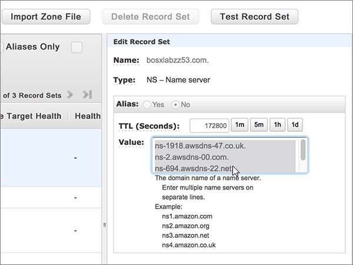

# Naamservers wijzigen om Microsoft in te stellen met Amazon Web Services (AWS)Change nameservers to set up Microsoft with Amazon Web Services (AWS)

 **[Raadpleeg de veelgestelde vragen over domeinen](../setup/domains-faq.md)** als u niet kunt vinden wat u zoekt.**[Check the Domains FAQ](../setup/domains-faq.md)** if you don't find what you're looking for. 
  
Volg deze instructies als u wilt dat Microsoft uw DNS-records voor u beheert.Follow these instructions if you want Microsoft to manage your DNS records for you. (Als u dat liever hebt, u [al uw Microsoft DNS-records beheren bij AWS](create-dns-records-at-aws.md).)(If you prefer, you can [manage all your Microsoft DNS records at AWS](create-dns-records-at-aws.md).)
  
    
## Een TXT-record toevoegen voor verificatieAdd a TXT record for verification

Voordat u uw domein bij Microsoft gebruikt, moeten we ervoor zorgen dat u eigenaar bent.Before you use your domain with Microsoft, we have to make sure that you own it. Uw mogelijkheid om in te loggen op uw account bij uw domeinregistrar en de DNS-record te maken bewijst microsoft dat u eigenaar bent van het domein.Your ability to log in to your account at your domain registrar and create the DNS record proves to Microsoft that you own the domain.
  
> [!NOTE]
> Deze record wordt alleen gebruikt om te verifiëren dat u de eigenaar van uw domein bent. Dit heeft verder geen invloed. U kunt deze record later desgewenst verwijderen.This record is used only to verify that you own your domain; it doesn't affect anything else. You can delete it later, if you like. 
  
1. Als u wilt beginnen, gaat u naar uw domeinenpagina bij AWS via [deze koppeling](https://console.aws.amazon.com/route53/home). U wordt gevraagd u eerst aan te melden.To get started, go to your domains page at AWS by using [this link](https://console.aws.amazon.com/route53/home). You'll be prompted to log in first.
    
2. Selecteer op de pagina **Resources** de optie **Gehoste zones**.On the **Resources** page, select **Hosted Zones**.
    
3. Selecteer op de pagina **Gehoste zones** in de kolom **Domeinnaam** de naam van het domein dat u wilt bewerken.On the **Hosted Zones** page, in the **Domain Name** column, select the name of the domain that you want to edit. 
    
4. Selecteer **Recordset maken**.Select **Create Record Set**.
    
5. Typ of kopieer en plak de waarden uit de volgende tabel in het gebied **Create Record Set** in de vakken voor de nieuwe record.In the **Create Record Set** area, in the boxes for the new record, type or copy and paste the values from the following table. 
    
    (Kies in de vervolgkeuzelijsten de waarden **Type** en **Routing Policy**.)(Choose the **Type** and **Routing Policy** values from the drop-down lists.) 
    
    > [!TIP]
    > De aanhalingstekens die zijn vereist volgens de instructies op het scherm, worden automatisch ingevoegd. U hoeft deze niet handmatig te typen.The quotation marks required by the onscreen instructions are supplied automatically. You don't need to type them manually. 
  
|||||||
|:-----|:-----|:-----|:-----|:-----|:-----|
|**Name****Name**   |**Type****Type**   |**Alias****Alias**   |**TTL (Seconds)****TTL (Seconds)**   |**Value****Value**   |**Routing Policy****Routing Policy**   |
|(Laat dit veld leeg)(Leave this field empty)    |TXT - TextTXT - Text    |NoNo    |300300    |MS=ms *XXXXXXXX*MS=ms *XXXXXXXX*   **Opmerking:** Dit is een voorbeeld.**Note:** This is an example. Gebruik hier de waarde van uw specifieke **bestemming of adrespunt** in de tabel.Use your specific **Destination or Points to Address** value here, from the table. [Hoe kan ik dit vinden?How do I find this?](../get-help-with-domains/information-for-dns-records.md)     |SimpleSimple   |
   
6. Selecteer **Maken**.Select **Create**.
    
7. Wacht enkele minuten voordat u verder gaat, zodat de record die u zojuist hebt gemaakt via internet kan worden bijgewerkt.Wait a few minutes before you continue, so that the record you just created can update across the Internet.
    
Nu u de record op de site van uw domeinregistrar hebt toegevoegd, gaat u terug naar Microsoft en vraagt u om een zoekopdracht naar de record.Now that you've added the record at your domain registrar's site, you'll go back to Microsoft and request a search for the record.
  
Wanneer Microsoft de juiste TXT-record vindt, wordt uw domein geverifieerd.When Microsoft finds the correct TXT record, your domain is verified.
  
1. Ga in het Microsoft-beheercentrum naar de pagina \> <a href="https://go.microsoft.com/fwlink/p/?linkid=834818" target="_blank">Instellingendomeinen.</a> **Settings**In the Microsoft admin center, go to the **Settings** \> <a href="https://go.microsoft.com/fwlink/p/?linkid=834818" target="_blank">Domains</a> page.

    
2. Kies op de pagina **Domeinen** de naam van het domein dat u verifieert.On the **Domains** page, select the domain that you are verifying. 
    
3. Kies **Start setup** op de pagina **Setup**.On the **Setup** page, select **Start setup**.
    
4. Kies **Verifiëren** op de pagina **Domein verifiëren**.On the **Verify domain** page, select **Verify**.
    
> [!NOTE]
> Het duurt gewoonlijk ongeveer 15 minuten voordat DNS-wijzigingen van kracht worden.Typically it takes about 15 minutes for DNS changes to take effect. Het kan echter soms wat langer duren voordat een wijziging die u hebt aangebracht, is bijgewerkt via het DNS-systeem op internet.However, it can occasionally take longer for a change you've made to update across the Internet's DNS system. Zie Problemen zoeken en oplossen na het toevoegen van [uw domein- of DNS-records](../get-help-with-domains/find-and-fix-issues.md)als u problemen ondervindt met e-mailstroom of andere problemen na het toevoegen van DNS-records.If you're having trouble with mail flow or other issues after adding DNS records, see [Find and fix issues after adding your domain or DNS records](../get-help-with-domains/find-and-fix-issues.md). 
  
## De naamserverrecords (NS-records) van uw domein wijzigenChange your domain's nameserver (NS) records

Als u het instellen van uw domein met Microsoft wilt voltooien, wijzigt u de NS-records van uw domein bij uw domeinregistrar om naar de primaire en secundaire naamservers van Microsoft te wijzen.To complete setting up your domain with Microsoft, you change your domain's NS records at your domain registrar to point to the Microsoft primary and secondary name servers. Hiermee wordt Microsoft ingesteld om de DNS-records van het domein voor u bij te werken.This sets up Microsoft to update the domain's DNS records for you. We voegen alle records toe zodat e-mail, Skype voor Bedrijven Online en uw openbare website met uw domein werken en u helemaal klaar bent.We'll add all records so that email, Skype for Business Online, and your public website work with your domain, and you'll be all set.
  
> [!CAUTION]
> Wanneer u de NS-records van uw domein wijzigt om naar de Microsoft-naamservers te wijzen, worden alle services die momenteel aan uw domein zijn gekoppeld, beïnvloed.When you change your domain's NS records to point to the Microsoft name servers, all the services that are currently associated with your domain are affected. Alle e-mail die naar uw *your_domain* domein wordt verzonden (zoals rob@ your_domain.com) wordt bijvoorbeeld naar Microsoft verzonden nadat u deze wijziging hebt gewijzigd.For example, all email sent to your domain (like rob@ *your_domain*  .com) will start coming to Microsoft after you make this change. 
  
> [!IMPORTANT]
>  In de volgende procedure kunt u zien hoe u andere, ongewenste naamservers uit de lijst verwijdert en hoe u de juiste naamservers toevoegt als deze niet al in de lijst staan. >  Na het voltooien van de stappen in deze sectie, moeten alleen de volgende vier naamservers in de lijst staan: >  ns1.bdm.microsoftonline.com >  ns2.bdm.microsoftonline.com >  ns3.bdm.microsoftonline.com >  ns4.bdm.microsoftonline.comThe following procedure will show you how to delete any other, unwanted nameservers from the list, and also how to add the correct nameservers if they are not already listed. >  When you have completed the steps in this section, the only nameservers that should be listed are these four: >  ns1.bdm.microsoftonline.com >  ns2.bdm.microsoftonline.com >  ns3.bdm.microsoftonline.com >  ns4.bdm.microsoftonline.com 
  
1. Als u wilt beginnen, gaat u naar uw domeinenpagina bij AWS via [deze koppeling](https://console.aws.amazon.com/route53/home).To get started, go to your domains page at AWS by using [this link](https://console.aws.amazon.com/route53/home). U wordt gevraagd u eerst aan te melden.You'll be prompted to log in first.
    
2. Selecteer op de pagina **Resources** de optie **Gehoste zones**.On the **Resources** page, select **Hosted Zones**.
    
3. Selecteer op de pagina **Gehoste zones** in de kolom **Domeinnaam** de naam van het domein dat u wilt bewerken.On the **Hosted Zones** page, in the **Domain Name** column, select the name of the domain that you want to edit. 
    
4. Selecteer de **Nameserver**-recordset.Select the **Nameserver** record set. 
    
    
  
5. Verwijder in de recordset **NS - Name server** in het vak **Value** alle naamservers door ze allemaal te selecteren en op de toets **Delete** op het toetsenbord te drukken.In the **NS - Name server** record set in the **Value** box, delete all of the nameservers by selecting them all and then pressing the **Delete** key on your keyboard. 
    
    > [!CAUTION]
    > Volg deze stappen alleen als u bestaande naamservers hebt, andere dan de vier juiste naamservers.Follow these steps only if you have existing nameservers other than the four correct nameservers. (Dat wil zeggen, alleen huidige naamservers verwijderen die *geen* naam hebben **ns1.bdm.microsoftonline.com,** **ns2.bdm.microsoftonline.com,** **ns3.bdm.microsoftonline.com**of **ns4.bdm.microsoftonline.com**.)(That is, delete only any current nameservers that are  *not*  named **ns1.bdm.microsoftonline.com**, **ns2.bdm.microsoftonline.com**, **ns3.bdm.microsoftonline.com**, or **ns4.bdm.microsoftonline.com**.) 
  
    
  
6. Selecteer 1 uur in het gebied **TTL (Seconden):** **1uur** (1 uur).In the **TTL (Seconds):** area, select **1h** (1 Hour). 
    
    
  
7. In de recordset **NS - Name server** en het vak **Value** typt of kopieert en plakt u bovendien de waarde uit **Eerste regel** uit de volgende tabel, drukt u op **Enter** op het toetsenbord en typt of kopieert en plakt u de waarde van de volgende **regel**.Still in the **NS - Name server** record set, in the **Value** box, type or copy and paste the **First line** value from the following table, then press the **Enter** key on your keyboard and type or copy and paste the next **line** value. 
    
    > [!IMPORTANT]
    > Elke naamserverwaarde  *moet*  op een afzonderlijke regel in het vak **Value** staan, zoals wordt weergegeven in de volgende afbeelding.Each nameserver value  *must*  be on its own separate line within the **Value** box, as shown in the following illustration. 
  
|||
|:-----|:-----|
|**Eerste regel****First line**   |ns1.bdm.microsoftonline.com.ns1.bdm.microsoftonline.com.    **Deze waarde MOET eindigen op een punt (.)****This value MUST end with a period (.)**   |
|**Tweede regel****Second line**   |ns2.bdm.microsoftonline.com.ns2.bdm.microsoftonline.com.    **Deze waarde MOET eindigen op een punt (.)****This value MUST end with a period (.)**   |
|**Derde regel****Third line**   |ns3.bdm.microsoftonline.com.ns3.bdm.microsoftonline.com.    **Deze waarde MOET eindigen op een punt (.)****This value MUST end with a period (.)**   |
|**Vierde regel****Fourth line**   |ns4.bdm.microsoftonline.com.ns4.bdm.microsoftonline.com.    **Deze waarde MOET eindigen op een punt (.)****This value MUST end with a period (.)**   |
   
   
  
8. Selecteer **Recordset opslaan**.Select **Save Record Set**.
    
    
  
> [!NOTE]
> Het kan enige uren duren voordat de updates van uw naamserverrecords via het DNS-systeem op internet zijn doorgevoerd.Your nameserver record updates may take up to several hours to update across the Internet's DNS system. Vervolgens zijn uw Microsoft-e-mail en andere services helemaal klaar om met uw domein te werken.Then your Microsoft email and other services will be all set to work with your domain. 
