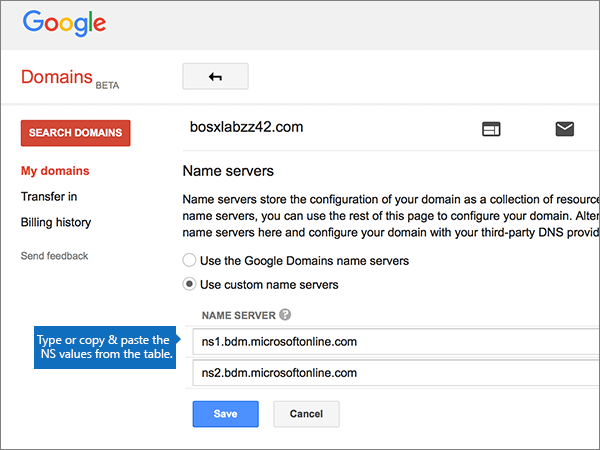

# Naamservers wijzigen voor het instellen van Office 365 met Google-domeinen

 **[Raadpleeg de veelgestelde vragen over domeinen](../setup/domains-faq.md)** als u niet kunt vinden wat u zoekt. 
  
Volg deze instructies als u wilt dat Office 365 uw DNS-records voor Office 365 voor u beheert. (Als u wilt, kunt u [al uw DNS-records voor Office 365 bij Google Domains beheren](create-dns-records-at-google-domains.md).)
  
    
## Een TXT-record toevoegen voor verificatie

Voordat u uw domein met Office 365 kunt gaan gebruiken, moet worden gecontroleerd dat u de eigenaar bent van het domein. Als u zich bij uw account bij de domeinregistrar kunt aanmelden en de DNS-record kunt maken, is dit voor Office 365 bewezen.
  
> [!NOTE]
>  Deze record wordt alleen gebruikt om te verifiëren dat u de eigenaar van uw domein bent. Dit heeft verder geen invloed. U kunt deze record later desgewenst verwijderen. 
  
1. Om aan de slag te gaan, ga je naar je domeinenpagina bij Google Domains via [deze link.](https://domains.google.com/registrar) U wordt gevraagd om u aan te melden. U gaat hiervoor als volgt te werk:
    
1. Selecteer **Aanmelden**.
    
2. Voer uw inloggegevens **in**en selecteer Opnieuw Aanmelden .
    
2. Selecteer **op** de pagina Domeinen in de sectie **Domein** de optie **DNS configureren** voor het domein dat u wilt bewerken. 
    
3. Typ of kopieer en plak de waarden uit de volgende tabel in de sectie **Custom resource records** in de vakken voor de nieuwe record. 
    
    (Mogelijk moet u omlaag schuiven.)
    
    (Kies in de vervolgkeuzelijst de waarde **Type**). 
    
|||||
|:-----|:-----|:-----|:-----|
|**Name**   |**Type**   |**TTL**   |**Data**   |
|@    |TXT    |1H    |MS=ms *XXXXXXXX*   **Opmerking:** Dit is een voorbeeld. Gebruik hier de specifieke waarde voor **Doel of adres waarnaar wordt verwezen** uit de tabel in Office 365. [Hoe kan ik dit vinden?](../get-help-with-domains/information-for-dns-records.md)          |
   
4. Kies **Toevoegen**.
    
5. Wacht enkele minuten voordat u verder gaat, zodat de record die u zojuist hebt gemaakt via internet kan worden bijgewerkt.
    
Nu u de record hebt toegevoegd aan de site van uw domeinregistrar, gaat u terug naar Office 365 en vraagt u of Office 365 naar de record wil zoeken.
  
Wanneer in Office 365 de juiste TXT-record is gevonden, is uw domein gecontroleerd.
  
1. Ga in het beheercentrum naar **Instellingen** \> <a href="https://go.microsoft.com/fwlink/p/?linkid=834818" target="_blank">Domeinen</a>-pagina.

    
2. Kies op de pagina **Domeinen** de naam van het domein dat u verifieert. 
    
3. Kies **Start setup** op de pagina **Setup**.
    
4. Kies **Verifiëren** op de pagina **Domein verifiëren**.
    
> [!NOTE]
> Het duurt meestal ongeveer 15 minuten voordat DNS-wijzigingen van kracht worden. Het kan echter soms wat langer duren voordat een wijziging die u hebt aangebracht, is bijgewerkt via het DNS-systeem op internet. Als u na het toevoegen van DNS-records problemen hebt met het ontvangen of verzenden van e-mail, raadpleegt u [Problemen opsporen en oplossen nadat u uw domein of DNS-records hebt toegevoegd in Office 365](../get-help-with-domains/find-and-fix-issues.md). 
  
## De naamserverrecords (NS-records) van uw domein wijzigen

U voltooit het instellen van uw domein met Office 365 door de NS-records van uw domein bij uw domeinregistrar te wijzigen, zodat deze verwijzen naar de primaire en secundaire naamservers van Office 365. Hiermee wordt Office 365 zo ingesteld dat de DNS-records van het domein voor u worden bijgewerkt. Alle benodigde records worden toegevoegd zodat e-mail, Skype voor Bedrijven Online en uw openbare website met uw domein kunnen werken. Daarna bent u klaar.
  
> [!CAUTION]
> Als u de NS-records van uw domein laat verwijzen naar de naamservers van Office 365, is dit van invloed op alle services die momenteel aan uw domein zijn gekoppeld. Bijvoorbeeld alle e-mail die naar uw domein wordt verzonden (zoals rob@ *your_domain.*  com) naar Office 365 komen nadat u deze wijziging hebt gewijzigd. 
  
> [!IMPORTANT]
> In de volgende procedure kunt u zien hoe u andere, ongewenste naamservers uit de lijst verwijdert en hoe u de juiste naamservers toevoegt als deze niet al in de lijst staan. > Na het voltooien van de stappen in deze sectie, moeten alleen de volgende vier naamservers in de lijst staan: 
  
1. Ga eerst naar de pagina met domeinen bij Google Domains via [deze koppeling](https://domains.google.com/registrar). U wordt gevraagd om u aan te melden. U gaat hiervoor als volgt te werk:
    
1. Selecteer **Aanmelden**.
    
2. Voer uw inloggegevens in en selecteer **Opnieuw Aanmelden**.
    
2. Selecteer **op** de pagina Domeinen in de sectie **Domein** de optie **DNS configureren** voor het domein dat u wilt bewerken. 
    
3. Selecteer op de pagina **Domains** in de sectie **Name servers** de optie **Use custom name servers**.
    
    
  
4. Afhankelijk van of er al naamservers worden vermeld op de pagina die wordt weergegeven, gaat u op een van de volgende twee manieren verder:
    
  - Als er nog **GEEN** naamservers worden vermeld, [Als er nog GEEN naamservers worden vermeld](#if-there-are-no-nameservers-already-listed).
    
  - Als er **WEL** naamservers worden vermeld, [Als er WEL naamservers worden vermeld](#if-there-are-nameservers-already-listed).
    
### Als er nog GEEN naamservers worden vermeld

1. Voeg de eerste naamserver toe.
    
    In de sectie **Name servers** typt of kopieert en plakt u in het vak **NAME SERVER** de eerste waarde uit de volgende tabel. 
    
|||
|:-----|:-----|
|**First name server**   |ns1.bdm.microsoftonline.com    |
|**Second name server**   |ns2.bdm.microsoftonline.com    |
|**Derde naamserver**   |ns3.bdm.microsoftonline.com    |
|**Vierde naamserver**   |ns4.bdm.microsoftonline.com    |
   
   
  
2. Selecteer het **besturingselement + (toevoegen)** om een lege rij te maken. 
    
    
  
3. De andere drie naamserverrecords toevoegen.
    
    Maak in de sectie **Aangepaste naamservers gebruiken** een record met de waarden uit de volgende rij in de tabel en selecteer vervolgens het **besturingselement + (toevoegen)** om een andere rij toe te voegen. 
    
    Herhaal deze procedure totdat u alle vier de naamserverrecords hebt gemaakt.
    
4. Kies **Opslaan**.
    
    
  
> [!NOTE]
> Het kan enige uren duren voordat de updates van uw naamserverrecords via het DNS-systeem op internet zijn doorgevoerd. Vervolgens worden uw e-mail voor Office 365 en andere services ingesteld voor gebruik met uw domein. 
  
### Als er WEL naamservers worden vermeld

1. Als er andere naamservers worden vermeld, selecteert u **Bewerken**.
    
    > [!CAUTION]
    > Volg deze stappen alleen als u bestaande naamservers hebt, andere dan de vier juiste naamservers. (Dat wil zeggen, alleen huidige naamservers verwijderen die *geen* naam hebben **ns1.bdm.microsoftonline.com,** **ns2.bdm.microsoftonline.com,** **ns3.bdm.microsoftonline.com**of **ns4.bdm.microsoftonline.com**.) 
  
    
  
2. Verwijder vervolgens elk item door het te selecteren en op de toets **Delete** op het toetsenbord te drukken. 
    
    
  
3. In de sectie **Name servers** typt of kopieert en plakt u de waarden uit de volgende tabel in de rijen **NAME SERVER**. 
    
|||
|:-----|:-----|
|**First name server**   |ns1.bdm.microsoftonline.com    |
|**Second name server**   |ns2.bdm.microsoftonline.com    |
|**Derde naamserver**   |ns3.bdm.microsoftonline.com    |
|**Vierde naamserver**   |ns4.bdm.microsoftonline.com    |
   
   
  
4. Selecteer het besturingselement **+(toevoegen)** om een lege rij te maken. 
    
    
  
5. Voer de andere twee naamserverrecords toe.
    
    Maak in de sectie **Aangepaste naamservers gebruiken** een record met de waarden uit de volgende rij in de tabel en selecteer vervolgens het besturingselement **+(toevoegen)** om een andere rij toe te voegen. 
    
    Herhaal deze procedure totdat u alle vier de naamserverrecords hebt gemaakt.
    
6. Kies **Opslaan**.
    
    
  
> [!NOTE]
> Het kan enige uren duren voordat de updates van uw naamserverrecords via het DNS-systeem op internet zijn doorgevoerd. Vervolgens worden uw e-mail voor Office 365 en andere services ingesteld voor gebruik met uw domein. 
  
