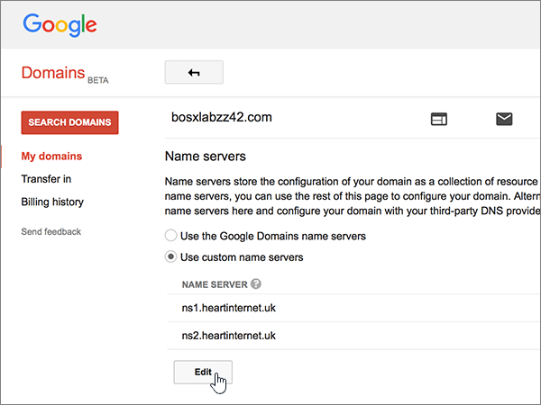

# Naamservers wijzigen voor het instellen van Office 365 met Google-domeinenChange nameservers to set up Office 365 with Google Domains

 **[Raadpleeg de veelgestelde vragen over domeinen](../setup/domains-faq.md)** als u niet kunt vinden wat u zoekt.**[Check the Domains FAQ](../setup/domains-faq.md)** if you don't find what you're looking for. 
  
Volg deze instructies als u wilt dat Office 365 uw DNS-records voor Office 365 voor u beheert. (Als u wilt, kunt u [al uw DNS-records voor Office 365 bij Google Domains beheren](create-dns-records-at-google-domains.md).)Follow these instructions if you want Office 365 to manage your Office 365 DNS records for you. (If you prefer, you can [manage all your Office 365 DNS records at Google Domains](create-dns-records-at-google-domains.md).)
  
    
## Een TXT-record toevoegen voor verificatieAdd a TXT record for verification

Voordat u uw domein met Office 365 kunt gaan gebruiken, moet worden gecontroleerd dat u de eigenaar bent van het domein. Als u zich bij uw account bij de domeinregistrar kunt aanmelden en de DNS-record kunt maken, is dit voor Office 365 bewezen.Before you use your domain with Office 365, we have to make sure that you own it. Your ability to log in to your account at your domain registrar and create the DNS record proves to Office 365 that you own the domain.
  
> [!NOTE]
>  Deze record wordt alleen gebruikt om te verifiëren dat u de eigenaar van uw domein bent. Dit heeft verder geen invloed. U kunt deze record later desgewenst verwijderen.This record is used only to verify that you own your domain; it doesn't affect anything else. You can delete it later, if you like. 
  
1. Om aan de slag te gaan, ga je naar je domeinenpagina bij Google Domains via [deze link.](https://domains.google.com/registrar)To get started, go to your domains page at Google Domains via [this link](https://domains.google.com/registrar). U wordt gevraagd om u aan te melden.You'll be prompted to sign in. U gaat hiervoor als volgt te werk:To do so:
    
1. Selecteer **Aanmelden**.Select **Sign In**.
    
2. Voer uw inloggegevens **in**en selecteer Opnieuw Aanmelden .Enter your login credentials and again select **Sign In**.
    
2. Selecteer **op** de pagina Domeinen in de sectie **Domein** de optie **DNS configureren** voor het domein dat u wilt bewerken.On the **Domains** page, in the **Domain** section, select **Configure DNS** for the domain that you want to edit. 
    
3. Typ of kopieer en plak de waarden uit de volgende tabel in de sectie **Custom resource records** in de vakken voor de nieuwe record.In the **Custom resource records** section, in the boxes for the new record, type or copy and paste the values from the following table. 
    
    (Mogelijk moet u omlaag schuiven.)(You may have to scroll down.)
    
    (Kies in de vervolgkeuzelijst de waarde **Type**).(Choose the **Type** value from the drop-down list.) 
    
|||||
|:-----|:-----|:-----|:-----|
|**Name****Name**   |**Type****Type**   |**TTL****TTL**   |**Data****Data**   |
|@    |TXTTXT    |1H1H    |MS=ms *XXXXXXXX*MS=ms *XXXXXXXX*   **Opmerking:** Dit is een voorbeeld.**Note:** This is an example. Gebruik hier de specifieke waarde voor **Doel of adres waarnaar wordt verwezen** uit de tabel in Office 365.Use your specific **Destination or Points to Address** value here, from the table in Office 365. [Hoe kan ik dit vinden?How do I find this?](../get-help-with-domains/information-for-dns-records.md)          |
   
4. Selecteer **Toevoegen**.Select **Add**.
    
5. Wacht enkele minuten voordat u verder gaat, zodat de record die u zojuist hebt gemaakt via internet kan worden bijgewerkt.Wait a few minutes before you continue, so that the record you just created can update across the Internet.
    
Nu u de record hebt toegevoegd aan de site van uw domeinregistrar, gaat u terug naar Office 365 en vraagt u of Office 365 naar de record wil zoeken.Now that you've added the record at your domain registrar's site, you'll go back to Office 365 and request Office 365 to look for the record.
  
Wanneer in Office 365 de juiste TXT-record is gevonden, is uw domein gecontroleerd.When Office 365 finds the correct TXT record, your domain is verified.
  
1. Ga in het beheercentrum naar de pagina \> <a href="https://go.microsoft.com/fwlink/p/?linkid=834818" target="_blank">Instellingendomeinen.</a> **Settings**In the admin center, go to the **Settings** \> <a href="https://go.microsoft.com/fwlink/p/?linkid=834818" target="_blank">Domains</a> page.

    
2. Selecteer **op** de pagina Domeinen het domein dat u verifieert.On the **Domains** page, select the domain that you are verifying. 
    
3. Selecteer **op** de pagina Setup de optie **Installatie starten**.On the **Setup** page, select **Start setup**.
    
4. Selecteer **op** de pagina Domein verifiëren de optie **Verifiëren**.On the **Verify domain** page, select **Verify**.
    
> [!NOTE]
> Het duurt meestal ongeveer 15 minuten voordat DNS-wijzigingen van kracht worden. Het kan echter soms wat langer duren voordat een wijziging die u hebt aangebracht, is bijgewerkt via het DNS-systeem op internet. Als u na het toevoegen van DNS-records problemen hebt met het ontvangen of verzenden van e-mail, raadpleegt u [Problemen opsporen en oplossen nadat u uw domein of DNS-records hebt toegevoegd in Office 365](../get-help-with-domains/find-and-fix-issues.md).Typically it takes about 15 minutes for DNS changes to take effect. However, it can occasionally take longer for a change you've made to update across the Internet's DNS system. If you're having trouble with mail flow or other issues after adding DNS records, see [Find and fix issues after adding your domain or DNS records in Office 365](../get-help-with-domains/find-and-fix-issues.md). 
  
## De naamserverrecords (NS-records) van uw domein wijzigenChange your domain's nameserver (NS) records

U voltooit het instellen van uw domein met Office 365 door de NS-records van uw domein bij uw domeinregistrar te wijzigen, zodat deze verwijzen naar de primaire en secundaire naamservers van Office 365. Hiermee wordt Office 365 zo ingesteld dat de DNS-records van het domein voor u worden bijgewerkt. Alle benodigde records worden toegevoegd zodat e-mail, Skype voor Bedrijven Online en uw openbare website met uw domein kunnen werken. Daarna bent u klaar.To complete setting up your domain with Office 365, you change your domain's NS records at your domain registrar to point to the Office 365 primary and secondary name servers. This sets up Office 365 to update the domain's DNS records for you. We'll add all records so that email, Skype for Business Online, and your public website work with your domain, and you'll be all set.
  
> [!CAUTION]
> Als u de NS-records van uw domein laat verwijzen naar de naamservers van Office 365, is dit van invloed op alle services die momenteel aan uw domein zijn gekoppeld.When you change your domain's NS records to point to the Office 365 name servers, all the services that are currently associated with your domain are affected. Bijvoorbeeld alle e-mail die naar uw domein wordt verzonden (zoals rob@ *your_domain.*For example, all email sent to your domain (like rob@ *your_domain.*  com) naar Office 365 komen nadat u deze wijziging hebt gewijzigd.com) will start coming to Office 365 after you make this change. 
  
> [!IMPORTANT]
> In de volgende procedure kunt u zien hoe u andere, ongewenste naamservers uit de lijst verwijdert en hoe u de juiste naamservers toevoegt als deze niet al in de lijst staan. > Na het voltooien van de stappen in deze sectie, moeten alleen de volgende vier naamservers in de lijst staan:The following procedure will show you how to delete any other, unwanted nameservers from the list, and also how to add the correct nameservers if they are not already in the list. > When you have completed the steps in this section, the only nameservers that should be listed are these four: 
  
1. Ga eerst naar de pagina met domeinen bij Google Domains via [deze koppeling](https://domains.google.com/registrar). U wordt gevraagd om u aan te melden. U gaat hiervoor als volgt te werk:To get started, go to your domains page at Google Domains by using [this link](https://domains.google.com/registrar). You'll be prompted to sign in. To do so:
    
1. Selecteer **Aanmelden**.Select **Sign In**.
    
2. Voer uw inloggegevens in en selecteer **Opnieuw Aanmelden**.Enter your login credentials, and then again select **Sign In**.
    
2. Selecteer **op** de pagina Domeinen in de sectie **Domein** de optie **DNS configureren** voor het domein dat u wilt bewerken.On the **Domains** page, in the **Domain** section, select **Configure DNS** for the domain that you want to edit. 
    
3. Selecteer op de pagina **Domains** in de sectie **Name servers** de optie **Use custom name servers**.On the **Domains** page, in the **Name servers** section, select **Use custom name servers**.
    
    
  
4. Afhankelijk van of er al naamservers worden vermeld op de pagina die wordt weergegeven, gaat u op een van de volgende twee manieren verder:Depending on whether or not there are already nameservers listed on the page that is displayed now, continue to one of the two following procedures:
    
  - Als er nog **GEEN** naamservers worden vermeld, [Als er nog GEEN naamservers worden vermeld](#if-there-are-no-nameservers-already-listed).If there are **NO** nameservers already listed, [If there are NO nameservers already listed](#if-there-are-no-nameservers-already-listed).
    
  - Als er **WEL** naamservers worden vermeld, [Als er WEL naamservers worden vermeld](#if-there-are-nameservers-already-listed).If there **ARE** nameservers already listed, [If there ARE nameservers already listed](#if-there-are-nameservers-already-listed).
    
### Als er nog GEEN naamservers worden vermeldIf there are NO nameservers already listed

1. Voeg de eerste naamserver toe.Add the first nameserver.
    
    In de sectie **Name servers** typt of kopieert en plakt u in het vak **NAME SERVER** de eerste waarde uit de volgende tabel.In the **Name servers** section, in the **NAME SERVER** box, type or copy and paste the first value from the following table. 
    
|||
|:-----|:-----|
|**First name server****First name server**   |ns1.bdm.microsoftonline.comns1.bdm.microsoftonline.com    |
|**Second name server****Second name server**   |ns2.bdm.microsoftonline.comns2.bdm.microsoftonline.com    |
|**Derde naamserver****Third name server**   |ns3.bdm.microsoftonline.comns3.bdm.microsoftonline.com    |
|**Vierde naamserver****Fourth name server**   |ns4.bdm.microsoftonline.comns4.bdm.microsoftonline.com    |
   
   
  
2. Selecteer het **besturingselement + (toevoegen)** om een lege rij te maken.Select the **+ (add)** control to create an empty row. 
    
    
  
3. De andere drie naamserverrecords toevoegen.Add the other three Nameserver records.
    
    Maak in de sectie **Aangepaste naamservers gebruiken** een record met de waarden uit de volgende rij in de tabel en selecteer vervolgens het **besturingselement + (toevoegen)** om een andere rij toe te voegen.In the **Use custom name servers** section, create a record by using the values from the next row in the table, and then select the **+ (add)** control to add another row. 
    
    Herhaal deze procedure totdat u alle vier de naamserverrecords hebt gemaakt.Repeat this process until you have created all four Nameserver records.
    
4. Kies **Opslaan**.Select **Save**.
    
    
  
> [!NOTE]
> Het kan enige uren duren voordat de updates van uw naamserverrecords via het DNS-systeem op internet zijn doorgevoerd. Vervolgens worden uw e-mail voor Office 365 en andere services ingesteld voor gebruik met uw domein.Your nameserver record updates may take up to several hours to update across the Internet's DNS system. Then your Office 365 email and other services will be all set to work with your domain. 
  
### Als er WEL naamservers worden vermeldIf there ARE nameservers already listed

1. Als er andere naamservers worden vermeld, selecteert u **Bewerken**.If there are any other nameservers listed, select **Edit**.
    
    > [!CAUTION]
    > Volg deze stappen alleen als u bestaande naamservers hebt, andere dan de vier juiste naamservers.Follow these steps only if you have existing nameservers other than the four correct nameservers. (Dat wil zeggen, alleen huidige naamservers verwijderen die *geen* naam hebben **ns1.bdm.microsoftonline.com,** **ns2.bdm.microsoftonline.com,** **ns3.bdm.microsoftonline.com**of **ns4.bdm.microsoftonline.com**.)(That is, delete only any current nameservers that are  *not*  named **ns1.bdm.microsoftonline.com**, **ns2.bdm.microsoftonline.com**, **ns3.bdm.microsoftonline.com**, or **ns4.bdm.microsoftonline.com**.) 
  
    
  
2. Verwijder vervolgens elk item door het te selecteren en op de toets **Delete** op het toetsenbord te drukken.Delete each one by selecting it, and then pressing the **Delete** key on your keyboard. 
    
    
  
3. In de sectie **Name servers** typt of kopieert en plakt u de waarden uit de volgende tabel in de rijen **NAME SERVER**.Still in the **Name servers** section, in the **NAME SERVER** rows, type or copy and paste the values from the following table. 
    
|||
|:-----|:-----|
|**First name server****First name server**   |ns1.bdm.microsoftonline.comns1.bdm.microsoftonline.com    |
|**Second name server****Second name server**   |ns2.bdm.microsoftonline.comns2.bdm.microsoftonline.com    |
|**Derde naamserver****Third name server**   |ns3.bdm.microsoftonline.comns3.bdm.microsoftonline.com    |
|**Vierde naamserver****Fourth name server**   |ns4.bdm.microsoftonline.comns4.bdm.microsoftonline.com    |
   
   
  
4. Selecteer het besturingselement **+(toevoegen)** om een lege rij te maken.Select the **+(add)** control to create an empty row. 
    
    
  
5. Voer de andere twee naamserverrecords toe.Add the other two Nameserver records.
    
    Maak in de sectie **Aangepaste naamservers gebruiken** een record met de waarden uit de volgende rij in de tabel en selecteer vervolgens het besturingselement **+(toevoegen)** om een andere rij toe te voegen.In the **Use custom name servers** section, create a record by using the values from the next row in the table, and then select the **+(add)** control to add another row. 
    
    Herhaal deze procedure totdat u alle vier de naamserverrecords hebt gemaakt.Repeat this process until you have created all four Nameserver records.
    
6. Kies **Opslaan**.Select **Save**.
    
    
  
> [!NOTE]
> Het kan enige uren duren voordat de updates van uw naamserverrecords via het DNS-systeem op internet zijn doorgevoerd. Vervolgens worden uw e-mail voor Office 365 en andere services ingesteld voor gebruik met uw domein.Your nameserver record updates may take up to several hours to update across the Internet's DNS system. Then your Office 365 email and other services will be all set to work with your domain. 
  
