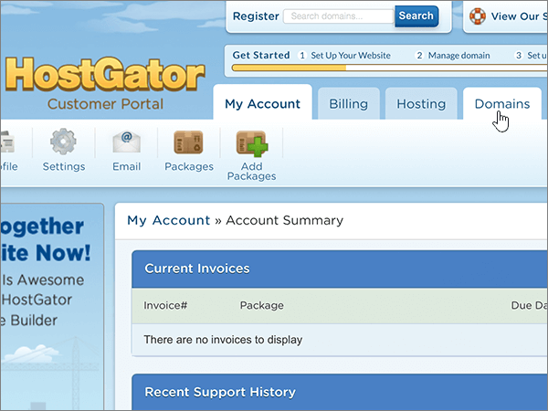

# Naamservers wijzigen om Microsoft 365 in te stellen met HostgatorChange nameservers to set up Microsoft 365 with Hostgator

 **[Raadpleeg de veelgestelde vragen over domeinen](../setup/domains-faq.md)** als u niet kunt vinden wat u zoekt.**[Check the Domains FAQ](../setup/domains-faq.md)** if you don't find what you're looking for.
  
Volg deze instructies als u wilt dat Microsoft uw DNS-records voor u beheert.Follow these instructions if you want Microsoft to manage your DNS records for you. (Als u dat liever hebt, u [al uw Microsoft DNS-records beheren bij Hostgator](create-dns-records-at-hostgator.md).)(If you prefer, you can [manage all your Microsoft DNS records at Hostgator](create-dns-records-at-hostgator.md).)
  
    
## Uw domein naar uw hostingaccount laten verwijzen.Point your domain to your hosting account.

> [!IMPORTANT]
> U moet deze procedure uitvoeren voordat u de procedure in de volgende sectie, **Een TXT-record toevoegen voor verificatie**, uitvoert.You must perform this procedure before you perform the procedure in the following section, **Add a TXT record for verification**.
  
Volg deze stappen om uw domein en hostingaccounts te koppelen.Follow these steps to associate your domain and hosting accounts.
  
1. Ga eerst naar uw pagina met de klantenportal bij Hostgator via [deze koppeling](https://portal.hostgator.com/domain/manage). U wordt gevraagd u aan te melden.To get started, go to your customer portal page at Hostgator by using [this link](https://portal.hostgator.com/domain/manage). You'll be prompted to log in.
    
    
  
2. Selecteer het tabblad **Domeinen.**Select the **Domains** tab.
    
    
  
3. Selecteer op de pagina **Domeinen beheren** in het gebied **Mijn domeinen** het domein dat u wilt bijwerken.On the **Manage Domains** page, in the **My Domains** area, select the domain you want to update.
    
    
  
4. Selecteer op de pagina **Domeinenoverzicht** in het gebied **Naamservers** de optie **Wijzigen**.On the **Domains Overview** page, in the **Name Servers** area, select **Change**.
    
    
  
5. Kies op de pagina **Naamservers** voor uw domein in de vervolgkeuzelijst **Hostingaccount** selecteren de **hostingaccount** die aan uw domein is gekoppeld.On the **Name Servers** page for your domain, in the **Select Hosting Account** drop-down list, choose the **hosting account** that is associated with your domain.
    
    
  
6. Selecteer **Naamservers opslaan**.Select **Save Name Servers**.
    
    
  
## Een TXT-record toevoegen voor verificatieAdd a TXT record for verification

> [!IMPORTANT]
> Voordat u deze procedure uitvoert, moet u eerst de procedure uitvoeren in het eerste deel van dit artikel, [Uw domein naar uw hostingaccount leiden.](#point-your-domain-to-your-hosting-account)Before you perform this procedure, you must first perform the procedure in the first section of this article, [Point your domain to your hosting account.](#point-your-domain-to-your-hosting-account).
  
Voordat u uw domein met Microsoft kunt gebruiken, moet worden gecontroleerd dat u de eigenaar bent van het domein. Als u zich bij uw account bij de domeinregistrar kunt aanmelden en de DNS-record kunt maken, is dit voor Microsoft bewezen.Before you use your domain with Microsoft, we have to make sure that you own it. Your ability to log in to your account at your domain registrar and create the DNS record proves to Microsoft that you own the domain.
  
> [!NOTE]
> Deze record wordt alleen gebruikt om te verifiëren dat u de eigenaar van uw domein bent. Dit heeft verder geen invloed. U kunt deze record later desgewenst verwijderen.This record is used only to verify that you own your domain; it doesn't affect anything else. You can delete it later, if you like.
  
1. Als u wilt beginnen, gaat u naar de pagina cPanel bij Hostgator. U wordt gevraagd u eerst aan te melden.To get started, go to your cPanel page at Hostgator. You'll be prompted to log in first.
    
    (Aan elk gehost account bij Hostgator is een uniek cPanel-adres toegewezen. Het adres van uw cPanel ziet er ongeveer als volgt uit: https://YourSiteAddress:secure-port-number nummer-beveiligde-poort. U vindt dit adres in de e-mail die u bij aanmelding van Hostgator hebt ontvangen.)(Each hosted account at Hostgator is assigned a unique cPanel address. Your cPanel address should look like this: https://YourSiteAddress:secure-port-number. The sign-up email you received from Hostgator will specify that address.)
    
    > [!IMPORTANT]
    > Als u cPanel aan uw domein wilt koppelen, hebt u een hostingaccount bij Hostgator nodig.To have a cPanel associated with your domain, you need a hosting account with Hostgator. Om aan de slag te gaan, u een hostingaccount kopen bij Hostgator of [de NS-records (nameserver) van uw domein wijzigen](#change-your-domains-nameserver-ns-records) om naar Microsoft te wijzen.To get started, you can either purchase a hosting account from Hostgator or [change your domain's nameserver (NS) records](#change-your-domains-nameserver-ns-records) to point to Microsoft. 
  
2. Selecteer op de pagina **Configuratiescherm** in het gebied **Domeinen** de optie **Advanced DNS Zone Editor**.On the **Control Panel** page, in the **Domains** area, select **Advanced DNS Zone Editor**.
    
    (Mogelijk moet u omlaag schuiven.)(You may have to scroll down.) 
    
3. Typ of kopieer en plak de waarden uit de volgende tabel in het gebied **Add a Record** in de vakken voor de nieuwe record op de pagina **Advanced DNS Zone Editor**.On the **Advanced DNS Zone Editor** page, in the **Add a Record** area, in the boxes for the new record, type or copy and paste the values from the following table. 
    
    (Kies in de vervolgkeuzelijst de waarde **Type**).(Choose the **Type** value from the drop-down list.) 
    
|||||
|:-----|:-----|:-----|:-----|
|**Name****Name**   |**TTL****TTL**   |**Type****Type**   |**TXT Data****TXT Data**   |
|Gebruik uw  *domeinnaam*  (bijvoorbeeld fourthcoffee.com).Use your  *domain_name*  . (for example, fourthcoffee.com.)    **Deze waarde MOET eindigen op een punt (.)****This value MUST end with a period (.)**   |11    |TXTTXT    |MS=ms *XXXXXXXX*MS=ms *XXXXXXXX*    **Opmerking:** Dit is een voorbeeld.**Note:** This is an example. Gebruik hier de specifieke waarde voor **Doel of adres waarnaar wordt verwezen** uit de tabel.Use your specific **Destination or Points to Address** value here, from the table. [Hoe kan ik dit vinden?How do I find this?](../get-help-with-domains/information-for-dns-records.md)        |
   
4. Selecteer **Record toevoegen**.Select **Add Record**.
    
5. Wacht enkele minuten voordat u verder gaat, zodat de record die u zojuist hebt gemaakt via internet kan worden bijgewerkt.Wait a few minutes before you continue, so that the record you just created can update across the Internet.
    
Nu u de record op de site van uw domeinregistrar hebt toegevoegd, gaat u terug naar Microsoft en vraagt u om een zoekopdracht naar de record.Now that you've added the record at your domain registrar's site, you'll go back to Microsoft and request a search for the record.
  
Wanneer in Microsoft de juiste TXT-record is gevonden, is uw domein gecontroleerd.When Microsoft finds the correct TXT record, your domain is verified.
  
1. Ga in het beheercentrum naar **Instellingen** \> <a href="https://go.microsoft.com/fwlink/p/?linkid=834818" target="_blank">Domeinen</a>-pagina.In the admin center, go to the **Settings** \> <a href="https://go.microsoft.com/fwlink/p/?linkid=834818" target="_blank">Domains</a> page.

    
2. Kies op de pagina **Domeinen** de naam van het domein dat u verifieert.On the **Domains** page, select the domain that you are verifying. 
    
3. Kies **Start setup** op de pagina **Setup**.On the **Setup** page, select **Start setup**.
    
4. Kies **Verifiëren** op de pagina **Domein verifiëren**.On the **Verify domain** page, select **Verify**.
    
> [!NOTE]
> Het duurt meestal ongeveer 15 minuten voordat DNS-wijzigingen van kracht worden. Het kan echter soms wat langer duren voordat een wijziging die u hebt aangebracht, is bijgewerkt via het DNS-systeem op internet. Als u na het toevoegen van DNS-records problemen hebt met het ontvangen of verzenden van e-mail, raadpleegt u [Problemen opsporen en oplossen nadat u uw domein of DNS-records hebt toegevoegd](../get-help-with-domains/find-and-fix-issues.md).Typically it takes about 15 minutes for DNS changes to take effect. However, it can occasionally take longer for a change you've made to update across the Internet's DNS system. If you're having trouble with mail flow or other issues after adding DNS records, see [Find and fix issues after adding your domain or DNS records](../get-help-with-domains/find-and-fix-issues.md). 
  
## De naamserverrecords (NS-records) van uw domein wijzigenChange your domain's nameserver (NS) records

Als u het instellen van uw domein met Microsoft wilt voltooien, wijzigt u de NS-records van uw domein bij uw domeinregistrar om naar de primaire en secundaire naamservers van Microsoft te wijzen.To complete setting up your domain with Microsoft, you change your domain's NS records at your domain registrar to point to the Microsoft primary and secondary name servers. Hiermee wordt Microsoft ingesteld om de DNS-records van het domein voor u bij te werken.This sets up Microsoft to update the domain's DNS records for you. We voegen alle records toe zodat e-mail, Skype voor Bedrijven Online en uw openbare website met uw domein werken en u helemaal klaar bent.We'll add all records so that email, Skype for Business Online, and your public website work with your domain, and you'll be all set.
  
> [!CAUTION]
> Wanneer u de NS-records van uw domein wijzigt om naar de Microsoft-naamservers te wijzen, worden alle services die momenteel aan uw domein zijn gekoppeld, beïnvloed.When you change your domain's NS records to point to the Microsoft name servers, all the services that are currently associated with your domain are affected. Alle e-mail die naar uw *your_domain* domein wordt verzonden (zoals rob@ your_domain.com) wordt bijvoorbeeld naar Microsoft verzonden nadat u deze wijziging hebt gewijzigd.For example, all email sent to your domain (like rob@ *your_domain*  .com) will start coming to Microsoft after you make this change.
  
> [!IMPORTANT]
> In de volgende procedure kunt u zien hoe u andere, ongewenste naamservers uit de lijst verwijdert en hoe u de juiste naamservers toevoegt als deze niet al in de lijst staan.The following procedure will show you how to delete any other, unwanted nameservers from the list, and also how to add the correct nameservers if they are not already listed. Wanneer u de stappen in deze sectie hebt voltooid, zijn deze vier de enige nameservers: **ns1.bdm.microsoftonline.com,** **ns2.bdm.microsoftonline.com,** **ns3.bdm.microsoftonline.com**en **ns4.bdm.microsoftonline.com**.When you have completed the steps in this section, the only nameservers that should be listed are these four:  **ns1.bdm.microsoftonline.com**, **ns2.bdm.microsoftonline.com**, **ns3.bdm.microsoftonline.com**, and **ns4.bdm.microsoftonline.com**.
  
1. Ga eerst naar uw pagina met de klantenportal bij Hostgator via [deze koppeling](https://portal.hostgator.com/domain/manage). U wordt gevraagd u aan te melden.To get started, go to your customer portal page at Hostgator by using [this link](https://portal.hostgator.com/domain/manage). You'll be prompted to log in.
    
    
  
2. Selecteer het tabblad **Domeinen.**Select the **Domains** tab. 
    
    
  
3. Selecteer op de pagina **Domeinen beheren** in het gebied **Mijn domeinen** het domein dat u wilt bijwerken.On the **Manage Domains** page, in the **My Domains** area, select the domain you want to update. 
    
    
  
4. Selecteer op de pagina **Domeinoverzicht** in het gebied **Naamservers** de optie **Wijzigen**.On the **Domain Overview** page, in the **Name Servers** area, select **Change**.
    
    
  
5. Kies op de pagina **Naamservers** voor uw domein in de vervolgkeuzelijst **Hostingaccount** selecteren de **hostingaccount** die aan uw domein is gekoppeld.On the **Name Servers** page for your domain, in the **Select Hosting Account** drop-down list, choose the **hosting account** that is associated with your domain. 
    
    
  
6. Selecteer **Handmatig mijn naamservers instellen**.Select **Manually set my name servers**.
    
    
  
7.   **LET OP:** Volg deze stappen alleen als u bestaande naamservers hebt, andere dan de vier juiste naamservers.**CAUTION**: Follow these steps only if you have existing nameservers other than the four correct nameservers. (Dat wil zeggen, alleen huidige naamservers verwijderen die *geen* naam hebben **ns1.bdm.microsoftonline.com,** **ns2.bdm.microsoftonline.com,** **ns3.bdm.microsoftonline.com**of **ns4.bdm.microsoftonline.com**.)(That is, delete only any current nameservers that are  *not*  named **ns1.bdm.microsoftonline.com**, **ns2.bdm.microsoftonline.com**, **ns3.bdm.microsoftonline.com**, or **ns4.bdm.microsoftonline.com**.)
  
        Met de pagina **Name Servers** voor uw domein geopend, verwijdert u elke naamserver in de lijst met naamservers door deze te selecteren en op de toets **Delete** op het toetsenbord te drukken.Still on the **Name Servers** page for your domain, in the list of nameservers, delete each nameserver in the list by selecting it and then pressing the **Delete** key on your keyboard. 
    
   
  
8. Terwijl u zich nog in de lijst met naamservers bevindt, typt of kopieert en plakt u de eerste twee waarden uit de volgende tabel.Still in the list of nameservers, type or copy and paste the first two values from the following table.
    
|||
|:-----|:-----|
|**Name Server 1:****Name Server 1:**   |ns1.bdm.microsoftonline.comns1.bdm.microsoftonline.com    |
|**Name Server 2****Name Server 2:**   |ns2.bdm.microsoftonline.comns2.bdm.microsoftonline.com    |
|**Name Server 3:****Name Server 3:**   |ns3.bdm.microsoftonline.comns3.bdm.microsoftonline.com    |
|**Name Server 4:****Name Server 4:**   |ns4.bdm.microsoftonline.comns4.bdm.microsoftonline.com    |
   
   
  
9. Voeg de andere waarden voor de naamserver toe.Add the other nameserver values.
    
    Selecteer **(+)** toevoegen en typ of kopieer en plak de waarde uit de volgende rij van de tabel in het vak voor de record.Select **(+)** add, and then type or copy and paste the value from the next row of the table into the box for the record. 
    
    Herhaal deze procedure totdat u alle vier naamserverrecords hebt gemaakt.Repeat this process until you have created all four nameserver records.
    
    
  
10. Selecteer **Naamservers opslaan**.Select **Save Name Servers**.
    
    
  
> [!NOTE]
> Het kan enige uren duren voordat de updates van uw naamserverrecords via het DNS-systeem op internet zijn doorgevoerd.Your nameserver record updates may take up to several hours to update across the Internet's DNS system. Vervolgens zijn uw Microsoft-e-mail en andere services helemaal klaar om met uw domein te werken.Then your Microsoft email and other services will be all set to work with your domain.
