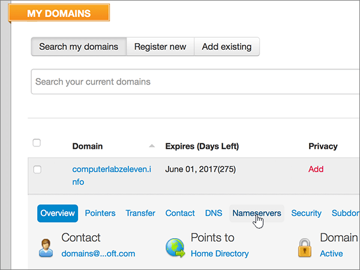

# Naamservers wijzigen om Microsoft in te stellen met MyDomainChange nameservers to set up Microsoft with MyDomain

 **[Raadpleeg de veelgestelde vragen over domeinen](../setup/domains-faq.md)** als u niet kunt vinden wat u zoekt.**[Check the Domains FAQ](../setup/domains-faq.md)** if you don't find what you're looking for.
  
Volg deze instructies als u wilt dat Microsoft uw DNS-records voor u beheert.Follow these instructions if you want Microsoft to manage your DNS records for you. (Als u dat liever hebt, u [al uw Microsoft DNS-records beheren bij MyDomain](create-dns-records-at-mydomain.md).)(If you prefer, you can [manage all your Microsoft DNS records at MyDomain](create-dns-records-at-mydomain.md).)
  
## Een TXT-record toevoegen voor verificatieAdd a TXT record for verification

Voordat u uw domein met Microsoft kunt gebruiken, moet worden gecontroleerd dat u de eigenaar bent van het domein. Als u zich bij uw account bij de domeinregistrar kunt aanmelden en de DNS-record kunt maken, is dit voor Microsoft bewezen.Before you use your domain with Microsoft, we have to make sure that you own it. Your ability to log in to your account at your domain registrar and create the DNS record proves to Microsoft that you own the domain.
  
> [!NOTE]
> Deze record wordt alleen gebruikt om te verifiëren dat u de eigenaar van uw domein bent. Dit heeft verder geen invloed. U kunt deze record later desgewenst verwijderen.This record is used only to verify that you own your domain; it doesn't affect anything else. You can delete it later, if you like. 
  
1. Ga eerst naar de pagina met domeinen bij MyDomain via [deze koppeling](https://www.mydomain.com/controlpanel). U wordt gevraagd u eerst aan te melden.To get started, go to your domains page at MyDomain by using [this link](https://www.mydomain.com/controlpanel). You'll be prompted to log in first.
    
2. Kies in de sectie **Mijn favorieten** de optie **Domain Central**.In the **My Favorites** section, select **Domain Central**.
    
3. Kies onder **Domein** de naam van het domein dat u wilt bewerken.Under **Domain**, select the name of the domain that you want to edit.
    
4. Kies in de rij **Overzicht** de optie **DNS**.In the **Overview** row, select **DNS**.
    
5. Kies in de vervolgkeuzelijst **Wijzigen** de optie **TXT/SPF-record**.From the **Modify** drop-down list, choose **TXT/SPF Record**.
    
6. Typ of kopieer en plak de waarden uit de volgende tabel in het vak voor de nieuwe record onder **Content**.Under **Content**, in the box for the new record, type or copy and paste the value from the following table.
    
||
|:-----|
|**Content****Content**   |
|MS=ms *XXXXXXXX*MS=ms *XXXXXXXX*    **Opmerking:** Dit is een voorbeeld.**Note**: This is an example. Gebruik hier de specifieke waarde voor **Doel of adres waarnaar wordt verwezen** uit de tabel.Use your specific **Destination or Points to Address** value here, from the table. [Hoe kan ik dit vinden?How do I find this?](../get-help-with-domains/information-for-dns-records.md)          |
   
7. Kies **Toevoegen**.Select **Add**.
    
8. Wacht enkele minuten voordat u verder gaat, zodat de record die u zojuist hebt gemaakt via internet kan worden bijgewerkt.Wait a few minutes before you continue, so that the record you just created can update across the Internet.
    
Nu u de record hebt toegevoegd aan de site van uw domeinregistrar, gaat u terug naar Microsoft 365 en vraagt u of Microsoft 365 naar de record wil zoeken.Now that you've added the record at your domain registrar's site, you'll go back to Microsoft 365 and request Microsoft 365 to look for the record.
  
Wanneer in Microsoft de juiste TXT-record is gevonden, is uw domein gecontroleerd.When Microsoft finds the correct TXT record, your domain is verified.
  
1. Ga in het Microsoft-beheercentrum naar **Instellingen** \> <a href="https://go.microsoft.com/fwlink/p/?linkid=834818" target="_blank">Domeinen</a>-pagina.In the Microsoft admin center, go to the **Settings** \> <a href="https://go.microsoft.com/fwlink/p/?linkid=834818" target="_blank">Domains</a> page.

    
2. Kies op de pagina **Domeinen** de naam van het domein dat u verifieert.On the **Domains** page, select the domain that you are verifying. 
    
3. Kies **Start setup** op de pagina **Setup**.On the **Setup** page, select **Start setup**.
    
4. Kies **Verifiëren** op de pagina **Domein verifiëren**.On the **Verify domain** page, select **Verify**.
    
> [!NOTE]
> Het duurt meestal ongeveer 15 minuten voordat DNS-wijzigingen van kracht worden. Het kan echter soms wat langer duren voordat een wijziging die u hebt aangebracht, is bijgewerkt via het DNS-systeem op internet. Als u na het toevoegen van DNS-records problemen hebt met het ontvangen of verzenden van e-mail, raadpleegt u [Problemen opsporen en oplossen nadat u uw domein of DNS-records hebt toegevoegd](../get-help-with-domains/find-and-fix-issues.md).Typically it takes about 15 minutes for DNS changes to take effect. However, it can occasionally take longer for a change you've made to update across the Internet's DNS system. If you're having trouble with mail flow or other issues after adding DNS records, see [Find and fix issues after adding your domain or DNS records](../get-help-with-domains/find-and-fix-issues.md). 
  
## De naamserverrecords (NS-records) van uw domein wijzigenChange your domain's nameserver (NS) records

Als u het instellen van uw domein met Microsoft wilt voltooien, wijzigt u de NS-records van uw domein bij uw domeinregistrar om naar de primaire en secundaire naamservers van Microsoft te wijzen.To complete setting up your domain with Microsoft, you change your domain's NS records at your domain registrar to point to the Microsoft primary and secondary name servers. Hiermee wordt Microsoft ingesteld om de DNS-records van het domein voor u bij te werken.This sets up Microsoft to update the domain's DNS records for you. We voegen alle records toe zodat e-mail, Skype voor Bedrijven Online en uw openbare website met uw domein werken en u helemaal klaar bent.We'll add all records so that email, Skype for Business Online, and your public website work with your domain, and you'll be all set.
  
> [!CAUTION]
> Wanneer u de NS-records van uw domein wijzigt om naar de Microsoft-naamservers te wijzen, worden alle services die momenteel aan uw domein zijn gekoppeld, beïnvloed.When you change your domain's NS records to point to the Microsoft name servers, all the services that are currently associated with your domain are affected. Bijvoorbeeld alle e-mail die naar uw domein wordt verzonden (zoals rob@ *your_domain.*For example, all email sent to your domain (like rob@ *your_domain.* com) zal beginnen te komen naar Microsoft nadat u deze wijziging.com) will start coming to Microsoft after you make this change. 
  
> [!IMPORTANT]
> In de volgende procedure kunt u zien hoe u andere, ongewenste naamservers uit de lijst verwijdert en hoe u de juiste naamservers toevoegt als deze niet al in de lijst staan.The following procedure will show you how to delete any other, unwanted nameservers from the list, and also how to add the correct nameservers if they are not already in the list.   Wanneer u de stappen in deze sectie hebt voltooid, zijn de enige nameservers die moeten worden vermeld:When you have completed the steps in this section, the only nameservers that should be listed are these four:
  
1. Ga eerst naar de pagina met domeinen bij MyDomain via [deze koppeling](https://www.mydomain.com/controlpanel). U wordt gevraagd u eerst aan te melden.To get started, go to your domains page at MyDomain by using [this link](https://www.mydomain.com/controlpanel). You'll be prompted to log in first.
    
2. Kies in de sectie **Mijn favorieten** de optie **Domain Central**.In the **My Favorites** section, select **Domain Central**.
    
3. Kies onder **Domein** de naam van het domein dat u wilt bewerken.Under **Domain**, select the name of the domain that you want to edit.
    
4. Selecteer **naamservers**in de rij **Overzicht** .In the **Overview** row, select **Nameservers**.
    
    
  
5. Selecteer in de sectie **Update Name Servers** de optie **Use different name servers**.In the **Update Name Servers** section, select **Use different name servers**.
    
    
  
6. Afhankelijk van het feit of er al nameservers op de pagina staan die nu wordt weergegeven, gaat u verder met een van de twee volgende procedures.Depending on whether or not there are already nameservers listed on the page that is displayed now, continue to one of the two following procedures.
    
### Als de correcte naamservers WEL worden vermeldIf the correct nameservers ARE already listed

- Als de correcte naamservers al worden vermeld, kunt u deze stap overslaan.If the correct nameservers are already listed, you can skip this step.
    
    
  
### Als de correcte naamservers NIET worden vermeldIf the correct nameservers are NOT already listed

> [!CAUTION]
> Volg deze stappen alleen als u bestaande naamservers hebt, andere dan de vier juiste naamservers.Follow these steps only if you have existing nameservers other than the four correct nameservers. (Dat wil zeggen, alleen huidige naamservers verwijderen die *geen* naam hebben **ns1.bdm.microsoftonline.com,** **ns2.bdm.microsoftonline.com,** **ns3.bdm.microsoftonline.com**of **ns4.bdm.microsoftonline.com**.)(That is, delete only any current nameservers that are  *not*  named **ns1.bdm.microsoftonline.com**, **ns2.bdm.microsoftonline.com**, **ns3.bdm.microsoftonline.com**, or **ns4.bdm.microsoftonline.com**.) 
  
1. Verwijder de bestaande naamservers door elke vermelding te selecteren in het veld **Nameserver 1:** en vervolgens op de toets **Delete** op het toetsenbord te drukken.Delete the existing nameservers by selecting each entry in the **Nameserver:** field, and then pressing the **Delete** key on your keyboard. 
    
    
  
2. Selecteer Twee maal **meer toevoegen** om twee nieuwe naamserverrijen toe te voegen.Select **Add More** twice to add two new Nameserver rows. 
    
    
  
3. Typ of kopieer en plak de naamserverwaarden uit de volgende tabel in de vakken voor de records.In the boxes for the records, type or copy and paste the nameserver values from the following table.
    
|||
|:-----|:-----|
|**Nameserver 1****Nameserver 1**   |ns1.bdm.microsoftonline.comns1.bdm.microsoftonline.com    |
|**Nameserver 2****Nameserver 2**   |ns2.bdm.microsoftonline.comns2.bdm.microsoftonline.com    |
|**Nameserver 3****Nameserver 3**   |ns3.bdm.microsoftonline.comns3.bdm.microsoftonline.com    |
|**Nameserver 4****Nameserver 4**   |ns4.bdm.microsoftonline.comns4.bdm.microsoftonline.com    |
   
   
  
4. Kies **Opslaan**.Select **Save**.
    
    
  
> [!NOTE]
> Het kan enige uren duren voordat de updates van uw naamserverrecords via het DNS-systeem op internet zijn doorgevoerd.Your nameserver record updates may take up to several hours to update across the Internet's DNS system. Vervolgens zijn uw Microsoft-e-mail en andere services helemaal klaar om met uw domein te werken.Then your Microsoft email and other services will be all set to work with your domain. 
