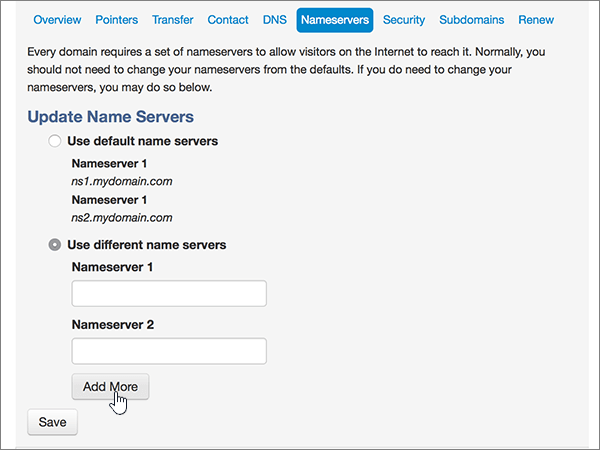

# Naamservers wijzigen voor het instellen van Microsoft met mijn domein

 **[Raadpleeg de veelgestelde vragen over domeinen](../setup/domains-faq.md)** als u niet kunt vinden wat u zoekt.
  
Voer de volgende instructies uit als u wilt dat Microsoft uw DNS-records voor u beheert. (Als u wilt, kunt u [al uw Microsoft DNS-records beheren op mijn domein](create-dns-records-at-mydomain.md).)
  
## Een TXT-record toevoegen voor verificatie

Voordat u uw domein met Microsoft kunt gebruiken, moet worden gecontroleerd dat u de eigenaar bent van het domein. Als u zich bij uw account bij de domeinregistrar kunt aanmelden en de DNS-record kunt maken, is dit voor Microsoft bewezen.
  
> [!NOTE]
> Deze record wordt alleen gebruikt om te verifiëren dat u de eigenaar van uw domein bent. Dit heeft verder geen invloed. U kunt deze record later desgewenst verwijderen. 
  
1. Ga eerst naar de pagina met domeinen bij MyDomain via [deze koppeling](https://www.mydomain.com/controlpanel). U wordt gevraagd u eerst aan te melden.
    
2. Kies in de sectie **Mijn favorieten** de optie **Domain Central**.
    
3. Kies onder **Domein** de naam van het domein dat u wilt bewerken.
    
4. Kies in de rij **Overzicht** de optie **DNS**.
    
5. Kies in de vervolgkeuzelijst **Wijzigen** de optie **TXT/SPF-record**.
    
6. Typ of kopieer en plak de waarden uit de volgende tabel in het vak voor de nieuwe record onder **Content**.
    
||
|:-----|
|**Content**   |
|MS=ms *XXXXXXXX*    **Opmerking:** Dit is een voorbeeld. Gebruik hier de specifieke waarde voor **Doel of adres waarnaar wordt verwezen** uit de tabel. [Hoe kan ik dit vinden?](../get-help-with-domains/information-for-dns-records.md)          |
   
7. Kies **Toevoegen**.
    
8. Wacht enkele minuten voordat u verder gaat, zodat de record die u zojuist hebt gemaakt via internet kan worden bijgewerkt.
    
Nu u de record hebt toegevoegd aan de site van uw domeinregistrar, gaat u terug naar Microsoft 365 en vraagt u of Microsoft 365 naar de record wil zoeken.
  
Wanneer in Microsoft de juiste TXT-record is gevonden, is uw domein gecontroleerd.
  
1. Ga in het Microsoft-beheercentrum naar **Instellingen** \> <a href="https://go.microsoft.com/fwlink/p/?linkid=834818" target="_blank">Domeinen</a>-pagina.

    
2. Kies op de pagina **Domeinen** de naam van het domein dat u verifieert. 
    
3. Kies **Start setup** op de pagina **Setup**.
    
4. Kies **Verifiëren** op de pagina **Domein verifiëren**.
    
> [!NOTE]
> Het duurt meestal ongeveer 15 minuten voordat DNS-wijzigingen van kracht worden. Het kan echter soms wat langer duren voordat een wijziging die u hebt aangebracht, is bijgewerkt via het DNS-systeem op internet. Als u na het toevoegen van DNS-records problemen hebt met het ontvangen of verzenden van e-mail, raadpleegt u [Problemen opsporen en oplossen nadat u uw domein of DNS-records hebt toegevoegd](../get-help-with-domains/find-and-fix-issues.md). 
  
## De naamserverrecords (NS-records) van uw domein wijzigen

Om het instellen van uw domein met Microsoft te voltooien, kunt u de NS-records van uw domein bij uw domeinregistratie wijzigen zodat deze verwijzen naar de primaire en secundaire naamservers van Microsoft. Hierdoor wordt Microsoft zodanig geconfigureerd dat de DNS-records van het domein voor u worden bijgewerkt. We toevoegen alle records, zodat e-mail, Skype voor bedrijven online en uw openbare website met uw domein werken, en u bent klaar.
  
> [!CAUTION]
> Als u de naamserver records van uw domein wijzigt zodat ze verwijzen naar de Microsoft-naamservers, worden dit van invloed op alle services die op dat moment zijn gekoppeld aan uw domein. Alle e-mailberichten die naar uw domein zijn verzonden, zoals rob@ *your_domain.* com) komt bij Microsoft binnen nadat u deze wijziging hebt aangebracht. 
  
> [!IMPORTANT]
> In de volgende procedure kunt u zien hoe u andere, ongewenste naamservers uit de lijst verwijdert en hoe u de juiste naamservers toevoegt als deze niet al in de lijst staan.  Wanneer u de stappen in deze sectie hebt voltooid, kunt u het volgende vier naamservers in de lijst:
  
1. Ga eerst naar de pagina met domeinen bij MyDomain via [deze koppeling](https://www.mydomain.com/controlpanel). U wordt gevraagd u eerst aan te melden.
    
2. Kies in de sectie **Mijn favorieten** de optie **Domain Central**.
    
3. Kies onder **Domein** de naam van het domein dat u wilt bewerken.
    
4. Selecteer in de rij **Overview** de optie **Naamservers**.
    
    
  
5. Selecteer in de sectie **Update Name Servers** de optie **Use different name servers**.
    
    
  
6. Afhankelijk van of er al naamservers worden vermeld op de pagina die wordt weergegeven, gaat u op een van de volgende twee manieren verder:
    
### Als de correcte naamservers WEL worden vermeld

- Als de correcte naamservers al worden vermeld, kunt u deze stap overslaan.
    
    
  
### Als de correcte naamservers NIET worden vermeld

> [!CAUTION]
> Ga als volgt te werk als u een bestaande naamservers hebt dan de vier juiste naamservers. (Dat wil zeggen dat u alleen huidige naamservers met de  *naam* **ns1.BDM.microsoftonline.com**, **ns2.BDM.microsoftonline.com**, **ns3.BDM.microsoftonline.com**of **ns4.BDM.microsoftonline.com**) verwijdert. 
  
1. Verwijder de bestaande naamservers door elke vermelding te selecteren in het veld **Nameserver 1:** en vervolgens op de toets **Delete** op het toetsenbord te drukken. 
    
    
  
2. Selecteer tweemaal **add more** om twee nieuwe naamserver-rijen toe te voegen. 
    
    
  
3. Typ of kopieer en plak de naamserverwaarden uit de volgende tabel in de vakken voor de records.
    
|||
|:-----|:-----|
|**Nameserver 1**   |ns1.bdm.microsoftonline.com    |
|**Nameserver 2**   |ns2.bdm.microsoftonline.com    |
|**Nameserver 3**   |ns3.bdm.microsoftonline.com    |
|**Nameserver 4**   |ns4.bdm.microsoftonline.com    |
   
   
  
4. Kies **Opslaan**.
    
    
  
> [!NOTE]
> Het kan enige uren duren voordat de updates van uw naamserverrecords via het DNS-systeem op internet zijn doorgevoerd. Vervolgens zijn uw Microsoft-e-mail en andere services allemaal ingesteld voor gebruik met uw domein. 
