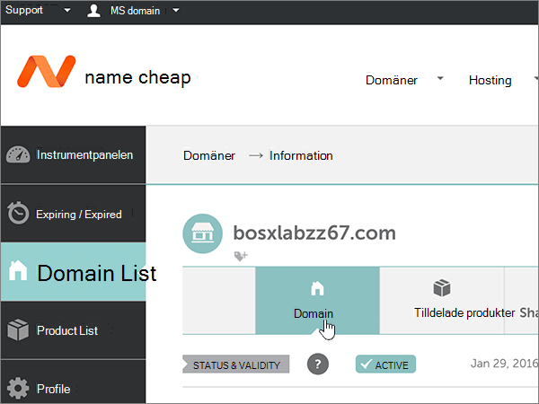

# Naamservers wijzigen voor het instellen van Office 365 bij Namecheap

 **[Raadpleeg de veelgestelde vragen over domeinen](../setup/domains-faq.md)** als u niet kunt vinden wat u zoekt.
  
Volg deze instructies als u wilt dat Office 365 uw DNS-records voor Office 365 voor u beheert. (Als u wilt, kunt u [al uw DNS-records voor Office 365 bij Namecheap beheren](create-dns-records-at-namecheap.md).)
  
    
## Een TXT-record toevoegen voor verificatie

1. Ga eerst naar de domeinenpagina bij Namecheap via [deze koppeling](https://www.namecheap.com/myaccount/login.aspx?ReturnUrl=%2f). U wordt gevraagd u aan te melden en verder te gaan.
    
    
  
2. Kies op de **bestemmingspagina** onder **Account**de optie **Lijst met domeinen** in de vervolgkeuzelijst. 
    
    
  
3. Zoek op de pagina **Domeinlijst** de naam van het domein dat u wilt bewerken en selecteer **Beheren**.
    
    
  
4. Selecteer **Geavanceerde DNS**.
    
    
  
5. Selecteer IN de sectie **HOST RECORDS** de optie NIEUWE **RECORD TOEVOEGEN**.
    
    
  
6. Selecteer in de vervolgkeuzelijst **Type** de optie **TXT Record**.
    
    > [!NOTE]
    > De vervolgkeuzelijst **Type** wordt automatisch weergegeven wanneer u **NIEUWE RECORD TOEVOEGEN selecteert.**
  
    
  
7. Typ of kopieer en plak de waarden uit de volgende tabel in de vakken voor de nieuwe record.
    
    (Kies de **TTL-waarde** in de vervolgkeuzelijst.) 
    
|**Type**|**Host**|**Value**|**TTL**|
|:-----|:-----|:-----|:-----|
|TXT    |@    |MS=ms *XXXXXXXX*    **Opmerking:** Dit is een voorbeeld. Gebruik hier de specifieke waarde voor **Doel of adres waarnaar wordt verwezen** uit de tabel in Office 365.           [Hoe kan ik dit vinden?](../get-help-with-domains/information-for-dns-records.md)          |30 min    |
   
   
  
8. Selecteer het besturingselement **Wijzigingen opslaan** (vinkje). 
    
    
  
9. Wacht enkele minuten voordat u verder gaat, zodat de record die u zojuist hebt gemaakt via internet kan worden bijgewerkt.
    
Nu u de record hebt toegevoegd aan de site van uw domeinregistrar, gaat u terug naar Office 365 en vraagt u of Office 365 naar de record wil zoeken.
  
Wanneer in Office 365 de juiste TXT-record is gevonden, is uw domein gecontroleerd.
  
1. Ga in het beheercentrum naar de pagina \> <a href="https://go.microsoft.com/fwlink/p/?linkid=834818" target="_blank">Instellingendomeinen.</a> **Settings**

    
2. Selecteer **op** de pagina Domeinen het domein dat u verifieert. 
    
    
  
3. Selecteer **op** de pagina Setup de optie **Installatie starten**.
    
    
  
4. Selecteer **op** de pagina Domein verifiëren de optie **Verifiëren**.
    
    
  
> [!NOTE]
>  Het duurt gewoonlijk ongeveer 15 minuten voordat DNS-wijzigingen van kracht worden. Het kan echter soms wat langer duren voordat een wijziging die u hebt aangebracht, is bijgewerkt via het DNS-systeem op internet. Als u na het toevoegen van de DNS-records problemen hebt met het ontvangen of verzenden van e-mail, raadpleegt u [Problemen oplossen nadat u uw domeinnaam of DNS-records hebt gewijzigd](../get-help-with-domains/find-and-fix-issues.md). 
  
## De naamserverrecords (NS-records) van uw domein wijzigen

U voltooit het instellen van uw domein met Office 365 door de NS-records van uw domein bij uw domeinregistrar te wijzigen, zodat deze verwijzen naar de primaire en secundaire naamservers van Office 365. Hiermee wordt Office 365 zo ingesteld dat de DNS-records van het domein voor u worden bijgewerkt. Alle benodigde records worden toegevoegd zodat e-mail, Skype voor Bedrijven Online en uw openbare website met uw domein kunnen werken. Daarna bent u klaar.
  
> [!CAUTION]
> Als u de NS-records van uw domein laat verwijzen naar de naamservers van Office 365, is dit van invloed op alle services die momenteel aan uw domein zijn gekoppeld. Zo wordt bijvoorbeeld alle e-mail die naar uw domein wordt verzonden (zoals william@ *uw_domein*  .com), naar Office 365 verzonden zodra u deze wijziging hebt aangebracht. 
  
> [!IMPORTANT]
>  Na het voltooien van de stappen in deze sectie, moeten  *alleen*  de volgende vier naamservers in de lijst staan: >  ns1.bdm.microsoftonline.com >  ns2.bdm.microsoftonline.com >  ns3.bdm.microsoftonline.com >  ns4.bdm.microsoftonline.com >  In de volgende procedure kunt u zien hoe u andere, ongewenste naamservers uit de lijst verwijdert en hoe u de  *juiste*  naamservers toevoegt als deze niet al in de lijst staan. 
  
1. Ga eerst naar de domeinenpagina bij Namecheap via [deze koppeling](https://www.namecheap.com/myaccount/login.aspx?ReturnUrl=%2f). U wordt gevraagd u aan te melden en verder te gaan.
    
    
  
2. Kies op de **bestemmingspagina** onder **Account**de optie **Lijst met domeinen** in de vervolgkeuzelijst. 
    
    
  
3. Zoek op de pagina **Domeinlijst** de naam van het domein dat u wilt bewerken en selecteer **Beheren**.
    
    
  
4. Selecteer **Domein**.
    
    
  
5. Ga naar de sectie **NAMESERVERS** en selecteer **Custom** in de vervolgkeuzelijst **Namecheap Default**. 
    
    
  
6. Afhankelijk van het feit of er al nameservers op de pagina staan die nu wordt weergegeven, gaat u verder met een van de twee volgende procedures.
    
### Als er nog GEEN naamservers worden vermeld

1. Selecteer **NaamSERVER toevoegen** twee maal om twee nieuwe rijen toe te voegen.
    
    
  
2. Typ of kopieer en plak de waarden uit de volgende tabel in de **Nameserver**-vakken.
    
|||
|:-----|:-----|
|**Nameserver 1**   |ns1.bdm.microsoftonline.com    |
|**Nameserver 2**   |ns2.bdm.microsoftonline.com    |
|**Nameserver 3**   |ns3.bdm.microsoftonline.com    |
|**Nameserver 4**   |ns4.bdm.microsoftonline.com    |
   
   
  
3. Selecteer het besturingselement **Opslaan** (vinkje). 
    
    
  
> [!NOTE]
> Het kan enige uren duren voordat de updates van uw naamserverrecords via het DNS-systeem op internet zijn doorgevoerd. Vervolgens worden uw e-mail voor Office 365 en andere services ingesteld voor gebruik met uw domein. 
  
### Als er WEL naamservers worden vermeld

> [!CAUTION]
> Voer deze stappen  *alleen*  uit als u andere bestaande naamservers hebt dan de vier  *juiste*  naamservers. (Dat wil zeggen, verwijder  *alleen*  huidige naamservers die een  *andere*  naam hebben dan **ns1.bdm.microsoftonline.com**, **ns2.bdm.microsoftonline.com**, **ns3.bdm.microsoftonline.com** of **ns4.bdm.microsoftonline.com**.) 
  
1. Als er andere naamservers in de **Nameserver**-vakken worden vermeld, verwijdert u elke vermelding door deze te selecteren en op de toets **Delete** op het toetsenbord te drukken. 
    
    
  
2. Selecteer **NaamSERVER toevoegen** twee maal om twee nieuwe rijen toe te voegen. 
    
    
  
3. Typ of kopieer en plak de waarden uit de volgende tabel in de **Nameserver**-vakken.
 
    
|||
|:-----|:-----|
|**Name Server 1**   |ns1.bdm.microsoftonline.com    |
|**Name Server 2**   |ns2.bdm.microsoftonline.com    |
|**Nameserver 3**   |ns3.bdm.microsoftonline.com    |
|**Nameserver 4**   |ns4.bdm.microsoftonline.com    |
   
   
  
4. Selecteer het besturingselement **Opslaan** (vinkje). 
    
    
  
> [!NOTE]
> Het kan enige uren duren voordat de updates van uw naamserverrecords via het DNS-systeem op internet zijn doorgevoerd. Vervolgens worden uw e-mail voor Office 365 en andere services ingesteld voor gebruik met uw domein.
