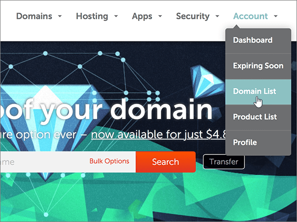

# Naamservers wijzigen voor het instellen van Microsoft met NamecheapChange nameservers to set up Microsoft with Namecheap

 **[Raadpleeg de veelgestelde vragen over domeinen](../setup/domains-faq.md)** als u niet kunt vinden wat u zoekt.**[Check the Domains FAQ](../setup/domains-faq.md)** if you don't find what you're looking for.
  
Voer de volgende instructies uit als u wilt dat Microsoft uw DNS-records voor u beheert.Follow these instructions if you want Microsoft to manage your DNS records for you. (Als u wilt, kunt u [al uw Microsoft DNS-records beheren op NameCheap](create-dns-records-at-namecheap.md).)(If you prefer, you can [manage all your Microsoft DNS records at Namecheap](create-dns-records-at-namecheap.md).)
  
    
## Een TXT-record toevoegen voor verificatieAdd a TXT record for verification

1. Ga eerst naar de domeinenpagina bij Namecheap via [deze koppeling](https://www.namecheap.com/myaccount/login.aspx?ReturnUrl=%2f). U wordt gevraagd u aan te melden en verder te gaan.To get started, go to your domains page at Namecheap by using [this link](https://www.namecheap.com/myaccount/login.aspx?ReturnUrl=%2f). You'll be prompted to Sign in and Continue.
    
    
  
2. Kies op de **openings** pagina onder **account**de optie **Domain List** in de vervolgkeuzelijst.On the **Landing** page, under **Account**, choose **Domain List** from the drop-down list. 
    
    
  
3. Zoek op de pagina **Domain List** de naam van het domein dat u wilt bewerken en selecteer vervolgens **Manage**.On the **Domain List** page, find the name of the domain that you want to edit, and then select **Manage**.
    
    
  
4. Selecteer **Advanced DNS**.Select **Advanced DNS**.
    
    
  
5. Selecteer in de sectie **host records** de optie **add new record**.In the **HOST RECORDS** section, select **ADD NEW RECORD**.
    
    
  
6. Selecteer in de vervolgkeuzelijst **Type** de optie **TXT Record**.In the **Type** drop-down, select **TXT Record**.
    
    > [!NOTE]
    > De vervolgkeuzelijst **type** wordt automatisch weergegeven wanneer u **nieuwe record toevoegen**selecteert.The **Type** drop-down automatically appears when you select **ADD NEW RECORD**.
  
    
  
7. Typ of kopieer en plak de waarden uit de volgende tabel in de vakken voor de nieuwe record.In the boxes for the new record, type or copy and paste the values from the following table.
    
    (Kies de waarde **TTL** in de vervolgkeuzelijst.)(Choose the **TTL** value from the drop-down list.) 
    
|**Type****Type**|**Host****Host**|**Waarde****Value**|**TTL****TTL**|
|:-----|:-----|:-----|:-----|
|TXTTXT    |@    |MS=ms *XXXXXXXX*MS=ms *XXXXXXXX*    **Opmerking:** Dit is een voorbeeld.**Note**: This is an example. Gebruik hier de specifieke waarde voor **Doel of adres waarnaar wordt verwezen** uit de tabel.Use your specific **Destination or Points to Address** value here, from the table.           [Hoe kan ik dit vinden?How do I find this?](../get-help-with-domains/information-for-dns-records.md)          |30 min30 min    |
   
   
  
8. Selecteer het besturingselement **wijzigingen opslaan** (vinkje).Select the **Save Changes** (check mark) control. 
    
    
  
9. Wacht enkele minuten voordat u verder gaat, zodat de record die u zojuist hebt gemaakt via internet kan worden bijgewerkt.Wait a few minutes before you continue, so that the record you just created can update across the Internet.
    
Nu u de record hebt toegevoegd aan de site van uw domeinregistratie, gaat u terug naar Microsoft en vraagt u naar de record.Now that you've added the record at your domain registrar's site, you'll go back to Microsoft and request a search for the record.
  
Wanneer in Microsoft de juiste TXT-record is gevonden, is uw domein gecontroleerd.When Microsoft finds the correct TXT record, your domain is verified.
  
1. Ga in het beheercentrum naar **Instellingen** \> <a href="https://go.microsoft.com/fwlink/p/?linkid=834818" target="_blank">Domeinen</a>-pagina.In the admin center, go to the **Settings** \> <a href="https://go.microsoft.com/fwlink/p/?linkid=834818" target="_blank">Domains</a> page.

    
2. Kies op de pagina **Domeinen** de naam van het domein dat u verifieert.On the **Domains** page, select the domain that you are verifying. 
    
    
  
3. Kies **Start setup** op de pagina **Setup**.On the **Setup** page, select **Start setup**.
    
    
  
4. Kies **Verifiëren** op de pagina **Domein verifiëren**.On the **Verify domain** page, select **Verify**.
    
    
  
> [!NOTE]
>  Het duurt gewoonlijk ongeveer 15 minuten voordat DNS-wijzigingen van kracht worden. Het kan echter soms wat langer duren voordat een wijziging die u hebt aangebracht, is bijgewerkt via het DNS-systeem op internet. Als u na het toevoegen van de DNS-records problemen hebt met het ontvangen of verzenden van e-mail, raadpleegt u [Problemen oplossen nadat u uw domeinnaam of DNS-records hebt gewijzigd](../get-help-with-domains/find-and-fix-issues.md).Typically it takes about 15 minutes for DNS changes to take effect. However, it can occasionally take longer for a change you've made to update across the Internet's DNS system. If you're having trouble with mail flow or other issues after adding DNS records, see [Troubleshoot issues after changing your domain name or DNS records](../get-help-with-domains/find-and-fix-issues.md). 
  
## De naamserverrecords (NS-records) van uw domein wijzigenChange your domain's nameserver (NS) records

Om het instellen van uw domein met Microsoft te voltooien, kunt u de NS-records van uw domein bij uw domeinregistratie wijzigen zodat deze verwijzen naar de primaire en secundaire naamservers van Microsoft.To complete setting up your domain with Microsoft, you change your domain's NS records at your domain registrar to point to the Microsoft primary and secondary name servers. Hierdoor wordt Microsoft zodanig geconfigureerd dat de DNS-records van het domein voor u worden bijgewerkt.This sets up Microsoft to update the domain's DNS records for you. We toevoegen alle records, zodat e-mail, Skype voor bedrijven online en uw openbare website met uw domein werken, en u bent klaar.We'll add all records so that email, Skype for Business Online, and your public website work with your domain, and you'll be all set.
  
> [!CAUTION]
> Als u de naamserver records van uw domein wijzigt zodat ze verwijzen naar de Microsoft-naamservers, worden dit van invloed op alle services die op dat moment zijn gekoppeld aan uw domein.When you change your domain's NS records to point to the Microsoft name servers, all the services that are currently associated with your domain are affected. Alle e-mailberichten die naar uw domein zijn verzonden (zoals rob@ *your_domain*  . com) worden bijvoorbeeld beschikbaar gemaakt voor Microsoft nadat u deze wijziging hebt aangebracht.For example, all email sent to your domain (like rob@ *your_domain*  .com) will start coming to Microsoft after you make this change. 
  
> [!IMPORTANT]
>  Na het voltooien van de stappen in deze sectie, moeten  *alleen*  de volgende vier naamservers in de lijst staan: >  ns1.bdm.microsoftonline.com >  ns2.bdm.microsoftonline.com >  ns3.bdm.microsoftonline.com >  ns4.bdm.microsoftonline.com >  In de volgende procedure kunt u zien hoe u andere, ongewenste naamservers uit de lijst verwijdert en hoe u de  *juiste*  naamservers toevoegt als deze niet al in de lijst staan.When you have completed the steps in this section, the  *only*  nameservers that should be listed are these four: >  ns1.bdm.microsoftonline.com >  ns2.bdm.microsoftonline.com >  ns3.bdm.microsoftonline.com >  ns4.bdm.microsoftonline.com >  The following procedure will show you how to delete any other, unwanted nameservers from the list, and also how to add the  *correct*  nameservers if they are not already in the list. 
  
1. Ga eerst naar de domeinenpagina bij Namecheap via [deze koppeling](https://www.namecheap.com/myaccount/login.aspx?ReturnUrl=%2f). U wordt gevraagd u aan te melden en verder te gaan.To get started, go to your domains page at Namecheap by using [this link](https://www.namecheap.com/myaccount/login.aspx?ReturnUrl=%2f). You'll be prompted to Sign in and Continue.
    
    
  
2. Kies op de **openings** pagina onder **account**de optie **Domain List** in de vervolgkeuzelijst.On the **Landing** page, under **Account**, choose **Domain List** from the drop-down list. 
    
    
  
3. Zoek op de pagina **Domain List** de naam van het domein dat u wilt bewerken en selecteer vervolgens **Manage**.On the **Domain List** page, find the name of the domain that you want to edit, and then select **Manage**.
    
    
  
4. Selecteer **Domain**.Select **Domain**.
    
    
  
5. Ga naar de sectie **NAMESERVERS** en selecteer **Custom** in de vervolgkeuzelijst **Namecheap Default**.Find the **NAMESERVERS** section, and then select **Custom** from the **Namecheap Default** drop-down list. 
    
    
  
6. Afhankelijk van of er al naamservers worden vermeld op de pagina die wordt weergegeven, gaat u op een van de volgende twee manieren verder:Depending on whether or not there are already nameservers listed on the page that is displayed now, continue to one of the two following procedures.
    
### Als er nog GEEN naamservers worden vermeldIf there are NO nameservers already listed

1. Selecteer tweemaal **add naamserver** om twee nieuwe rijen toe te voegen.Select **ADD NAMESERVER** twice to add two new rows.
    
    
  
2. Typ of kopieer en plak de waarden uit de volgende tabel in de **Nameserver**-vakken.In the **Nameserver** boxes, type or copy and paste the values from the following table.
    
|||
|:-----|:-----|
|**Nameserver 1****Nameserver 1**   |ns1.bdm.microsoftonline.comns1.bdm.microsoftonline.com    |
|**Nameserver 2****Nameserver 2**   |ns2.bdm.microsoftonline.comns2.bdm.microsoftonline.com    |
|**Nameserver 3****Nameserver 3**   |ns3.bdm.microsoftonline.comns3.bdm.microsoftonline.com    |
|**Nameserver 4****Nameserver 4**   |ns4.bdm.microsoftonline.comns4.bdm.microsoftonline.com    |
   
   
  
3. Het besturingselement **Opslaan** (vinkje) selecterenSelect the **Save** (check mark) control. 
    
    
  
> [!NOTE]
> Het kan enige uren duren voordat de updates van uw naamserverrecords via het DNS-systeem op internet zijn doorgevoerd.Your nameserver record updates may take up to several hours to update across the Internet's DNS system. Vervolgens zijn uw Microsoft-e-mail en andere services allemaal ingesteld voor gebruik met uw domein.Then your Microsoft email and other services will be all set to work with your domain. 
  
### Als er WEL naamservers worden vermeldIf there ARE nameservers already listed

> [!CAUTION]
> Voer deze stappen  *alleen*  uit als u andere bestaande naamservers hebt dan de vier  *juiste*  naamservers. (Dat wil zeggen, verwijder  *alleen*  huidige naamservers die een  *andere*  naam hebben dan **ns1.bdm.microsoftonline.com**, **ns2.bdm.microsoftonline.com**, **ns3.bdm.microsoftonline.com** of **ns4.bdm.microsoftonline.com**.)Follow these steps  *only*  if you have existing nameservers other than the four  *correct*  nameservers. (That is, delete  *only*  any current nameservers that are  *not*  named **ns1.bdm.microsoftonline.com**, **ns2.bdm.microsoftonline.com**, **ns3.bdm.microsoftonline.com**, or **ns4.bdm.microsoftonline.com**.) 
  
1. Als er andere naamservers in de **Nameserver**-vakken worden vermeld, verwijdert u elke vermelding door deze te selecteren en op de toets **Delete** op het toetsenbord te drukken.If there are any other nameservers listed in the **Nameserver** boxes, delete each one by selecting it and then pressing the **Delete** key on your keyboard. 
    
    
  
2. Selecteer tweemaal **add naamserver** om twee nieuwe rijen toe te voegen.Select **ADD NAMESERVER** twice to add two new rows. 
    
    
  
3. Typ of kopieer en plak de waarden uit de volgende tabel in de **Nameserver**-vakken.In the **Nameserver** boxes, type or copy and paste the values from the following table.
 
    
|||
|:-----|:-----|
|**Name Server 1****Name Server 1**   |ns1.bdm.microsoftonline.comns1.bdm.microsoftonline.com    |
|**Name Server 2****Name Server 2**   |ns2.bdm.microsoftonline.comns2.bdm.microsoftonline.com    |
|**Nameserver 3****Nameserver 3**   |ns3.bdm.microsoftonline.comns3.bdm.microsoftonline.com    |
|**Nameserver 4****Nameserver 4**   |ns4.bdm.microsoftonline.comns4.bdm.microsoftonline.com    |
   
   
  
4. Het besturingselement **Opslaan** (vinkje) selecterenSelect the **Save** (check mark) control. 
    
    
  
> [!NOTE]
> Het kan enige uren duren voordat de updates van uw naamserverrecords via het DNS-systeem op internet zijn doorgevoerd.Your nameserver record updates may take up to several hours to update across the Internet's DNS system. Vervolgens zijn uw Microsoft-e-mail en andere services allemaal ingesteld voor gebruik met uw domein.Then your Microsoft email and other services will be all set to work with your domain.
