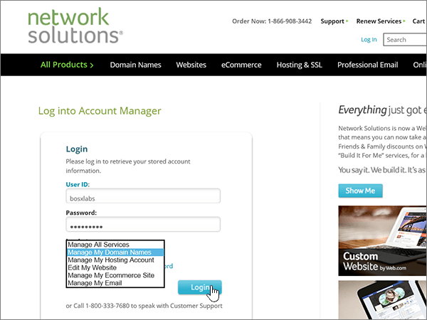
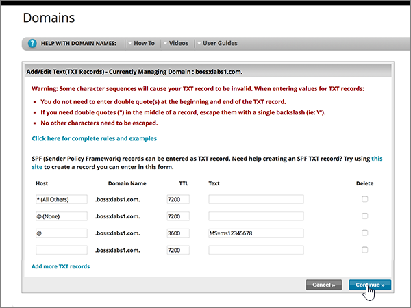
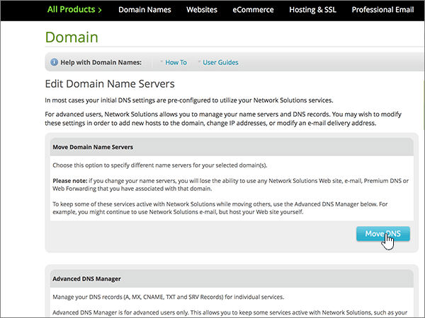

# Naamservers wijzigen voor het instellen van Microsoft met Network Solutions

 **[Raadpleeg de veelgestelde vragen over domeinen](../setup/domains-faq.md)** als u niet kunt vinden wat u zoekt.
  
Voer de volgende instructies uit als u wilt dat Microsoft uw DNS-records voor u beheert. (Als u wilt, kunt u [al uw Microsoft DNS-records beheren bij Network Solutions](create-dns-records-at-network-solutions.md).)
  
    
## Een TXT-record toevoegen op Network Solutions om te bevestigen dat u eigenaar van het domein bent

Voordat u uw domein met Microsoft kunt gebruiken, moet worden gecontroleerd dat u de eigenaar bent van het domein. Als u zich bij uw account bij de domeinregistrar kunt aanmelden en de DNS-record kunt maken, is dit voor Microsoft bewezen.
  
> [!NOTE]
> Deze record wordt alleen gebruikt om te verifiëren dat u de eigenaar van uw domein bent. Dit heeft verder geen invloed. U kunt deze record later desgewenst verwijderen. 
  
Volg onderstaande stappen of [bekijk de video (start op 0:47)](https://support.microsoft.com/office/69b092e3-c026-4d19-a7d0-16cdb2d8b261).
  
1. Als u wilt beginnen, gaat u [via deze koppeling](https://www.networksolutions.com/manage-it) naar uw pagina met domeinen bij Network Solutions. U wordt gevraagd u aan te melden.
    
    > [!IMPORTANT]
    > Voordat u de knop **login** selecteert, kiest u eerst **Manage My Domain names** in de vervolgkeuzelijst **Log in to:** .
  
    
  
2. Schakel het selectievakje in naast de naam van het domein dat u wilt wijzigen.
    
    
  
3. Selecteer **Edit DNS**.
    
    
  
4. Selecteer **Manage Advanced DNS records**.
    
    (Mogelijk moet u omlaag schuiven.)
    
    
  
5. Schuif omlaag naar de sectie **Text (TXT records)** en selecteer vervolgens **Edit TXT records**.
    
    
  
6. Typ of kopieer en plak de waarden uit de volgende tabel in de vakken voor de nieuwe record.
    
|**Host**|**TTL**|**Tekst**|
|:-----|:-----|:-----|
|@    (In het systeem wordt deze waarde gewijzigd in **@ (None)** wanneer u de record opslaat.)    |3600    |MS=ms *XXXXXXXX*    **Opmerking:** Dit is een voorbeeld. Gebruik hier de specifieke waarde voor **Doel of adres waarnaar wordt verwezen** uit de tabel in Microsoft 365.           [Hoe kan ik dit vinden?](../get-help-with-domains/information-for-dns-records.md)
   
    
   
  
7. Selecteer **Doorgaan**.
    
    
  
8. Selecteer **Save Changes**.
    
    
  
9. Wacht enkele minuten voordat u verder gaat, zodat de record die u zojuist hebt gemaakt via internet kan worden bijgewerkt.
    
Nu u de record hebt toegevoegd aan de site van uw domeinregistrar, gaat u terug naar Microsoft 365 en vraagt u of Microsoft 365 naar de record wil zoeken.
  
Wanneer in Microsoft de juiste TXT-record is gevonden, is uw domein gecontroleerd.
  
1. Ga in het Microsoft-beheercentrum naar **Instellingen** \> <a href="https://go.microsoft.com/fwlink/p/?linkid=834818" target="_blank">Domeinen</a>-pagina.

    
2. Kies op de pagina **Domeinen** de naam van het domein dat u verifieert. 
    
    
  
3. Kies **Start setup** op de pagina **Setup**.
    
    
  
4. Kies **Verifiëren** op de pagina **Domein verifiëren**.
    
    
  
> [!NOTE]
>  Het duurt gewoonlijk ongeveer 15 minuten voordat DNS-wijzigingen van kracht worden. Het kan echter soms wat langer duren voordat een wijziging die u hebt aangebracht, is bijgewerkt via het DNS-systeem op internet. Als u na het toevoegen van de DNS-records problemen hebt met het ontvangen of verzenden van e-mail, raadpleegt u [Problemen oplossen nadat u uw domeinnaam of DNS-records hebt gewijzigd](../get-help-with-domains/find-and-fix-issues.md). 
  
## De naamserverrecords (NS-records) van uw domein wijzigen

Om het instellen van uw domein met Microsoft te voltooien, kunt u de NS-records van uw domein bij uw domeinregistratie wijzigen zodat deze verwijzen naar de primaire en secundaire naamservers van Microsoft. Hierdoor wordt Microsoft zodanig geconfigureerd dat de DNS-records van het domein voor u worden bijgewerkt. We toevoegen alle records, zodat e-mail, Skype voor bedrijven online en uw openbare website met uw domein werken, en u bent klaar.
  
> [!CAUTION]
> Als u de naamserver records van uw domein wijzigt zodat ze verwijzen naar de Microsoft-naamservers, worden dit van invloed op alle services die op dat moment zijn gekoppeld aan uw domein. Alle e-mailberichten die naar uw domein zijn verzonden (zoals rob@ *your_domain*  . com) worden bijvoorbeeld beschikbaar gemaakt voor Microsoft nadat u deze wijziging hebt aangebracht.
  
Bent u klaar voor het wijzigen van uw NS-records zodat Microsoft uw domein kan instellen? Volg onderstaande stappen of [bekijk de video (start bij 2:23)](https://support.microsoft.com/office/69b092e3-c026-4d19-a7d0-16cdb2d8b261).
  
> [!IMPORTANT]
>  Wanneer u de stappen in deze sectie hebt voltooid, kunt u  *alleen*  de volgende vier naamservers in de lijst vinden **: ns1.BDM.microsoftonline.com**, **ns2.BDM.microsoftonline.com**, **ns3.BDM.microsoftonline.com**en **ns4.BDM.microsoftonline.com**. In de volgende procedure kunt u zien hoe u andere, ongewenste naamservers uit de lijst verwijdert en hoe u de  *juiste*  naamservers toevoegt als deze niet al in de lijst staan. 
  
1. Als u wilt beginnen, gaat u [via deze koppeling](https://www.networksolutions.com/manage-it) naar uw pagina met domeinen bij Network Solutions. U wordt gevraagd u aan te melden.
    
    > [!IMPORTANT]
    > Voordat u de knop **login** selecteert, kiest u eerst **Manage My Domain names** in de vervolgkeuzelijst **Log in to:** . 
  
    
  
2. Schakel het selectievakje in naast de naam van het domein dat u wilt wijzigen.
    
    
  
3. Selecteer **Edit DNS**.
    
    
  
4. Selecteer **DNS verplaatsen**.
    
    
  
5. Afhankelijk van of er al naamservers worden vermeld op de pagina die wordt weergegeven, gaat u op een van de volgende twee manieren verder:
    
  - Als er nog **GEEN** naamservers worden vermeld, [Als er nog GEEN naamservers worden vermeld](#if-there-are-no-nameservers-already-listed).
    
  - Als er **WEL** naamservers worden vermeld, [Als er WEL naamservers worden vermeld](#if-there-are-nameservers-already-listed).
    
### Als er nog GEEN naamservers worden vermeld

1. Selecteer op de pagina **Domains** , in de sectie **Specify domain name servers** , de optie **add more name servers**.
    
    
  
2. Typ of kopieer en plak de naamserverwaarden uit de volgende tabel naar de pagina **Domain Names**. 
    
|||
|:-----|:-----|
|**Name Server 1**   |ns1.bdm.microsoftonline.com    |
|**Name Server 2**   |ns2.bdm.microsoftonline.com    |
|**Name Server 2**   |ns3.bdm.microsoftonline.com    |
|**Name Server 2**   |ns4.bdm.microsoftonline.com    |
   
    

  
3. Selecteer **DNS verplaatsen**.
    
    
  
4. Selecteer **Save Changes**.
    
    
  
> [!NOTE]
> Het kan enige uren duren voordat de updates van uw naamserverrecords via het DNS-systeem op internet zijn doorgevoerd. Vervolgens zijn uw Microsoft-e-mail en andere services allemaal ingesteld voor gebruik met uw domein. 
  
### Als er WEL naamservers worden vermeld

> [!CAUTION]
> Voer deze stappen  *alleen*  uit als u andere bestaande naamservers hebt dan de vier  *juiste*  naamservers. (Dat wil zeggen, verwijder  *alleen*  huidige naamservers die een  *andere*  naam hebben dan **ns1.bdm.microsoftonline.com**, **ns2.bdm.microsoftonline.com**, **ns3.bdm.microsoftonline.com** of **ns4.bdm.microsoftonline.com**.)
  
1. Als er andere naamservers worden vermeld, verwijdert u elke vermelding door deze te selecteren en vervolgens te drukken op de toets **Delete** op het toetsenbord.
    
    
  
2. Selecteer **add more name servers**.
    
    
  
3. Typ of kopieer en plak de naamserverwaarden uit de volgende tabel naar de pagina **Domain Names**. 
    
|||
|:-----|:-----|
|**Name Server 1**   |ns1.bdm.microsoftonline.com    |
|**Name Server 2**   |ns2.bdm.microsoftonline.com    |
|**Name Server 3**   |ns3.bdm.microsoftonline.com    |
|**Name Server 4**   |ns4.bdm.microsoftonline.com    |
   
    

  
4. Selecteer **DNS verplaatsen**.
    
    
  
5. Selecteer **Save Changes.**
    
    
  
> [!NOTE]
> Het kan enige uren duren voordat de updates van uw naamserverrecords via het DNS-systeem op internet zijn doorgevoerd. Vervolgens zijn uw Microsoft-e-mail en andere services allemaal ingesteld voor gebruik met uw domein.
