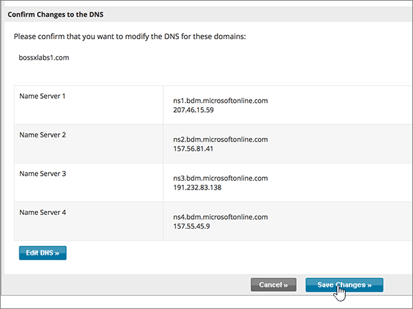

# Naamservers wijzigen om Microsoft in te stellen met Network SolutionsChange nameservers to set up Microsoft with Network Solutions

 **[Raadpleeg de veelgestelde vragen over domeinen](../setup/domains-faq.md)** als u niet kunt vinden wat u zoekt.**[Check the Domains FAQ](../setup/domains-faq.md)** if you don't find what you're looking for.
  
Volg deze instructies als u wilt dat Microsoft uw DNS-records voor u beheert.Follow these instructions if you want Microsoft to manage your DNS records for you. (Als u dat liever hebt, u [al uw DNS-records van Microsoft beheren bij Network Solutions](create-dns-records-at-network-solutions.md).)(If you prefer, you can [manage all your Microsoft DNS records at Network Solutions](create-dns-records-at-network-solutions.md).)
  
    
## Een TXT-record toevoegen op Network Solutions om te bevestigen dat u eigenaar van het domein bentAdd a TXT record at Network Solutions to verify that you own the domain

Voordat u uw domein met Microsoft kunt gebruiken, moet worden gecontroleerd dat u de eigenaar bent van het domein. Als u zich bij uw account bij de domeinregistrar kunt aanmelden en de DNS-record kunt maken, is dit voor Microsoft bewezen.Before you use your domain with Microsoft, we have to make sure that you own it. Your ability to log in to your account at your domain registrar and create the DNS record proves to Microsoft that you own the domain.
  
> [!NOTE]
> Deze record wordt alleen gebruikt om te verifiëren dat u de eigenaar van uw domein bent. Dit heeft verder geen invloed. U kunt deze record later desgewenst verwijderen.This record is used only to verify that you own your domain; it doesn't affect anything else. You can delete it later, if you like. 
  
Volg onderstaande stappen of [bekijk de video (start op 0:47)](https://support.microsoft.com/office/69b092e3-c026-4d19-a7d0-16cdb2d8b261).Follow the steps below or [watch the video (start at 0:47)](https://support.microsoft.com/office/69b092e3-c026-4d19-a7d0-16cdb2d8b261).
  
1. Als u wilt beginnen, gaat u [via deze koppeling](https://www.networksolutions.com/manage-it) naar uw pagina met domeinen bij Network Solutions. U wordt gevraagd u aan te melden.To get started, go to your domains page at Network Solutions by using [this link](https://www.networksolutions.com/manage-it). You'll be prompted to log in.
    
    > [!IMPORTANT]
    > Voordat u de **knop Aanmelden** selecteert, kiest u Eerst **Mijn domeinnamen beheren** in de vervolgkeuzelijst Aanmelden **bij:**Before you select the **Login** button, first choose **Manage My Domain Names** in the **Log In to:** drop-down list.
  
    
  
2. Schakel het selectievakje in naast de naam van het domein dat u wilt wijzigen.Select the check box next to the name of the domain that you are modifying.
    
    
  
3. Selecteer **DNS bewerken**.Select **Edit DNS**.
    
    
  
4. Selecteer **Geavanceerde DNS-records beheren**.Select **Manage Advanced DNS Records**.
    
    (Mogelijk moet u omlaag schuiven.)(You may have to scroll down.)
    
    
  
5. Schuif omlaag naar de sectie **Tekst (TXT Records)** en selecteer **TXT-records bewerken**.Scroll down to the **Text (TXT Records)** section, and then select **Edit TXT Records**.
    
    
  
6. Typ of kopieer en plak de waarden uit de volgende tabel in de vakken voor de nieuwe record.In the boxes for the new record, type or copy and paste the values in the following table.
    
|**Host****Host**|**TTL****TTL**|**Tekst****Text**|
|:-----|:-----|:-----|
|@    (In het systeem wordt deze waarde gewijzigd in **@ (None)** wanneer u de record opslaat.)(The system will change this value to **@ (None)** when you save the record.)    |36003600    |MS=ms *XXXXXXXX*MS=ms *XXXXXXXX*    **Opmerking:** Dit is een voorbeeld.**Note**: This is an example. Gebruik hier de specifieke waarde voor **Doel of adres waarnaar wordt verwezen** uit de tabel in Microsoft 365.Use your specific **Destination or Points to Address** value here, from the table in Microsoft 365.           [Hoe kan ik dit vinden?How do I find this?](../get-help-with-domains/information-for-dns-records.md)
   
    
   
  
7. Selecteer **Doorgaan**.Select **Continue**.
    
    
  
8. Selecteer **Wijzigingen opslaan**.Select **Save Changes**.
    
    
  
9. Wacht enkele minuten voordat u verder gaat, zodat de record die u zojuist hebt gemaakt via internet kan worden bijgewerkt.Wait a few minutes before you continue, so that the record you just created can update across the Internet.
    
Nu u de record hebt toegevoegd aan de site van uw domeinregistrar, gaat u terug naar Microsoft 365 en vraagt u of Microsoft 365 naar de record wil zoeken.Now that you've added the record at your domain registrar's site, you'll go back to Microsoft 365 and request Microsoft 365 to look for the record.
  
Wanneer in Microsoft de juiste TXT-record is gevonden, is uw domein gecontroleerd.When Microsoft finds the correct TXT record, your domain is verified.
  
1. Ga in het Microsoft-beheercentrum naar **Instellingen** \> <a href="https://go.microsoft.com/fwlink/p/?linkid=834818" target="_blank">Domeinen</a>-pagina.In the Microsoft admin center, go to the **Settings** \> <a href="https://go.microsoft.com/fwlink/p/?linkid=834818" target="_blank">Domains</a> page.

    
2. Kies op de pagina **Domeinen** de naam van het domein dat u verifieert.On the **Domains** page, select the domain that you are verifying. 
    
    
  
3. Kies **Start setup** op de pagina **Setup**.On the **Setup** page, select **Start setup**.
    
    
  
4. Kies **Verifiëren** op de pagina **Domein verifiëren**.On the **Verify domain** page, select **Verify**.
    
    
  
> [!NOTE]
>  Het duurt gewoonlijk ongeveer 15 minuten voordat DNS-wijzigingen van kracht worden. Het kan echter soms wat langer duren voordat een wijziging die u hebt aangebracht, is bijgewerkt via het DNS-systeem op internet. Als u na het toevoegen van de DNS-records problemen hebt met het ontvangen of verzenden van e-mail, raadpleegt u [Problemen oplossen nadat u uw domeinnaam of DNS-records hebt gewijzigd](../get-help-with-domains/find-and-fix-issues.md).Typically it takes about 15 minutes for DNS changes to take effect. However, it can occasionally take longer for a change you've made to update across the Internet's DNS system. If you're having trouble with mail flow or other issues after adding DNS records, see [Troubleshoot issues after changing your domain name or DNS records](../get-help-with-domains/find-and-fix-issues.md). 
  
## De naamserverrecords (NS-records) van uw domein wijzigenChange your domain's nameserver (NS) records

Als u het instellen van uw domein met Microsoft wilt voltooien, wijzigt u de NS-records van uw domein bij uw domeinregistrar om naar de primaire en secundaire naamservers van Microsoft te wijzen.To complete setting up your domain with Microsoft, you change your domain's NS records at your domain registrar to point to the Microsoft primary and secondary name servers. Hiermee wordt Microsoft ingesteld om de DNS-records van het domein voor u bij te werken.This sets up Microsoft to update the domain's DNS records for you. We voegen alle records toe, zodat e-mail, Skype voor Bedrijven Online en uw openbare website met uw domein werken en u helemaal klaar bent.We'll add all records so that email, Skype for Business Online, and your public website work with your domain, and you'll be all set.
  
> [!CAUTION]
> Wanneer u de NS-records van uw domein wijzigt om naar de Microsoft-naamservers te wijzen, worden alle services beïnvloed die momenteel aan uw domein zijn gekoppeld.When you change your domain's NS records to point to the Microsoft name servers, all the services that are currently associated with your domain are affected. Alle e-mail die naar uw domein wordt verzonden (zoals rob@ *your_domain* .com) komt bijvoorbeeld naar Microsoft nadat u deze wijziging hebt gewijzigd.For example, all email sent to your domain (like rob@ *your_domain*  .com) will start coming to Microsoft after you make this change.
  
Klaar om uw NS-records te wijzigen, zodat Microsoft uw domein kan instellen?Ready to change your NS records so Microsoft can set up your domain? Volg onderstaande stappen of [bekijk de video (start bij 2:23)](https://support.microsoft.com/office/69b092e3-c026-4d19-a7d0-16cdb2d8b261).Follow the steps below or [watch the video (start at 2:23)](https://support.microsoft.com/office/69b092e3-c026-4d19-a7d0-16cdb2d8b261).
  
> [!IMPORTANT]
>  Wanneer u de stappen in deze sectie hebt voltooid, zijn de *enige* naamservers die moeten worden vermeld, deze vier: **ns1.bdm.microsoftonline.com,** **ns2.bdm.microsoftonline.com**, **ns3.bdm.microsoftonline.com**en **ns4.bdm.microsoftonline.com**.When you have completed the steps in this section, the  *only*  nameservers that should be listed are these four: **ns1.bdm.microsoftonline.com**, **ns2.bdm.microsoftonline.com**, **ns3.bdm.microsoftonline.com**, and **ns4.bdm.microsoftonline.com**. In de volgende procedure kunt u zien hoe u andere, ongewenste naamservers uit de lijst verwijdert en hoe u de  *juiste*  naamservers toevoegt als deze niet al in de lijst staan.The following procedure will show you how to delete any other, unwanted nameservers from the list, and also how to add the  *correct*  nameservers if they are not already in the list. 
  
1. Als u wilt beginnen, gaat u [via deze koppeling](https://www.networksolutions.com/manage-it) naar uw pagina met domeinen bij Network Solutions.To get started, go to your domains page at Network Solutions by using [this link](https://www.networksolutions.com/manage-it). U wordt gevraagd u aan te melden.You'll be prompted to log in.
    
    > [!IMPORTANT]
    > Voordat u de **knop Aanmelden** selecteert, kiest u Eerst **Mijn domeinnamen beheren** in de vervolgkeuzelijst Aanmelden **bij:**Before you select the **Login** button, first choose **Manage My Domain Names** in the **Log In to:** drop-down list. 
  
    
  
2. Schakel het selectievakje in naast de naam van het domein dat u wilt wijzigen.Select the check box next to the name of the domain that you are modifying.
    
    
  
3. Selecteer **DNS bewerken**.Select **Edit DNS**.
    
    
  
4. Selecteer **DNS verplaatsen**.Select **Move DNS**.
    
    
  
5. Afhankelijk van of er al naamservers worden vermeld op de pagina die wordt weergegeven, gaat u op een van de volgende twee manieren verder:Depending on whether or not there are already nameservers listed on the page that is displayed now, continue to one of the two following procedures:
    
  - Als er nog **GEEN** naamservers worden vermeld, [Als er nog GEEN naamservers worden vermeld](#if-there-are-no-nameservers-already-listed).If there are **NO** nameservers already listed, [If there are NO nameservers already listed](#if-there-are-no-nameservers-already-listed).
    
  - Als er **WEL** naamservers worden vermeld, [Als er WEL naamservers worden vermeld](#if-there-are-nameservers-already-listed).If there **ARE** nameservers already listed, [If there ARE nameservers already listed](#if-there-are-nameservers-already-listed).
    
### Als er nog GEEN naamservers worden vermeldIf there are NO nameservers already listed

1. Selecteer op de pagina **Domeinen** in de sectie **Domeinnaamservers opgeven** de optie Meer **naamservers toevoegen**.On the **Domains** page, in the **Specify Domain Name Servers** section, select **Add More Name Servers**.
    
    
  
2. Typ of kopieer en plak de naamserverwaarden uit de volgende tabel naar de pagina **Domain Names**.On the **Domain Names** page, type or copy and paste the nameserver values from the following table. 
    
|||
|:-----|:-----|
|**Name Server 1****Name Server 1**   |ns1.bdm.microsoftonline.comns1.bdm.microsoftonline.com    |
|**Name Server 2****Name Server 2**   |ns2.bdm.microsoftonline.comns2.bdm.microsoftonline.com    |
|**Name Server 2****Name Server 2**   |ns3.bdm.microsoftonline.comns3.bdm.microsoftonline.com    |
|**Name Server 2****Name Server 2**   |ns4.bdm.microsoftonline.comns4.bdm.microsoftonline.com    |
   
    

  
3. Selecteer **DNS verplaatsen**.Select **Move DNS**.
    
    
  
4. Selecteer **Wijzigingen opslaan**.Select **Save Changes**.
    
    
  
> [!NOTE]
> Het kan enige uren duren voordat de updates van uw naamserverrecords via het DNS-systeem op internet zijn doorgevoerd.Your nameserver record updates may take up to several hours to update across the Internet's DNS system. Vervolgens zijn uw Microsoft-e-mail en andere services helemaal klaar om met uw domein te werken.Then your Microsoft email and other services will be all set to work with your domain. 
  
### Als er WEL naamservers worden vermeldIf there ARE nameservers already listed

> [!CAUTION]
> Voer deze stappen  *alleen*  uit als u andere bestaande naamservers hebt dan de vier  *juiste*  naamservers. (Dat wil zeggen, verwijder  *alleen*  huidige naamservers die een  *andere*  naam hebben dan **ns1.bdm.microsoftonline.com**, **ns2.bdm.microsoftonline.com**, **ns3.bdm.microsoftonline.com** of **ns4.bdm.microsoftonline.com**.)Follow these steps  *only*  if you have existing nameservers other than the four  *correct*  nameservers. (That is, delete  *only*  any current nameservers that are  *not*  named **ns1.bdm.microsoftonline.com**, **ns2.bdm.microsoftonline.com**, **ns3.bdm.microsoftonline.com**, or **ns4.bdm.microsoftonline.com**.)
  
1. Als er andere naamservers worden vermeld, verwijdert u elke vermelding door deze te selecteren en vervolgens te drukken op de toets **Delete** op het toetsenbord.If there are any other nameservers listed, delete each one by selecting it and then pressing the **Delete** key on your keyboard.
    
    
  
2. Selecteer **Meer naamservers toevoegen**.Select **Add More Name Servers**.
    
    
  
3. Typ of kopieer en plak de naamserverwaarden uit de volgende tabel naar de pagina **Domain Names**.On the **Domain Names** page, type or copy and paste the nameserver values from the following table. 
    
|||
|:-----|:-----|
|**Name Server 1****Name Server 1**   |ns1.bdm.microsoftonline.comns1.bdm.microsoftonline.com    |
|**Name Server 2****Name Server 2**   |ns2.bdm.microsoftonline.comns2.bdm.microsoftonline.com    |
|**Name Server 3****Name Server 3**   |ns3.bdm.microsoftonline.comns3.bdm.microsoftonline.com    |
|**Name Server 4****Name Server 4**   |ns4.bdm.microsoftonline.comns4.bdm.microsoftonline.com    |
   
    

  
4. Selecteer **DNS verplaatsen**.Select **Move DNS**.
    
    
  
5. Selecteer **Wijzigingen opslaan.**Select **Save Changes.**
    
    
  
> [!NOTE]
> Het kan enige uren duren voordat de updates van uw naamserverrecords via het DNS-systeem op internet zijn doorgevoerd.Your nameserver record updates may take up to several hours to update across the Internet's DNS system. Vervolgens zijn uw Microsoft-e-mail en andere services helemaal klaar om met uw domein te werken.Then your Microsoft email and other services will be all set to work with your domain.
