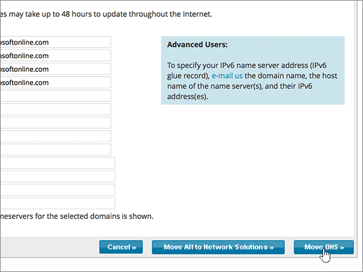

# Naamservers wijzigen om Microsoft in te stellen met Netwerkoplossingen

 **[Raadpleeg de veelgestelde vragen over domeinen](../setup/domains-faq.md)** als u niet kunt vinden wat u zoekt.
  
Volg deze instructies als u wilt dat Microsoft uw DNS-records voor u beheert. (Als u dat liever hebt, u [al uw Microsoft DNS-records beheren bij Network Solutions](create-dns-records-at-network-solutions.md).)
  
    
## Een TXT-record toevoegen op Network Solutions om te bevestigen dat u eigenaar van het domein bent

Voordat u uw domein bij Microsoft gebruikt, moeten we ervoor zorgen dat u eigenaar bent. Uw mogelijkheid om in te loggen op uw account bij uw domeinregistrar en de DNS-record te maken bewijst microsoft dat u eigenaar bent van het domein.
  
> [!NOTE]
> Deze record wordt alleen gebruikt om te verifiëren dat u de eigenaar van uw domein bent. Dit heeft verder geen invloed. U kunt deze record later desgewenst verwijderen. 
  
Volg onderstaande stappen of [bekijk de video (start op 0:47)](https://support.office.com/article/Video-Change-nameservers-to-set-up-Office-365-with-Network-Solutions-69b092e3-c026-4d19-a7d0-16cdb2d8b261?ui=en-US&amp;rs=en-US&amp;ad=US).
  
1. Als u wilt beginnen, gaat u [via deze koppeling](https://www.networksolutions.com/manage-it) naar uw pagina met domeinen bij Network Solutions. U wordt gevraagd u aan te melden.
    
    > [!IMPORTANT]
    > Voordat u de knop **Aanmelden** selecteert, kiest u **Mijn domeinnamen beheren** in de **vervolgkeuzelijst Aanmelden.**
  
    
  
2. Schakel het selectievakje in naast de naam van het domein dat u wilt wijzigen.
    
    
  
3. Selecteer **DNS bewerken**.
    
    
  
4. Selecteer **Geavanceerde DNS-records beheren**.
    
    (Mogelijk moet u omlaag schuiven.)
    
    
  
5. Schuif omlaag naar de sectie **Tekst (TXT Records)** en selecteer **Vervolgens TXT Records bewerken**.
    
    
  
6. Typ of kopieer en plak de waarden uit de volgende tabel in de vakken voor de nieuwe record.
    
|**Host**|**TTL**|**Tekst**|
|:-----|:-----|:-----|
|@    (In het systeem wordt deze waarde gewijzigd in **@ (None)** wanneer u de record opslaat.)    |3600    |MS=ms *XXXXXXXX*    **Opmerking:** Dit is een voorbeeld. Gebruik hier de waarde van uw specifieke **bestemming of adresinrichten** in de tabel in Microsoft 365.           [Hoe kan ik dit vinden?](../get-help-with-domains/information-for-dns-records.md)
   
    
   
  
7. Selecteer **Doorgaan**.
    
    
  
8. Selecteer **Wijzigingen opslaan**.
    
    
  
9. Wacht enkele minuten voordat u verder gaat, zodat de record die u zojuist hebt gemaakt via internet kan worden bijgewerkt.
    
Nu u de record op de site van uw domeinregistrar hebt toegevoegd, gaat u terug naar Microsoft 365 en vraagt u Microsoft 365 om de record te zoeken.
  
Wanneer Microsoft de juiste TXT-record vindt, wordt uw domein geverifieerd.
  
1. Ga in het Microsoft-beheercentrum naar de pagina \> <a href="https://go.microsoft.com/fwlink/p/?linkid=834818" target="_blank">Instellingendomeinen.</a> **Settings**

    
2. Kies op de pagina **Domeinen** de naam van het domein dat u verifieert. 
    
    
  
3. Kies **Start setup** op de pagina **Setup**.
    
    
  
4. Kies **Verifiëren** op de pagina **Domein verifiëren**.
    
    
  
> [!NOTE]
>  Het duurt gewoonlijk ongeveer 15 minuten voordat DNS-wijzigingen van kracht worden. Het kan echter soms wat langer duren voordat een wijziging die u hebt aangebracht, is bijgewerkt via het DNS-systeem op internet. Als u na het toevoegen van de DNS-records problemen hebt met het ontvangen of verzenden van e-mail, raadpleegt u [Problemen oplossen nadat u uw domeinnaam of DNS-records hebt gewijzigd](../get-help-with-domains/find-and-fix-issues.md). 
  
## De naamserverrecords (NS-records) van uw domein wijzigen

Als u het instellen van uw domein met Microsoft wilt voltooien, wijzigt u de NS-records van uw domein bij uw domeinregistrar om naar de primaire en secundaire naamservers van Microsoft te wijzen. Hiermee wordt Microsoft ingesteld om de DNS-records van het domein voor u bij te werken. We voegen alle records toe zodat e-mail, Skype voor Bedrijven Online en uw openbare website met uw domein werken en u helemaal klaar bent.
  
> [!CAUTION]
> Wanneer u de NS-records van uw domein wijzigt om naar de Microsoft-naamservers te wijzen, worden alle services die momenteel aan uw domein zijn gekoppeld, beïnvloed. Alle e-mail die naar uw *your_domain* domein wordt verzonden (zoals rob@ your_domain.com) wordt bijvoorbeeld naar Microsoft verzonden nadat u deze wijziging hebt gewijzigd.
  
Klaar om uw NS-records te wijzigen, zodat Microsoft uw domein kan instellen? Volg onderstaande stappen of [bekijk de video (start bij 2:23)](https://support.office.com/article/Video-Change-nameservers-to-set-up-Office-365-with-Network-Solutions-69b092e3-c026-4d19-a7d0-16cdb2d8b261?ui=en-US&amp;rs=en-US&amp;ad=US).
  
> [!IMPORTANT]
>  Wanneer u de stappen in deze sectie hebt voltooid, zijn de *enige* nameservers die moeten worden vermeld deze vier: **ns1.bdm.microsoftonline.com,** **ns2.bdm.microsoftonline.com,** **ns3.bdm.microsoftonline.com**en **ns4.bdm.microsoftonline.com**. In de volgende procedure kunt u zien hoe u andere, ongewenste naamservers uit de lijst verwijdert en hoe u de  *juiste*  naamservers toevoegt als deze niet al in de lijst staan. 
  
1. Als u wilt beginnen, gaat u [via deze koppeling](https://www.networksolutions.com/manage-it) naar uw pagina met domeinen bij Network Solutions. U wordt gevraagd u aan te melden.
    
    > [!IMPORTANT]
    > Voordat u de knop **Aanmelden** selecteert, kiest u **Mijn domeinnamen beheren** in de **vervolgkeuzelijst Aanmelden.** 
  
    
  
2. Schakel het selectievakje in naast de naam van het domein dat u wilt wijzigen.
    
    
  
3. Selecteer **DNS bewerken**.
    
    
  
4. Selecteer **DNS verplaatsen**.
    
    
  
5. Afhankelijk van of er al naamservers worden vermeld op de pagina die wordt weergegeven, gaat u op een van de volgende twee manieren verder:
    
  - Als er nog **GEEN** naamservers worden vermeld, [Als er nog GEEN naamservers worden vermeld](#if-there-are-no-nameservers-already-listed).
    
  - Als er **WEL** naamservers worden vermeld, [Als er WEL naamservers worden vermeld](#if-there-are-nameservers-already-listed).
    
### Als er nog GEEN naamservers worden vermeld

1. Selecteer op de pagina **Domeinen** in de sectie **Domeinnaamservers opgeven** de optie **Meer naamservers toevoegen**.
    
    
  
2. Typ of kopieer en plak de naamserverwaarden uit de volgende tabel naar de pagina **Domain Names**. 
    
|||
|:-----|:-----|
|**Name Server 1**   |ns1.bdm.microsoftonline.com    |
|**Name Server 2**   |ns2.bdm.microsoftonline.com    |
|**Name Server 2**   |ns3.bdm.microsoftonline.com    |
|**Name Server 2**   |ns4.bdm.microsoftonline.com    |
   
    

  
3. Selecteer **DNS verplaatsen**.
    
    
  
4. Selecteer **Wijzigingen opslaan**.
    
    
  
> [!NOTE]
> Het kan enige uren duren voordat de updates van uw naamserverrecords via het DNS-systeem op internet zijn doorgevoerd. Vervolgens zijn uw Microsoft-e-mail en andere services helemaal klaar om met uw domein te werken. 
  
### Als er WEL naamservers worden vermeld

> [!CAUTION]
> Voer deze stappen  *alleen*  uit als u andere bestaande naamservers hebt dan de vier  *juiste*  naamservers. (Dat wil zeggen, verwijder  *alleen*  huidige naamservers die een  *andere*  naam hebben dan **ns1.bdm.microsoftonline.com**, **ns2.bdm.microsoftonline.com**, **ns3.bdm.microsoftonline.com** of **ns4.bdm.microsoftonline.com**.)
  
1. Als er andere naamservers worden vermeld, verwijdert u elke vermelding door deze te selecteren en vervolgens te drukken op de toets **Delete** op het toetsenbord.
    
    
  
2. Selecteer **Meer naamservers toevoegen**.
    
    
  
3. Typ of kopieer en plak de naamserverwaarden uit de volgende tabel naar de pagina **Domain Names**.
 
    
|||
|:-----|:-----|
|**Name Server 1**   |ns1.bdm.microsoftonline.com    |
|**Name Server 2**   |ns2.bdm.microsoftonline.com    |
|**Name Server 3**   |ns3.bdm.microsoftonline.com    |
|**Name Server 4**   |ns4.bdm.microsoftonline.com    |
   
    

  
4. Selecteer **DNS verplaatsen**.
    
    
  
5. Selecteer **Wijzigingen opslaan.**
    
    
  
> [!NOTE]
> Het kan enige uren duren voordat de updates van uw naamserverrecords via het DNS-systeem op internet zijn doorgevoerd. Vervolgens zijn uw Microsoft-e-mail en andere services helemaal klaar om met uw domein te werken.
