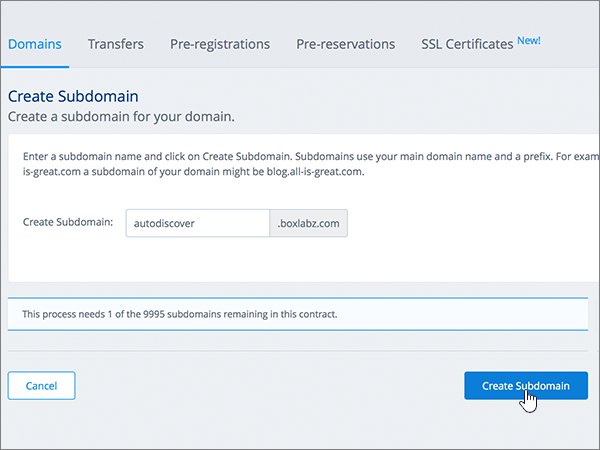
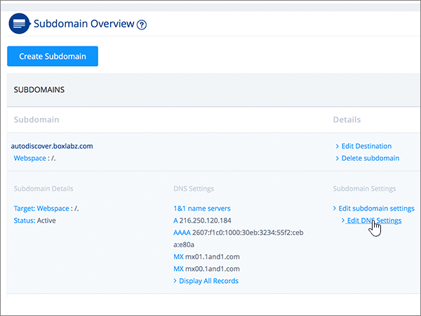

# DNS-records bij 1&1 IONOS voor Microsoft maken

 **[Raadpleeg de veelgestelde vragen over domeinen](../setup/domains-faq.yml)** als u niet kunt vinden wat u zoekt. 
  
> [!CAUTION]
> Met 1&1 IONOS kan een domein niet zowel een MX-record als een Autodiscover-record van het hoogste niveau bevatten. Dit beperkt de manieren waarop u Exchange Online voor Microsoft kunt configureren. Er is een tijdelijke oplossing, maar u kunt deze **alleen** gebruiken als u al ervaring hebt met het maken van subdomeinen voor 1&1 IONOS. > als deze [servicebeperking](https://docs.microsoft.com/microsoft-365/admin/setup/domains-faq) u kiest voor het beheren van uw eigen Microsoft DNS-records bij 1&1 IONOS, voert u de stappen in dit artikel uit om uw domein te verifiëren en DNS-records in te stellen voor E-mail, Skype voor bedrijven online. 
  
Nadat u deze records bij 1&1 IONOS hebt toegevoegd, is uw domein ingesteld voor gebruik met Microsoft-services.
  
  
> [!NOTE]
> Het duurt meestal ongeveer 15 minuten voordat DNS-wijzigingen van kracht worden. Het kan echter soms wat langer duren voordat een wijziging die u hebt aangebracht, is bijgewerkt via het DNS-systeem op internet. Als u na het toevoegen van DNS-records problemen hebt met het ontvangen of verzenden van e-mail, raadpleegt u [Problemen opsporen en oplossen nadat u uw domein of DNS-records hebt toegevoegd](../get-help-with-domains/find-and-fix-issues.md). 
  
## Een TXT-record toevoegen voor verificatie

Voordat u uw domein met Microsoft kunt gebruiken, moet worden gecontroleerd dat u de eigenaar bent van het domein. Als u zich bij uw account bij de domeinregistrar kunt aanmelden en de DNS-record kunt maken, is dit voor Microsoft bewezen.
  
> [!NOTE]
> Deze record wordt alleen gebruikt om te verifiëren dat u de eigenaar van uw domein bent. Dit heeft verder geen invloed. U kunt deze record later desgewenst verwijderen. 
  
Volg onderstaande stappen of [bekijk de video (start op 0:42)](https://docs.microsoft.com/microsoft-365/admin/dns/create-dns-records-at-1-1-internet).
  
1. Als u wilt beginnen, gaat u naar uw domeinen pagina op 1&1 IONOS met behulp van [deze koppeling](https://my.1and1.com/). U wordt gevraagd u aan te melden.
    
2. Selecteer **domeinen beheren**.
    
3. Zoek op de pagina **Domain Center** naar het domein dat u wilt bijwerken en selecteer het besturingselement **panel** ( **v**) voor het domein.
    
4. Selecteer in het gebied **Domain Settings** de optie **Edit DNS Settings**.
    
5. Selecteer in de sectie **txt and SRV records** de optie **add record**.
    
6. Ga naar het gebied **Add Record**. In de vakken voor de nieuwe record in dit gebied kunt u vervolgens de waarden uit de volgende tabel typen of kopiëren en plakken. 
    
    (Kies in de vervolgkeuzelijst de waarde **Type**). 
    
    ||||
    |:-----|:-----|:-----|
    |**Type**   |**Voorvoegsel**   |**Naamwaarde**   |
    |TXT    |(Laat dit veld leeg)    |MS=ms *XXXXXXXX*    Opmerking: dit is een voorbeeld. Gebruik hier de specifieke waarde voor **Doel of adres waarnaar wordt verwezen** uit de tabel. [Hoe kan ik dit vinden?](../get-help-with-domains/information-for-dns-records.md)          |
   
7. Kies **Opslaan**.
    
8. Selecteer opnieuw **Opslaan** . 
    
9. Selecteer in het dialoogvenster **Edit DNS Settings** de optie **Yes**.
    
10. Wacht enkele minuten voordat u verder gaat, zodat de record die u zojuist hebt gemaakt via internet kan worden bijgewerkt.
    
Nu u de record hebt toegevoegd aan de site van uw domeinregistrar, gaat u terug naar Microsoft 365 en vraagt u of Microsoft 365 naar de record wil zoeken.
  
Wanneer in Microsoft de juiste TXT-record is gevonden, is uw domein gecontroleerd.
  
1. Ga in het Microsoft-beheercentrum naar **Instellingen** \> <a href="https://go.microsoft.com/fwlink/p/?linkid=834818" target="_blank">Domeinen</a>-pagina.

    
2. Kies op de pagina **Domeinen** de naam van het domein dat u verifieert. 
    
3. Kies **Start setup** op de pagina **Setup**.
    
4. Kies **Verifiëren** op de pagina **Domein verifiëren**.
    
> [!NOTE]
> Het duurt meestal ongeveer 15 minuten voordat DNS-wijzigingen van kracht worden. Het kan echter soms wat langer duren voordat een wijziging die u hebt aangebracht, is bijgewerkt via het DNS-systeem op internet. Als u na het toevoegen van DNS-records problemen hebt met het ontvangen of verzenden van e-mail, raadpleegt u [Problemen opsporen en oplossen nadat u uw domein of DNS-records hebt toegevoegd](../get-help-with-domains/find-and-fix-issues.md). 
  
## Voeg een MX-record toe zodat e-mail voor uw domein naar Microsoft wordt verzonden

Volg onderstaande stappen of [bekijk de video (start op 3:22)](https://docs.microsoft.com/microsoft-365/admin/dns/create-dns-records-at-1-1-internet).
  
> [!NOTE]
> Als u zich hebt geregistreerd bij 1und1.de, [meldt u zich hier](https://go.microsoft.com/fwlink/?linkid=859152)aan. 
  
1. Als u wilt beginnen, gaat u naar uw domeinen pagina op 1&1 IONOS met behulp van [deze koppeling](https://my.1and1.com/). U wordt gevraagd u aan te melden.
    
2. Selecteer **domeinen beheren**.
    
3. Zoek op de pagina **Domain Center** naar het domein dat u wilt bijwerken en selecteer het besturingselement **panel** ( **v**) voor het domein.
    
4. Selecteer in het gebied **Domain Settings** de optie **Edit DNS Settings**.
    
5. Selecteer in de sectie **MX records** in het gebied **Mail Exchanger (MX record)** de optie **other mailserver**. (Mogelijk moet u omlaag schuiven.)   
  
6. Als er al MX-records worden vermeld, verwijdert u deze door de records te selecteren en op de toets **Delete** op het toetsenbord te drukken. (Als er nog geen MX-records worden vermeld, gaat u verder met de volgende stap.)  
  
7. Typ of kopieer en plak de waarden uit de volgende tabel in de vakken voor de **MX 1**-record. 
    
    |**MX 1**|**Prioriteit**|
    |:-----|:-----|
    | *\<domain-key\>*  .mail.protection.outlook.com     Opmerking: u ontvangt uw \<domain-key\> van uw Microsoft-account. [Hoe kan ik dit vinden?](../get-help-with-domains/information-for-dns-records.md)          |10    Zie [Wat is MX-prioriteit?](https://docs.microsoft.com/microsoft-365/admin/setup/domains-faq) voor meer informatie over prioriteit.      | 
    
     
  
8. Kies **Opslaan**. (Mogelijk moet u omlaag schuiven.) 
  
9. Selecteer in het dialoogvenster **Edit DNS Settings** de optie **Yes**. 
  
## De zes CNAME-records toevoegen die vereist zijn voor Microsoft

1&1 IONOS vereist een tijdelijke oplossing zodat u een MX-record kunt gebruiken in combinatie met de CNAME-records die zijn vereist voor Microsoft-e-mailservices. Voor deze tijdelijke oplossing dient u een verzameling subdomeinen te maken voor 1&1 IONOS en deze toe te wijzen aan CNAME-records.
  
> [!IMPORTANT]
> Zorg dat u ten minste twee beschikbare subdomeinen hebt voordat u deze procedure begint. U wordt aangeraden deze oplossing uitsluitend te maken als u al met ervaring subdomeinen hebt voor 1&1 IONOS. 
  
### Basis-CNAME-records

Volg onderstaande stappen of [bekijk de video (start op 3:57)](https://docs.microsoft.com/microsoft-365/admin/dns/create-dns-records-at-1-1-internet).
  
> [!NOTE]
> Als u zich hebt geregistreerd bij 1und1.de, [meldt u zich hier](https://go.microsoft.com/fwlink/?linkid=859152)aan. 
  
1. Als u wilt beginnen, gaat u naar uw domeinen pagina op 1&1 IONOS met behulp van [deze koppeling](https://my.1and1.com/). U wordt gevraagd u aan te melden.
    
2. Selecteer **domeinen beheren**.
    
3. Zoek op de pagina **Domain Center** naar het domein dat u wilt bijwerken en selecteer **Manage subdomains**.   Nu maakt u twee subdomeinen en stelt u voor elk subdomein een **Alias**-waarde in. (Dit is nodig omdat 1&1 IONOS ondersteuning biedt voor één CNAME-record op het hoogste niveau, maar Microsoft heeft meerdere CNAME-records nodig.) Eerst maakt u het autodiscover-subdomein.
    
4. Selecteer in de sectie **subdomain Overview** de optie **Create Subdomain**.
    
    
  
5. Typ of kopieer en plak in het vak **Create Subdomain** voor het nieuwe subdomein alleen de waarde voor **Create Subdomain** uit de volgende tabel. (De **Alias**-waarde voegt u in een latere stap toe.)

    |**Create Subdomain**|**Alias**|
    |:-----|:-----|
    |autodiscover    |autodiscover.outlook.com   | 

    
  
6. Selecteer **subdomein maken**. 
  
7. Zoek in de sectie **subdomain Overview** het **Autodiscover** -subdomein dat u zojuist hebt gemaakt, en selecteer het besturingselement **panel (v)** voor dat subdomein.  
  
8. Selecteer in het gebied **subdomain Settings** de optie **Edit DNS Settings**.  
  
9. Selecteer **CNAME** in het gebied **IP Address (a record)** van de sectie **A/AAAA records (IP** addresses). 
  
10. Typ of kopieer en plak alleen de **Alias**-waarde uit de volgende tabel in het vak **Alias:**.  
    
    |**Create Subdomain**|**Alias**|
    |:-----|:-----|
    |autodiscover    |autodiscover.outlook.com   |

    
  
11. Schakel het selectievakje in voor de vrijwaring **I am aware**. 
  
12. Kies **Opslaan**. 
  
  
### Extra CNAME-records

Met de extra CNAME-records die in de volgende procedure worden gemaakt, worden Skype voor Bedrijven Online-services ingeschakeld. U gebruikt dezelfde stappen die u eerder hebt gebruikt om de twee CNAME-records te maken.
  
1. Maak het derde subdomein (Lyncdiscover). Selecteer in de sectie **subdomain Overview** de optie **Create Subdomain**.
    
2. Typ of kopieer en plak in het vak **Create Subdomain** voor het nieuwe subdomein alleen de waarde voor **Create Subdomain** uit de volgende tabel. (De **Alias**-waarde voegt u in een latere stap toe.)  
    
    |**Create Subdomain**|**Alias**|
    |:-----|:-----|
    |lyncdiscover   |webdir.online.lync.com  |
   
3. Selecteer **subdomein maken**.
    
4. Selecteer op de pagina **Domain Center** de optie **Manage subdomains**.
    
5. Zoek in de sectie **subdomain Overview** het **lyncdiscover** -subdomein dat u zojuist hebt gemaakt, en selecteer het besturingselement **panel (v)** voor dat subdomein.  Selecteer in het gebied **subdomain Settings** de optie **Edit DNS Settings**.
    
6. Selecteer **CNAME** in het gebied **IP Address (a record)** van de sectie **A/AAAA records (IP** addresses).
    
7. Typ of kopieer en plak alleen de **Alias**-waarde uit de volgende tabel in het vak **Alias:**.  
    
    |**Create Subdomain**|**Alias**|
    |:-----|:-----|
    |lyncdiscover    |webdir.online.lync.com    |
   
8. Schakel het selectievakje in voor de vrijwaring **I am aware** en selecteer **Opslaan**.
    
9. Selecteer in het dialoogvenster **Edit DNS Settings** de optie **Yes**.
    
10. Maak als volgt het vierde subdomein (SIP):  Selecteer in de sectie **subdomain Overview** de optie **Create Subdomain**.
    
11. Typ of kopieer en plak in het vak **Create Subdomain** voor het nieuwe subdomein alleen de waarde voor **Create Subdomain** uit de volgende tabel. (De **Alias**-waarde voegt u in een latere stap toe.) 
    
    |**Create Subdomain**|**Alias**|
    |:-----|:-----|
    |sip    |sipdir.online.lync.com    |
   
12. Selecteer **subdomein maken**.
    
13. Selecteer op de pagina **Domain Center** de optie **Manage subdomains**.
    
14. Zoek in de sectie **subdomain Overview** het **SIP** -subdomein dat u zojuist hebt gemaakt, en selecteer het besturingselement **panel (v)** voor dat subdomein.  Selecteer in het gebied **subdomain Settings** de optie **Edit DNS Settings**.
    
15. Selecteer **CNAME** in het gebied **IP Address (a record)** van de sectie **A/AAAA records (IP** addresses).
    
16. Typ of kopieer en plak alleen de **Alias**-waarde uit de volgende tabel in het vak **Alias:**. 
    
    |**Create Subdomain**|**Alias**|
    |:-----|:-----|
    |sip    |sipdir.online.lync.com    |
   
17. Schakel het selectievakje in voor de vrijwaring **I am aware** en selecteer **Opslaan**.
    
18. Selecteer in het dialoogvenster **Edit DNS Settings** de optie **Yes**.
    
### CNAME-records die nodig zijn voor MDM

> [!IMPORTANT]
> Volg de stappen die u hebt gevolgd voor de andere vier CNAME-records, maar gebruik de waarden uit de volgende tabel. 
  
|**Create Subdomain**|**Alias**|
|:-----|:-----|
|enterpriseregistration    |enterpriseregistration.windows.net    |
|enterpriseenrollment    |enterpriseenrollment-s.manage.microsoft.com    |
   
## Een TXT-record voor SPF toevoegen om spam tegen te gaan

> [!IMPORTANT]
> U kunt maximaal 1 TXT-record hebben voor SPF voor een domein. Als uw domein meer dan één SPF-record heeft, kan dit resulteren in e-mailfouten, evenals leverings- en spamclassificatieproblemen. Als u al een SPF-record voor uw domein hebt, hoeft u geen nieuwe te maken voor Microsoft. In plaats daarvan voegt u de vereiste Microsoft-waarden toe aan de huidige record, zodat u  *één*  SPF-record hebt die beide sets met waarden bevat. Hebt u voorbeelden nodig? Bekijk deze [Externe Domain Name System-records voor Microsoft](https://docs.microsoft.com/microsoft-365/enterprise/external-domain-name-system-records). Voor het valideren van uw SPF-record gebruikt u een van deze[SPF-validatie hulpmiddelen](../setup/domains-faq.yml). 
  
Volg onderstaande stappen of [bekijk de video (start op 5:09)](https://docs.microsoft.com/microsoft-365/admin/dns/create-dns-records-at-1-1-internet).
  
> [!NOTE]
> Als u zich hebt geregistreerd bij 1und1.de, [meldt u zich hier](https://go.microsoft.com/fwlink/?linkid=859152)aan. 
  
1. Als u wilt beginnen, gaat u naar uw domeinen pagina op 1&1 IONOS met behulp van [deze koppeling](https://my.1and1.com/). U wordt gevraagd u aan te melden.
    
2. Selecteer **domeinen beheren**.
    
3. Zoek op de pagina **Domain Center** naar het domein dat u wilt bijwerken en selecteer het besturingselement **panel** (**v**) voor het domein.
    
4. Selecteer in het gebied **Domain Settings** de optie **Edit DNS Settings**.
    
5. Selecteer in de sectie **txt and SRV records** de optie **add record**.  (Mogelijk moet u omlaag schuiven.)
    
6. Ga naar het gebied **Add Record**. In de vakken voor de nieuwe record in dit gebied kunt u vervolgens de waarden uit de volgende tabel typen of kopiëren en plakken.  (Kies in de vervolgkeuzelijst de waarde **Type**).  
    
    |**Type**|**Voorvoegsel**|**Naamwaarde**|
    |:-----|:-----|:-----|
    |TXT    |(Laat dit veld leeg.)    |v=spf1 include:spf.protection.outlook.com -all    **Opmerking:** het is raadzaam dit item te kopiëren en te plakken, zodat het spatiegebruik ongewijzigd blijft.           | 
    
    
  
7. Kies **Opslaan**. 
  
8. Kies **Opslaan**. 
  
9. Selecteer in het dialoogvenster **Edit DNS Settings** de optie **Yes**. 
  
## De twee SRV-records toevoegen die zijn vereist voor Microsoft

Volg onderstaande stappen of [bekijk de video (start op 5:51)](https://docs.microsoft.com/microsoft-365/admin/dns/create-dns-records-at-1-1-internet).
  
> [!NOTE]
> Als u zich hebt geregistreerd bij 1und1.de, [meldt u zich hier](https://go.microsoft.com/fwlink/?linkid=859152)aan. 
  
1. Als u wilt beginnen, gaat u naar uw domeinen pagina op 1&1 IONOS met behulp van [deze koppeling](https://my.1and1.com/). U wordt gevraagd u aan te melden.
    
2. Selecteer **domeinen beheren**.
    
3. Zoek op de pagina **Domain Center** naar het domein dat u wilt bijwerken en selecteer het besturingselement **panel** ( **v**) voor het domein.
    
4. Selecteer in het gebied **Domain Settings** de optie **Edit DNS Settings**.
    
5. Selecteer in de sectie **txt and SRV records** de optie **add record**.
    
6. Voeg de eerste van de twee SRV-records toe. Typ of kopieer en plak de waarden uit de eerste rij van de volgende tabel in het gebied **Add Record** in de vakken voor de nieuwe record.  (Kies in de vervolgkeuzelijst de waarden **type** en **TTL** .) 
    
    |**Type**|**Service**|**Protocol**|**Naam**|**Host**|**Prioriteit**|**Gewicht**|**Poort**|**TTL**|
    |:-----|:-----|:-----|:-----|:-----|:-----|:-----|:-----|:-----|
    |SRV    |sip    |tls    |(Laat dit veld leeg.)    |sipdir.online.lync.com    |100    |1    |443    |3600 (1 uur)    |
    |SRV    |sipfederationtls    |tcp    |(Laat dit veld leeg.)    |sipfed.online.lync.com    |100    |1    |5061    |3600 (1 uur)    |  
    
    
  
7. Kies **Opslaan**.  
  
8. Kies **Opslaan**.  
  
9. Selecteer in het dialoogvenster **Edit DNS Settings** de optie **Yes**.  
  
10. Voeg de andere SRV-record toe.  Selecteer in de sectie **txt and SRV records** de optie **add record**.  Maak in het gebied **add record** een record met behulp van de waarden uit de andere rij in de tabel en selecteer vervolgens opnieuw **add**, **Save** en **Yes** om de record te voltooien. 
    
> [!NOTE]
> Het duurt meestal ongeveer 15 minuten voordat DNS-wijzigingen van kracht worden. Het kan echter soms wat langer duren voordat een wijziging die u hebt aangebracht, is bijgewerkt via het DNS-systeem op internet. Als u na het toevoegen van DNS-records problemen hebt met het ontvangen of verzenden van e-mail, raadpleegt u [Problemen opsporen en oplossen nadat u uw domein of DNS-records hebt toegevoegd](../get-help-with-domains/find-and-fix-issues.md). 
  
