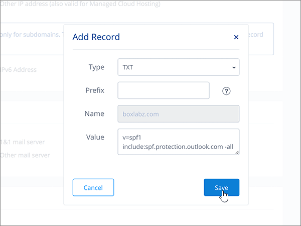
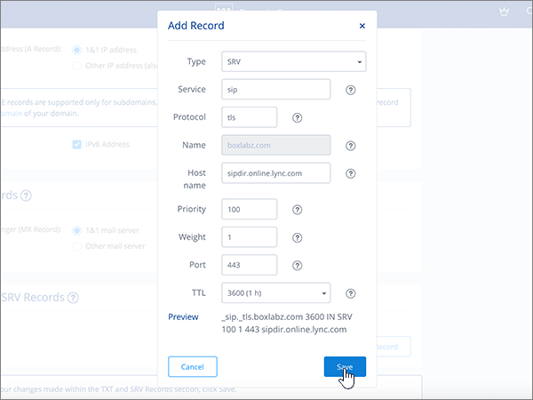

# DNS-records maken op 1&1 IONOS voor MicrosoftCreate DNS records at 1&1 IONOS for Microsoft

 **[Raadpleeg de veelgestelde vragen over domeinen](../setup/domains-faq.md)** als u niet kunt vinden wat u zoekt.**[Check the Domains FAQ](../setup/domains-faq.md)** if you don't find what you're looking for. 
  
> [!CAUTION]
> Houd er rekening mee dat 1&1 IONOS niet toestaat dat een domein zowel een MX-record als een Autodiscover CNAME-record op het hoogste niveau heeft.Note that 1&1 IONOS doesn't allow a domain to have both an MX record and a top-level Autodiscover CNAME record. Dit beperkt de manieren waarop u Exchange Online voor Microsoft configureren.This limits the ways in which you can configure Exchange Online for Microsoft. Er is een tijdelijke oplossing, maar we raden u aan deze **alleen** in te zetten als u al ervaring hebt met het maken van subdomeinen op 1&1 IONOS.There is a workaround, but we recommend employing it **only** if you already have experience with creating subdomains at 1&1 IONOS. > Als u er ondanks deze [servicebeperking](https://support.office.com/article/7ae9a655-041d-4724-aa92-60392ee390c2.aspx) voor kiest om uw eigen Microsoft DNS-records op 1&1 IONOS te beheren, voert u de stappen in dit artikel uit om uw domein te verifiëren en DNS-records in te stellen voor e-mail, Skype voor Bedrijven Online, enzovoort.> If despite this [service limitation](https://support.office.com/article/7ae9a655-041d-4724-aa92-60392ee390c2.aspx) you choose to manage your own Microsoft DNS records at 1&1 IONOS, follow the steps in this article to verify your domain and to set up DNS records for email, Skype for Business Online, and so on. 
  
Nadat u deze records op 1&1 IONOS hebt toegevoegd, wordt uw domein ingesteld voor gebruik met Microsoft-services.After you add these records at 1&1 IONOS, your domain will be set up to work with Microsoft services.
  
Zie Een openbare website gebruiken met Microsoft voor meer informatie over webhosting en DNS voor websites met [Microsoft.](https://support.office.com/article/choose-a-public-website-3325d50e-d131-403c-a278-7f3296fe33a9)To learn about webhosting and DNS for websites with Microsoft, see [Use a public website with Microsoft](https://support.office.com/article/choose-a-public-website-3325d50e-d131-403c-a278-7f3296fe33a9).
  
> [!NOTE]
> Het duurt gewoonlijk ongeveer 15 minuten voordat DNS-wijzigingen van kracht worden.Typically it takes about 15 minutes for DNS changes to take effect. Het kan echter soms wat langer duren voordat een wijziging die u hebt aangebracht, is bijgewerkt via het DNS-systeem op internet.However, it can occasionally take longer for a change you've made to update across the Internet's DNS system. Zie Problemen zoeken en oplossen na het toevoegen van [uw domein- of DNS-records](../get-help-with-domains/find-and-fix-issues.md)als u problemen ondervindt met e-mailstroom of andere problemen na het toevoegen van DNS-records.If you're having trouble with mail flow or other issues after adding DNS records, see [Find and fix issues after adding your domain or DNS records](../get-help-with-domains/find-and-fix-issues.md). 
  
## Een TXT-record toevoegen voor verificatieAdd a TXT record for verification

Voordat u uw domein bij Microsoft gebruikt, moeten we ervoor zorgen dat u eigenaar bent.Before you use your domain with Microsoft, we have to make sure that you own it. Uw mogelijkheid om in te loggen op uw account bij uw domeinregistrar en de DNS-record te maken bewijst microsoft dat u eigenaar bent van het domein.Your ability to log in to your account at your domain registrar and create the DNS record proves to Microsoft that you own the domain.
  
> [!NOTE]
> Deze record wordt alleen gebruikt om te verifiëren dat u de eigenaar van uw domein bent. Dit heeft verder geen invloed. U kunt deze record later desgewenst verwijderen.This record is used only to verify that you own your domain; it doesn't affect anything else. You can delete it later, if you like. 
  
Volg onderstaande stappen of [bekijk de video (start op 0:42)](https://support.office.com/article/Video-Create-DNS-records-at-1-1-Internet-for-Office-365-543fb112-ecf5-47ae-b096-07f3f942a089?ui=en-US&amp;rs=en-US&amp;ad=US).Follow the steps below or [watch the video (start at 0:42)](https://support.office.com/article/Video-Create-DNS-records-at-1-1-Internet-for-Office-365-543fb112-ecf5-47ae-b096-07f3f942a089?ui=en-US&amp;rs=en-US&amp;ad=US).
  
1. Ga om aan de slag te gaan naar de pagina domeinen op 1&1 IONOS via [deze link.](https://my.1and1.com/)To get started, go to your domains page at 1&1 IONOS by using [this link](https://my.1and1.com/). U wordt gevraagd u aan te melden.You'll be prompted to log in.
    
2. Selecteer **Domeinen beheren**.Select **Manage domains**.
    
3. Zoek op de pagina **Domain Center** het domein dat u wilt bijwerken en selecteer vervolgens het besturingselement **Paneel** **(v)** voor dat domein.On the **Domain Center** page, find the domain that you want to update, and then select the **Panel** ( **v**) control for that domain.
    
4. Selecteer **DNS-instellingen bewerken**in het gebied **Domeininstellingen** .In the **Domain Settings** area, select **Edit DNS Settings**.
    
5. Selecteer **Record toevoegen**in de sectie **TXT- en SRV-records** .In the **TXT and SRV Records** section, select **Add Record**.
    
6. Ga naar het gebied **Add Record**. In de vakken voor de nieuwe record in dit gebied kunt u vervolgens de waarden uit de volgende tabel typen of kopiëren en plakken.In the **Add Record** area, in the boxes for the new record, type or copy and paste the values from the following table. 
    
    (Kies in de vervolgkeuzelijst de waarde **Type**).(Choose the **Type** value from the drop-down list.) 
    
    ||||
    |:-----|:-----|:-----|
    |**Type****Type**   |**Voorvoegsel****Prefix**   |**Naamwaarde****Name Value**   |
    |TXTTXT    |(Laat dit veld leeg staan)(Leave this field blank)    |MS=ms *XXXXXXXX*MS=ms *XXXXXXXX*    LET OP: Dit is een voorbeeld.NOTE: This is an example. Gebruik hier de waarde van uw specifieke **bestemming of adrespunt** in de tabel.Use your specific **Destination or Points to Address** value here, from the table. [Hoe kan ik dit vinden?How do I find this?](../get-help-with-domains/information-for-dns-records.md)          |
   
7. Kies **Opslaan**.Select **Save**.
    
8. Selecteer Opnieuw **opslaan.**Select **Save** again. 
    
9. Selecteer **Ja**. in het dialoogvenster **DNS-instellingen bewerken** .In the **Edit DNS Settings** dialog box, select **Yes**.
    
10. Wacht enkele minuten voordat u verder gaat, zodat de record die u zojuist hebt gemaakt via internet kan worden bijgewerkt.Wait a few minutes before you continue, so that the record you just created can update across the Internet.
    
Nu u de record op de site van uw domeinregistrar hebt toegevoegd, gaat u terug naar Microsoft 365 en vraagt u Microsoft 365 om de record te zoeken.Now that you've added the record at your domain registrar's site, you'll go back to Microsoft 365 and request Microsoft 365 to look for the record.
  
Wanneer Microsoft de juiste TXT-record vindt, wordt uw domein geverifieerd.When Microsoft finds the correct TXT record, your domain is verified.
  
1. Ga in het Microsoft-beheercentrum naar de pagina \> <a href="https://go.microsoft.com/fwlink/p/?linkid=834818" target="_blank">Instellingendomeinen.</a> **Settings**In the Microsoft admin center, go to the **Settings** \> <a href="https://go.microsoft.com/fwlink/p/?linkid=834818" target="_blank">Domains</a> page.

    
2. Kies op de pagina **Domeinen** de naam van het domein dat u verifieert.On the **Domains** page, select the domain that you are verifying. 
    
3. Kies **Start setup** op de pagina **Setup**.On the **Setup** page, select **Start setup**.
    
4. Kies **Verifiëren** op de pagina **Domein verifiëren**.On the **Verify domain** page, select **Verify**.
    
> [!NOTE]
> Het duurt gewoonlijk ongeveer 15 minuten voordat DNS-wijzigingen van kracht worden.Typically it takes about 15 minutes for DNS changes to take effect. Het kan echter soms wat langer duren voordat een wijziging die u hebt aangebracht, is bijgewerkt via het DNS-systeem op internet.However, it can occasionally take longer for a change you've made to update across the Internet's DNS system. Zie Problemen zoeken en oplossen na het toevoegen van [uw domein- of DNS-records](../get-help-with-domains/find-and-fix-issues.md)als u problemen ondervindt met e-mailstroom of andere problemen na het toevoegen van DNS-records.If you're having trouble with mail flow or other issues after adding DNS records, see [Find and fix issues after adding your domain or DNS records](../get-help-with-domains/find-and-fix-issues.md). 
  
## Voeg een MX-record toe, zodat e-mail voor uw domein naar Microsoft komtAdd an MX record so email for your domain will come to Microsoft

Volg onderstaande stappen of [bekijk de video (start op 3:22)](https://support.office.com/article/Video-Create-DNS-records-at-1-1-Internet-for-Office-365-543fb112-ecf5-47ae-b096-07f3f942a089?ui=en-US&amp;rs=en-US&amp;ad=US).Follow the steps below or [watch the video (start at 3:22)](https://support.office.com/article/Video-Create-DNS-records-at-1-1-Internet-for-Office-365-543fb112-ecf5-47ae-b096-07f3f942a089?ui=en-US&amp;rs=en-US&amp;ad=US).
  
> [!NOTE]
> Als je je hebt geregistreerd bij 1und1.de, [log dan hier in.](https://go.microsoft.com/fwlink/?linkid=859152)If you've registered with 1und1.de, [sign in here](https://go.microsoft.com/fwlink/?linkid=859152). 
  
1. Ga om aan de slag te gaan naar de pagina domeinen op 1&1 IONOS via [deze link.](https://my.1and1.com/)To get started, go to your domains page at 1&1 IONOS by using [this link](https://my.1and1.com/). U wordt gevraagd u aan te melden.You'll be prompted to log in.
    
2. Selecteer **Domeinen beheren**.Select **Manage domains**.
    
3. Zoek op de pagina **Domain Center** het domein dat u wilt bijwerken en selecteer vervolgens het besturingselement **Paneel** **(v)** voor dat domein.On the **Domain Center** page, find the domain that you want to update, and then select the **Panel** ( **v**) control for that domain.
    
4. Selecteer **DNS-instellingen bewerken**in het gebied **Domeininstellingen** .In the **Domain Settings** area, select **Edit DNS Settings**.
    
5. In the **MX Records** section, in the \*\* Mail Exchanger (MX Record) \*\* area, select **Other mail server**.In the **MX Records** section, in the \*\* Mail Exchanger (MX Record) \*\* area, select **Other mail server**. (Mogelijk moet u omlaag schuiven.)(You may have to scroll down.)   
  
6. Als er al MX-records worden vermeld, verwijdert u deze door de records te selecteren en op de toets **Delete** op het toetsenbord te drukken.If there are any MX records already listed, delete each of them by selecting the record and then pressing the **Delete** key on your keyboard. (Als er nog geen MX-records worden vermeld, gaat u verder met de volgende stap.)(If there are no MX records already listed, continue to the next step.)  
  
7. Typ of kopieer en plak de waarden uit de volgende tabel in de vakken voor de **MX 1**-record.In the boxes for the **MX 1** record, type or copy and paste the values from the following table. 
    
    |**MX 1****MX 1**|**Prioriteit****Priority**|
    |:-----|:-----|
    | *\<domeinsleutel\>*  .mail.protection.outlook.com*\<domain-key\>*  .mail.protection.outlook.com     OPMERKING: haal \<uw\> domeinsleutel uit uw Microsoft-account.NOTE: Get your \<domain-key\> from your Microsoft account. [Hoe kan ik dit vinden?How do I find this?](../get-help-with-domains/information-for-dns-records.md)          |1010    Zie [Wat is MX-prioriteit?](https://support.office.com/article/2784cc4d-95be-443d-b5f7-bb5dd867ba83.aspx) voor meer informatie over prioriteit.   For more information about priority, see [What is MX priority?](https://support.office.com/article/2784cc4d-95be-443d-b5f7-bb5dd867ba83.aspx)   | 
    
     
  
8. Kies **Opslaan**.Select **Save**. (Mogelijk moet u omlaag schuiven.)(You may have to scroll down.) 
  
9. Selecteer **Ja**. in het dialoogvenster **DNS-instellingen bewerken** .In the **Edit DNS Settings** dialog box, select **Yes**. 
  
## Voeg de zes CNAME-records toe die nodig zijn voor MicrosoftAdd the six CNAME records that are required for Microsoft

1&1 IONOS vereist een tijdelijke oplossing, zodat u een MX-record gebruiken samen met de CNAME-records die vereist zijn voor microsoft-e-mailservices.1&1 IONOS requires a workaround so that you can use an MX record together with the CNAME records that are required for Microsoft email services. Voor deze tijdelijke oplossing moet u een set subdomeinen maken op 1&1 IONOS en deze toewijzen aan CNAME-records.This workaround requires you to create a set of subdomains at 1&1 IONOS, and to assign them to CNAME records.
  
> [!IMPORTANT]
> Zorg dat u ten minste twee beschikbare subdomeinen hebt voordat u deze procedure begint.Make sure that you have at least two available subdomains before starting this procedure. We raden deze oplossing alleen aan als je al ervaring hebt met het maken van subdomeinen op 1&1 IONOS.We recommend this solution only if you already have experience with creating subdomains at 1&1 IONOS. 
  
### Basis-CNAME-recordsBasic CNAME records

Volg onderstaande stappen of [bekijk de video (start op 3:57)](https://support.office.com/article/Video-Create-DNS-records-at-1-1-Internet-for-Office-365-543fb112-ecf5-47ae-b096-07f3f942a089?ui=en-US&amp;rs=en-US&amp;ad=US).Follow the steps below or [watch the video (start at 3:57)](https://support.office.com/article/Video-Create-DNS-records-at-1-1-Internet-for-Office-365-543fb112-ecf5-47ae-b096-07f3f942a089?ui=en-US&amp;rs=en-US&amp;ad=US).
  
> [!NOTE]
> Als je je hebt geregistreerd bij 1und1.de, [log dan hier in.](https://go.microsoft.com/fwlink/?linkid=859152)If you've registered with 1und1.de, [sign in here](https://go.microsoft.com/fwlink/?linkid=859152). 
  
1. Ga om aan de slag te gaan naar de pagina domeinen op 1&1 IONOS via [deze link.](https://my.1and1.com/)To get started, go to your domains page at 1&1 IONOS by using [this link](https://my.1and1.com/). U wordt gevraagd u aan te melden.You'll be prompted to log in.
    
2. Selecteer **Domeinen beheren**.Select **Manage domains**.
    
3. Zoek op de pagina **Domain Center** het domein dat u wilt bijwerken en selecteer **Subdomeinen beheren**.On the **Domain Center** page, find the domain that you want to update, and then select **Manage Subdomains**.   Nu maakt u twee subdomeinen en stelt u voor elk subdomein een **Alias**-waarde in.Now you'll create two subdomains and set an **Alias** value for each. (Dit is vereist omdat 1&1 IONOS slechts één CNAME-record op het hoogste niveau ondersteunt, maar Microsoft vereist meerdere CNAME-records.)(This is required because 1&1 IONOS supports only one top-level CNAME record, but Microsoft requires several CNAME records.) Eerst maakt u het autodiscover-subdomein.First, you'll create the Autodiscover subdomain.
    
4. Selecteer **Subdomein maken**in de sectie **Subdomeinoverzicht** .In the **Subdomain Overview** section, select **Create Subdomain**.
    
    
  
5. Typ of kopieer en plak in het vak **Create Subdomain** voor het nieuwe subdomein alleen de waarde voor **Create Subdomain** uit de volgende tabel. (De **Alias**-waarde voegt u in een latere stap toe.)In the **Create Subdomain** box for the new subdomain, type or copy and paste only the **Create Subdomain** value from the following table. (You'll add the **Alias** value in a later step.)

    |**Create Subdomain****Create Subdomain**|**Alias****Alias**|
    |:-----|:-----|
    |autodiscoverautodiscover    |autodiscover.outlook.comautodiscover.outlook.com   | 

    
  
6. Selecteer **Subdomein maken**.Select **Create Subdomain**. 
  
7. Zoek in de sectie **Subdomeinoverzicht** het **subdomein automatisch ontdekken** dat u zojuist hebt gemaakt en selecteer vervolgens het **besturingselement Paneel (v)** voor dat subdomein.In the **Subdomain Overview** section, locate the **autodiscover** subdomain that you just created, and then select the **Panel (v)** control for that subdomain.  
  
8. Selecteer **DNS-instellingen bewerken**in het gebied **Subdomeininstellingen** .In the **Subdomain Settings** area, select **Edit DNS Settings**.  
  
9. Selecteer in de sectie **A/AAAA Records (IP-adressen)** in het gedeelte **IP-adres (A Record)** de optie **CNAME**.In the **A/AAAA Records (IP Addresses)** section, in the **IP address (A Record)** area, select **CNAME**. 
  
10. Typ of kopieer en plak alleen de **Alias**-waarde uit de volgende tabel in het vak **Alias:**.In the **Alias:** box, type or copy and paste only the **Alias** value from the following table.  
    
    |**Create Subdomain****Create Subdomain**|**Alias****Alias**|
    |:-----|:-----|
    |autodiscoverautodiscover    |autodiscover.outlook.comautodiscover.outlook.com   |

    
  
11. Schakel het selectievakje in voor de vrijwaring **I am aware**.Select the check box for the **I am aware** disclaimer. 
  
12. Kies **Opslaan**.Select **Save**. 
  
  
### Extra CNAME-recordsAdditional CNAME records

Met de extra CNAME-records die in de volgende procedure worden gemaakt, worden Skype voor Bedrijven Online-services ingeschakeld. U gebruikt dezelfde stappen die u eerder hebt gebruikt om de twee CNAME-records te maken.The additional CNAME records created in the following procedure enable Skype for Business Online services. You will employ the same steps that you used to create the two CNAME records you have already created.
  
1. Maak het derde subdomein (Lyncdiscover).Create the third subdomain (Lyncdiscover). Selecteer **Subdomein maken**in de sectie **Subdomeinoverzicht** .On the **Subdomain Overview** section, select **Create Subdomain**.
    
2. Typ of kopieer en plak in het vak **Create Subdomain** voor het nieuwe subdomein alleen de waarde voor **Create Subdomain** uit de volgende tabel. (De **Alias**-waarde voegt u in een latere stap toe.)In the **Create Subdomain** box for the new subdomain, type or copy and paste only the **Create Subdomain** value from the following table. (You'll add the **Alias** value in a later step.)  
    
    |**Create Subdomain****Create Subdomain**|**Alias****Alias**|
    |:-----|:-----|
    |lyncdiscoverlyncdiscover   |webdir.online.lync.comwebdir.online.lync.com  |
   
3. Selecteer **Subdomein maken**.Select **Create Subdomain**.
    
4. Selecteer **Subdomeinen beheren**op de pagina **Domain Center** .On the **Domain Center** page, select **Manage Subdomains**.
    
5. Zoek in de sectie **Subdomeinoverzicht** het subdomein **lyncdiscover** dat u zojuist hebt gemaakt en selecteer vervolgens het **besturingselement Paneel (v)** voor dat subdomein.In the **Subdomain Overview** section, find the **lyncdiscover** subdomain that you just created, and then select the **Panel (v)** control for that subdomain.  Selecteer **DNS-instellingen bewerken**in het gebied **Subdomeininstellingen** .In the **Subdomain Settings** area, select **Edit DNS Settings**.
    
6. In the **A/AAAA Records (IP Addresses)** section, in the \*\* IP address (A Record) \*\* area, select **CNAME**.In the **A/AAAA Records (IP Addresses)** section, in the \*\* IP address (A Record) \*\* area, select **CNAME**.
    
7. Typ of kopieer en plak alleen de **Alias**-waarde uit de volgende tabel in het vak **Alias:**.In the **Alias:** box, type or copy and paste only the **Alias** value from the following table.  
    
    |**Create Subdomain****Create Subdomain**|**Alias****Alias**|
    |:-----|:-----|
    |lyncdiscoverlyncdiscover    |webdir.online.lync.comwebdir.online.lync.com    |
   
8. Schakel het selectievakje in voor de disclaimer **Ik ben me bewust** en selecteer **Opslaan**.Select the check box for the **I am aware** disclaimer, and then select **Save**.
    
9. Selecteer **Ja**. in het dialoogvenster **DNS-instellingen bewerken** .In the **Edit DNS Settings** dialog box, select **Yes**.
    
10. Maak als volgt het vierde subdomein (SIP):Create the fourth subdomain (SIP):  Selecteer **Subdomein maken**in de sectie **Subdomeinoverzicht** .In the **Subdomain Overview** section, select **Create Subdomain**.
    
11. Typ of kopieer en plak in het vak **Create Subdomain** voor het nieuwe subdomein alleen de waarde voor **Create Subdomain** uit de volgende tabel. (De **Alias**-waarde voegt u in een latere stap toe.)In the **Create Subdomain** box for the new subdomain, type or copy and paste only the **Create Subdomain** value from the following table. (You'll add the **Alias** value in a later step.)  
    
    |**Create Subdomain****Create Subdomain**|**Alias****Alias**|
    |:-----|:-----|
    |sipsip    |sipdir.online.lync.comsipdir.online.lync.com    |
   
12. Selecteer **Subdomein maken**.Select **Create Subdomain**.
    
13. Selecteer **Subdomeinen beheren**op de pagina **Domain Center** .On the **Domain Center** page, select **Manage Subdomains**.
    
14. Zoek in de sectie **Subdomeinoverzicht** het **sip-subdomein** dat u zojuist hebt gemaakt en selecteer vervolgens het **besturingselement Paneel (v)** voor dat subdomein.In the **Subdomain Overview** section, find the **sip** subdomain that you just created, and then select the **Panel (v)** control for that subdomain.  Selecteer **DNS-instellingen bewerken**in het gebied **Subdomeininstellingen** .In the **Subdomain Settings** area, select **Edit DNS Settings**.
    
15. In the **A/AAAA Records (IP Addresses)** section, in the \*\* IP address (A Record) \*\* area, select **CNAME**.In the **A/AAAA Records (IP Addresses)** section, in the \*\* IP address (A Record) \*\* area, select **CNAME**.
    
16. Typ of kopieer en plak alleen de **Alias**-waarde uit de volgende tabel in het vak **Alias:**.In the **Alias:** box, type or copy and paste only the **Alias** value from the following table. 
    
    |**Create Subdomain****Create Subdomain**|**Alias****Alias**|
    |:-----|:-----|
    |sipsip    |sipdir.online.lync.comsipdir.online.lync.com    |
   
17. Schakel het selectievakje in voor de disclaimer **Ik ben me bewust** en selecteer **Opslaan**.Select the check box for the **I am aware** disclaimer, and then select **Save**.
    
18. Selecteer **Ja**. in het dialoogvenster **DNS-instellingen bewerken** .In the **Edit DNS Settings** dialog box, select **Yes**.
    
### CNAME-records die nodig zijn voor MDMCNAME records needed for MDM

> [!IMPORTANT]
> Volg de stappen die u hebt gevolgd voor de andere vier CNAME-records, maar gebruik de waarden uit de volgende tabel.Follow the procedure that you used for the other four CNAME records, but supply the values from the following table. 
  
|**Create Subdomain****Create Subdomain**|**Alias****Alias**|
|:-----|:-----|
|enterpriseregistrationenterpriseregistration    |enterpriseregistration.windows.netenterpriseregistration.windows.net    |
|enterpriseenrollmententerpriseenrollment    |enterpriseenrollment-s.manage.microsoft.comenterpriseenrollment-s.manage.microsoft.com    |
   
## Een TXT-record voor SPF toevoegen om spam tegen te gaanAdd a TXT record for SPF to help prevent email spam

> [!IMPORTANT]
> U kunt maximaal 1 TXT-record hebben voor SPF voor een domein.You cannot have more than one TXT record for SPF for a domain. Als uw domein meer dan één SPF-record heeft, kan dit resulteren in e-mailfouten, evenals leverings- en spamclassificatieproblemen.If your domain has more than one SPF record, you'll get email errors, as well as delivery and spam classification issues. Als u al een SPF-record voor uw domein hebt, maakt u geen nieuwe voor Microsoft.If you already have an SPF record for your domain, don't create a new one for Microsoft. Voeg in plaats daarvan de vereiste Microsoft-waarden toe aan de huidige record, zodat u *één* SPF-record hebt die beide waardensets bevat.Instead, add the required Microsoft values to the current record so that you have a  *single*  SPF record that includes both sets of values. Hebt u voorbeelden nodig?Need examples? Bekijk deze [externe domeinnaamsysteemrecords voor Microsoft.](https://support.office.com/article/c0531a6f-9e25-4f2d-ad0e-a70bfef09ac0)Check out these [External Domain Name System records for Microsoft](https://support.office.com/article/c0531a6f-9e25-4f2d-ad0e-a70bfef09ac0). Als u uw SPF-record wilt valideren, u een van deze[SPF-validatietools](../setup/domains-faq.md)gebruiken.To validate your SPF record, you can use one of these[SPF validation tools](../setup/domains-faq.md). 
  
Volg onderstaande stappen of [bekijk de video (start op 5:09)](https://support.office.com/article/Video-Create-DNS-records-at-1-1-Internet-for-Office-365-543fb112-ecf5-47ae-b096-07f3f942a089?ui=en-US&amp;rs=en-US&amp;ad=US).Follow the steps below or [watch the video (start at 5:09)](https://support.office.com/article/Video-Create-DNS-records-at-1-1-Internet-for-Office-365-543fb112-ecf5-47ae-b096-07f3f942a089?ui=en-US&amp;rs=en-US&amp;ad=US).
  
> [!NOTE]
> Als je je hebt geregistreerd bij 1und1.de, [log dan hier in.](https://go.microsoft.com/fwlink/?linkid=859152)If you've registered with 1und1.de, [sign in here](https://go.microsoft.com/fwlink/?linkid=859152). 
  
1. Ga om aan de slag te gaan naar de pagina domeinen op 1&1 IONOS via [deze link.](https://my.1and1.com/)To get started, go to your domains page at 1&1 IONOS by using [this link](https://my.1and1.com/). U wordt gevraagd u aan te melden.You'll be prompted to log in.
    
2. Selecteer **Domeinen beheren**.Select **Manage domains**.
    
3. Zoek op de pagina **Domain Center** het domein dat u wilt bijwerken en selecteer vervolgens het besturingselement **Paneel** **(v)** voor dat domein.On the **Domain Center** page, find the domain that you want to update, and then select the **Panel** (**v**) control for that domain.
    
4. Selecteer **DNS-instellingen bewerken**in het gebied **Domeininstellingen** .In the **Domain Settings** area, select **Edit DNS Settings**.
    
5. Selecteer **Record toevoegen**in de sectie **TXT- en SRV-records** .In the **TXT and SRV Records** section, select **Add Record**.  (Mogelijk moet u omlaag schuiven.)(You may have to scroll down.)
    
6. Ga naar het gebied **Add Record**. In de vakken voor de nieuwe record in dit gebied kunt u vervolgens de waarden uit de volgende tabel typen of kopiëren en plakken.In the **Add Record** area, in the boxes for the new record, type or copy and paste the values from the following table.  (Kies in de vervolgkeuzelijst de waarde **Type**).(Choose the **Type** value from the drop-down list.)  
    
    |**Type****Type**|**Voorvoegsel****Prefix**|**Naamwaarde****Name Value**|
    |:-----|:-----|:-----|
    |TXTTXT    |(Laat dit veld leeg.)(Leave this field empty.)    |v=spf1 include:spf.protection.outlook.com -allv=spf1 include:spf.protection.outlook.com -all    **Opmerking:** het is raadzaam dit item te kopiëren en te plakken, zodat het spatiegebruik ongewijzigd blijft.**Note:** We recommend copying and pasting this entry, so that all of the spacing stays correct.           | 
    
    
  
7. Kies **Opslaan**.Select **Save**. 
  
8. Kies **Opslaan**.Select **Save**. 
  
9. Selecteer **Ja**. in het dialoogvenster **DNS-instellingen bewerken** .In the **Edit DNS Settings** dialog box, select **Yes**. 
  
## Voeg de twee SRV-records toe die nodig zijn voor MicrosoftAdd the two SRV records that are required for Microsoft

Volg onderstaande stappen of [bekijk de video (start op 5:51)](https://support.office.com/article/Video-Create-DNS-records-at-1-1-Internet-for-Office-365-543fb112-ecf5-47ae-b096-07f3f942a089?ui=en-US&amp;rs=en-US&amp;ad=US).Follow the steps below or [watch the video (start at 5:51)](https://support.office.com/article/Video-Create-DNS-records-at-1-1-Internet-for-Office-365-543fb112-ecf5-47ae-b096-07f3f942a089?ui=en-US&amp;rs=en-US&amp;ad=US).
  
> [!NOTE]
> Als je je hebt geregistreerd bij 1und1.de, [log dan hier in.](https://go.microsoft.com/fwlink/?linkid=859152)If you've registered with 1und1.de, [sign in here](https://go.microsoft.com/fwlink/?linkid=859152). 
  
1. Ga om aan de slag te gaan naar de pagina domeinen op 1&1 IONOS via [deze link.](https://my.1and1.com/)To get started, go to your domains page at 1&1 IONOS by using [this link](https://my.1and1.com/). U wordt gevraagd u aan te melden.You'll be prompted to log in.
    
2. Selecteer **Domeinen beheren**.Select **Manage domains**.
    
3. Zoek op de pagina **Domain Center** het domein dat u wilt bijwerken en selecteer vervolgens het besturingselement **Paneel** **(v)** voor dat domein.On the **Domain Center** page, find the domain that you want to update, and then select the **Panel** ( **v**) control for that domain.
    
4. Selecteer **DNS-instellingen bewerken**in het gebied **Domeininstellingen** .In the **Domain Settings** area, select **Edit DNS Settings**.
    
5. Selecteer **Record toevoegen**in de sectie **TXT- en SRV-records** .In the **TXT and SRV Records** section, select **Add Record**.
    
6. Voeg de eerste van de twee SRV-records toe.Add the first of the two SRV records. Typ of kopieer en plak de waarden uit de eerste rij van de volgende tabel in het gebied **Add Record** in de vakken voor de nieuwe record.In the **Add Record** area, in the boxes for the new record, type or copy and paste the values from the first row in the following table.  (Kies de waarden **Type** en **TTL** in de vervolgkeuzelijst.)(Choose the **Type** and **TTL** values from the drop-down list.) 
    
    |**Type****Type**|**Service****Service**|**Protocol****Protocol**|**Naam****Name**|**Host****Host**|**Prioriteit****Priority**|**Gewicht****Weight**|**Poort****Port**|**TTL****TTL**|
    |:-----|:-----|:-----|:-----|:-----|:-----|:-----|:-----|:-----|
    |SRVSRV    |sipsip    |tlstls    |(Laat dit veld leeg.)(Leave this field empty.)    |sipdir.online.lync.comsipdir.online.lync.com    |100100    |11    |443443    |3600 (1 uur)3600 (1 h)    |
    |SRVSRV    |sipfederationtlssipfederationtls    |tcptcp    |(Laat dit veld leeg.)(Leave this field empty.)    |sipfed.online.lync.comsipfed.online.lync.com    |100100    |11    |50615061    |3600 (1 uur)3600 (1 h)    |  
    
    
  
7. Kies **Opslaan**.Select **Save**.  
  
8. Kies **Opslaan**.Select **Save**.  
  
9. Selecteer **Ja**. in het dialoogvenster **DNS-instellingen bewerken** .In the **Edit DNS Settings** dialog box, select **Yes**.  
  
10. Voeg de andere SRV-record toe.Add the other SRV record.  Selecteer **Record toevoegen**in de sectie **TXT- en SRV-records** .In the **TXT and SRV Records** section, select **Add Record**.  Maak in het gebied **Record toevoegen** een record met de waarden uit de andere rij in de tabel en selecteer vervolgens opnieuw **Toevoegen,** **Opslaan**en **Ja** om de record te voltooien.In the **Add Record** area, create a record using the values from the other row in the table, and then again select **Add**, **Save**, and **Yes** to complete the record. 
    
> [!NOTE]
> Het duurt gewoonlijk ongeveer 15 minuten voordat DNS-wijzigingen van kracht worden.Typically it takes about 15 minutes for DNS changes to take effect. Het kan echter soms wat langer duren voordat een wijziging die u hebt aangebracht, is bijgewerkt via het DNS-systeem op internet.However, it can occasionally take longer for a change you've made to update across the Internet's DNS system. Zie Problemen zoeken en oplossen na het toevoegen van [uw domein- of DNS-records](../get-help-with-domains/find-and-fix-issues.md)als u problemen ondervindt met e-mailstroom of andere problemen na het toevoegen van DNS-records.If you're having trouble with mail flow or other issues after adding DNS records, see [Find and fix issues after adding your domain or DNS records](../get-help-with-domains/find-and-fix-issues.md). 
  
