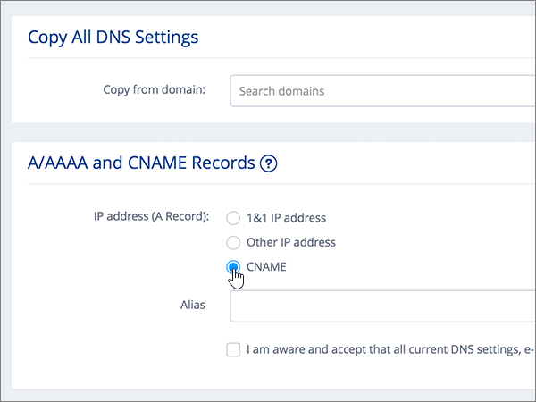

# DNS-records maken op 1&1 IONOS voor Microsoft

 **[Raadpleeg de veelgestelde vragen over domeinen](../setup/domains-faq.md)** als u niet kunt vinden wat u zoekt. 
  
> [!CAUTION]
> Houd er rekening mee dat 1&1 IONOS niet toestaat dat een domein zowel een MX-record als een Autodiscover CNAME-record op het hoogste niveau heeft. Dit beperkt de manieren waarop u Exchange Online voor Microsoft configureren. Er is een tijdelijke oplossing, maar we raden u aan deze **alleen** in te zetten als u al ervaring hebt met het maken van subdomeinen op 1&1 IONOS. > Als u er ondanks deze [servicebeperking](https://support.office.com/article/7ae9a655-041d-4724-aa92-60392ee390c2.aspx) voor kiest om uw eigen Microsoft DNS-records op 1&1 IONOS te beheren, voert u de stappen in dit artikel uit om uw domein te verifiëren en DNS-records in te stellen voor e-mail, Skype voor Bedrijven Online, enzovoort. 
  
Nadat u deze records op 1&1 IONOS hebt toegevoegd, wordt uw domein ingesteld voor gebruik met Microsoft-services.
  
Zie [Een openbare website gebruiken met Microsoft](https://support.office.com/article/choose-a-public-website-3325d50e-d131-403c-a278-7f3296fe33a9) voor informatie over webhosting en DNS voor websites met Microsoft.
  
> [!NOTE]
> Het duurt meestal ongeveer 15 minuten voordat DNS-wijzigingen van kracht worden. Het kan echter soms wat langer duren voordat een wijziging die u hebt aangebracht, is bijgewerkt via het DNS-systeem op internet. Als u na het toevoegen van DNS-records problemen hebt met het ontvangen of verzenden van e-mail, raadpleegt u [Problemen opsporen en oplossen nadat u uw domein of DNS-records hebt toegevoegd](../get-help-with-domains/find-and-fix-issues.md). 
  
## Een TXT-record toevoegen voor verificatie

Voordat u uw domein met Microsoft kunt gebruiken, moet worden gecontroleerd dat u de eigenaar bent van het domein. Als u zich bij uw account bij de domeinregistrar kunt aanmelden en de DNS-record kunt maken, is dit voor Microsoft bewezen.
  
> [!NOTE]
> Deze record wordt alleen gebruikt om te verifiëren dat u de eigenaar van uw domein bent. Dit heeft verder geen invloed. U kunt deze record later desgewenst verwijderen. 
  
Volg onderstaande stappen of [bekijk de video (start op 0:42)](https://support.office.com/article/Video-Create-DNS-records-at-1-1-Internet-for-Office-365-543fb112-ecf5-47ae-b096-07f3f942a089?ui=en-US&amp;rs=en-US&amp;ad=US).
  
1. Ga om aan de slag te gaan naar de pagina domeinen op 1&1 IONOS via [deze link.](https://my.1and1.com/) U wordt gevraagd u aan te melden.
    
2. Selecteer **Domeinen beheren**.
    
3. Zoek op de pagina **Domain Center** het domein dat u wilt bijwerken en selecteer vervolgens het besturingselement **Paneel** **(v)** voor dat domein.
    
4. Selecteer **DNS-instellingen bewerken**in het gebied **Domeininstellingen** .
    
5. Selecteer **Record toevoegen**in de sectie **TXT- en SRV-records** .
    
6. Ga naar het gebied **Add Record**. In de vakken voor de nieuwe record in dit gebied kunt u vervolgens de waarden uit de volgende tabel typen of kopiëren en plakken. 
    
    (Kies in de vervolgkeuzelijst de waarde **Type**). 
    
    ||||
    |:-----|:-----|:-----|
    |**Type**   |**Voorvoegsel**   |**Naamwaarde**   |
    |TXT    |(Laat dit veld leeg staan)    |MS=ms *XXXXXXXX*    LET OP: Dit is een voorbeeld. Gebruik hier de specifieke waarde voor **Doel of adres waarnaar wordt verwezen** uit de tabel. [Hoe kan ik dit vinden?](../get-help-with-domains/information-for-dns-records.md)          |
   
7. Kies **Opslaan**.
    
8. Selecteer Opnieuw **opslaan.** 
    
9. Selecteer **Ja**. in het dialoogvenster **DNS-instellingen bewerken** .
    
10. Wacht enkele minuten voordat u verder gaat, zodat de record die u zojuist hebt gemaakt via internet kan worden bijgewerkt.
    
Nu u de record hebt toegevoegd aan de site van uw domeinregistrar, gaat u terug naar Microsoft 365 en vraagt u of Microsoft 365 naar de record wil zoeken.
  
Wanneer in Microsoft de juiste TXT-record is gevonden, is uw domein gecontroleerd.
  
1. Ga in het Microsoft-beheercentrum naar **Instellingen** \> <a href="https://go.microsoft.com/fwlink/p/?linkid=834818" target="_blank">Domeinen</a>-pagina.

    
2. Kies op de pagina **Domeinen** de naam van het domein dat u verifieert. 
    
3. Kies **Start setup** op de pagina **Setup**.
    
4. Kies **Verifiëren** op de pagina **Domein verifiëren**.
    
> [!NOTE]
> Het duurt meestal ongeveer 15 minuten voordat DNS-wijzigingen van kracht worden. Het kan echter soms wat langer duren voordat een wijziging die u hebt aangebracht, is bijgewerkt via het DNS-systeem op internet. Als u na het toevoegen van DNS-records problemen hebt met het ontvangen of verzenden van e-mail, raadpleegt u [Problemen opsporen en oplossen nadat u uw domein of DNS-records hebt toegevoegd](../get-help-with-domains/find-and-fix-issues.md). 
  
## Voeg een MX-record toe zodat e-mail voor uw domein naar Microsoft wordt verzonden

Volg onderstaande stappen of [bekijk de video (start op 3:22)](https://support.office.com/article/Video-Create-DNS-records-at-1-1-Internet-for-Office-365-543fb112-ecf5-47ae-b096-07f3f942a089?ui=en-US&amp;rs=en-US&amp;ad=US).
  
> [!NOTE]
> Als je je hebt geregistreerd bij 1und1.de, [log dan hier in.](https://go.microsoft.com/fwlink/?linkid=859152) 
  
1. Ga om aan de slag te gaan naar de pagina domeinen op 1&1 IONOS via [deze link.](https://my.1and1.com/) U wordt gevraagd u aan te melden.
    
2. Selecteer **Domeinen beheren**.
    
3. Zoek op de pagina **Domain Center** het domein dat u wilt bijwerken en selecteer vervolgens het besturingselement **Paneel** **(v)** voor dat domein.
    
4. Selecteer **DNS-instellingen bewerken**in het gebied **Domeininstellingen** .
    
5. Selecteer in de sectie **MX Records** in het gebied **Mail Exchanger (MX Record)** de optie **Andere e-mailserver**. (Mogelijk moet u omlaag schuiven.)   
  
6. Als er al MX-records worden vermeld, verwijdert u deze door de records te selecteren en op de toets **Delete** op het toetsenbord te drukken. (Als er nog geen MX-records worden vermeld, gaat u verder met de volgende stap.)  
  
7. Typ of kopieer en plak de waarden uit de volgende tabel in de vakken voor de **MX 1**-record. 
    
    |**MX 1**|**Prioriteit**|
    |:-----|:-----|
    | *\<domeinsleutel\>*  .mail.protection.outlook.com     OPMERKING: haal \<uw\> domeinsleutel uit uw Microsoft-account. [Hoe kan ik dit vinden?](../get-help-with-domains/information-for-dns-records.md)          |10    Zie [Wat is MX-prioriteit?](https://support.office.com/article/2784cc4d-95be-443d-b5f7-bb5dd867ba83.aspx) voor meer informatie over prioriteit.      | 
    
     
  
8. Kies **Opslaan**. (Mogelijk moet u omlaag schuiven.) 
  
9. Selecteer **Ja**. in het dialoogvenster **DNS-instellingen bewerken** . 
  
## Voeg de zes CNAME-records toe die nodig zijn voor Microsoft

1&1 IONOS vereist een tijdelijke oplossing, zodat u een MX-record gebruiken samen met de CNAME-records die vereist zijn voor microsoft-e-mailservices. Voor deze tijdelijke oplossing moet u een set subdomeinen maken op 1&1 IONOS en deze toewijzen aan CNAME-records.
  
> [!IMPORTANT]
> Zorg dat u ten minste twee beschikbare subdomeinen hebt voordat u deze procedure begint. We raden deze oplossing alleen aan als je al ervaring hebt met het maken van subdomeinen op 1&1 IONOS. 
  
### Basis-CNAME-records

Volg onderstaande stappen of [bekijk de video (start op 3:57)](https://support.office.com/article/Video-Create-DNS-records-at-1-1-Internet-for-Office-365-543fb112-ecf5-47ae-b096-07f3f942a089?ui=en-US&amp;rs=en-US&amp;ad=US).
  
> [!NOTE]
> Als je je hebt geregistreerd bij 1und1.de, [log dan hier in.](https://go.microsoft.com/fwlink/?linkid=859152) 
  
1. Ga om aan de slag te gaan naar de pagina domeinen op 1&1 IONOS via [deze link.](https://my.1and1.com/) U wordt gevraagd u aan te melden.
    
2. Selecteer **Domeinen beheren**.
    
3. Zoek op de pagina **Domain Center** het domein dat u wilt bijwerken en selecteer **Subdomeinen beheren**.   Nu maakt u twee subdomeinen en stelt u voor elk subdomein een **Alias**-waarde in. (Dit is vereist omdat 1&1 IONOS slechts één CNAME-record op het hoogste niveau ondersteunt, maar Microsoft vereist meerdere CNAME-records.) Eerst maakt u het autodiscover-subdomein.
    
4. Selecteer **Subdomein maken**in de sectie **Subdomeinoverzicht** .
    
    
  
5. Typ of kopieer en plak in het vak **Create Subdomain** voor het nieuwe subdomein alleen de waarde voor **Create Subdomain** uit de volgende tabel. (De **Alias**-waarde voegt u in een latere stap toe.)

    |**Create Subdomain**|**Alias**|
    |:-----|:-----|
    |autodiscover    |autodiscover.outlook.com   | 

    
  
6. Selecteer **Subdomein maken**. 
  
7. Zoek in de sectie **Subdomeinoverzicht** het **subdomein automatisch ontdekken** dat u zojuist hebt gemaakt en selecteer vervolgens het **besturingselement Paneel (v)** voor dat subdomein.  
  
8. Selecteer **DNS-instellingen bewerken**in het gebied **Subdomeininstellingen** .  
  
9. Selecteer in de sectie **A/AAAA Records (IP-adressen)** in het gedeelte **IP-adres (A Record)** de optie **CNAME**. 
  
10. Typ of kopieer en plak alleen de **Alias**-waarde uit de volgende tabel in het vak **Alias:**.  
    
    |**Create Subdomain**|**Alias**|
    |:-----|:-----|
    |autodiscover    |autodiscover.outlook.com   |

    
  
11. Schakel het selectievakje in voor de vrijwaring **I am aware**. 
  
12. Kies **Opslaan**. 
  
  
### Extra CNAME-records

Met de extra CNAME-records die in de volgende procedure worden gemaakt, worden Skype voor Bedrijven Online-services ingeschakeld. U gebruikt dezelfde stappen die u eerder hebt gebruikt om de twee CNAME-records te maken.
  
1. Maak het derde subdomein (Lyncdiscover). Selecteer **Subdomein maken**in de sectie **Subdomeinoverzicht** .
    
2. Typ of kopieer en plak in het vak **Create Subdomain** voor het nieuwe subdomein alleen de waarde voor **Create Subdomain** uit de volgende tabel. (De **Alias**-waarde voegt u in een latere stap toe.)  
    
    |**Create Subdomain**|**Alias**|
    |:-----|:-----|
    |lyncdiscover   |webdir.online.lync.com  |
   
3. Selecteer **Subdomein maken**.
    
4. Selecteer **Subdomeinen beheren**op de pagina **Domain Center** .
    
5. Zoek in de sectie **Subdomeinoverzicht** het subdomein **lyncdiscover** dat u zojuist hebt gemaakt en selecteer vervolgens het **besturingselement Paneel (v)** voor dat subdomein.  Selecteer **DNS-instellingen bewerken**in het gebied **Subdomeininstellingen** .
    
6. Selecteer in de sectie **A/AAAA Records (IP-adressen)** in het gedeelte **IP-adres (A Record)** de optie **CNAME**.
    
7. Typ of kopieer en plak alleen de **Alias**-waarde uit de volgende tabel in het vak **Alias:**.  
    
    |**Create Subdomain**|**Alias**|
    |:-----|:-----|
    |lyncdiscover    |webdir.online.lync.com    |
   
8. Schakel het selectievakje in voor de disclaimer **Ik ben me bewust** en selecteer **Opslaan**.
    
9. Selecteer **Ja**. in het dialoogvenster **DNS-instellingen bewerken** .
    
10. Maak als volgt het vierde subdomein (SIP):  Selecteer **Subdomein maken**in de sectie **Subdomeinoverzicht** .
    
11. Typ of kopieer en plak in het vak **Create Subdomain** voor het nieuwe subdomein alleen de waarde voor **Create Subdomain** uit de volgende tabel. (De **Alias**-waarde voegt u in een latere stap toe.) 
    
    |**Create Subdomain**|**Alias**|
    |:-----|:-----|
    |sip    |sipdir.online.lync.com    |
   
12. Selecteer **Subdomein maken**.
    
13. Selecteer **Subdomeinen beheren**op de pagina **Domain Center** .
    
14. Zoek in de sectie **Subdomeinoverzicht** het **sip-subdomein** dat u zojuist hebt gemaakt en selecteer vervolgens het **besturingselement Paneel (v)** voor dat subdomein.  Selecteer **DNS-instellingen bewerken**in het gebied **Subdomeininstellingen** .
    
15. Selecteer in de sectie **A/AAAA Records (IP-adressen)** in het gedeelte **IP-adres (A Record)** de optie **CNAME**.
    
16. Typ of kopieer en plak alleen de **Alias**-waarde uit de volgende tabel in het vak **Alias:**. 
    
    |**Create Subdomain**|**Alias**|
    |:-----|:-----|
    |sip    |sipdir.online.lync.com    |
   
17. Schakel het selectievakje in voor de disclaimer **Ik ben me bewust** en selecteer **Opslaan**.
    
18. Selecteer **Ja**. in het dialoogvenster **DNS-instellingen bewerken** .
    
### CNAME-records die nodig zijn voor MDM

> [!IMPORTANT]
> Volg de stappen die u hebt gevolgd voor de andere vier CNAME-records, maar gebruik de waarden uit de volgende tabel. 
  
|**Create Subdomain**|**Alias**|
|:-----|:-----|
|enterpriseregistration    |enterpriseregistration.windows.net    |
|enterpriseenrollment    |enterpriseenrollment-s.manage.microsoft.com    |
   
## Een TXT-record voor SPF toevoegen om spam tegen te gaan

> [!IMPORTANT]
> U kunt maximaal 1 TXT-record hebben voor SPF voor een domein. Als uw domein meer dan één SPF-record heeft, kan dit resulteren in e-mailfouten, evenals leverings- en spamclassificatieproblemen. Als u al een SPF-record voor uw domein hebt, hoeft u geen nieuwe te maken voor Microsoft. Voeg in plaats daarvan de vereiste Microsoft-waarden toe aan de huidige record, zodat u *één* SPF-record hebt die beide waardensets bevat. Hebt u voorbeelden nodig? Bekijk deze [Externe Domain Name System-records voor Microsoft](https://support.office.com/article/c0531a6f-9e25-4f2d-ad0e-a70bfef09ac0). Als u uw SPF-record wilt valideren, u een van deze[SPF-validatietools](../setup/domains-faq.md)gebruiken. 
  
Volg onderstaande stappen of [bekijk de video (start op 5:09)](https://support.office.com/article/Video-Create-DNS-records-at-1-1-Internet-for-Office-365-543fb112-ecf5-47ae-b096-07f3f942a089?ui=en-US&amp;rs=en-US&amp;ad=US).
  
> [!NOTE]
> Als je je hebt geregistreerd bij 1und1.de, [log dan hier in.](https://go.microsoft.com/fwlink/?linkid=859152) 
  
1. Ga om aan de slag te gaan naar de pagina domeinen op 1&1 IONOS via [deze link.](https://my.1and1.com/) U wordt gevraagd u aan te melden.
    
2. Selecteer **Domeinen beheren**.
    
3. Zoek op de pagina **Domain Center** het domein dat u wilt bijwerken en selecteer vervolgens het besturingselement **Paneel** **(v)** voor dat domein.
    
4. Selecteer **DNS-instellingen bewerken**in het gebied **Domeininstellingen** .
    
5. Selecteer **Record toevoegen**in de sectie **TXT- en SRV-records** .  (Mogelijk moet u omlaag schuiven.)
    
6. Ga naar het gebied **Add Record**. In de vakken voor de nieuwe record in dit gebied kunt u vervolgens de waarden uit de volgende tabel typen of kopiëren en plakken.  (Kies in de vervolgkeuzelijst de waarde **Type**).  
    
    |**Type**|**Voorvoegsel**|**Naamwaarde**|
    |:-----|:-----|:-----|
    |TXT    |(Laat dit veld leeg.)    |v=spf1 include:spf.protection.outlook.com -all    **Opmerking:** het is raadzaam dit item te kopiëren en te plakken, zodat het spatiegebruik ongewijzigd blijft.           | 
    
    
  
7. Kies **Opslaan**. 
  
8. Kies **Opslaan**. 
  
9. Selecteer **Ja**. in het dialoogvenster **DNS-instellingen bewerken** . 
  
## De twee SRV-records toevoegen die zijn vereist voor Microsoft

Volg onderstaande stappen of [bekijk de video (start op 5:51)](https://support.office.com/article/Video-Create-DNS-records-at-1-1-Internet-for-Office-365-543fb112-ecf5-47ae-b096-07f3f942a089?ui=en-US&amp;rs=en-US&amp;ad=US).
  
> [!NOTE]
> Als je je hebt geregistreerd bij 1und1.de, [log dan hier in.](https://go.microsoft.com/fwlink/?linkid=859152) 
  
1. Ga om aan de slag te gaan naar de pagina domeinen op 1&1 IONOS via [deze link.](https://my.1and1.com/) U wordt gevraagd u aan te melden.
    
2. Selecteer **Domeinen beheren**.
    
3. Zoek op de pagina **Domain Center** het domein dat u wilt bijwerken en selecteer vervolgens het besturingselement **Paneel** **(v)** voor dat domein.
    
4. Selecteer **DNS-instellingen bewerken**in het gebied **Domeininstellingen** .
    
5. Selecteer **Record toevoegen**in de sectie **TXT- en SRV-records** .
    
6. Voeg de eerste van de twee SRV-records toe. Typ of kopieer en plak de waarden uit de eerste rij van de volgende tabel in het gebied **Add Record** in de vakken voor de nieuwe record.  (Kies de waarden **Type** en **TTL** in de vervolgkeuzelijst.) 
    
    |**Type**|**Service**|**Protocol**|**Naam**|**Host**|**Prioriteit**|**Gewicht**|**Poort**|**TTL**|
    |:-----|:-----|:-----|:-----|:-----|:-----|:-----|:-----|:-----|
    |SRV    |sip    |tls    |(Laat dit veld leeg.)    |sipdir.online.lync.com    |100    |1    |443    |3600 (1 uur)    |
    |SRV    |sipfederationtls    |tcp    |(Laat dit veld leeg.)    |sipfed.online.lync.com    |100    |1    |5061    |3600 (1 uur)    |  
    
    
  
7. Kies **Opslaan**.  
  
8. Kies **Opslaan**.  
  
9. Selecteer **Ja**. in het dialoogvenster **DNS-instellingen bewerken** .  
  
10. Voeg de andere SRV-record toe.  Selecteer **Record toevoegen**in de sectie **TXT- en SRV-records** .  Maak in het gebied **Record toevoegen** een record met de waarden uit de andere rij in de tabel en selecteer vervolgens opnieuw **Toevoegen,** **Opslaan**en **Ja** om de record te voltooien. 
    
> [!NOTE]
> Het duurt meestal ongeveer 15 minuten voordat DNS-wijzigingen van kracht worden. Het kan echter soms wat langer duren voordat een wijziging die u hebt aangebracht, is bijgewerkt via het DNS-systeem op internet. Als u na het toevoegen van DNS-records problemen hebt met het ontvangen of verzenden van e-mail, raadpleegt u [Problemen opsporen en oplossen nadat u uw domein of DNS-records hebt toegevoegd](../get-help-with-domains/find-and-fix-issues.md). 
  
